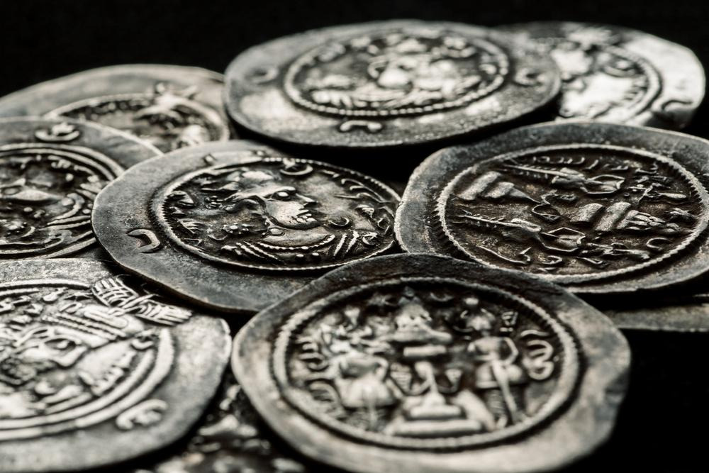

## Table of Contents

## What is silver and where does it come from?

Silver is a shiny, white metal that people have used for thousands of years. It is very soft and easy to shape into different things like jewelry, coins, and even electronic parts. Silver is also a good conductor of heat and electricity, which means it can move heat and electricity very well. This makes it useful in many things we use every day, like computers and phones.

Silver comes from the earth. It is found in rocks and minerals, often mixed with other metals like copper and lead. To get silver, people mine these rocks and then use special methods to separate the silver from the other materials. Some of the biggest silver mines are in countries like Mexico, Peru, and China. After mining, the silver is purified and turned into different products that we use.

## What are the basic physical and chemical properties of silver?

Silver is a soft, shiny metal that is very easy to shape. It is one of the best metals for conducting heat and electricity, which means it can move heat and electricity very well. Silver is also very reflective, which is why it is used in mirrors. It has a bright, white color that makes it popular for jewelry and decorative items. Silver is not very strong, so it is often mixed with other metals to make it harder and more durable.

Chemically, silver does not react easily with most substances, which makes it very stable. However, it can tarnish when it comes into contact with sulfur in the air, turning it a dark color. Silver can form compounds with other elements, like silver chloride, which is used in photography. Silver also has antibacterial properties, which means it can kill germs, making it useful in medical applications.

## What are the most common uses of silver in everyday life?

Silver is used in many things we see and use every day. One big use is in jewelry. People love silver because it looks shiny and pretty. It's also used to make coins and medals. Silver is soft, so it's easy to shape into different designs. Another common use is in electronics. Silver is a great conductor of electricity, so it's used in things like phones, computers, and TVs to help them work well.

Silver also has some special uses that might not be as obvious. For example, it's used in medicine because it can kill germs. Some bandages and medical tools have a bit of silver in them to keep them clean. Silver is also used in photography. It helps make pictures appear on film. Even mirrors use silver because it's so good at reflecting light. So, even though we might not always see it, silver is all around us, helping in many different ways.

## How is silver used in the medical field?

Silver is used in the medical field because it can kill germs. This is called being antibacterial. Doctors and nurses use silver in bandages and dressings to help keep wounds clean and stop infections. Some medical tools, like catheters, also have a bit of silver in them to keep them safe to use. Silver helps make sure that these tools don't spread germs to patients.

Silver is also used in some medicines. For example, silver nitrate is used to help heal wounds and treat eye infections in newborn babies. It's important because it can stop germs from growing and causing problems. So, silver plays a big role in keeping people healthy and safe in hospitals and clinics.

## What role does silver play in the electronics industry?

Silver is really important in the electronics industry because it is a great conductor of electricity. This means it can move electricity very well, which is needed for things like phones, computers, and TVs to work properly. Inside these devices, silver is used in small parts called contacts and connectors. These parts help the electricity move around inside the device, making sure everything works the way it should.

Silver is also used in the circuits of electronic devices. Circuits are like the roads that electricity travels on inside a device. Silver makes these roads very good at moving electricity quickly and without losing much energy. This helps make electronic devices more efficient and reliable. So, even though we might not see it, silver is a big part of why our electronics work so well.

## How has silver been used historically in currency and trade?

Silver has been used as money for a very long time. People started using silver coins around 600 B.C. in places like Lydia, which is now part of Turkey. These coins were easy to [carry](/wiki/carry-trading) and use for buying things. Many countries used silver coins because silver was valuable and easy to find. In the United States, the dollar was originally based on the amount of silver it contained. Silver was also used in big trades between countries. For example, in the 1500s and 1600s, Spain got a lot of silver from its colonies in the Americas and used it to buy things from China.

Silver's use in money changed over time. In the 1800s, many countries started using the gold standard, which meant their money was based on gold instead of silver. But silver was still important. Some countries, like the United States, kept using silver coins until the 20th century. Today, silver is not used much for everyday money, but people still collect silver coins. Silver is also used in special coins and medals that are made to celebrate important events or to honor people.

## What are the mechanisms by which silver acts as an antimicrobial agent?

Silver works as an antimicrobial agent by killing germs like bacteria, viruses, and fungi. It does this in a few ways. When silver touches these germs, it can release tiny silver ions. These ions are like little soldiers that attack the germs. They mess up the germs' cell walls, which can make the germs fall apart. Silver ions also stop the germs from making energy, which is like cutting off their food supply. Without energy, the germs can't live and grow.

Silver's ability to kill germs is also helped by something called the oligodynamic effect. This is a fancy way of saying that even a tiny bit of silver can be very powerful against germs. Silver can keep working for a long time, slowly releasing its ions to keep fighting germs. This is why silver is used in things like bandages and medical tools. It helps keep these items clean and safe, even after they've been used for a while.

## How is silver extracted and refined from its ores?

Silver is found in the earth mixed with other metals and minerals in rocks called ores. To get the silver out, people first mine these rocks from the ground. They dig big holes or tunnels to reach the ores. After the ore is taken out of the earth, it's broken into smaller pieces. These pieces are then crushed into a powder. This makes it easier to separate the silver from the other stuff in the ore.

Next, the silver is separated from the other materials in the ore. One common way to do this is by using a process called flotation. In this process, the crushed ore is mixed with water and chemicals. The silver sticks to air bubbles and floats to the top, where it can be collected. After the silver is separated, it's time to make it pure. This is done by smelting, which means heating the silver until it melts. Any other metals mixed with the silver can be removed during smelting. The silver is then cooled and turned into bars or other shapes, ready to be used.

## What are the environmental impacts of silver mining and usage?

Silver mining can harm the environment in several ways. When people dig for silver, they create big holes and tunnels in the ground. This can change the land and make it hard for plants and animals to live there. Mining also uses a lot of water and can pollute it with chemicals. These chemicals can get into rivers and lakes, hurting fish and other water creatures. The air can also get dirty from dust and gases released during mining, which can affect the air we breathe.

After silver is mined, the way it's used can also impact the environment. When silver is used in things like electronics, it can end up in landfills when those items are thrown away. Silver doesn't break down easily, so it can stay in the ground for a long time. If it's not handled right, silver waste can pollute the soil and water. But, if we recycle silver, we can use it again and again, which helps reduce the need for more mining and lessens the harm to the environment.

## How does silver's conductivity compare to other metals, and why is it significant?

Silver is the best conductor of electricity out of all the metals. This means it can move electricity very easily and quickly. Compared to other metals like copper, which is also a good conductor, silver is even better. Copper is often used instead of silver in many things because it's cheaper, but silver is the top choice when the best conductivity is needed. For example, in high-end electronics, silver might be used to make sure the device works as well as possible.

Silver's high conductivity is really important because it helps make things like computers, phones, and TVs work better. When electricity moves quickly and without losing much energy, devices can be more efficient and reliable. This is why silver is used in the tiny parts inside these devices, even though we might not see it. Silver's ability to conduct electricity so well makes it a key material in many of the things we use every day.

## What advanced applications of silver are being researched in nanotechnology?

Silver is being used in a lot of new ways in nanotechnology. Scientists are making tiny things called nanoparticles out of silver. These nanoparticles are so small you can't see them with your eyes. They are being studied to see if they can help fight germs better than regular silver. For example, silver nanoparticles might be used in special bandages that can kill germs even better than the ones we use now. They could also be used in water filters to make water cleaner by killing germs in it.

Another cool thing scientists are looking at is using silver in tiny machines called nanosensors. These nanosensors can be used to find very small amounts of things, like chemicals or germs. Silver helps these nanosensors work better because it conducts electricity so well. This could be really helpful in medicine, where doctors might use these nanosensors to check for diseases in a person's body. So, even though silver has been around for a long time, scientists are still finding new ways to use it in tiny, powerful ways.

## How have international silver prices and markets evolved over the last century?

Over the last century, the price of silver has gone up and down a lot. In the early 1900s, silver was used a lot in coins and jewelry, so its price was pretty stable. But during World War II, the need for silver in industry went up, and so did its price. After the war, the price of silver dropped because there was a lot of it around. In the 1970s, things changed again. People started using more silver in electronics and photography, which made the price go up a lot. In 1980, the price of silver reached a high point because some people tried to buy a lot of it to make the price go up even more. After that, the price went down again, but it has been going up slowly over the last few years.

The way silver is bought and sold around the world has also changed a lot. In the past, most silver was traded in big countries like the United States and England. But now, countries like China, India, and Mexico are also big players in the silver market. These countries mine a lot of silver and also use it in their industries. The way silver is traded has become more global, with prices being set by what's happening all over the world. Today, people can buy and sell silver on big markets like the London Metal Exchange and the COMEX in the United States. These markets help keep the price of silver fair and make it easier for people to trade it.

## References & Further Reading

[1]: The Silver Institute. [Silver Market Trends](https://www.silverinstitute.org/silver-supply-demand/). 

[2]: Bergstra, J., Bardenet, R., Bengio, Y., & Kégl, B. (2011). ["Algorithms for Hyper-Parameter Optimization."](https://dl.acm.org/doi/10.5555/2986459.2986743) Advances in Neural Information Processing Systems 24.

[3]: Lopez de Prado, M. (2018). [Advances in Financial Machine Learning](https://www.amazon.com/Advances-Financial-Machine-Learning-Marcos/dp/1119482089). Wiley.

[4]: Aronson, D. (2007). [Evidence-Based Technical Analysis: Applying the Scientific Method and Statistical Inference to Trading Signals](https://www.wiley.com/en-us/Evidence+Based+Technical+Analysis%3A+Applying+the+Scientific+Method+and+Statistical+Inference+to+Trading+Signals-p-9780470008744). Wiley.

[5]: Jansen, S. (2020). [Machine Learning for Algorithmic Trading](https://github.com/stefan-jansen/machine-learning-for-trading). Packt Publishing.

[6]: Chan, E. P. (2009). [Quantitative Trading: How to Build Your Own Algorithmic Trading Business](https://github.com/ftvision/quant_trading_echan_book). Wiley.