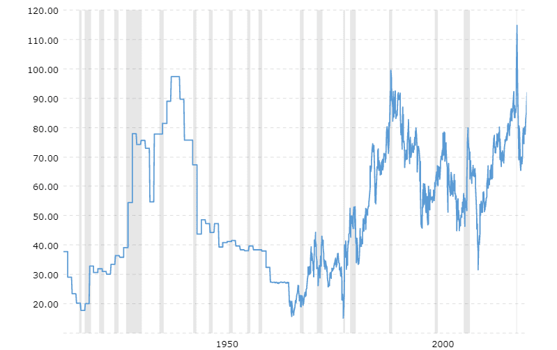

Silver, denoted by the symbol Ag and atomic number 47, is a lustrous white metal known for its conductivity, ductility, and corrosion resistance. Unique among metals, it exhibits the highest electrical conductivity, thermal conductivity, and reflectivity. These properties make silver not only a desirable commodity for ornamentation and currency but also an indispensable material in various industrial applications.

Industries harness silver’s properties in numerous ways, such as in the production of electrical components and circuits due to its superior conductivity. It is integral to the manufacture of photovoltaic cells in solar panels, capitalizing on its conductive and reflective properties. The medical field benefits from silver's antibacterial qualities, employing it in wound dressings and medical devices. Additionally, silver is valued as an investment commodity; its price fluctuations attract those seeking to diversify their portfolios.



Algorithmic trading, or algo trading, involves using computer programs and algorithms to execute financial transactions at exceptionally high speeds and volumes. This method uses predefined criteria, utilizing mathematical models and statistical analysis to make trading decisions. The significance of algorithmic trading lies in its ability to process vast volumes of data rapidly and its potential to maximize profits by leveraging market inefficiencies.

Silver is a key focus in algorithmic trading due to its volatile price movements, influenced by factors like industrial demand, geopolitical events, and market speculation. This volatility can lead to profitable opportunities for traders leveraging algorithms capable of analyzing market trends and executing trades faster than traditional manual methods.

This article aims to explore the historical and modern significance of silver, highlighting its industrial applications and role as a trading asset. It will delve into the principles of algorithmic trading and its intersection with silver trading, examining how technological advancements continue to shape this dynamic. Furthermore, we will assess future trends and developments, providing insights into the evolving landscape of silver markets and trading strategies.

## Table of Contents

## Historical Significance of Silver

Silver, one of the earliest metals discovered by humans, holds a significant place in human history due to its widespread use and symbolic value. The origins of silver mining trace back to ancient civilizations, with evidence suggesting that silver was extracted from lead ores as early as 3000 BCE in areas like Anatolia, now part of modern-day Turkey. The process of cupellation, where ores containing silver were smelted to separate the metal from lead, marked a technological breakthrough in metallurgy.

Historically, silver has been intricately linked with human civilization's progress. The Greeks and Romans were eminent in their silver mining efforts, particularly in regions such as Laurium in Greece, where large-scale mining and coin production were undertaken. Silver coins, known as drachmas and denarii, form vital components of classical antiquity's monetary systems, facilitating trade and the expansion of empires. The introduction of the silver standard, a monetary system where the standard economic unit of account is based on a fixed quantity of silver, marked a significant shift in economic history, maintaining its influence well into the 19th century.

Culturally, silver has been revered not just for its aesthetic qualities but also for its perceived purity and protective powers, often used in jewelry, religious artifacts, and ceremonial objects. Economically, silver has had profound impacts, notably during the Spanish colonization of the Americas. The discovery of silver deposits in the New World, especially at Potosí in present-day Bolivia, resulted in an influx that altered global trade dynamics and monetary systems, playing a pivotal role in the development of global capitalism.

Silver has also been central in various historical events. The Opium Wars in the 19th century, for instance, were significantly influenced by Britain's trade imbalance with China, where silver was exchanged for tea, silk, and porcelain. The resulting outflow of silver from Britain to China prompted the British to introduce opium into the trade cycle, leading to geopolitical tensions and eventual warfare.

Throughout history, silver's role in monetary systems has evolved. Initially serving as a primary medium of exchange, it transitioned into a reserve asset as bimetallic standards emerged, eventually making way for fiat currencies. Despite these changes, silver maintains its reputation as a 'safe-haven' asset in times of economic uncertainty.

Silver’s historical narrative is deeply interwoven with human civilization, reflecting its enduring allure and practical value across cultures and economies. Its journey from ancient mining to modern usage underpins not only technological and economic transformations but also the shifting paradigms of global trade and finance.

## Modern Applications of Silver

Silver, a metal with a rich historical background, has evolved to play crucial roles in various modern applications across diverse industries. Its unique properties, such as high electrical conductivity, thermal conductivity, and reflectivity, make it indispensable in many technological and industrial domains.

In technology and industry, silver is extensively used due to its superior conductive properties. It is an essential component in electrical switches, circuits, and contacts where efficient current flow is critical. Silver's ability to withstand high temperatures and resist corrosion further enhances its value in these applications.

In the medical field, silver is valued for its antibacterial properties. Silver ions can disrupt bacterial cell membranes, ultimately leading to cell death. This property is utilized in wound dressings, catheters, and other medical devices to prevent infections. Silver sulfadiazine cream, commonly used in burn treatment, exemplifies the metal's therapeutic benefits.

Silver's application in renewable energy is most notable in solar panels. Photovoltaic cells in solar panels rely on silver paste to conduct electricity generated from sunlight. This conductive paste is crucial for capturing and transferring the electric current, making silver integral to the efficiency of solar technology.

The electronics and electrical sectors also significantly benefit from silver. It is used in soldering components due to its excellent conductivity and thermal properties. In semiconductors, silver provides pathways for electrical signals crucial for the functioning of integrated circuits.

Besides its industrial and technological applications, silver serves as a significant investment commodity. Investors view silver as a store of value and a hedge against inflation and currency fluctuations. Its tangible nature and historical role as a monetary standard contribute to its appeal as a financial asset.

In summary, silver's diverse applications underscore its indispensability in modern industry, technology, medicine, and investment. Its unique properties continue to drive innovation and development across multiple sectors, cementing its status as a valuable and versatile metal in contemporary society.

 to Algorithmic Trading

Algorithmic trading, often referred to as algo trading, is the method of executing trades using pre-programmed instructions accounting for variables such as time, price, and [volume](/wiki/volume-trading-strategy). The evolution of computers and programming languages has facilitated this modern approach to trading, allowing for orders to be placed with optimal speed and precision. Fundamentally, [algorithmic trading](/wiki/algorithmic-trading) minimizes human intervention, relying on automated scripts to make decisions, hence reducing the likelihood of human errors and enabling high-frequency trading.

A variety of technologies power algorithmic trading. These include advanced computing resources, trading algorithms, statistical analysis, predictive modeling, and direct market access (DMA). Algorithms are typically written in programming languages such as Python, C++, or Java, with Python being particularly popular due to its comprehensive libraries for data analysis and [machine learning](/wiki/machine-learning), such as NumPy, pandas, and scikit-learn. Trades are executed through electronic communication networks (ECNs) which connect buyers and sellers directly, away from traditional exchanges.

Strategies employed in algorithmic trading are diverse, ranging from statistical [arbitrage](/wiki/arbitrage) and pairs trading to [market making](/wiki/market-making) and [trend following](/wiki/trend-following). Statistical arbitrage involves exploiting price inefficiencies between related financial instruments, while market making increases [liquidity](/wiki/liquidity-risk-premium) by continuously offering buy and sell quotes. Trend-following strategies predict future price movements based on historical data, capitalizing on market [momentum](/wiki/momentum).

Despite the numerous benefits associated with algorithmic trading, such as increased transaction speed, reduced costs, and enhanced accuracy, it is not without its challenges. The principal challenge is the need for continuous refinement of the trading algorithms to adapt to ever-changing market conditions. Additionally, the reliance on technology presents risks associated with system failures or cyber-attacks. Market liquidity, or the lack thereof, can also impact the performance of algorithmic strategies.

Data analysis plays a crucial role in algorithmic trading, serving as the backbone of trading algorithms. Statistical methods and machine learning techniques are employed to analyze vast amounts of historical data, identify trends, backtest strategies, and refine algorithms. This dependency underscores the need for high-quality data and robust computational capability.

Algorithmic trading is prevalent across numerous markets, including stock exchanges, foreign exchange markets, commodities, and cryptocurrencies. In the equity markets, it accounts for a significant portion of the total trading volume. The growth of cryptocurrencies has also seen an increase in the use of algorithms due to the market’s [volatility](/wiki/volatility-trading-strategies) and continuous trading hours. As algorithmic trading continues to evolve, it remains integral to the modern financial ecosystem, underscoring its importance across international markets.

## The Intersection of Silver and Algorithmic Trading

Silver is a perennial favorite among algorithmic traders, due to its unique characteristics and the role it plays in financial markets. As a commodity, silver exhibits significant price volatility, which provides potential for high-frequency trading strategies to capitalize on short-term price movements. Additionally, silver's dual role as both an industrial commodity and a precious metal adds layers of complexity and opportunity for traders employing algorithms.

### Why Silver is a Popular Asset in Algorithmic Trading

One of the primary reasons silver is a popular choice in algorithmic trading is its liquidity. As one of the most traded commodities on various exchanges, silver offers ample opportunities for entry and [exit](/wiki/exit-strategy) points, reducing the risk of slippage. The historical and economic significance of silver further adds to its stable demand across different sectors, making its price movements highly relevant for traders.

### Strategies Used by Traders for Silver in Algo Trading

Traders utilize several strategies for algorithmic trading with silver, two of which are mean reversion and trend following. Mean reversion capitalizes on the idea that silver prices will revert to a mean value over time. Traders using this strategy might develop algorithms to identify deviations from historical price averages and execute trades anticipating a return to these averages.

Trend following, on the other hand, involves algorithms designed to detect and act upon established trends in silver prices. These algorithms analyze past data to project future price movements, allowing traders to take positions in alignment with the current trend direction. Machine learning techniques can enhance these strategies by providing sophisticated predictive capabilities and pattern recognition.

### Impact of Silver Price Volatility on Algorithmic Trading

Volatility is a double-edged sword in algorithmic trading. For silver, volatility can present profitable opportunities for traders prepared to handle rapid market movements but also poses risks of large losses. Algorithmic trading systems are designed to process vast amounts of data quickly, enabling them to react to volatile market conditions faster than human traders. This speed allows algorithmic traders to capitalize on short-lived price inefficiencies and arbitrage opportunities.

### Technological Tools Used for Trading Silver

The success of algorithmic trading in silver markets is heavily reliant on cutting-edge technological tools. Trading platforms with low latency connections are crucial for timely order executions. Furthermore, algorithms are developed using high-level programming languages such as Python, which offers libraries for data analysis (e.g., Pandas, NumPy) and machine learning (e.g., Scikit-learn, TensorFlow).

Here's a basic example in Python for a moving average crossover strategy, often used in trend following:

```python
import pandas as pd
import numpy as np

# Load silver price data
data = pd.read_csv('silver_prices.csv')
data['SMA_20'] = data['Close'].rolling(window=20).mean()
data['SMA_50'] = data['Close'].rolling(window=50).mean()

# Generate trading signals
data['Signal'] = 0
data['Signal'][20:] = np.where(data['SMA_20'][20:] > data['SMA_50'][20:], 1, -1)

# Calculate daily returns
data['Returns'] = data['Close'].pct_change()

# Calculate strategy returns
data['Strategy_Returns'] = data['Signal'].shift(1) * data['Returns']

# Output performance
performance = data[['Strategy_Returns']].sum()
print(f"Strategy Performance: {performance}")
```

### Case Studies of Successful Algorithmic Trading with Silver

Numerous examples exist of successful algorithmic trading in silver. Quantitative hedge funds have historically used complex algorithms to exploit silver's volatility and liquidity. For instance, during periods of geopolitical tension or economic uncertainty, silver often experiences price spikes. Traders with access to algorithmic systems can exploit these rapid price changes to generate profits. Additionally, in the context of macroeconomic events, algorithms can swiftly adapt to new information, providing a competitive advantage over traditional trading strategies.

In summary, silver's volatility, coupled with its economic significance, makes it an attractive asset for algorithmic trading. With advancements in technology and data analysis, the interplay between silver and algorithmic trading continues to evolve, offering potential opportunities for traders who can adeptly navigate this dynamic market.

## Future Trends and Developments

Emerging trends in the markets for silver reflect a dynamic interplay of economic factors, technological advancements, and evolving consumer demands. Recent years have seen increasing interest in silver due to its dual role as both a precious metal and an industrial commodity. The growing adoption of silver in renewable energy technologies, particularly in photovoltaic (PV) cells for solar panels, is a significant market driver. As countries shift towards sustainable energy solutions, the demand for solar technology rises, positioning silver as a critical component. According to the Silver Institute, the solar sector accounted for approximately 10% of global silver demand in recent years, a figure projected to grow as solar energy becomes more prevalent [1]. 

In financial markets, algorithmic trading is transforming how silver is traded. Technological advancements facilitate more sophisticated trading algorithms that can process vast amounts of data quickly and execute trades at speeds previously unattainable. Machine learning and [artificial intelligence](/wiki/ai-artificial-intelligence) are being increasingly integrated into these algorithms, allowing traders to predict silver price movements with greater accuracy. These technologies analyze patterns from historical price data, news sentiment, and geopolitical events, offering data-driven insights that enhance trading strategies.

Silver's future potential in industries beyond solar energy is promising. In electronics, silver's superior conductivity makes it an indispensable material, and innovations in electronics manufacturing could further bolster its demand. The medical sector also presents growth prospects owing to silver's antimicrobial properties, which are being leveraged in wound care and medical devices. As technology advances, new industrial applications for silver are likely to emerge, sustaining its relevance across various sectors.

Traders must adapt to predicted changes in silver trading strategies, particularly as algorithmic trading becomes more prevalent. Strategies that combine quantitative analysis with machine learning are expected to dominate, providing a competitive edge in predictive accuracy and risk management. However, the volatility of silver prices, influenced by factors such as currency fluctuations, geopolitical tensions, and market speculation, poses challenges. Traders must remain agile, employing risk management techniques and diversification to mitigate potential losses.

The rise in algorithmic trading presents both challenges and opportunities for traders. While the automation of trading processes increases efficiency, it also intensifies market competition, necessitating continuous innovation in trading strategies. Regulatory challenges might also arise, as financial authorities globally emphasize the need for transparency and accountability in automated trading systems.

In conclusion, the evolution of silver markets and algorithmic trading presents dynamic opportunities and challenges. As silver's industrial applications expand and trading technologies advance, market participants who adapt promptly and innovate will likely harness significant benefits.

References:
1. The Silver Institute. Silver Market Trends. Retrieved from [https://www.silverinstitute.org](https://www.silverinstitute.org)

## Conclusion

Silver holds both historical and contemporary significance, having served essential roles from ancient coinage to advanced technological applications. As a versatile metal, silver's utility spans industries, including medicine, renewable energy, and electronics, demonstrating not only its adaptability but also its sustained relevance. Its place within monetary systems as a standard for trade and symbol of wealth underscores its longstanding economic importance.

In algorithmic trading, silver emerges as a key asset due to its intrinsic value and market dynamics that offer opportunities for strategic trading. The metal's price volatility, influenced by supply-demand imbalances, geopolitical factors, and economic indicators, makes it attractive for algorithmic traders. These traders employ sophisticated algorithms and data analysis tools to capitalize on market trends and inefficiencies, employing strategies like mean reversion and momentum trading to optimize gains. The fusion of technology and market knowledge enhances trading precision, efficiency, and profitability in dealing with silver.

Looking forward, silver's potential remains robust within global markets. As technological advancements continue, particularly in data analytics and machine learning, algorithmic trading strategies are expected to evolve, allowing for even more refined approaches to trading silver. Additionally, as industries strive for sustainability, silver's role in technologies like solar power is predicted to expand, potentially affecting its market dynamics and investment attractiveness.

For those interested in the dynamic interactions between commodities and technology-driven trading, further exploration into the future trajectories of silver can yield valuable insights. Readers are encouraged to engage with this fascinating intersection by contributing thoughts and discussions regarding the evolving market landscape and the opportunities it presents. Further study into predictive methodologies and market analyses can also provide a deeper understanding of how silver may continue to impact economic and industrial spheres.

## References & Further Reading

[1]: The Silver Institute. [Silver Market Trends](https://www.silverinstitute.org/silver-supply-demand/). 

[2]: Bergstra, J., Bardenet, R., Bengio, Y., & Kégl, B. (2011). ["Algorithms for Hyper-Parameter Optimization."](https://dl.acm.org/doi/10.5555/2986459.2986743) Advances in Neural Information Processing Systems 24.

[3]: Lopez de Prado, M. (2018). [Advances in Financial Machine Learning](https://www.amazon.com/Advances-Financial-Machine-Learning-Marcos/dp/1119482089). Wiley.

[4]: Aronson, D. (2007). [Evidence-Based Technical Analysis: Applying the Scientific Method and Statistical Inference to Trading Signals](https://www.wiley.com/en-us/Evidence+Based+Technical+Analysis%3A+Applying+the+Scientific+Method+and+Statistical+Inference+to+Trading+Signals-p-9780470008744). Wiley.

[5]: Jansen, S. (2020). [Machine Learning for Algorithmic Trading](https://github.com/stefan-jansen/machine-learning-for-trading). Packt Publishing.

[6]: Chan, E. P. (2009). [Quantitative Trading: How to Build Your Own Algorithmic Trading Business](https://github.com/ftvision/quant_trading_echan_book). Wiley.