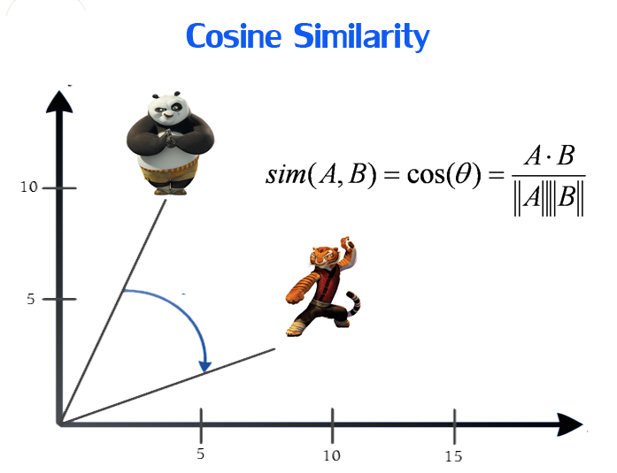

## Table of Contents

## What is a similarity measure in machine learning?

A similarity measure in machine learning is a way to find out how much two things are alike. These things could be pictures, texts, or any data points. Imagine you have two photos, and you want to know if they are of the same person. A similarity measure helps you do that by giving a number that shows how similar the photos are. The number is usually between 0 and 1, where 1 means the photos are very similar, and 0 means they are not similar at all.

There are many types of similarity measures, and which one you use depends on what you are trying to do. For example, the Euclidean distance is a common measure used when you are working with numbers. It calculates the straight-line distance between two points. If you have two points, $$ (x_1, y_1) $$ and $$ (x_2, y_2) $$, the Euclidean distance between them is $$ \sqrt{(x_2 - x_1)^2 + (y_2 - y_1)^2} $$. Another measure is cosine similarity, which is often used for text data. It looks at the angle between two vectors and tells you how similar their directions are, which can be useful for comparing the meaning of words or documents.

## Why are similarity measures important in machine learning?

Similarity measures are really important in machine learning because they help computers understand how things are related to each other. Imagine you're trying to teach a computer to recognize different animals in pictures. By using similarity measures, the computer can compare new pictures to the ones it already knows and decide if the new picture is of a cat or a dog. This is super helpful in tasks like clustering, where you want to group similar items together, or in classification, where you need to label things based on what they are most similar to.

Another reason similarity measures are important is because they help with making predictions and recommendations. For example, if you're using a movie recommendation system, it uses similarity measures to find out which movies you might like based on the ones you've already watched and enjoyed. By calculating how similar your tastes are to other people's tastes, the system can suggest movies that others with similar tastes liked. This makes the recommendations more accurate and personalized, which is a big part of why [machine learning](/wiki/machine-learning) is so useful in our daily lives.

## Can you explain the difference between similarity and distance measures?

Similarity and distance measures are two ways to compare things in machine learning, but they work in opposite ways. A similarity measure tells you how much two things are alike. It usually gives you a number between 0 and 1, where 1 means the things are very similar, and 0 means they are not similar at all. For example, if you're comparing two pictures, a high similarity score means the pictures look a lot alike. 

On the other hand, a distance measure tells you how different two things are. It usually gives you a number that gets bigger the more different the things are. A common distance measure is the Euclidean distance, which calculates the straight-line distance between two points. If you have two points, $$ (x_1, y_1) $$ and $$ (x_2, y_2) $$, the Euclidean distance between them is $$ \sqrt{(x_2 - x_1)^2 + (y_2 - y_1)^2} $$. A smaller distance means the points are closer together, and a larger distance means they are farther apart. 

So, while similarity measures focus on how alike things are, distance measures focus on how different they are. Both are important in machine learning, but you choose which one to use based on what you're trying to do. If you want to group things that are alike, you might use a similarity measure. If you want to see how far apart things are, you might use a distance measure.

## What are some common types of similarity measures used in machine learning?

In machine learning, one common type of similarity measure is the cosine similarity. It's often used when you're working with text data or other kinds of data that can be represented as vectors. Cosine similarity looks at the angle between two vectors and tells you how similar their directions are. If the vectors point in the same direction, they are very similar, and if they point in opposite directions, they are not similar at all. The formula for cosine similarity is $$ \text{cosine similarity} = \frac{A \cdot B}{||A|| \cdot ||B||} $$, where $$ A \cdot B $$ is the dot product of vectors A and B, and $$ ||A|| $$ and $$ ||B|| $$ are the magnitudes of vectors A and B.

Another common similarity measure is the Jaccard similarity, which is often used for comparing sets. It's useful when you want to see how similar two groups of things are. For example, if you have two sets of words, the Jaccard similarity looks at how many words are in both sets compared to how many words are in either set. The formula for Jaccard similarity is $$ \text{Jaccard similarity} = \frac{|A \cap B|}{|A \cup B|} $$, where $$ |A \cap B| $$ is the size of the intersection of sets A and B, and $$ |A \cup B| $$ is the size of the union of sets A and B.

A third type of similarity measure is the Euclidean similarity, which is based on the Euclidean distance. The Euclidean distance measures the straight-line distance between two points in space. To turn this into a similarity measure, you can use a formula like $$ \text{Euclidean similarity} = \frac{1}{1 + \text{Euclidean distance}} $$. This way, a smaller distance means a higher similarity score. The Euclidean distance itself is calculated as $$ \text{Euclidean distance} = \sqrt{(x_2 - x_1)^2 + (y_2 - y_1)^2} $$ for two points in two-dimensional space.

## How does the Euclidean distance work as a similarity measure?

Euclidean distance is a way to measure how far apart two points are in space. It's like measuring the shortest distance between two places on a map. In machine learning, we can use this distance to figure out how similar two things are. If the distance is small, it means the things are very similar, and if the distance is big, it means they are not similar at all. The formula for Euclidean distance between two points, $$ (x_1, y_1) $$ and $$ (x_2, y_2) $$, is $$ \sqrt{(x_2 - x_1)^2 + (y_2 - y_1)^2} $$. This formula works for points in any number of dimensions, not just two.

To turn the Euclidean distance into a similarity measure, we use a simple trick. We take the distance and turn it into a number between 0 and 1, where 1 means the points are very similar and 0 means they are not similar at all. One way to do this is by using the formula $$ \text{Euclidean similarity} = \frac{1}{1 + \text{Euclidean distance}} $$. This way, a smaller distance gives a bigger similarity score. So, if you have two points that are very close together, their Euclidean similarity will be close to 1, showing they are very similar.

## What is the Cosine Similarity and where is it commonly used?

Cosine similarity is a way to measure how similar two things are by looking at the angle between them. Imagine you have two arrows pointing in different directions. If the arrows are pointing in the same direction, they are very similar, and if they are pointing in opposite directions, they are not similar at all. Cosine similarity uses this idea to compare things like words or documents. The formula for cosine similarity is $$ \text{cosine similarity} = \frac{A \cdot B}{||A|| \cdot ||B||} $$, where $$ A \cdot B $$ is the dot product of vectors A and B, and $$ ||A|| $$ and $$ ||B|| $$ are the lengths of vectors A and B. The result is a number between -1 and 1, but in many cases, we only use the positive part, so it's between 0 and 1.

Cosine similarity is commonly used in text analysis and information retrieval. For example, if you're searching for documents on the internet, cosine similarity can help find documents that are similar to your search query. It's also used in recommendation systems, like when a music app suggests songs that are similar to the ones you've listened to before. By turning songs into vectors based on their features, the app can use cosine similarity to find songs that have a similar "direction" in the vector space, meaning they are likely to be similar in style or genre.

## How can the Jaccard Index be used to measure similarity between sets?

The Jaccard Index, also known as the Jaccard similarity coefficient, is a way to measure how similar two sets are. It does this by looking at how many things the sets have in common compared to how many things they have together. Imagine you have two sets of items, like two lists of words. The Jaccard Index will tell you how many words are in both lists compared to how many words are in either list. The formula for the Jaccard Index is $$ \text{Jaccard similarity} = \frac{|A \cap B|}{|A \cup B|} $$, where $$ |A \cap B| $$ is the number of items that are in both set A and set B, and $$ |A \cup B| $$ is the number of items that are in either set A or set B or both. The result is a number between 0 and 1, where 1 means the sets are exactly the same, and 0 means they have nothing in common.

The Jaccard Index is really useful in many areas, like comparing the similarity between documents or finding similar items in a database. For example, if you're trying to see how similar two documents are, you can turn each document into a set of words and use the Jaccard Index to see how many words they share. This can help you find documents that talk about the same topics. It's also used in recommendation systems, where you might want to find items that are similar to the ones a user has liked before. By turning items into sets of features, the Jaccard Index can help find items that share many of the same features, making them likely to be similar to what the user enjoys.

## What are the advantages and disadvantages of using the Hamming distance?

The Hamming distance is a simple way to measure how different two strings of the same length are. It counts the number of positions at which the strings have different symbols. For example, if you have two strings "1010" and "1110", the Hamming distance between them is 1 because they differ in only one position. This makes the Hamming distance very easy to calculate and understand, which is a big advantage. It's also useful in many areas, like error detection in communication systems, where you want to know how many bits have changed in a message. Another advantage is that it works well for comparing things like DNA sequences or binary data, where you want to see how many positions are different.

However, the Hamming distance has some disadvantages too. One big problem is that it only works well for strings of the same length. If you have strings of different lengths, you can't use the Hamming distance directly. This can be a problem in many real-world situations where data might not be the same length. Another disadvantage is that the Hamming distance treats all positions as equally important. This might not be true in some cases, like when comparing text where some words or characters might be more important than others. So, while the Hamming distance is simple and useful, it has limitations that might make other measures better for some tasks.

## How do similarity measures like Pearson correlation help in feature selection?

Similarity measures like Pearson correlation can help in feature selection by showing how much one feature is related to another. In machine learning, you often have a lot of data, and not all of it is useful. By using Pearson correlation, you can find out which features are closely related to the thing you're trying to predict. For example, if you're trying to predict house prices, you might use Pearson correlation to see which features, like the number of bedrooms or the size of the house, are most related to the price. The formula for Pearson correlation is $$ r = \frac{\sum (x_i - \bar{x})(y_i - \bar{y})}{\sqrt{\sum (x_i - \bar{x})^2 \sum (y_i - \bar{y})^2}} $$, where $$ x_i $$ and $$ y_i $$ are the values of two features, and $$ \bar{x} $$ and $$ \bar{y} $$ are their means. A high correlation means the features are closely related, and a low correlation means they are not.

Using Pearson correlation for feature selection helps you pick the most important features and leave out the ones that don't help much. This makes your model simpler and faster, and it can even make your predictions more accurate. For example, if you find that the number of bathrooms has a high correlation with house prices but the color of the house doesn't, you might choose to use the number of bathrooms in your model and ignore the color. By focusing on the features that are most related to what you're trying to predict, you can build a better model that works well with less data.

## What advanced techniques exist for optimizing similarity measures in high-dimensional spaces?

In high-dimensional spaces, optimizing similarity measures can be challenging because the data often becomes sparse and distances between points can lose their meaning. One advanced technique to address this is dimensionality reduction. This involves transforming the high-dimensional data into a lower-dimensional space while trying to keep the important information. Techniques like Principal Component Analysis (PCA) and t-SNE (t-Distributed Stochastic Neighbor Embedding) are commonly used. PCA works by finding the directions in the data where the variance is highest and projecting the data onto these directions. t-SNE, on the other hand, focuses on preserving the local structure of the data, making it useful for visualizing high-dimensional data. By reducing the number of dimensions, these methods can help make similarity measures more effective and easier to interpret.

Another technique for optimizing similarity measures in high-dimensional spaces is the use of locality-sensitive hashing (LSH). LSH is a method to quickly find similar items in large datasets by hashing the data in a way that similar items are more likely to have the same hash value. This allows for faster similarity searches, which is crucial when dealing with high-dimensional data. For example, if you have a large set of images and want to find similar ones, LSH can help you quickly narrow down the search to a smaller subset of images that are likely to be similar. This approach is particularly useful in applications like recommendation systems and image retrieval, where speed and efficiency are important.

## How can similarity measures be applied in clustering algorithms such as K-means?

Similarity measures are important in clustering algorithms like K-means because they help decide which data points should be grouped together. In K-means, the goal is to put similar data points into the same cluster. The algorithm does this by using a similarity measure, usually the Euclidean distance, to find out how far each point is from the center of a cluster. If a point is closer to the center of one cluster than to the center of another, it gets put in the first cluster. The formula for Euclidean distance between two points, $$ (x_1, y_1) $$ and $$ (x_2, y_2) $$, is $$ \sqrt{(x_2 - x_1)^2 + (y_2 - y_1)^2} $$. This helps K-means find clusters where the points inside each cluster are as similar to each other as possible.

Using similarity measures in K-means also helps improve the algorithm over time. After putting points into clusters, K-means recalculates the center of each cluster by finding the average position of all the points in that cluster. Then, it uses the similarity measure again to see if any points should be moved to a different cluster. This process repeats until the clusters stop changing much. By constantly checking the similarity of points to cluster centers, K-means can find the best way to group the data. This makes the clusters more meaningful and useful for understanding the data.

## What are some state-of-the-art methods for using similarity measures in deep learning applications?

In [deep learning](/wiki/deep-learning), one state-of-the-art method for using similarity measures is through the use of Siamese networks. These networks are designed to learn how to compare two inputs, like images or text, by training them to output similar results for similar inputs. For example, if you're using a Siamese network to compare faces, it would learn to give a high similarity score for two pictures of the same person and a low score for pictures of different people. This is done by using a loss function, like the contrastive loss, which encourages the network to make similar inputs have similar outputs and different inputs have different outputs. This method is very useful in tasks like face recognition, signature verification, and even recommendation systems where you want to find items that are similar to what a user likes.

Another advanced technique is the use of triplet loss in deep learning models. Triplet loss involves training a model with three inputs at a time: an anchor, a positive example, and a negative example. The goal is to make the model learn to put the anchor closer to the positive example than to the negative example in the feature space. The formula for triplet loss is $$ L = \max(d(a, p) - d(a, n) + \text{margin}, 0) $$, where $$ d(a, p) $$ is the distance between the anchor and the positive example, $$ d(a, n) $$ is the distance between the anchor and the negative example, and the margin is a small number that helps the model learn better. This method is widely used in applications like image retrieval, where you want to find images that are similar to a query image, and in person re-identification, where you need to match images of the same person taken from different cameras.

## References & Further Reading

[1]: Manning, C. D., Raghavan, P., & Schütze, H. (2008). ["Introduction to Information Retrieval."](https://nlp.stanford.edu/IR-book/information-retrieval-book.html) Cambridge University Press.

[2]: Leskovec, J., Rajaraman, A., & Ullman, J. D. (2020). ["Mining of Massive Datasets."](http://infolab.stanford.edu/~ullman/mmds/book.pdf) Cambridge University Press.

[3]: Tan, P.-N., Steinbach, M., & Kumar, V. (2014). ["Introduction to Data Mining,"](https://www-users.cse.umn.edu/~kumar001/dmbook/index.php) Pearson.

[4]: Aggarwal, C. C., Hinneburg, A., & Keim, D. A. (2001). ["On the Surprising Behavior of Distance Metrics in High Dimensional Space."](https://link.springer.com/chapter/10.1007/3-540-44503-X_27) In International Conference on Database Theory (pp. 420-434). Springer.

[5]: Hastie, T., Tibshirani, R., & Friedman, J. (2009). ["The Elements of Statistical Learning: Data Mining, Inference, and Prediction."](https://link.springer.com/book/10.1007/978-0-387-84858-7) Springer.