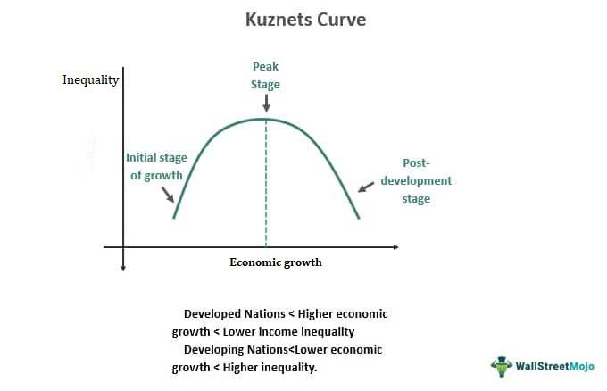

The Kuznets Curve holds a central place in economic theory, capturing significant attention for its insights into the relationship between economic growth and income inequality. Introduced by Simon Kuznets, a pioneering economist renowned for his contributions to understanding the dynamics of income distribution, this curve suggests a relationship where income inequality initially increases and subsequently decreases as a country's economy develops. This concept emerged from Kuznets' empirical observations, which were part of his broader research on the patterns and structures of economic growth. His contributions to economics earned him the Nobel Prize in Economic Sciences in 1971.

Simon Kuznets' work has not only shaped the discourse on economic development but has also informed policymakers and economists about the potential social implications of industrialization and economic growth. His hypothesis that inequality rises and then falls with developmental progress initiated a lasting dialogue about the forces that drive inequality transitions. Kuznets' broader legacy includes advancements in measuring national income and economic growth, positioning him as a foundational figure in modern economics.

The significance of the Kuznets Curve extends to contemporary discussions, particularly in light of modern economic phenomena such as algorithmic trading. As a practice that automates trading decisions through sophisticated algorithms, it presents a new landscape of economic activity that intersects with the themes of inequality articulated by Kuznets. Algorithmic trading raises questions about how technological advancements and financial innovations might influence income distribution patterns, potentially challenging or reaffirming the expectations set forth by the Kuznets Curve.

This article aims to explore these intersections, examining how the principles of the Kuznets Curve remain relevant in today's economic environment, where globalization, technology, and market practices continue to evolve. It sets the stage for an in-depth examination of the Kuznets Curve's implications across various facets of economic policy and practice, including its potential impact on modern trading mechanisms. Through this exploration, we delve into the timeless influence of Kuznets' insights on current economic strategies and future research directions.

## Table of Contents

## Understanding the Kuznets Curve

The Kuznets Curve is a concept in economic theory that illustrates the relationship between income inequality and economic development. Proposed by economist Simon Kuznets in the mid-20th century, the curve suggests that as an economy develops, inequality will initially increase and then decrease after reaching a certain level of income per capita. Visually, this relationship is depicted as an inverted U-shaped curve, with the vertical axis representing income inequality and the horizontal axis representing per capita income.

### Hypothesis of the Kuznets Curve

Kuznets' hypothesis arose from empirical observations during the 1950s and 1960s, particularly in industrialized countries such as the United States. He posited that early stages of economic development and industrialization are marked by increased inequality. This occurs as workers transition from agriculture, where wages are relatively uniform, to more varied and high-paying roles in urban industries. However, as development progresses, the benefits of economic growth become more evenly distributed across society, leading to reductions in income inequality.

Mathematically, the curve can be represented as a function of inequality $I$ in terms of income $Y$, described informally as:
$$
I(Y) = aY - bY^2 + c
$$
where $a, b, c$ are parameters determining the shape and peak of the curve, highlighting the increase in inequality at the initial income levels $a$ and decrease past the peak at $b$.

### Societal Changes and Industrialization

Industrialization plays a crucial role in the formation of the Kuznets Curve. During the initial stages, economies experience shifts from agrarian to industrial activities. This transition often leads to urbanization and the creation of wealth in industrial centers, generating a disparity between those who benefit from the new economic activities and those remaining in traditional sectors. The concentration of industries also leads to capital accumulation by a few, exacerbating inequality temporarily.

As industrialization matures, however, further shifts occur. Improvements in infrastructure, education, and technology dissemination contribute to broader access to opportunities. Labor markets respond to the increasing demand for skills, and policies such as progressive taxation or social welfare can redistribute income more equitably. These factors collectively drive the declining half of the Kuznets Curve.

### Criticisms and Empirical Evidence

The concept of the Kuznets Curve has faced various criticisms and empirical scrutiny. Critics argue that the curve oversimplifies the complex dynamics of inequality and development. The model assumes a unidirectional path of development and overlooks factors such as policy interventions, global market influences, and technological changes that significantly alter inequality dynamics.

Empirical evidence supporting the Kuznets Curve is mixed. While numerous studies within industrializing countries during the mid-20th century corroborated Kuznets' observations, subsequent research in multiple contexts has found varied outcomes. For instance, some rapidly developing nations have experienced growing inequality without clear evidence of an eventual decrease, challenging the universality of the Kuznets Curve. Instead, factors like globalization, technological advancement, and economic policies have introduced new variables that might reshape the traditional curve.

In summary, while the Kuznets Curve provides a foundational framework for understanding income inequality in the context of economic development, its applicability is nuanced and influenced by a myriad of additional factors beyond those Kuznets initially considered. The ongoing academic debate emphasizes the need for models that incorporate contemporary economic and social complexities.

## The Environmental Kuznets Curve

The Environmental Kuznets Curve (EKC) suggests that there is an inverted-U relationship between environmental degradation and economic growth. According to this hypothesis, at early stages of economic development, pollution and environmental impacts increase as a country expands its industrial base. However, after reaching a certain level of income per capita, the trend reverses, and further economic growth leads to environmental improvements, as more resources become available for cleaner technologies and stricter environmental regulations.

Empirical investigation of the EKC has produced mixed results. Some studies have supported the hypothesis by highlighting cases where countries with higher GDP per capita levels have experienced decreased levels of certain pollutants, such as sulfur dioxide and carbon emissions. For instance, Grossman and Krueger's seminal work in 1991 provided initial evidence of the EKC by illustrating how some pollutants reduced after a threshold income level was reached. The study analyzed air quality indicators from urban areas across 42 countries and found evidence of the EKC with respect to air pollution, wherein as economies surpassed middle-income levels, they started to experience a decline in pollution indicators.

However, critiques of the EKC point to several limitations in the hypothesis. Critics argue that the observed reductions in pollution may be the result of other factors not directly linked to income per capita, such as technological advancements or shifts in economic structure towards less polluting industries, rather than a natural consequence of economic growth itself. Furthermore, the EKC might not apply uniformly across all types of environmental degradation or pollutants; some pollutants may not decrease at all or may do so over different income levels and time horizons. Moreover, the notion that developing countries must endure higher pollution in early stages of development until they reach affluence could be considered an ethically problematic justification.

Modern environmental policies provide further insight into the EKC hypothesis. Policies such as carbon pricing, strict emission standards, and investment in renewable energy can push economies along the path suggested by the EKC more rapidly by deliberately fostering cleaner growth instead of waiting for the natural progression through economic maturity. For example, legislative efforts like the European Union's Emission Trading Scheme and commitments under international agreements such as the Paris Agreement serve to accelerate the decoupling of economic growth from environmental degradation, thus potentially flattening or shifting the EKC leftward, meaning environmental benefits are achieved at lower levels of income.

In contrast, the persistence of high pollution levels in rapidly developing economies like India and China challenges the universality of the EKC. Despite substantial economic growth, some researchers note that without adequate policy interventions, environmental degradation continues, driven by industrial expansion, urbanization, and increased consumption. These insights imply that while the EKC provides a useful framework for understanding potential trends in environmental impact, its predictions are heavily contingent on the adoption and effectiveness of deliberate environmental policies rather than economic growth alone.

## Relevance of the Kuznets Curve in Today's Economy

The resurgence of interest in the Kuznets Curve stems from its continued relevance in understanding the dynamics of global inequality. Originally posited by Simon Kuznets in the mid-20th century, the Kuznets Curve hypothesizes that as an economy develops, income inequality first increases and then decreases. This model has regained attention due to persistent global disparities in wealth distribution and the evolving economic landscape influenced by technology and globalization.

Technology significantly influences the Kuznets Curve's applicability. As economies have transitioned into the digital age, the role of technology in economic development has grown exponentially. On one hand, technological advancements can lead to increased productivity and growth, potentially elevating income levels across the board. However, the same technologies can exacerbate income inequality as high-skilled workers, who can adeptly use these advancements, experience wage increases while low-skilled workers may face job displacement or stagnation. The rise of automation and [artificial intelligence](/wiki/ai-artificial-intelligence), for instance, has reshaped the labor market, challenging the traditional dynamics depicted by the Kuznets Curve.

Globalization further complicates the narrative presented by the Kuznets Curve. While it can drive economic growth by opening new markets and enhancing efficiency, globalization can also lead to increased income disparities both within and between countries. The flow of capital often favors regions with established infrastructures and skilled workforces, potentially widening the gap between developed and developing regions. Moreover, globalization can contribute to a "race to the bottom," where countries compete on regulatory standards and labor costs, often to the detriment of income equality.

In advanced economies, Kuznets’ theories become particularly pertinent when considering growing income disparity. The late 20th and early 21st centuries have seen a divergence from the anticipated convergence of incomes, with wealth increasingly concentrated in the hands of a few. Factors such as declining unionization, tax policies favoring the affluent, and the financialization of economies have contributed to this trend, leading to debate over whether the Kuznets Curve can sustain its explanatory power in the face of these modern challenges.

The contemporary global economy raises questions about the original assumptions of the Kuznets Curve. With capital becoming more mobile and technology driving significant shifts, the traditional path of industrialization followed by service-led economies may no longer be the sole framework for development. Consequently, the interaction between globalization, technological change, and income inequality requires a nuanced understanding that may extend beyond Kuznets' initial model. These complexities suggest that while the Kuznets Curve provides foundational insights into economic disparities, its application needs adaptation to fit the multifaceted nature of today's global economy. Future research could explore how these forces interact, potentially leading to new interpretations and extensions of Kuznets’ work in economic policy and theoretical discourse.

## Kuznets Curve and Algo Trading

Algorithmic trading, often referred to as algo trading, involves the use of computer programs and algorithms to execute trades at high speed and frequency, with little to no human intervention. These algorithms make decisions based on set criteria and leverage vast amounts of data, analyzing trends faster than any human trader could. The advent of high-frequency trading ([HFT](/wiki/high-frequency-trading-strategies)), a subset of [algorithmic trading](/wiki/algorithmic-trading), has revolutionized financial markets by increasing [liquidity](/wiki/liquidity-risk-premium) and reducing bid-ask spreads.

The rise of algorithmic trading has had profound impacts on income inequality and the financial sector. Firstly, algo trading has contributed to the concentration of wealth among a small group of high-frequency traders and financial institutions that possess the capital and technology to implement these complex systems. These entities can exploit market inefficiencies and earn profits that are increasingly inaccessible to smaller investors, potentially exacerbating existing economic disparities.

Furthermore, algorithmic trading impacts market stability. While these trading systems increase market efficiency under normal conditions, they can lead to increased [volatility](/wiki/volatility-trading-strategies) during times of stress. Events such as the "Flash Crash" of May 6, 2010, where the Dow Jones Industrial Average plummeted about 1,000 points within minutes, illustrate the systemic risks posed by trading algorithms operating iteratively across financial markets. This phenomenon can contribute to wealth polarization, as smaller investors may not withstand such rapid and unpredictable changes, while larger firms can capitalize on the turmoil.

Considering Simon Kuznets' theories on the relationship between economic development and income inequality, algorithmic trading both aligns with and diverges from these predictions. Kuznets suggested that as an economy develops, inequality first increases and then decreases after reaching a certain level of income per capita—a pattern often illustrated by the Kuznets Curve. However, the influence of sophisticated trading technologies modifies this dynamic.

Algorithmic trading reshapes the traditional predictions of the Kuznets Curve by introducing technological disruption not originally foreseen by Kuznets. Technology accelerates capital accumulation for those with access, potentially creating a prolonged phase of heightened inequality before any equalizing effects occur. This interaction suggests a modified Kuznets Curve where the peak of inequality may be more pronounced and prolonged due to the overwhelming influence of technology-driven capital gains.

In summary, algorithmic trading introduces new variables into the understanding of income inequality, challenging established economic theories such as those proposed by Kuznets. These developments indicate a need for a nuanced analysis of how technology interacts with economic growth and distribution, with a focus on mitigating potential adverse implications for income inequality.

## Conclusion

The Kuznets Curve remains a significant framework within economic theory, highlighting the complex relationships between economic development, income inequality, and environmental challenges. Named after Simon Kuznets, a crucial figure in economics and a Nobel laureate, the curve illustrates the hypothesis that income inequality initially increases during early economic development stages, only to decrease as a society becomes more industrialized. Similarly, the Environmental Kuznets Curve (EKC) predicts that environmental degradation follows a similar pattern—initially worsening with economic growth before improving as a society becomes wealthier and more capable of implementing cleaner technologies.

Throughout the discussion, empirical evidence both supporting and challenging these hypotheses has been evaluated. While some studies affirm the existence of a turning point where economic growth leads to reduced inequality and environmental impact, others critique these models for oversimplifications, noting that historical, social, and political contexts play substantial roles.

In the contemporary economy, the resurgence of interest in the Kuznets Curve is evident, particularly as discussions on global inequality and sustainable economic growth intensify. The advent of technologies such as algorithmic trading poses new dimensions to understanding economic disparities. Although algorithmic trading may contribute to market efficiency, there is an ongoing debate on its potential to exacerbate income inequalities. In this context, the relevance of the Kuznets Curve must be reassessed considering technological advancements and globalization.

Future research on the Kuznets Curve could benefit from integrating more dynamic factors such as technological change, globalization impacts, and policy alterations. Investigating the relationship between algorithmic trading and income distribution further could offer insights into modern financial markets' complexities and their alignment or divergence with Kuznets' theories. Such inquiries would not only enhance theoretical understanding but also inform economic policies aimed at managing inequality and promoting sustainable development. This exploration is crucial as policymakers seek to harness economic growth's benefits while mitigating its potential adverse effects.

## References & Further Reading

[1]: Kuznets, S. (1955). ["Economic Growth and Income Inequality,"](https://www.aeaweb.org/aer/top20/45.1.1-28.pdf) The American Economic Review, 45(1), 1-28.

[2]: Piketty, T., & Saez, E. (2003). ["Income Inequality in the United States, 1913-1998,"](https://eml.berkeley.edu/~saez/pikettyqje.pdf) The Quarterly Journal of Economics, 118(1), 1-39.

[3]: Grossman, G. M., & Krueger, A. B. (1991). ["Environmental Impacts of a North American Free Trade Agreement,"](https://www.nber.org/papers/w3914) National Bureau of Economic Research, Working Paper No. 3914.

[4]: Atkinson, A. B., & Bourguignon, F. (Eds.). (2000). ["Handbook of Income Distribution,"](https://www.sciencedirect.com/handbook/handbook-of-income-distribution) Vol. 1, Elsevier.

[5]: Baek, J., & Koo, W. W. (2009). ["A Dynamic Approach to the FDI-Environment Nexus: The Case of China and India,"](https://www.semanticscholar.org/paper/A-Dynamic-Approach-to-the-FDI-Environment-Nexus%3A-of-Baek-Koo/ba224c5ed1b6f68f92e21bcd603ec5526a35c63c) Journal of Environmental Management, 90(4), 1161-1168.

[6]: Mankiw, N. G., Romer, D., & Weil, D. N. (1992). ["A Contribution to the Empirics of Economic Growth,"](https://eml.berkeley.edu/~dromer/papers/MRW_QJE1992.pdf)90017-J) The Quarterly Journal of Economics, 107(2), 407-437.

[7]: Jovanovic, B. (1982). ["Selection and the Evolution of Industry,"](https://www.jstor.org/stable/1912606) Econometrica, 50(3), 649-670.

[8]: Aghion, P., Caroli, E., & García-Peñalosa, C. (1999). ["Inequality and Economic Growth: The Perspective of the New Growth Theories,"](https://www.aeaweb.org/articles?id=10.1257/jel.37.4.1615)80024-6) Journal of Economic Literature, 37(4), 1615-1660.

[9]: Acemoglu, D., & Robinson, J. A. (2002). ["The Political Economy of the Kuznets Curve,"](https://onlinelibrary.wiley.com/doi/abs/10.1111/1467-9361.00149) Review of Development Economics, 6(2), 183-203.