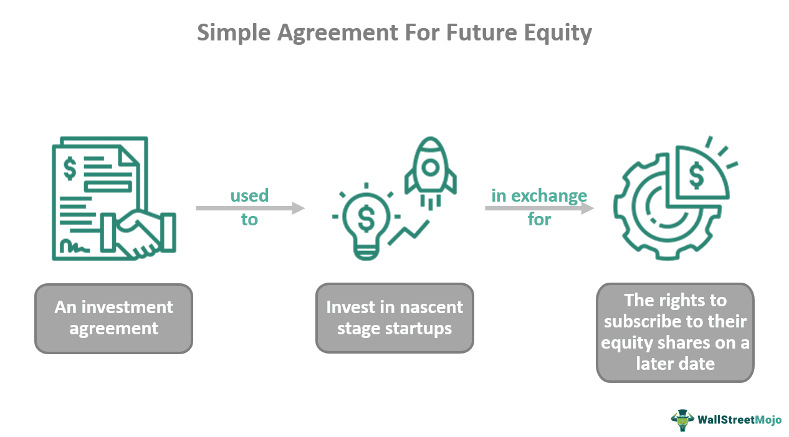

In the dynamic world of startups, securing funding is a critical step towards growth and sustainability. Obtaining the necessary capital enables startups to develop their products, hire talent, and expand their operations. One prominent method of acquiring startup investment is through equity funding agreements, notably the Simple Agreement for Future Equity (SAFE) model. The SAFE investment model provides startups and investors with a simplified framework to negotiate future equity stakes, facilitating a more streamlined capital raising process.

Alongside these funding complexities, algorithmic trading is transforming the financial landscape, offering new avenues for strategic advantage in the marketplace. Algorithmic trading utilizes sophisticated algorithms to execute trades at optimal speeds and efficiencies, significantly enhancing decision-making capabilities and offering insights that can shape funding strategies. As algorithmic trading becomes more prevalent, it represents a shift towards data-driven financial practices, influencing how startups and investors approach investment opportunities.

This article examines how startups can leverage SAFE agreements and algorithmic trading to their advantage. By understanding the mechanics of SAFE investments and the potential of algorithmic trading, startups can align their funding strategies with technological advancements in the financial sector. These improvements not only simplify investment processes but also offer enhanced opportunities for strategic positioning in a competitive market environment.

## Table of Contents

## Understanding Startup Funding

Startup funding is a critical phase for early-stage companies, requiring a delicate balance between giving up equity and obtaining capital. At this stage, businesses look for investors who can provide the financial resources needed to propel growth in exchange for an ownership stake. This exchange forms the basis of most startup funding models.

Traditional funding routes have long included venture capital (VC), angel investors, and initial public offerings (IPOs). Venture capital involves investment from funds or firms specializing in identifying and nurturing young businesses with high growth potential. These firms typically take an active role in the business, offering not just capital but also strategic advice and networking opportunities. Angel investors, often successful entrepreneurs or wealthy individuals, provide funding at even earlier stages compared to VCs and can also offer valuable mentorship.

An IPO allows a company to raise large amounts of capital from public markets by selling shares to public investors. However, this route is generally suitable for more mature startups due to the regulatory complexities and costs involved.

In recent years, new funding models have emerged to mitigate some of the complexities associated with traditional methods. A notable innovation is the Simple Agreement for Future Equity (SAFE). Unlike traditional equity agreements, SAFEs offer a flexible and less bureaucratic approach to fundraising. Originally introduced by Y Combinator, a leading startup [accelerator](/wiki/accelerator), SAFE agreements allow startups to secure funding without needing to determine a valuation immediately. Instead, they convert into equity at a future financing round or another specified event, sidestepping the detailed negotiations on company valuation that often accompany traditional funding deals.

This innovation appeals to both startups and investors due to its simplicity and the potential for substantial future equity. For startups, it means less administrative overhead and more focus on development and growth. For investors, it presents an opportunity to gain significant equity stakes should the startup succeed in its future rounds of funding. As the financial landscape continues to evolve, models like SAFE agreements are likely to play an increasingly prominent role in startup funding strategies.

## What is a SAFE Agreement?

A SAFE (Simple Agreement for Future Equity) agreement is an investment contract used to simplify the funding process for startups. The concept was introduced by the startup accelerator Y Combinator in 2013, aiming to offer a more streamlined and flexible approach to obtain funding compared to traditional equity financing methods. 

SAFE agreements offer a mechanism whereby the valuation of the startup is deferred to a later date. This deferral is beneficial to both startups and investors, as it allows companies to acquire necessary funding without engaging in protracted price negotiations at the outset. Instead, the company valuation will be determined at a subsequent, typically more mature, round of financing or during a specified triggering event, such as an acquisition or bankruptcy. 

These agreements typically convert into equity either during a financing round that follows or when an event that is stipulated in the agreement occurs. Because they do not determine an immediate value for company shares, SAFE agreements can be advantageous in volatile or early-stage markets where an accurate valuation may be difficult to ascertain.

The simplicity of SAFE agreements and their potential for yielding significant future equity make them attractive to investors. They appeal to investors who are willing to assume some risk upfront for the prospect of equity stake in a startup once it achieves a substantive financing round. By avoiding detailed early-stage negotiations, SAFE agreements provide a mutually beneficial solution for startups looking to focus on growth and innovation while securing essential capital.

## Exploring Algorithmic Trading

Algorithmic trading uses advanced algorithms to execute trades with high speed and efficiency, transforming financial markets by optimizing the decision-making process through technology. These algorithms utilize various mathematical models and statistical methods to analyze market data, identify trading opportunities, and execute trades based on predefined parameters. This technological approach allows trades to occur in milliseconds, far outpacing human capabilities and maximizing potential returns.

Algorithmic trading fundamentally relies on the ability to process large volumes of data quickly to make informed decisions. Algorithms can parse historical data and real-time market fluctuations to predict future price movements. This prediction model is enhanced by [machine learning](/wiki/machine-learning) techniques, where algorithms adapt and improve from new data inputs over time.

Mathematically, an algorithm might use linear regression models to predict stock prices based on historical correlations between variables. Consider the relationship expressed as:

$$
P(t) = \alpha + \beta X + \epsilon
$$

where $P(t)$ is the predicted price, $\alpha$ is a constant, $\beta$ represents coefficients correlating different explanatory variables $X$, and $\epsilon$ is the error term. The algorithm will adjust $\alpha$ and $\beta$ based on data to minimize $\epsilon$, thereby refining its predictive accuracy.

In practice, [algorithmic trading](/wiki/algorithmic-trading) involves various strategies, such as statistical [arbitrage](/wiki/arbitrage), [trend following](/wiki/trend-following), and [market making](/wiki/market-making). Each strategy has its unique model and execution plan, all governed by technologies designed to spot short-lived trends and exploit them before human traders are able to react. Startups leveraging algorithmic trading can enhance their appeal to investors by demonstrating the ability to manage and interpret big data effectively, showcasing their technological sophistication in identifying lucrative market opportunities.

The prevalence of algorithmic trading represents a broader trend towards data-driven finance, where analytical capabilities define competitiveness. This trend is evident as more financial technology startups turn to algorithmic solutions to streamline operations and achieve strategic advantages. The technological prowess displayed through effective algorithmic trading not only strengthens market positioning but attracts potential investors interested in innovative and forward-thinking business models.

## SAFE Investments and Algo Trading: A Symbiotic Relationship

SAFE agreements and algorithmic trading, while distinct financial tools, combine to form a potent synergy that enhances [capital raising](/wiki/hedge-fund-capital-raising) and investment strategies for startups. SAFE agreements simplify the process of securing funding by offering a flexible mechanism for future equity conversion based on a trigger event, such as a subsequent financing round. This deferral of valuation negotiations allows startups to focus on growth without being bogged down by immediate equity pricing concerns.

Algorithmic trading, on the other hand, revolutionizes investment strategies by utilizing advanced algorithms to execute trades with speed and precision. This technology allows for real-time analysis of market data, enabling more informed and timely decision-making. Startups can use these algorithmic models to predict their funding requirements more accurately and determine optimal timing for equity conversion under SAFE agreements. For example, algorithms can analyze market trends and startup performance metrics to suggest the best time to convert a SAFE into equity, potentially maximizing valuation.

For investors, algorithmic tools offer a method to gauge a startup's potential before committing funds. By leveraging data analytics and machine learning, investors can assess market conditions, startup performance indicators, and broader economic factors to make well-timed investment decisions. This strategic insight reduces the risks associated with early-stage investments and aligns with the startup’s growth trajectory.

The interplay between SAFE investments and algorithmic trading signifies a confluence of financial innovation and technology. By harmonizing the flexibility of SAFE agreements with the data-driven precision of algorithmic trading, startups and investors alike can streamline the capital raising process. For startups, this means access to capital when it's most needed without the additional burden of negotiating valuations prematurely. For investors, it represents an opportunity to diversify their portfolios with minimal risk through meticulously timed investments.

This combination of financial engineering and technological advancement provides clear benefits, offering a modern approach to startup financing that adapts to the evolving financial landscape. Both startups and investors can capitalize on this synergy to drive innovation and growth, underscoring the need for continued exploration and adoption of such integrated financial strategies.

## Challenges and Considerations

SAFE (Simple Agreement for Future Equity) agreements and algorithmic trading, despite their innovative advantages, pose several challenges and considerations for startups and investors. These challenges must be meticulously understood to maximize the instruments' potential while mitigating associated risks.

SAFE agreements, although simple and flexible, can introduce complexities surrounding equity structuring and potential dilution risks. When a SAFE converts into equity upon a triggering event, such as subsequent financing, it can significantly dilute existing shareholders if not adequately planned. This uncertainty in equity structure can affect future funding rounds and the overall capital table of a startup. It is crucial for startups to model various scenarios about how safes impact their ownership schema to make informed strategic decisions.

Algorithmic trading, on the other hand, is not without its own set of challenges. The sophistication of these trading algorithms necessitates robust technological infrastructure to prevent failures. Technological risks, such as system errors or latency issues, can lead to substantial financial losses. Additionally, the financial markets are unpredictable, and even the most advanced algorithms cannot anticipate all market movements, leading to potential misjudgments in trading strategies. To mitigate these risks, continuous monitoring, testing, and refinement of algorithms are essential.

Regulatory compliance poses another challenge in both SAFE agreements and algorithmic trading. The regulatory environment is constantly evolving, with authorities scrutinizing these modern financial instruments more closely. Startups must stay informed about the latest legal developments to ensure compliance and avoid potential legal pitfalls. Likewise, algorithmic trading is subject to regulatory standards aimed at maintaining fair and transparent markets. Familiarity with these regulations, such as those related to market manipulation and insider trading, is critical for both startups and investors.

Due diligence remains paramount for investors considering either of these investment methods. Investors should thoroughly evaluate startups' financial health, strategic plans, and the robustness of their algorithmic trading systems before committing capital. Due diligence helps identify potential risks and allows investors to make well-informed decisions.

Ultimately, a deep understanding of the intricacies and potential risks associated with SAFE agreements and algorithmic trading is integral to harnessing their full potential. Such understanding can help startups and investors alike navigate the complex financial landscape, driving strategic growth and investment efficiency.

## Conclusion

The landscape of startup funding is experiencing a transformative shift with the advent of SAFE agreements and algorithmic trading. SAFE (Simple Agreement for Future Equity) agreements offer an innovative approach, simplifying the investment process by deferring valuation negotiations until a later stage. This enables startups to quickly secure the financial resources they need without getting entangled in early-stage equity discussions, fostering an environment conducive to rapid growth and adaptability.

Algorithmic trading further complements this funding model by offering enhanced financial decision-making through its data-driven approach. With the ability to analyze vast amounts of market data at unprecedented speeds, algorithmic trading provides precise insights, allowing both startups and investors to make informed decisions that maximize potential returns. This technology not only benefits startups seeking to predict funding needs and optimize equity conversion timing but also offers investors a tool to evaluate startup potential more accurately, facilitating well-timed and strategic investments.

The confluence of SAFE agreements and algorithmic trading represents a symbiosis of simplicity and technological advancement, streamlining the capital-raising process. This convergence empowers startups to strategically secure essential funding, while investors can diversify their portfolios with innovative financial instruments that balance potential risks and rewards. 

The evolution of these financial tools underscores the importance of being well-informed and adaptable in a rapidly changing financial landscape. As SAFE agreements and algorithmic trading continue to reshape the financial terrain, both startups and investors must remain agile, embracing these innovations to achieve sustainable growth and robust investment portfolios.

## References & Further Reading

[1]: ["Simple Agreement for Future Equity (SAFE)"](https://www.forbes.com/sites/kylewestaway/2023/01/06/understanding-safe-agreements-benefits-and-risks-for-startups/) by Y Combinator

[2]: ["Venture Deals: Be Smarter Than Your Lawyer and Venture Capitalist"](https://www.amazon.com/Venture-Deals-Smarter-Lawyer-Capitalist/dp/1119259754) by Brad Feld and Jason Mendelson

[3]: Nathaniel Popper. ["Digital Gold: Bitcoin and the Inside Story of the Misfits and Millionaires Trying to Reinvent Money"](https://www.amazon.com/Digital-Gold-Bitcoin-Millionaires-Reinvent/dp/006236250X)

[4]: ["Advances in Financial Machine Learning"](https://www.amazon.com/Advances-Financial-Machine-Learning-Marcos/dp/1119482089) by Marcos Lopez de Prado

[5]: ["Algorithmic Trading: Winning Strategies and Their Rationale"](https://play.google.com/store/books/details/Algorithmic_Trading_Winning_Strategies_and_Their_R?id=CIwCTVqEj4oC&hl=en-US) by Ernie Chan