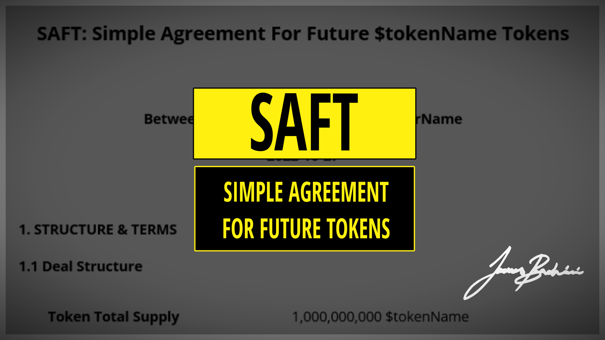

## Table of Contents

## What is a Simple Agreement for Future Tokens (SAFT)?

A Simple Agreement for Future Tokens (SAFT) is a type of investment contract used in the world of cryptocurrencies and blockchain projects. It allows investors to give money to a project now, with the promise of receiving tokens later when the project launches or reaches certain milestones. This is helpful for new projects that need funding to develop their ideas before they can issue their tokens.

SAFTs are popular because they let startups raise money without having to create and sell tokens right away. This can be important if the project isn't ready or if the rules about selling tokens are complicated. By using a SAFT, both the project and the investors agree on the terms early, making it clear when and how the investors will get their tokens in the future.

## How does a SAFT differ from traditional investment methods in cryptocurrency?

A SAFT is different from traditional investment methods in cryptocurrency because it's not about buying tokens right away. With traditional methods like Initial Coin Offerings (ICOs), investors buy tokens directly when they're available. But with a SAFT, investors give money to a project early on, before the tokens even exist. They get a promise that they'll receive tokens later, when the project is ready. This helps new projects get the money they need to build and grow before they can offer tokens to the public.

Another difference is how SAFTs handle legal and regulatory issues. Traditional methods like ICOs can be tricky because the rules about selling tokens can be strict and different in each country. SAFTs are designed to work around these issues by being a kind of investment contract that promises future tokens instead of selling them right away. This makes it easier for projects to raise money legally while they're still developing, and it gives investors a clear agreement on when and how they'll get their tokens.

## What are the key components of a SAFT?

A SAFT includes several important parts that make it work. First, there's the promise of future tokens. This means the investors give money now and get a promise that they'll receive tokens later when the project is ready. The agreement also says how many tokens the investors will get, which depends on how much money they put in. Another part is the price of the tokens. The SAFT sets a price for the tokens that the investors will get in the future, which helps everyone know what to expect.

Another key part of a SAFT is the conditions for when the tokens will be given out. This could be when the project reaches certain goals or when they launch their tokens to the public. The agreement also talks about what happens if things don't go as planned, like if the project can't give out the tokens. There are also rules about how the money from investors can be used by the project, to make sure it's spent wisely on building the project. All these parts together make a SAFT a clear and fair way for new projects to get the money they need to grow.

## Who can typically invest in a SAFT?

Usually, only certain people can invest in a SAFT. These are often called accredited investors. They are people who have a lot of money or know a lot about investing. This is because SAFTs can be risky since the tokens are promised for the future, and the project might not work out. So, the rules are strict to protect people who might not understand the risks.

Sometimes, the project might let other people invest too, but this is less common. It depends on the rules in different places and how the project wants to raise money. But most of the time, SAFTs are for people who are experienced with investing and can handle the risks that come with waiting for future tokens.

## What are the potential benefits of investing in a SAFT for both issuers and investors?

For issuers, a SAFT can be a great way to raise money early in their project. When a project is just starting out, it might not have tokens ready to sell yet. A SAFT lets the issuer get the money they need to build and grow their project before they can offer tokens to everyone. This early funding helps them work on their idea without worrying about money right away. Plus, because SAFTs are designed to work within legal rules, issuers can raise money in a way that's less risky and more clear for everyone involved.

For investors, a SAFT offers a chance to get in on a new project early. By investing in a SAFT, they can buy tokens at a lower price before the project gets big and the tokens might become more expensive. This early investment can lead to bigger rewards if the project does well. Also, because SAFTs are agreements made before the tokens exist, investors know exactly what they're getting and when they'll get it, which can make investing feel safer and more predictable.

## What are the risks associated with SAFTs?

Investing in a SAFT can be risky because the tokens you're promised might never be made. If the project fails or doesn't finish, you might not get any tokens at all. This means you could lose all the money you put in. Also, since SAFTs are about future tokens, it's hard to know if the project will be worth it. You're betting on something that hasn't happened yet, and that can be a big risk.

Another risk is that the rules about SAFTs can change. Different countries have different laws about what's allowed, and these laws can change over time. If the rules change, it might affect whether the project can give you the tokens they promised. Plus, because SAFTs are often only for people with a lot of money or experience, regular people might not be allowed to invest. This can make it feel unfair or like you're missing out on a good opportunity.

## How is the valuation of future tokens determined in a SAFT?

The valuation of future tokens in a SAFT is decided by looking at how much money investors put in and how many tokens they will get later. The project sets a price for the tokens that will be given out in the future. This price is based on what the project thinks the tokens will be worth when they are ready. It's like guessing how much something will be worth before it's even made.

This guess can be tricky because it depends on a lot of things, like how well the project does and what people think about it. If the project does better than expected, the tokens might be worth more than what was guessed. But if the project has problems, the tokens might be worth less or nothing at all. So, the valuation in a SAFT is a kind of promise about the future, and it's not always easy to get it right.

## What legal considerations should be taken into account when issuing a SAFT?

When a project wants to issue a SAFT, they need to think about the laws in different places. SAFTs are made to follow the rules about selling tokens, but these rules can be different everywhere. In some countries, only certain people, like those with a lot of money or experience, can invest in SAFTs. The project needs to make sure they're following these rules so they don't get in trouble. They also need to be clear about what they're promising with the SAFT, so everyone knows what to expect.

Another important thing is to make sure the SAFT agreement is strong and clear. This means writing down exactly when and how investors will get their tokens, and what happens if things don't go as planned. If the project can't give out the tokens, they need to say what they'll do instead. It's also good to have lawyers check the SAFT to make sure it's legal and fair. This helps protect both the project and the investors, and makes sure everyone understands the risks and rewards.

## Can you explain the process of converting a SAFT into actual tokens?

When it's time to convert a SAFT into actual tokens, it happens based on what the SAFT agreement says. Usually, this happens when the project reaches certain goals or when they launch their tokens to the public. The project will tell the investors when this is going to happen, so everyone knows what to expect. The investors then get the tokens they were promised, based on how much money they put in and the price set in the SAFT.

The process of getting the tokens can be different depending on the project. Sometimes, the project will send the tokens directly to the investors' digital wallets. Other times, investors might need to do something, like fill out a form or use a special website to claim their tokens. It's important for investors to follow the instructions from the project carefully, so they don't miss out on getting their tokens. Once the tokens are in their wallets, investors can use them or sell them, just like any other [cryptocurrency](/wiki/cryptocurrency).

## How have regulatory bodies like the SEC viewed SAFTs?

The U.S. Securities and Exchange Commission (SEC) has been watching SAFTs closely. They want to make sure that people who invest in them are protected and that the rules are followed. The SEC sees SAFTs as a way to raise money before tokens are ready, but they still think these agreements need to follow the same rules as other investments. If a SAFT is set up the wrong way, the SEC might say it's breaking the law, and the project could get in trouble.

Even though SAFTs are meant to help projects follow the rules, the SEC has said that they need to be careful. They've looked at some SAFTs and found that they might be selling securities, which means they need to follow special rules. The SEC wants projects to be honest about what they're promising and to make sure only the right people can invest. This way, they can help keep the investing world fair and safe for everyone.

## What are some notable examples of successful SAFT implementations in the crypto industry?

One successful example of a SAFT in the crypto industry is Filecoin. Filecoin used a SAFT to raise money before their tokens were ready. They promised investors that they would get Filecoin tokens later, once the project was finished. This early funding helped them build their project, which is about storing data on a special kind of network. When Filecoin finally launched their tokens, the investors who had bought into the SAFT got their tokens and were happy with how things turned out.

Another example is Blockstack. They also used a SAFT to raise money for their project, which is about building a new kind of internet. By using a SAFT, Blockstack was able to get the money they needed to keep working on their idea. When they were ready, they gave out the promised tokens to their investors. This helped Blockstack grow and become a well-known name in the crypto world. Both Filecoin and Blockstack show how SAFTs can be a good way for new projects to get started and succeed.

## How might the future of SAFTs evolve with changes in cryptocurrency regulations and market dynamics?

The future of SAFTs might change a lot because of new rules about cryptocurrencies and how the market works. As more countries make their own rules about what's allowed with tokens and investments, projects might have to change how they use SAFTs. If the rules get stricter, SAFTs might need to be more careful about who can invest and how they promise future tokens. But if the rules become clearer and easier to follow, more projects might use SAFTs to raise money. The market also plays a big part. If people keep wanting to invest in new crypto projects, SAFTs could stay popular. But if the market changes and people get worried about risks, projects might need to find other ways to get money.

Even with these changes, SAFTs could still be useful for new projects. They let projects get money early on, which can be really helpful for building and growing. As long as projects can keep following the rules and make good promises to investors, SAFTs might keep being a good choice. But projects will need to be ready to change how they use SAFTs depending on what's happening with the rules and the market. This way, they can keep raising money in a way that's fair and safe for everyone involved.

## References & Further Reading

[1]: Juan Ignacio Ibañez, & Anthony Zeoli. (2017). ["SAFT Background and FAQs."](https://profiles.ucl.ac.uk/77438-juan-ignacio-ibanez) Cooley LLP.

[2]: Juan Batiz-Benet, Marco Santori, & Jesse Clayburgh. (2017). ["The SAFT Project: Toward a Compliant Token Sale Framework."](https://saftproject.com/static/SAFT-Project-Whitepaper.pdf) Whitepaper.

[3]: ["Cryptocurrency Trading & Investing: Beginners Guide To Bitcoin - Crypto Market, Exchanges, Brokers, Buying, Selling & Investing Cryptocurrencies"](https://www.amazon.com/Cryptocurrency-Trading-Investing-Beginners-Cryptocurrencies/dp/1547416588) by Aimee Vo

[4]: Narayanan, A., Bonneau, J., Felten, E., Miller, A., & Goldfeder, S. (2016). ["Bitcoin and Cryptocurrency Technologies: A Comprehensive Introduction."](https://press.princeton.edu/books/hardcover/9780691171692/bitcoin-and-cryptocurrency-technologies) Princeton University Press.

[5]: Marcos Lopez de Prado. (2018). ["Advances in Financial Machine Learning."](https://www.amazon.com/Advances-Financial-Machine-Learning-Marcos/dp/1119482089) Wiley.

[6]: Investopedia Team. (2021). ["Simple Agreement for Future Tokens (SAFT) Definition."](https://www.investopedia.com/simple-agreement-for-future-equity-8414773) Investopedia.

[7]: David F. Swensen. (2009). ["Pioneering Portfolio Management: An Unconventional Approach to Institutional Investment."](https://books.google.com/books/about/Pioneering_Portfolio_Management.html?id=SbIz2gRbrF4C) Free Press.