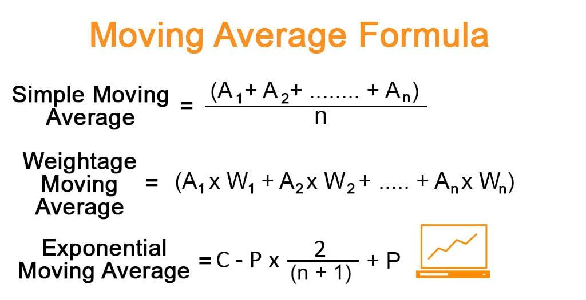

Technical analysis is an essential component of algorithmic trading, enabling traders and automated systems to forecast future price movements by analyzing historical market data. It relies on various tools and indicators to discern patterns and trends that may not be immediately visible. Central to these tools is the Simple Moving Average (SMA), a foundational element of technical analysis. SMA is a statistical calculation that simplifies price data, allowing traders to identify prevailing market trends more effectively.

The Simple Moving Average plays a crucial role as it aids in smoothing out price fluctuations, providing a clearer view of the market's direction. By calculating the average of a security's price over a specific number of periods, the SMA helps traders understand the underlying trend, whether upward, downward, or sideways. This characteristic of SMA is invaluable in developing effective trading strategies that can capitalize on these trends. For instance, when the current price consistently stays above the SMA, it can indicate a bullish trend, suggesting potential buying opportunities.



This article aims to explore the SMA formula in detail and illustrate its application in algorithmic trading. By understanding how SMA can be integrated into trading algorithms, traders can enhance their strategies to respond to dynamic market conditions. The discussion will encompass the essential concepts required to grasp the significance of SMA in trading, providing insights into its advantages, limitations, and practical applications within algorithmic frameworks. As we progress, readers will gain a comprehensive understanding of how to leverage SMA to bolster their trading methodologies effectively.

## Table of Contents

## Understanding Simple Moving Averages (SMA)

A Simple Moving Average (SMA) is a widely used technical indicator that aids in the analysis of market data by smoothing out fluctuations in price to highlight underlying trends. The SMA calculates the average price of a given asset over a specified period by summing up its prices during that period and dividing by the total number of prices. This simple technique helps traders to understand market movements without the noise inherent in daily price variations.

The smoothing effect of SMA is particularly beneficial in revealing trends in price data. By averaging a set of data points, the SMA provides a clearer view of the direction in which a market is moving, eliminating much of the short-term volatility. This makes it easier to identify trends, whether upward, downward, or sideways, thus informing trading decisions. For instance, when the price of an asset consistently stays above its SMA, it might indicate an upward trend.

One of the key features of the SMA is its customizable nature. Traders can adjust the period over which the SMA is calculated to better suit different trading strategies and market conditions. Common SMA periods include 10, 50, or 200 days, but any period can be used. A short period SMA, such as 10 days, will react quickly to price changes and is useful for short-term trades, while a longer period SMA, like 200 days, shows more stable trends suitable for long-term investments.

To illustrate how SMA can be used in various market conditions, consider a trader analyzing a stock trending upwards over several months. The trader might use a 50-day SMA to confirm the trend and set buy or sell signals accordingly. For example, if the stock price consistently rises above its 50-day SMA, this may strengthen the trader's decision to buy. Conversely, if the price falls below the 50-day SMA, it could indicate a potential sell-off or downturn.

Overall, the SMA is a fundamental tool in technical analysis that provides a straightforward method for traders to interpret market data and identify trends. Its ability to smooth out price data, combined with the flexibility of customizing the period, makes it an invaluable component in developing effective trading strategies.

## The SMA Formula

The Simple Moving Average (SMA) is an essential tool for traders and analysts seeking to uncover trends within market data. The SMA is calculated by summing up a specified number of recent price points and dividing the total by the number of periods. Mathematically, the SMA is expressed as:

$$
\text{SMA} = \frac{A_1 + A_2 + \ldots + A_n}{n}
$$

where $A_1, A_2, \ldots, A_n$ represent individual price points over $n$ periods. This formula is designed to help smooth out short-term fluctuations and highlight longer-term trends in the data.

### Example: Calculating a 15-Day SMA

Consider a dataset representing the closing prices of a stock over a period of 15 days. If these daily closing prices are: 

$$

\begin{align*}
\text{Day 1: } & 100, \\
\text{Day 2: } & 102, \\
\text{Day 3: } & 101, \\
\text{Day 4: } & 105, \\
\text{Day 5: } & 107, \\
\text{Day 6: } & 108, \\
\text{Day 7: } & 107, \\
\text{Day 8: } & 110, \\
\text{Day 9: } & 112, \\
\text{Day 10: } & 111, \\
\text{Day 11: } & 113, \\
\text{Day 12: } & 115, \\
\text{Day 13: } & 117, \\
\text{Day 14: } & 116, \\
\text{Day 15: } & 120 \\
\end{align*}
$$

To compute the 15-day SMA for this dataset, sum all 15 prices and divide by 15:

$$

\text{SMA}_{15} = \frac{100 + 102 + 101 + 105 + 107 + 108 + 107 + 110 + 112 + 111 + 113 + 115 + 117 + 116 + 120}{15} = \frac{1544}{15} = 102.93 
$$

This SMA of approximately 102.93 provides a smoothed view of the stock's closing prices over the specified period, facilitating trend analysis.

### Comparison with Other Moving Averages

#### Exponential Moving Average (EMA)

The Exponential Moving Average (EMA) differs from the SMA in terms of how it weights the data points. While the SMA treats all periods equally, the EMA gives more weight to recent prices, making it more responsive to new information. The formula for the EMA incorporates a smoothing [factor](/wiki/factor-investing) $\alpha$, which determines the weight given to the most recent data:

$$
\text{EMA}_{\text{today}} = \alpha \cdot \text{Price}_{\text{today}} + (1-\alpha) \cdot \text{EMA}_{\text{yesterday}}
$$

where $\alpha = \frac{2}{n+1}$.

#### Weighted Moving Average (WMA)

The Weighted Moving Average (WMA) assigns different weights to each data point, usually increasing linearly, where the most recent data points receive the highest weight. This characteristic allows the WMA to follow price trends more closely than the SMA.

Both EMA and WMA are known for their ability to reflect more current price movements, making them preferable in volatile markets compared to the lagging nature of the SMA. However, the SMA's simplicity and ease of computation often make it a popular choice among traders preferring straightforward trend analysis.

## Advantages and Limitations of SMA

The Simple Moving Average (SMA) is a widely utilized tool in technical analysis, known for its straightforward calculation and broad applicability across various markets. Its primary advantage lies in its simplicity; the SMA is computed by taking the arithmetic mean of a set number of closing prices over a specific period. For example, a 10-day SMA is calculated as the average of the closing prices over the last 10 days. This simplicity makes it accessible even to beginners and encourages widespread usage across diverse trading strategies.

Another significant advantage of SMA is its ability to provide a clear picture of price trends by smoothing out short-term fluctuations. By averaging out price data, SMA helps identify longer-term trends, which can be crucial for trend-following strategies and other trading techniques focusing on broader market movements.

However, the SMA has notable limitations. One of the primary drawbacks is its lagging nature, as it is inherently based on past data. The reliance on historical prices means that SMA reacts slowly to rapid changes in the market conditions. This lag can be problematic in rapidly moving markets where timely responses are critical.

Furthermore, the SMA assigns equal weight to all data points within the selected period. This equal weighting can result in outdated information unduly influencing the moving average, especially when older data significantly differs from recent price movements. Traders might find that this characteristic diminishes the responsiveness and accuracy of the SMA in reflecting current market dynamics.

The reliability of SMA can also be impacted by using outdated data, which may no longer be relevant. In markets subject to frequent price changes due to economic events or sudden news, the SMA may fail to provide an accurate representation of the current trend if it heavily incorporates older price data. For these reasons, traders often complement SMA with other indicators or opt for more responsive alternatives, such as the Exponential Moving Average (EMA), which gives more weight to recent prices.

In summary, while the SMA is valued for its simplicity and clear trend depiction, its limitations, including lag and equal weighting, necessitate careful consideration and, often, adaptation or enhancement with additional tools for improved reliability and responsiveness.

## SMA in Algo Trading

Simple Moving Averages (SMA) are integral to [algorithmic trading](/wiki/algorithmic-trading) strategies due to their straightforward computation and ability to smooth out price data, making it easier to identify trends. In algo trading, SMA can be seamlessly integrated into automated trading systems to enhance decision-making processes, specifically for trend identification and mean reversion strategies.

### Integration of SMA into Automated Trading Strategies

To incorporate SMA in algorithmic trading, traders typically use it to evaluate historical price data, allowing algorithms to execute trades when prices follow specific patterns relative to the moving average. The SMA line serves as a dynamic support or resistance level, helping to inform buy or sell decisions. By leveraging SMA, traders can automate market entries and exits based on predetermined criteria, thus optimizing their trading efficiency.

### Use Cases of SMA in Algo Trading

#### Trend Identification

SMA is predominantly employed in trend-following strategies. For instance, when the price of an asset consistently remains above its moving average, it may signal an upward trend, prompting algorithms to execute long positions. Conversely, a price below the SMA can indicate a downtrend, suggesting short-selling opportunities.

**Example:**

A common approach is using a dual-SMA crossover strategy. This involves two SMAs of different periods, commonly referred to as the fast and slow SMA. The fast SMA, calculated over a shorter timeframe, reacts more swiftly to price changes, while the slow SMA, averaging prices over a longer period, provides a broader view. A classic application is:

- **Golden Cross:** Occurs when the fast SMA crosses above the slow SMA, signaling a potential bullish market. This crossover can trigger buy signals within an algorithm.

- **Death Cross:** Occurs when the fast SMA crosses below the slow SMA, indicating a possible bearish market. Algorithms use this crossover to trigger sell signals.

```python
# Python example for a dual-SMA crossover strategy

def sma(data, window):
    return data.rolling(window=window).mean()

def trading_strategy(prices, short_window, long_window):
    signals = pd.DataFrame(index=prices.index)
    signals['price'] = prices
    signals['short_sma'] = sma(prices, short_window)
    signals['long_sma'] = sma(prices, long_window)
    signals['signal'] = 0.0

    # Generate trading signals
    signals['signal'][short_window:] = np.where(
        signals['short_sma'][short_window:] > signals['long_sma'][short_window:], 1.0, 0.0)

    # Generate trading orders
    signals['positions'] = signals['signal'].diff()

    return signals
```

#### Mean Reversion

Apart from trend-following, mean reversion strategies also utilize SMA. These strategies are based on the belief that the price of an asset will eventually revert to its long-term mean, represented by the SMA line. If a significant price deviation occurs, such algorithms may identify it as an opportunity to enter a trade, expecting a return to the average.

### Examples of Popular Trading Strategies

The golden cross and death cross mentioned above are quintessential examples of SMA-driven strategies used in algo trading. These strategies capitalize on the belief that once an upward or downward crossover occurs, the price is likely to continue in that direction for some time. By pre-programming these signals into an algorithm, traders can automate the execution of trades, minimizing human error and emotional decision-making.

SMA's robust integration into trading algorithms is a testament to its utility in both identifying trends and harnessing mean reversion dynamics. Its simplicity and effectiveness continue to make it a preferred choice for traders and developers creating automated strategies.

## Comparing SMA and Exponential Moving Average (EMA)

Simple Moving Average (SMA) and Exponential Moving Average (EMA) are both widely utilized moving averages in technical analysis. While they share the purpose of smoothing price data to help discern market trends, there are distinct differences in their responsiveness to price changes that make each suitable for particular market conditions.

The primary difference between SMA and EMA lies in their sensitivity to recent price changes. The SMA assigns an equal weight to all data points in the calculation period, resulting in a straightforward average that smooths out price data over the specified window. This characteristic makes SMA less responsive to sharp price fluctuations, thus providing a more stable view of the trend over time. However, it also means that SMA may react slowly to sudden market shifts, potentially causing traders to miss entry or [exit](/wiki/exit-strategy) opportunities during rapid price movements.

Conversely, the EMA gives more weight to the most recent prices, making it more sensitive to recent price movements. This is achieved using a smoothing factor in its formula, which can be expressed as:

$$
\text{EMA}_t = \left ( P_t \times \frac{2}{n+1} \right ) + \left ( \text{EMA}_{t-1} \times \left (1 - \frac{2}{n+1} \right ) \right )
$$

where:
- $\text{EMA}_t$ is the current EMA,
- $P_t$ is the current price,
- $n$ is the selected number of periods.

This increased sensitivity allows EMA to react more quickly to recent price changes, making it more useful in volatile market conditions. Traders often prefer EMA over SMA when fast-moving markets demand quicker signal generation. For instance, in periods of strong trending behavior, the EMA may provide more timely signals for entering or exiting trades compared to the slower-moving SMA.

While EMA's responsiveness is an advantage in swift markets, it can also result in false signals during sideways or choppy market conditions. This characteristic can lead some traders to prefer SMA, despite its slower response, as its dampened sensitivity may help in filtering out market noise.

In essence, the choice between using an SMA or EMA depends largely on the specific trading strategy and market conditions. Traders must assess the balance between smoothness and responsiveness to effectively utilize these tools for technical analysis and algorithmic trading.

## Implementing SMA for Trading Success

Implementing the Simple Moving Average (SMA) for trading requires a strategic approach to ensure effectiveness and minimize errors. The SMA is a valuable tool due to its simplicity and the ability to smooth out market noise, yet traders must apply best practices to maximize its utility.

**Best Practices for Using SMA**

To avoid common pitfalls, traders should carefully select the period length for the SMA based on their trading strategy and market conditions. A shorter SMA period will be more sensitive to recent price changes, capturing short-term trends but increasing the risk of false signals. Conversely, a longer period SMA smooths out more [volatility](/wiki/volatility-trading-strategies) and might miss timely exit or entry points. Balance is key, and testing different periods to match specific market scenarios is advised.

Understanding market context is also crucial. The SMA performs best in trending markets, where it can help identify the direction of the price. In sideways or choppy markets, traders might encounter whipsaws—frequent crossovers generating misleading signals. Therefore, combining the SMA with [volume](/wiki/volume-trading-strategy) indicators or other trend-confirming tools can help filter these false signals.

**Combining SMA with Other Indicators**

To enhance accuracy, traders often combine SMA with other technical indicators. For example, pairing it with Relative Strength Index (RSI) can add value by assessing whether a market is overbought or oversold, offering clearer confirmation for trades. Moving Average Convergence Divergence (MACD) is another powerful companion, indicating shifts in [momentum](/wiki/momentum) that complement SMA trend signals.

Using multiple moving averages of different periods, such as plotting both a short-term and a long-term SMA, helps identify trends' strength and potential reversals. A "golden cross" (when a short-term average crosses above a long-term average) and a "death cross" (when a short-term average crosses below a long-term average) are popular signals derived from this setup.

**Importance of Backtesting SMA Strategies**

Backtesting is a crucial step in the implementation process. It involves applying the SMA strategy to historical data to evaluate its effectiveness and reliability before deploying it in a live trading environment. Backtesting can expose flaws in the strategy, such as failings in particular market conditions, and help refine parameter settings for optimal performance.

Traders can use Python to backtest SMA strategies efficiently. Libraries like Pandas and Backtrader provide the necessary tools to perform comprehensive analyses. An example of a simple backtest setup in Python might look like this:

```python
import pandas as pd
import backtrader as bt

# Create a strategy
class SMATest(bt.SignalStrategy):
    def __init__(self):
        sma_short = bt.indicators.SimpleMovingAverage(self.data.close, period=20)
        sma_long = bt.indicators.SimpleMovingAverage(self.data.close, period=50)
        self.signal_add(bt.SignalLong, sma_short > sma_long)
        self.signal_add(bt.SignalShort, sma_short < sma_long)

# Load data
data = bt.feeds.YahooFinanceData(dataname='AAPL', fromdate=pd.Timestamp('2020-01-01'), todate=pd.Timestamp('2021-01-01'))

# Set up Cerebro engine
cerebro = bt.Cerebro()
cerebro.addstrategy(SMATest)
cerebro.adddata(data)
cerebro.run()
cerebro.plot()
```

This script sets up a basic backtest strategy where short and long SMAs are compared for crossover signals. Traders can adjust parameters to suit different assets or time frames and analyze results. 

In conclusion, by observing these best practices—carefully selecting SMA periods, combining with other indicators for robust trading signals, and rigorously [backtesting](/wiki/backtesting)—traders can effectively implement SMA strategies and enhance their trading success.

## Conclusion

Understanding and utilizing the Simple Moving Average (SMA) is crucial for anyone engaged in trading, particularly algorithmic trading. As a foundational tool, SMA helps traders identify market trends by smoothing out price data, which is essential for developing effective trading strategies. Its simplicity and ease of calculation make it accessible, even to those new to technical analysis, as it enables an easier interpretation of complex market data.

Incorporating SMA into algorithmic trading systems can offer measurable improvements in performance. By automating the use of SMA, traders can efficiently execute trades based on identified trends. The straightforward nature of SMA calculation, defined as $\text{SMA} = \frac{(A_1 + A_2 + ... + A_n)}{n}$, lends itself well to integration into trading algorithms. This enables an automated system to capitalize on market trends and make data-driven decisions rapidly.

However, it's important to remember that the effective use of SMA in trading does not end with its integration into algorithms. Continuous learning and comprehensive backtesting are essential to refining trading strategies. By testing strategies in various market conditions and historical data sets, traders can gain insights into the reliability and effectiveness of SMA-based strategies, allowing for adjustments and improvements over time.

In conclusion, mastering the use of SMA can significantly enhance a trader's success within algorithmic trading systems. By staying committed to further learning and diligent backtesting, traders can unlock the full potential of SMA to navigate the complexities of the financial markets efficiently.

## References & Further Reading

[1]: Murphy, J. J. (1999). ["Technical Analysis of the Financial Markets: A Comprehensive Guide to Trading Methods and Applications."](https://archive.org/details/technicalanalysi0000murp) New York Institute of Finance.

[2]: Pring, M. J. (2002). ["Technical Analysis Explained: The Successful Investor's Guide to Spotting Investment Trends and Turning Points."](https://www.amazon.com/Technical-Analysis-Explained-Fifth-Successful/dp/0071825177) McGraw-Hill Education.

[3]: Wilder, J. W. (1978). ["New Concepts in Technical Trading Systems."](https://archive.org/details/newconceptsintec00wild) Trend Research.

[4]: Appel, G. (2005). ["Technical Analysis: Power Tools for Active Investors."](https://www.amazon.com/Technical-Analysis-Power-Active-Investors/dp/0132930048) Financial Times Press.

[5]: Brock, W., Lakonishok, J., & LeBaron, B. (1992). ["Simple Technical Trading Rules and the Stochastic Properties of Stock Returns."](https://onlinelibrary.wiley.com/doi/10.1111/j.1540-6261.1992.tb04681.x) The Review of Financial Studies, 5(4), 661-676.