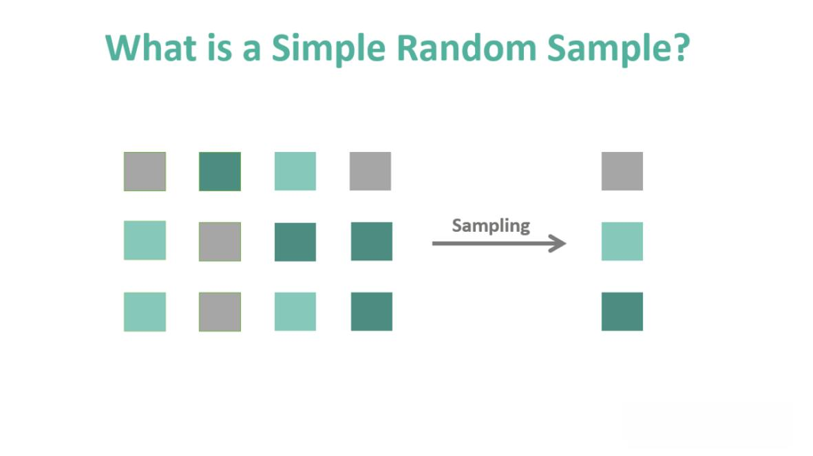

In today's technologically-driven financial markets, statistical sampling is essential for informed decision-making processes. This significance emerges from the need to distill vast amounts of data into actionable insights, a task sampling methods facilitate by enabling the collection and analysis of manageable data subsets. The accuracy of forecasts and the precision of decisions in finance, especially in algorithmic trading, heavily depend on these sampling techniques. Algorithmic trading, which automates buying and selling decisions through complex algorithms, showcases this reliance acutely. The algorithms must analyze large datasets quickly and accurately to remain competitive, highlighting the critical role that effective sampling plays.

Sampling methods serve as the backbone of data analysis by ensuring representative and unbiased data collection, thus allowing for reliable financial market predictions and decision-making. Among these techniques, simple random sampling is favored for its straightforward application and ability to reduce bias. By randomly selecting samples, it ensures each member of a population has an equal chance of being included, yielding a dataset that accurately reflects the larger pool. 



This article will discuss statistical sampling techniques, emphasizing simple random sampling's methodologies and applications, especially in algorithmic trading contexts. By understanding these methods, one can appreciate their importance in driving the accuracy and efficiency of modern financial data analysis and decision-making processes.

## Table of Contents

## Understanding Statistical Sampling Methods

Statistical sampling is a crucial aspect of data analysis, particularly when dealing with large datasets from which it is impractical or impossible to collect data on every individual or observation. Instead, researchers and analysts select a subset, or sample, to infer information about the entire population. This process allows for cost-effective and efficient data analysis while maintaining a high degree of accuracy and reliability.

Key sampling methods widely used in statistical sampling include simple random sampling, stratified sampling, systematic sampling, and cluster sampling, each with unique characteristics suited to different kinds of data and research needs.

**Simple Random Sampling** is the most straightforward of these techniques. In this method, each individual or observation in the population has an equal chance of being selected. This technique is easily implemented and minimizes bias, offering a representative cross-section of the population. However, randomness does not guarantee that all segments of the population will be proportionately represented, which can lead to sampling errors, especially in populations with significant diversity or stratification.

**Stratified Sampling** addresses some of the limitations of simple random sampling by dividing the population into homogeneous subgroups known as strata. Samples are selected from each stratum, ensuring that the population's diversity is adequately represented. This method reduces variance in the estimate of population parameters and is particularly useful when specific subgroups are critical to the analysis.

**Systematic Sampling** involves selecting every kth individual from a list of the population, where k is the interval between selected members. This method is simple to execute and ensures that the sampling process can be conducted quickly. However, it assumes that the list has no inherent order that might bias the sample, such as periodic patterns that align with the sampling interval.

**Cluster Sampling** is used when populations are too large or dispersed. It involves dividing the population into clusters, often geographically, and then randomly selecting entire clusters to analyze. While efficient in terms of resources and time, this method can introduce bias if the clusters are not homogeneous or if they do not collectively represent the population accurately.

Each of these sampling methods has inherent advantages and potential biases. Simple random sampling is appreciated for its lack of bias, but its randomness might not capture population diversity. Stratified sampling allows for proportionate representation but requires a clear understanding of the population's structure. Systematic sampling's efficiency can be hindered by periodic population traits, while cluster sampling is economical but demands careful cluster selection to avoid bias.

Understanding these methods enables practitioners to select the most appropriate technique for their datasets, ensuring robust and reliable data analysis that can support decision-making in diverse fields, including finance and [algorithmic trading](/wiki/algorithmic-trading).

## Deep Dive into Simple Random Sampling

Simple random sampling is a fundamental statistical technique where each member of a population has an equal chance of being selected. This method is favored for its straightforward approach and ability to produce unbiased samples that accurately represent the overall population. It forms the basis for many advanced statistical analyses and is particularly useful when impartiality and simplicity are required.

### Process of Simple Random Sampling

The process of conducting simple random sampling involves several essential steps:

1. **Defining the Population**: The first step is to clearly define the population from which the sample will be drawn. The population can be any group of entities relevant to the study, such as stocks in a market index or customer transactions over a period.

2. **Choosing the Sample Size**: Determining an appropriate sample size is crucial. It involves balancing the need for accuracy with the available resources. The sample size can be calculated using statistical formulas like Cochran's formula for larger populations:
$$
   n_0 = \frac{Z^2 \cdot p \cdot (1-p)}{e^2}

$$

   Here, $n_0$ is the sample size, $Z$ is the Z-score associated with the desired confidence level, $p$ is the estimated proportion of an attribute present in the population, and $e$ is the margin of error.

3. **Selecting Random Values**: Once the sample size is determined, random selection of individual members can be facilitated through various techniques such as drawing lots, rolling dice, or using software tools that generate random numbers. In Python, the process can be implemented using the `random.sample()` function from the `random` library:

   ```python
   import random

   population = list(range(1, 101))  # Example population from 1 to 100
   sample_size = 10
   random_sample = random.sample(population, sample_size)
   ```

4. **Ensuring Randomness and Unbiasedness**: To maintain the integrity of the sampling process, it's vital to ensure that every member of the population has an equal probability of selection. This minimizes biases that could skew the results.

### Benefits and Challenges

Simple random sampling offers numerous advantages, such as reducing selection bias and facilitating straightforward implementation. However, it requires a complete list of the population and can be inefficient for very large datasets due to the difficulty in managing vast numbers of elements.

In summary, simple random sampling remains a widely used method due to its simplicity and the reliability of its results. Its application in fields like finance and trading underscores its importance in making informed decisions based on representative data.

## Simple Random Sampling in Algorithmic Trading

Algorithmic trading has fundamentally transformed financial markets, employing quantitative analysis to optimize trade execution. At the heart of this transformation lies the necessity for robust data analysis tools, with simple random sampling playing a pivotal role. This sampling method is employed to test and validate trading strategies by ensuring that analysis is based on data that accurately mirrors historical trends.

Simple random sampling involves selecting data points with equal probability, reducing potential bias and offering a representative snapshot of the larger dataset. In the context of algorithmic trading, this method is particularly advantageous for [backtesting](/wiki/backtesting) strategies. Backtesting uses historical data to simulate how a trading strategy would have performed in the past, enabling traders to refine and optimize strategies before implementation in live markets.

By executing simple random sampling, traders can obtain a dataset that reflects the broad characteristics of the historical data without introducing selection bias. This is crucial for the reliable prediction of future market behavior. An effective simple random sample ensures diverse price movements, trading volumes, and market conditions are included, providing a holistic view necessary for strategy testing.

For example, consider a quantitative analyst developing a mean-reversion strategy. The analyst can harness simple random sampling to extract a subset of historical price data ensuring that this sample covers various periods of market [volatility](/wiki/volatility-trading-strategies) and stability. This sampling guarantees the mean-reversion logic is tested across different market scenarios, enhancing the robustness of the strategy.

### Implementation Example in Python

To implement simple random sampling in Python, one can use the `pandas` library to manipulate data and the `random.sample` method to perform the sampling:

```python
import pandas as pd
import random

# Load historical data into a DataFrame (e.g., stock_prices.csv)
data = pd.read_csv('stock_prices.csv')

# Define the sample size
sample_size = int(len(data) * 0.1)  # 10% of the dataset

# Randomly select indices for sampling
random_indices = random.sample(range(len(data)), sample_size)

# Extract the sample data
sample_data = data.iloc[random_indices]
```

This code snippet randomly selects 10% of a given historical dataset, creating a sample that can be used for backtesting trading strategies. Critically, by leveraging simple random sampling, the sample is likely to be representative of the broader dataset, assuming large enough sample size, thus enhancing the backtest outcomes.

Real-world implementations have highlighted the efficacy of simple random sampling in designing automated trading systems. For instance, leading hedge funds and proprietary trading firms often incorporate this approach when testing algorithms across different asset classes and market conditions.

In conclusion, simple random sampling is an invaluable tool in the domain of algorithmic trading. It not only facilitates the creation of unbiased and representative samples from historical data but also enhances the reliability of backtesting procedures, driving more accurate predictions and strategic adjustments.

## Comparison with Other Sampling Methods

In addition to simple random sampling, stratified and systematic sampling are two other prevalent methods used in data analysis and algorithmic trading. Each offers unique advantages and is suited to specific scenarios that may arise in financial markets.

Stratified sampling involves dividing the entire population into distinct subgroups, or strata, that share similar attributes, and then performing random sampling within each stratum. This method is particularly beneficial when dealing with populations that have inherent variability among different segments. For instance, in algorithmic trading, an analyst could stratify a dataset based on industry sectors, such as technology, healthcare, and finance, ensuring that each sector is adequately represented in the sample. This approach reduces variability and can lead to more precise estimations of population parameters by ensuring that key segments are not underrepresented. By accurately capturing segment-specific trends, stratified sampling can deliver more targeted insights, which is crucial in refining trading strategies and reducing sampling costs.

Systematic sampling, on the other hand, involves selecting every nth element from a list of the population. This technique can be implemented quickly and efficiently, which is advantageous in trading scenarios where time is a critical [factor](/wiki/factor-investing). If the data is sorted in a meaningful order and there are no hidden patterns that coincide with the sampling interval, systematic sampling can produce reliable samples rapidly. For example, if a trading dataset is organized chronologically, a systematic sample could be obtained by selecting every 10th trading day. This method not only simplifies the sampling process but also reduces the time and resources required for data collection and preprocessing, aiding real-time trading decisions.

Despite the ease and lack of bias associated with simple random sampling, selecting an appropriate sampling method depends on the specific requirements of the trading strategy and the characteristics of the dataset. In some cases, having a representative sample with minimal computational burden is more achievable with stratified or systematic sampling, particularly when dealing with large, complex datasets. Consequently, while simple random sampling remains a robust tool in many contexts, traders and data analysts must carefully consider the nature of their data and the goals of their analysis to select the most effective sampling strategy.

## Pros and Cons of Simple Random Sampling

Simple random sampling stands out for its straightforwardness and its ability to minimize bias, making it a highly favorable choice for many statistical studies and analyses. This sampling method ensures each member of a population has an equal chance of being selected, thus reducing the likelihood of bias influencing the results. This characteristic is particularly advantageous in situations where a representative sample is vital for accurate conclusions.

One primary advantage of simple random sampling is its simplicity. The process is intuitive and easy to understand, requiring minimal computational resources for implementation. This ease of use is particularly beneficial for algorithmic trading, where swift and effective decision-making based on reliable data is crucial. By employing simple random sampling, traders can quickly develop a representative dataset to backtest trading strategies, thereby enhancing the robustness of their predictive models.

Moreover, simple random sampling reduces the potential for selection bias. As each member of the population has an identical probability of being included in the sample, the risk of favoring certain groups or characteristics over others is minimized. This feature is crucial in financial analyses, ensuring that the sample accurately reflects the complexities and diversities of market data.

Despite these strengths, simple random sampling is not without its drawbacks. One notable limitation is the potential for sampling errors. Although each individual has an equal chance of selection, it is still possible to draw a sample that does not effectively represent the population. Such errors can lead to misleading conclusions, particularly if the population is heterogeneous, and the sample size is relatively small. This issue emphasizes the importance of determining an adequate sample size to capture the population's variability.

Another challenge associated with simple random sampling is the requirement for a comprehensive and precise list of the population. This necessity can be particularly daunting in algorithmic trading, where market data is vast and continuously evolving. Acquiring and maintaining an accurate list may involve significant time and resources, potentially offsetting some of the method's simplicity.

In the context of algorithmic trading and data analysis, weighing these pros and cons is crucial. While the simplicity and unbiased nature of simple random sampling are highly appealing, particularly for modeling and backtesting algorithms, considerations regarding sampling errors and the logistical demands of acquiring accurate population lists must be thoroughly assessed. By understanding these factors, traders can effectively harness the benefits of simple random sampling while mitigating its limitations to enhance their decision-making processes and trading strategies.

## Conclusion

Statistical sampling stands as a fundamental aspect of data analysis techniques applied within contemporary finance, where precision and accuracy are crucial. Among the various sampling methods, simple random sampling is particularly noted for its straightforward approach in ensuring unbiased and representative data collection. By granting each member of a population an equal chance of selection, this method mitigates systematic errors and potential biases, which are critical factors when analyzing financial data.

In the context of algorithmic trading, the implementation of robust sampling methods directly influences the reliability of trading strategies. Algorithms benefit from the integrity of the data they process; thus, accurately reflecting historical data through precise sampling contributes to more dependable predictions and adjustments. The capacity to generate representative samples plays a pivotal role in backtesting trading models, where the performance of strategies over historical market data is evaluated to forecast future outcomes.

Moreover, algorithmic trading systems thrive on the ability to adapt to evolving market conditions, which requires continuous data analysis. Rigorous sampling methods facilitate this adaptability, enhancing the capability of algorithms to seize market opportunities and optimize trading decisions in real time. By applying sampling techniques effectively, traders and analysts can increase the profitability and resilience of their strategies against market fluctuations.

In conclusion, the integration of reliable statistical sampling techniques, such as simple random sampling, into financial data analysis enriches the field of algorithmic trading. It supports the development of robust trading algorithms that can navigate the complexities of modern financial markets with greater efficacy. Understanding and applying these techniques are vital to achieving success and staying competitive in this dynamic domain.

## References & Further Reading

[1]: ["Advances in Financial Machine Learning"](https://www.amazon.com/Advances-Financial-Machine-Learning-Marcos/dp/1119482089) by Marcos Lopez de Prado

[2]: ["Evidence-Based Technical Analysis: Applying the Scientific Method and Statistical Inference to Trading Signals"](https://www.amazon.com/Evidence-Based-Technical-Analysis-Scientific-Statistical/dp/0470008741) by David Aronson

[3]: ["Machine Learning for Algorithmic Trading"](https://github.com/PacktPublishing/Machine-Learning-for-Algorithmic-Trading-Second-Edition) by Stefan Jansen

[4]: ["Quantitative Trading: How to Build Your Own Algorithmic Trading Business"](https://www.amazon.com/Quantitative-Trading-Build-Algorithmic-Business/dp/1119800064) by Ernest P. Chan