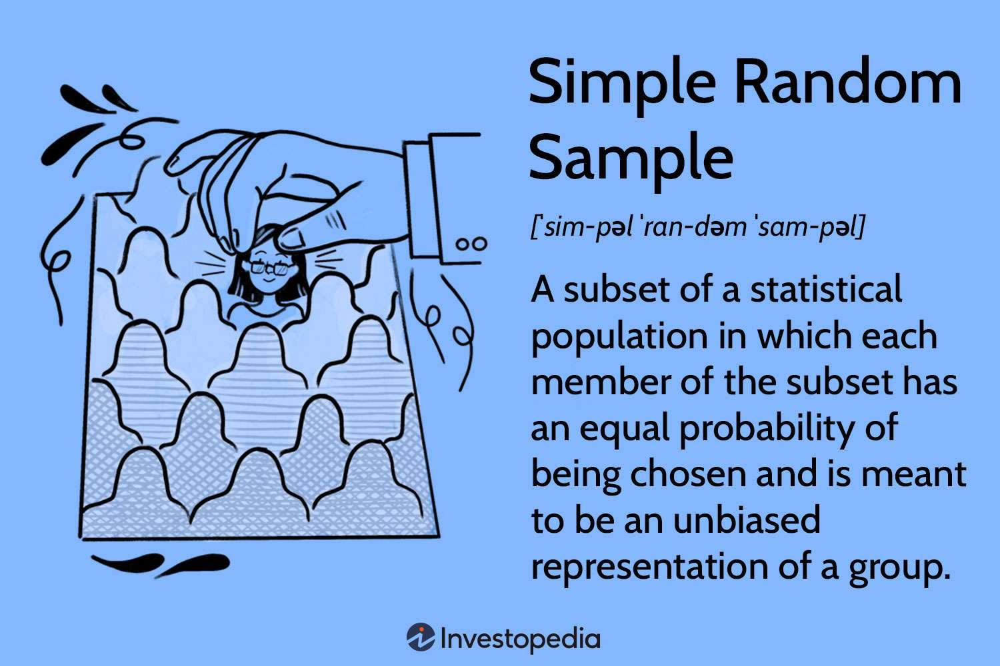

## Table of Contents

## What is simple random sampling?

Simple random sampling is a method used to choose a smaller group from a larger group. In this method, every member of the larger group has an equal chance of being chosen. Imagine you have a big jar of candies and you want to pick a few to taste. If you close your eyes and pick candies without looking, each candy has the same chance of being picked. That's how simple random sampling works.

This method is useful because it helps to make sure the smaller group is a good representation of the whole group. For example, if you want to know what all the students in a school think about a new rule, you can use simple random sampling to pick some students to ask. By giving everyone an equal chance, you can be more confident that the opinions of the smaller group will reflect the opinions of all the students.

## Why is simple random sampling important in statistics?

Simple random sampling is important in statistics because it helps to make sure that the sample chosen is a fair representation of the whole group. When every member of the group has an equal chance of being picked, it reduces the chance of bias. This means that the results from the sample can be trusted to give a good picture of what the whole group thinks or how it behaves. For example, if a researcher wants to know how many people in a city like a new park, using simple random sampling to choose people to ask helps make sure that the results are not just from one part of the city or one type of person.

Another reason simple random sampling is important is that it makes the math easier and more accurate. In [statistics](/wiki/bayesian-statistics), we often use formulas and calculations to make guesses about the whole group based on the sample. Simple random sampling fits well with these formulas because it assumes that every member of the group is equally likely to be in the sample. This makes the calculations simpler and the results more reliable. So, when statisticians need to make predictions or draw conclusions, simple random sampling gives them a solid foundation to work from.

## How does simple random sampling differ from other sampling methods?

Simple random sampling is different from other sampling methods because it gives every member of the group an equal chance of being chosen. Imagine you have a big box of toys and you want to pick a few to play with. If you close your eyes and pick toys without looking, that's like simple random sampling. Other methods, like stratified sampling, divide the group into smaller parts based on something they have in common, like age or color, and then pick from each part. This is like sorting the toys by type and then [picking](/wiki/asset-class-picking) from each type.

Another way simple random sampling differs is from cluster sampling. In cluster sampling, the group is divided into smaller groups or clusters, and then whole clusters are picked. It's like if you had toys in different boxes, and you picked a whole box instead of picking toys one by one. Simple random sampling doesn't do this; it treats the whole group as one big pool to pick from. Each method has its own use, but simple random sampling is the simplest and most straightforward way to pick a sample.

## What are the basic steps to perform simple random sampling?

To perform simple random sampling, you start by making a list of all the members in the group you want to study. This list is called a sampling frame. For example, if you want to study all the students in a school, you would list every student's name. Once you have your list, you need to decide how many members you want to pick for your sample. This number depends on how big your group is and how accurate you want your results to be.

After you have your list and know how many members you want to pick, you can start the actual sampling. You can use a random number generator or a table of random numbers to pick members from your list. Imagine each student on your list has a number next to their name. You use the random number generator to pick numbers, and the students with those numbers are the ones you choose for your sample. This way, every student has an equal chance of being picked, which is the key to simple random sampling.

## What tools or software can be used to conduct simple random sampling?

To conduct simple random sampling, you can use different tools and software that help you pick members from your group in a fair way. One common tool is a random number generator. This can be a physical tool like a dice or a coin, but most people use computer programs or apps on their phones. These programs give you random numbers that you can match with the list of all the members in your group. For example, if you have a list of all the students in a school, you can use a random number generator to pick numbers, and the students with those numbers are the ones you choose for your sample.

Another tool you can use is a spreadsheet program like Microsoft Excel or Google Sheets. These programs have functions that can generate random numbers for you. You can type in all the names or numbers of your group members into the spreadsheet, and then use a function to pick random numbers from your list. This way, the computer does the work for you and makes sure every member has an equal chance of being picked. Both random number generators and spreadsheet programs are easy to use and help you do simple random sampling correctly.

## Can you provide an example of simple random sampling in a real-world scenario?

Imagine a school wants to find out if students like the new playground. The principal decides to ask some students, but they want to make sure the sample is fair. So, they use simple random sampling. They make a list of all the students in the school, from kindergarten to grade 12. Then, they use a computer program to pick 100 students at random from the list. Each student has an equal chance of being picked, so the sample is a good reflection of the whole school. The principal then asks these 100 students if they like the new playground and uses their answers to understand what the whole school thinks.

In another example, a company wants to test a new product. They have a list of all their customers, which is a very large group. To keep things simple and fair, they decide to use simple random sampling to choose 500 customers to try the product. They use a random number generator to pick 500 numbers from their customer list. Each customer has the same chance of being picked, so the sample is a good representation of all customers. The company then sends the new product to these 500 customers and asks for their feedback. This helps the company understand if the product will be liked by all their customers.

## What are the potential biases in simple random sampling and how can they be mitigated?

Simple random sampling tries to give everyone an equal chance of being picked, but sometimes biases can still sneak in. One common bias is if the list of all group members, called the sampling frame, is not complete or up-to-date. For example, if a school's list of students is missing some names, those students won't have a chance to be picked. Another bias can happen if some people are harder to reach or don't respond to the survey. If only certain types of people respond, the sample might not represent the whole group well.

To reduce these biases, you need to make sure your list of all group members is as complete and up-to-date as possible. This means checking and updating the list regularly. Also, try to make it easy for everyone to participate in the survey. You can do this by offering different ways to respond, like online or by phone, and by following up with people who don't respond at first. By taking these steps, you can help make sure your sample is a fair representation of the whole group.

## How do you determine the sample size for simple random sampling?

To figure out how many people to pick for simple random sampling, you need to think about how big the whole group is and how accurate you want your results to be. If the group is very big, like all the people in a city, you might need a bigger sample to make sure your results are reliable. On the other hand, if the group is smaller, like all the students in a school, you might be able to use a smaller sample. The level of accuracy you want also matters. If you need to be very sure that your sample represents the whole group well, you'll need a bigger sample size.

There are formulas and calculators that can help you decide the right sample size. These tools take into account things like the size of the whole group, the level of accuracy you want, and how much variation there might be in the group. For example, if you're asking people if they like a new park, and you think most people will say yes, you might need a smaller sample than if you think opinions will be very mixed. Using these formulas and tools can help you pick a sample size that gives you good, reliable results without making your survey too big and hard to do.

## What are the advantages and disadvantages of using simple random sampling?

Simple random sampling has some big advantages. It's easy to understand and use. You just need to make a list of everyone in the group and then pick some people at random. This way, everyone has the same chance of being chosen, which helps make sure the sample is fair. It also works well with math formulas that help you understand the whole group based on the sample. This makes it easier to get reliable results without too much work.

But simple random sampling also has some downsides. It can be hard to make sure your list of everyone in the group is complete and up-to-date. If you miss some people, they won't have a chance to be picked, and your sample won't be as good. Also, some people might not respond to your survey, and if those people are different from the ones who do respond, your results might not be accurate. Sometimes, other sampling methods might be better for certain situations, especially if you need to make sure different types of people are included in your sample.

## How can the results of simple random sampling be analyzed statistically?

Once you have your sample from simple random sampling, you can use different ways to look at the results and understand what they mean. One common way is to use something called descriptive statistics. This means you can find out things like the average, the middle number, or how spread out the answers are. For example, if you asked students if they like the new playground, you could count how many said yes and how many said no, and then figure out the percentage of students who like it. This helps you see what the sample thinks in a clear way.

Another way to analyze the results is by using inferential statistics. This is a bit more complicated, but it helps you make guesses about the whole group based on your sample. You can use formulas to figure out if the results from your sample are likely to be true for everyone in the group. For example, if most of the students in your sample like the new playground, you can use inferential statistics to say how sure you are that most students in the whole school would also like it. This helps you make decisions or predictions based on your sample.

## What are some common mistakes to avoid when implementing simple random sampling?

When doing simple random sampling, one big mistake to avoid is not having a complete and up-to-date list of everyone in the group. If your list is missing some people, they won't have a chance to be picked, and your sample won't be a good reflection of the whole group. It's important to check and update your list regularly to make sure everyone is included. Another mistake is not using a truly random way to pick people. If you pick people based on who you see first or who is easiest to reach, you might end up with a sample that doesn't represent everyone fairly.

Another common mistake is not thinking about how many people to pick for your sample. If your sample is too small, your results might not be accurate enough to trust. On the other hand, if your sample is too big, it might be a waste of time and resources. It's important to use formulas or calculators to figure out the right sample size based on how big the whole group is and how accurate you want your results to be. By avoiding these mistakes, you can make sure your simple random sampling is done correctly and gives you reliable results.

## How does simple random sampling contribute to the validity and reliability of research findings?

Simple random sampling helps make research findings more valid and reliable because it gives everyone in the group an equal chance of being picked. When you use this method, you're less likely to miss important parts of the group or include too many of one type of person. This means your sample is a good reflection of the whole group, and your results are more likely to be true for everyone. For example, if you're asking students about a new playground, simple random sampling helps make sure you hear from all kinds of students, not just a few.

Another way simple random sampling helps is by making the math easier and more accurate. When everyone has an equal chance of being picked, the formulas and calculations used in statistics work better. This means you can trust the numbers more when you're trying to understand what the whole group thinks or how it behaves. By using simple random sampling, researchers can feel more confident that their findings are both valid, meaning they measure what they're supposed to measure, and reliable, meaning they can be trusted to be consistent if the study is done again.

## What is a Deep Dive into Simple Random Sampling?

Simple random sampling is a fundamental statistical technique where each member of a population has an equal chance of being selected. This method is favored for its straightforward approach and ability to produce unbiased samples that accurately represent the overall population. It forms the basis for many advanced statistical analyses and is particularly useful when impartiality and simplicity are required.

### Process of Simple Random Sampling

The process of conducting simple random sampling involves several essential steps:

1. **Defining the Population**: The first step is to clearly define the population from which the sample will be drawn. The population can be any group of entities relevant to the study, such as stocks in a market index or customer transactions over a period.

2. **Choosing the Sample Size**: Determining an appropriate sample size is crucial. It involves balancing the need for accuracy with the available resources. The sample size can be calculated using statistical formulas like Cochran's formula for larger populations:
$$
   n_0 = \frac{Z^2 \cdot p \cdot (1-p)}{e^2}

$$

   Here, $n_0$ is the sample size, $Z$ is the Z-score associated with the desired confidence level, $p$ is the estimated proportion of an attribute present in the population, and $e$ is the margin of error.

3. **Selecting Random Values**: Once the sample size is determined, random selection of individual members can be facilitated through various techniques such as drawing lots, rolling dice, or using software tools that generate random numbers. In Python, the process can be implemented using the `random.sample()` function from the `random` library:

   ```python
   import random

   population = list(range(1, 101))  # Example population from 1 to 100
   sample_size = 10
   random_sample = random.sample(population, sample_size)
   ```

4. **Ensuring Randomness and Unbiasedness**: To maintain the integrity of the sampling process, it's vital to ensure that every member of the population has an equal probability of selection. This minimizes biases that could skew the results.

### Benefits and Challenges

Simple random sampling offers numerous advantages, such as reducing selection bias and facilitating straightforward implementation. However, it requires a complete list of the population and can be inefficient for very large datasets due to the difficulty in managing vast numbers of elements.

In summary, simple random sampling remains a widely used method due to its simplicity and the reliability of its results. Its application in fields like finance and trading underscores its importance in making informed decisions based on representative data.

## References & Further Reading

[1]: ["Advances in Financial Machine Learning"](https://www.amazon.com/Advances-Financial-Machine-Learning-Marcos/dp/1119482089) by Marcos Lopez de Prado

[2]: ["Evidence-Based Technical Analysis: Applying the Scientific Method and Statistical Inference to Trading Signals"](https://www.amazon.com/Evidence-Based-Technical-Analysis-Scientific-Statistical/dp/0470008741) by David Aronson

[3]: ["Machine Learning for Algorithmic Trading"](https://github.com/PacktPublishing/Machine-Learning-for-Algorithmic-Trading-Second-Edition) by Stefan Jansen

[4]: ["Quantitative Trading: How to Build Your Own Algorithmic Trading Business"](https://www.amazon.com/Quantitative-Trading-Build-Algorithmic-Business/dp/1119800064) by Ernest P. Chan