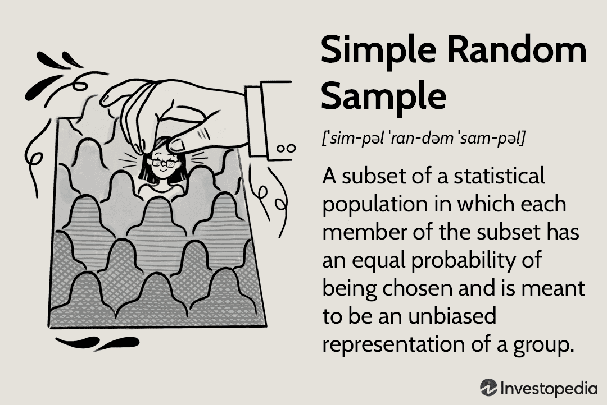

Statistical sampling is a fundamental technique applied across numerous disciplines, from social sciences to engineering, finance, and more. It involves selecting a subset of individuals or observations from a larger population to draw conclusions about the entire group. The efficiency and cost-effectiveness of statistical sampling make it indispensable, especially in scenarios where analyzing the full data set is impractical. By leveraging a well-constructed sample, researchers and analysts can infer population characteristics with significant accuracy.

In the financial sector, particularly in algorithmic trading, statistical sampling plays a crucial role. Algorithmic trading leverages mathematical models and data analysis to execute orders at speeds and frequencies unachievable by human traders. In such a data-intensive environment, sampling techniques are employed to manage and interpret large volumes of market data efficiently. Effective sampling methods allow traders to optimize their strategies by ensuring they are based on representative and unbiased data.



This article will explore various sampling methods with a particular focus on simple random sampling, one of the most straightforward and widely used techniques. Simple random sampling involves selecting a subset of data from a larger set in such a way that each element has an equal probability of being chosen. This technique is foundational because of its simplicity and ability to produce unbiased samples, which are critical for reliable data analysis and decision-making in trading.

Readers of this article will gain insights into the relevance of statistical sampling in enhancing the efficacy of trading strategies. The discussion will cover key concepts and applications of sampling in algorithmic trading, practical implementation methods, and how these techniques can lead to optimized trading decisions. Additionally, we will examine the role of sampling techniques in balancing accuracy and computational efficiency in trading algorithms.

In an era where data-driven strategies continue to reshape financial markets, understanding and applying effective sampling techniques is more critical than ever. This article aims to equip readers with the foundational knowledge and practical tools needed to integrate sampling methods into their trading strategies, thereby driving better outcomes in algorithmic trading environments.

## Table of Contents

## Understanding Statistical Sampling

Statistical sampling is a critical process used to collect, analyze, and make inferences about large data sets without needing to evaluate every observation within the population. It involves selecting a subset of individuals from a statistical population, thus enabling researchers and analysts to estimate characteristics of the larger group efficiently.

**Applications of Statistical Sampling Across Industries**

Statistical sampling is indispensable in numerous fields including medicine, market research, quality control, and environmental studies. In medicine, it aids in clinical trials where only a sample of patients is tested, ensuring the feasibility and ethical viability of studies. Market researchers utilize sampling to understand consumer behavior by surveying a representative group, while manufacturers deploy it to monitor product quality through control samples, significantly reducing costs and resources.

**Necessity of Sampling for Large Data Sets**

Handling massive data sets necessitates sampling due to computational and practical constraints. Processing entire populations can be computationally intensive and often infeasible due to time and resource limitations. Sampling provides a practical way to extract meaningful insights from data, ensuring analyses are both efficient and manageable. For instance, in data-heavy industries like finance and telecommunications, sampling techniques enable the analysis of trends and anomaly detection without processing terabytes of data.

**Relationship Between Population and Sample**

In [statistics](/wiki/bayesian-statistics), the population denotes the entire set of elements or units that are of interest, while a sample represents a subset selected from this population. This relationship is vital for making inferences; characteristics observed in the sample are used to draw conclusions about the population. This inferential process is underpinned by the assumption that the sample accurately reflects the attributes of the population, which is achieved by meticulous selection techniques and sample design.

**Key Statistical Concepts for Traders**

Traders, particularly those involved in [algorithmic trading](/wiki/algorithmic-trading), need to understand key statistical concepts to optimize their strategies. These include understanding distribution types (normal, skewed), variance, standard deviation, and confidence intervals. Knowledge of statistical significance and hypothesis testing allows traders to differentiate between random fluctuations and genuine market trends.

Reliability and validity of inferences drawn from sample data largely depend on how well the sample represents the population. By comprehending these statistical underpinnings, traders can better navigate data complexities, facilitating more informed and effective trading decisions.

## Overview of Sampling Techniques

Statistical sampling techniques play a vital role in data analysis and decision-making processes across various fields. These techniques allow analysts to draw meaningful conclusions about a larger population by studying a smaller, manageable subset, known as a sample. The effectiveness of sampling methods is crucial for achieving reliable and valid results, especially in high-stakes domains like algorithmic trading.

**Probability vs. Non-Probability Sampling Methods**

Sampling techniques are broadly categorized into probability and non-probability methods. Probability sampling ensures that every member of a population has a known, non-zero chance of being selected. This category includes methods such as simple random sampling, stratified sampling, cluster sampling, and systematic sampling. The advantage of probability sampling lies in its ability to produce representative samples, minimizing selection bias and allowing for inferential statistics.

In contrast, non-probability sampling does not offer every individual the same selection chance. Methods like convenience sampling, judgmental sampling, quota sampling, and snowball sampling fall under this category. These techniques are often quicker and more cost-effective but may lead to biased samples and limit the ability to generalize findings to the larger population.

**Merits and Demerits of Different Sampling Strategies**

The choice of sampling strategy depends on the specific goals and constraints of a study. Probability sampling, while more time-consuming and potentially costly, provides more accurate and generalizable results. For instance, stratified sampling allows researchers to ensure representation across key subgroups, enhancing the precision of the analysis.

On the other hand, non-probability sampling techniques can be beneficial when time, resources, or access to the entire population are limited. However, these methods often require careful consideration of potential biases and may necessitate additional statistical techniques, such as bootstrapping, to account for their limitations.

**Choosing the Right Technique for Your Data Needs**

Selecting the appropriate sampling method involves assessing various factors: the nature and size of the population, available resources, and the research objectives. If the focus is on generalizability, probability sampling may be more suitable. For exploratory research or when targeting a specific segment, non-probability sampling might suffice.

Considerations such as sample size also play a critical role. Larger samples tend to yield more reliable estimates but come at increased costs and complexity. Tools like power analysis can help determine the optimal sample size needed to achieve significant results.

**Common Pitfalls in Selecting Sampling Methods**

One must be cautious of common pitfalls encountered in sampling. These include undercoverage, where some population members are inadequately represented; over-reliance on non-probability methods, leading to biased results; and ignoring the potential impact of sampling errors. Suboptimal sample size and failure to account for non-response can further skew findings, undermining the study's validity.

In conclusion, understanding and implementing appropriate sampling techniques is a critical skill for analysts and researchers. By carefully selecting and employing the right methods, one can ensure robust, accurate, and applicable findings that inform decision-making and strategy formulation across diverse applications.

## Deep Dive into Simple Random Sampling

Simple random sampling is a fundamental statistical technique used to select a subset of individuals from a larger population. Each member of the population has an equal chance of being chosen. This method is essential for ensuring that the sample reflects the population as accurately as possible, reducing bias and allowing for the generalization of results.

### Implementation of Simple Random Sampling

Implementing simple random sampling involves three primary steps:

1. **Define the population**: Clearly understand who or what constitutes the population.
2. **Determine the sample size**: Decide how many individuals or units need to be sampled.
3. **Select the sample**: Use randomization methods to select individuals. This can be achieved using random number tables, software that generates random numbers, or programming tools.

Here's a simple Python code providing a basic demonstration of how to implement this method:

```python
import random

# Population list
population = list(range(1, 101))  # Example population from 1 to 100

# Sample size
n = 10

# Simple random sampling
sample = random.sample(population, n)

print("Selected sample:", sample)
```

This code generates a random sample of 10 individuals from a population of 100.

### Examples of Simple Random Sampling in Algorithmic Trading

In algorithmic trading, simple random sampling can be employed to create training datasets from historical market data. For instance, consider a dataset where each entry represents a day's stock price movements. Simple random sampling might be used to select a sample of these days to train [machine learning](/wiki/machine-learning) models designed to predict future price movements.

### Advantages in Data Analysis

1. **Unbiased Representation**: Ensures each member of the population has an equal chance of being included, which minimizes selection bias.
2. **Simplicity**: Easy to understand and implement, making it accessible for various applications.
3. **Statistical Validity**: Facilitates the use of statistical tests that require random sampling to draw valid inferences about the population.

### Potential Limitations and Solutions

While simple random sampling offers clear advantages, there are notable limitations:

1. **Need for Population List**: It requires a complete list of the population, which might not always be feasible.
   - *Solution*: Use advanced sampling methods such as stratified sampling if a complete list is unavailable.

2. **Sample Size Constraints**: Large populations may require substantial sample sizes to ensure accurate representation, potentially increasing the study's cost and complexity.
   - *Solution*: Statistical formulas can help determine the optimal sample size needed to achieve confidence without unnecessary oversampling.

3. **Randomness Imperfections**: Computers generate pseudo-random numbers, which might introduce subtle patterns if not correctly managed.
   - *Solution*: Utilize robust algorithms and libraries for random number generation to maintain randomness integrity.

In conclusion, simple random sampling serves as a cornerstone technique in both statistical analysis and algorithmic trading, offering a straightforward and statistically sound method for data sampling while highlighting potential challenges that can be addressed with thoughtful application and technological aids.

## The Role of Simple Random Sampling in Algo Trading

Simple random sampling is a key element in algorithmic trading due to its unbiased nature and its capacity to effectively manage vast amounts of data. In the context of algorithmic trading, particularly where large datasets are concerned, it provides a means to create representative samples that facilitate accurate analysis and decision-making without the need to process every single data point. 

### Enhancing Trading Strategies Using Effective Sampling

Simple random sampling enables traders to develop more robust strategies by allowing them to test and optimize algorithms on a representative subset of data. This approach minimizes overfitting, a common issue where models become too tailored to past data, reducing their effectiveness on unseen data. By using a simple random sample, traders can efficiently validate their strategies in a way that mirrors the entire dataset, improving the generalizability and reliability of their trading models.

### Case Studies: Successful Use of Simple Random Sampling in Trading

Numerous case studies underscore the importance of simple random sampling in trading. For instance, hedge funds often employ random sampling techniques to assess the performance of specific trading strategies across different market conditions. In one documented scenario, a [quantitative trading](/wiki/quantitative-trading) firm used simple random sampling to evaluate the efficacy of their algorithms by selecting random time slots for testing, effectively simulating different trading environments. This method allowed the firm to dynamically adapt their strategies, leading to a consistent incremental profit in volatile markets.

### Integrating Sampling Techniques into Algorithmic Models

Incorporating simple random sampling into algorithmic models involves careful planning and execution. Algorithms are designed to pull random samples from historical data at various intervals, ensuring each sample accurately reflects the market's characteristics. This integration can be implemented using programming languages such as Python, where libraries like NumPy facilitate the creation of random samples. For example:

```python
import numpy as np

# Create a sample dataset representing historical market data
data = np.array([...])  # replace with actual data

# Generate a random sample
sample_size = 100  # choose appropriate sample size
random_sample = np.random.choice(data, size=sample_size, replace=False)

# Use random_sample for testing trading algorithms
```

This code snippet illustrates the practical application of simple random sampling in developing trading algorithms, highlighting its efficiency in processing large datasets.

### Balancing Accuracy and Efficiency in Trading Algorithms

Balancing accuracy and efficiency is a delicate aspect of trading algorithm development. Simple random sampling aids in achieving this balance by allowing traders to process smaller subsets of data without sacrificing representativeness and accuracy. By reducing the computational burden, traders can deploy their algorithms faster, enabling real-time decision-making which is crucial in fast-paced trading environments. This practice also reduces costs related to processing power and data storage, making it a cost-efficient strategy in algorithmic trading.

In summary, simple random sampling serves as a fundamental tool in algorithmic trading. It helps enhance trading strategies' effectiveness, supports the dynamic testing and implementation of these strategies, and ensures a balanced approach toward accuracy and computational efficiency. These benefits underscore the critical role of simple random sampling in crafting successful and adaptable trading algorithms.

## Tools and Techniques for Implementing Sampling in Trading

Statistical sampling serves as a cornerstone in the development of algorithmic trading systems. The ability to select representative samples from large datasets allows traders to construct and validate effective strategies. This section explores the tools, techniques, and challenges involved in implementing sampling within trading environments, with a focus on simple random sampling.

### Popular Tools for Statistical Sampling in Trading Software

Several software tools and libraries facilitate statistical sampling in trading algorithms. Python, with its rich ecosystem, offers libraries such as NumPy and pandas, which provide built-in support for sampling operations. The `numpy.random` module allows for straightforward implementation of simple random sampling, making Python an attractive option for traders. R, another popular programming language in finance, provides robust statistical tools and packages like "dplyr" for sampling operations. These tools enable traders to perform complex sampling tasks efficiently, thereby aiding in data analysis and strategy optimization.

### Technical Considerations for Implementing Sampling in Algorithms

When integrating sampling techniques into trading algorithms, consider the trade-off between computational efficiency and the representativeness of the sample. Ensuring the sample size is sufficiently large to provide statistical power, while small enough to maintain computational efficiency, is crucial. Sampling should be performed in a manner that minimizes biases, which can affect the outcome of trading strategies. Ensuring randomness in sample selection is critical for maintaining the integrity of statistical inferences.

### Coding Simple Random Sampling in Common Programming Languages

A typical Python implementation of simple random sampling can be executed using pandas:

```python
import pandas as pd

# Assuming df is a DataFrame containing trading data
sample_size = 100
random_sample = df.sample(n=sample_size, random_state=42)
```

In this snippet, `random_state` is set to ensure reproducibility of results. This simple approach helps traders to extract a sample from larger datasets with ease.

### Real-time Data Processing and Sampling Challenges

Trading algorithms often require processing data in real-time, presenting unique challenges for sampling. Real-time sampling necessitates rapid decision-making, demanding efficient algorithms that can handle large data streams without introducing latency. Implementing sampling techniques that can operate within stringent time constraints while ensuring data accuracy is a persistent challenge. Furthermore, the need for dynamic sampling strategies that can adapt to changing market conditions adds to the complexity.

### Tips for Optimizing Sampling Processes in Trading Systems

Optimization of sampling in trading systems involves balancing accuracy with computational constraints. To optimize:

1. **Use Batch Sampling**: Process data in batches to reduce computational overhead and improve processing speed.
2. **Leverage Parallel Processing**: Employ parallel computing techniques to distribute the sampling load across multiple processors.
3. **Adaptive Sampling Algorithms**: Implement algorithms that adjust the sampling rate based on the volatility of data, focusing more resources during periods of high market activity.
4. **Data Preprocessing**: Clean and preprocess data before sampling to enhance the quality of the samples and reduce noise.
5. **Monitoring and Evaluation**: Continuously monitor sampling results to ensure the quality of the sample and adjust parameters as needed.

The goal of implementing these strategies is to maximize the efficiency and effectiveness of sampling techniques in trading systems, ultimately leading to improved decision-making and strategy performance.

## Conclusion and Best Practices

This article has offered an in-depth examination of statistical sampling techniques, with a particular emphasis on simple random sampling, and their integral role in optimizing algorithmic trading strategies. By using statistical sampling, traders are better equipped to handle large data sets, ensuring more accurate and efficient analysis and decision-making processes.

### Best Practices for Applying Statistical Sampling in Trading

1. **Choose the Right Technique**: Depending on the data's nature and the desired outcome, selecting the appropriate sampling method is crucial. Simple random sampling is often the most straightforward and unbiased choice, yet other methods might be more suitable depending on specific circumstances.

2. **Maintain Data Integrity**: Ensure randomness in the sample selection to minimize bias. This can be achieved through the use of algorithms that guarantee each data point has an equal chance of being selected.

3. **Utilize Adequate Tools**: Employ robust statistical software and coding practices to automate and streamline the sampling process, which ensures precision and saves time.

4. **Optimize Sample Size**: Determine an optimal sample size that balances the trade-off between accuracy and computational efficiency. A sample that's too large may waste resources, while one too small might not be representative.

### Future Implications of Sampling Techniques in Financial Markets

The continuous advancements in computational power and data availability will likely amplify the importance of sampling techniques. With the rise of big data, effective sampling methods will be essential for managing exponentially growing information, ensuring that trading strategies remain both adaptive and robust.

### Enhancing Trading Strategies with Sampling

Integrating statistical sampling into algorithmic trading models enhances the robustness and adaptability of these systems. These techniques facilitate better risk management and support more informed decision-making processes. For example, by using Python libraries such as NumPy and Pandas, traders can create efficient sampling scripts to analyze large datasets effectively. Below is a simple Python example:

```python
import numpy as np
import pandas as pd

# Load your data
dataset = pd.read_csv('financial_data.csv')

# Perform simple random sampling
sample_size = 1000
random_sample = dataset.sample(n=sample_size, random_state=42)

# Proceed with analysis on the random sample
analyze_sample(random_sample)
```

### Encouragement for Ongoing Learning and Adaptation

As the financial markets continue to evolve, traders must commit to continuous learning and adaptation. This involves staying updated with the latest sampling techniques and technologies, participating in online courses, and engaging in professional communities to exchange knowledge and experiences. By doing so, traders can refine their strategies, maintaining relevance and competitiveness in a dynamic market environment.

In conclusion, statistical sampling is poised to remain a foundational element in algorithmic trading. By adhering to best practices and embracing forward-thinking approaches, traders can enhance the effectiveness of their strategies, positioning themselves for success in an ever-changing financial landscape.

## Additional Resources and Further Reading

**Recommended Books and Articles on Statistical Sampling**

For those interested in deepening their understanding of statistical sampling, several [books](/wiki/algo-trading-books) stand out. "Sampling Techniques" by William G. Cochran provides a comprehensive overview of sampling methods, covering both theoretical aspects and practical applications. Another excellent resource is "Practical Statistics for Data Scientists" by Peter Bruce and Andrew Bruce, which includes a dedicated section on sampling techniques relevant to data-driven decision-making.

Articles such as "A Tutorial on the Practical Use of Decision-Making Theory in Big Data" provide insights into applying sampling techniques in contexts where large datasets are prevalent. The Journal of Statistical Software offers numerous papers on statistical methodologies, including innovative approaches to sampling in various fields.

**Online Courses and Certifications for Deeper Learning**

Platforms such as Coursera and edX offer specialized courses on statistical sampling. Courses like "Introduction to Probability and Data" by Duke University and "Statistics and R" by Harvard University provide foundational knowledge and practical skills applicable to sampling in data analysis. For more advanced learners, "Advanced Data Visualization and Data Interpretation" by the University of Illinois is recommended, with modules dedicated to sampling techniques and their uses in predictive modeling.

**Relevant Academic Papers and Research Studies**

Academic journals are rich sources of detailed studies on sampling. Papers such as "Sampling: Design and Analysis" published in the Journal of Agricultural, Biological, and Environmental Statistics can enhance one's understanding of sampling frameworks. Research studies in the Journal of Econometrics frequently discuss the application of sampling techniques in econometric models, highlighting both theoretical advancements and practical implementations.

**Communities and Forums for Discussion on Algo Trading and Sampling**

Engaging with online communities can provide valuable insights and peer support. The Stack Exchange network, particularly the Cross Validated section, hosts numerous discussions related to statistical sampling. For algo trading enthusiasts, platforms like QuantConnect and QuantInsti offer forums where traders and developers share experiences and strategies involving statistical techniques. These communities provide an interactive space to discuss challenges and innovations in the application of sampling within trading systems.

**Links to Tools and Software for Practical Implementation**

Numerous tools facilitate the practical application of statistical sampling in algorithmic trading. Python libraries such as NumPy and SciPy are foundational for statistical computations, enabling efficient sampling operations. pandas is also essential for data manipulation and sampling within data frames. For more specialized needs, the statsmodels library offers functions for statistical modeling, including tools for sampling methods.

Developers can access resources and documentation directly from these libraries:
- NumPy: [NumPy Documentation](https://numpy.org/doc/)
- pandas: [pandas Documentation](https://pandas.pydata.org/docs/)
- statsmodels: [statsmodels Documentation](https://www.statsmodels.org/stable/index.html)

These resources collectively provide a robust foundation for understanding and applying statistical sampling in various domains, particularly in enhancing the efficacy of trading strategies.

## References & Further Reading

[1]: Cochran, W. G. (1977). ["Sampling Techniques."](https://archive.org/details/samplingtechniqu0000coch_t4x6) Wiley.

[2]: Bruce, P., & Bruce, A. (2017). ["Practical Statistics for Data Scientists: 50 Essential Concepts."](https://books.google.com/books/about/Practical_Statistics_for_Data_Scientists.html?id=k2XcDwAAQBAJ) O'Reilly Media.

[3]: Aronson, D. R. (2006). ["Evidence-Based Technical Analysis: Applying the Scientific Method and Statistical Inference to Trading Signals."](https://www.amazon.com/Evidence-Based-Technical-Analysis-Scientific-Statistical/dp/0470008741) Wiley.

[4]: James, G., Witten, D., Hastie, T., & Tibshirani, R. (2013). ["An Introduction to Statistical Learning: with Applications in R."](https://link.springer.com/book/10.1007/978-1-0716-1418-1) Springer.

[5]: Lopez de Prado, M. (2018). ["Advances in Financial Machine Learning."](https://www.amazon.com/Advances-Financial-Machine-Learning-Marcos/dp/1119482089) Wiley.

[6]: Chan, E. (2008). ["Quantitative Trading: How to Build Your Own Algorithmic Trading Business."](https://github.com/ftvision/quant_trading_echan_book) Wiley.