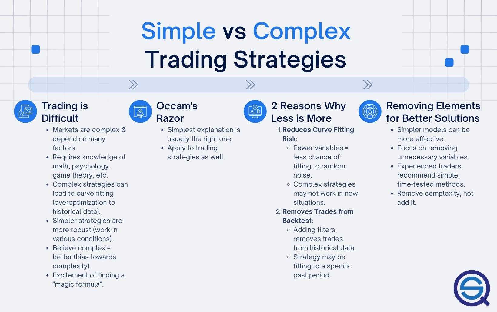

## Table of Contents

## What is a systematic trading strategy?

A systematic trading strategy is a method of trading where decisions are made based on a set of predefined rules and criteria, rather than relying on human judgment. These rules are often programmed into a computer system, which then automatically executes trades when certain conditions are met. This approach aims to remove emotional biases from trading, as the system follows the rules consistently without being influenced by fear or greed.

These strategies can be based on various factors such as technical indicators, statistical models, or fundamental analysis. For example, a simple systematic strategy might involve buying a stock when its 50-day moving average crosses above its 200-day moving average, and selling when the opposite occurs. By using historical data and backtesting, traders can refine these rules to improve the strategy's performance over time. While systematic trading can be highly effective, it's important to regularly monitor and adjust the strategy to adapt to changing market conditions.

## What are the main differences between simple and advanced systematic trading strategies?

Simple systematic trading strategies are easy to understand and use. They often rely on basic technical indicators like moving averages or simple price patterns. For example, a simple strategy might tell you to buy a stock when its price goes above a certain line and sell it when the price drops below another line. These strategies are good for beginners because they don't need a lot of complicated math or computer programming. However, they might not work as well in all market conditions because they don't take into account many different factors.

Advanced systematic trading strategies are more complex and use a lot more data and sophisticated methods. They might use things like [machine learning](/wiki/machine-learning), big data analysis, or complex statistical models to make trading decisions. These strategies can look at many different pieces of information at the same time, like economic reports, company news, and even social media trends. Because they are more detailed, advanced strategies can sometimes make better predictions and adapt to changing markets more easily. But they also need more time and skill to set up and manage, and they can be harder to understand and explain.

## How does a simple systematic trading strategy work?

A simple systematic trading strategy uses clear rules to decide when to buy or sell something. For example, imagine you have a rule that says you should buy a stock when its price goes above a certain line on a chart, like the 50-day moving average. If the stock's price goes above this line, your strategy tells you to buy the stock. Then, if the price drops below another line, like the 200-day moving average, your rule says to sell the stock. These rules help you make decisions without getting confused by your feelings.

These simple strategies are great because they're easy to follow and don't need fancy computers or math. Anyone can use them if they know how to read a chart. But, they might not work well all the time because they only look at a few things. If the market changes a lot, a simple strategy might not be able to keep up. Still, they're a good starting point for people new to trading because they help you learn how to make decisions based on clear rules.

## What are the key components of an advanced systematic trading strategy?

An advanced systematic trading strategy uses a lot of different information and fancy math to decide when to buy or sell. It might use things like machine learning, which is like teaching a computer to find patterns in data, and big data analysis, which looks at huge amounts of information from many places. These strategies can look at things like stock prices, economic reports, company news, and even what people are saying on social media. By using all this information, the strategy can make smarter guesses about what might happen in the market.

Setting up an advanced strategy takes a lot of time and skill. You need to know how to program computers and understand complicated math. You also need to keep checking and changing the strategy to make sure it still works well as the market changes. Even though it's harder to set up and understand, an advanced strategy can be better at making money because it looks at so many things at once. But, it's not perfect, and sometimes the market can still surprise it.

## What are the advantages of using a simple systematic trading strategy for beginners?

Using a simple systematic trading strategy is great for beginners because it's easy to understand and follow. These strategies use clear rules, like buying a stock when its price goes above a certain line on a chart. This helps beginners make decisions without getting confused or emotional. They don't need to know a lot about complicated math or how to program computers. All they need is to know how to read a chart and follow the rules.

Another advantage is that simple strategies are a good way to start learning about trading. They help beginners see how the market works and how to use rules to make decisions. While these strategies might not always make a lot of money, they're a safe way to practice and learn. As beginners get more comfortable, they can slowly start to add more complex rules or try more advanced strategies. But starting with something simple helps them build confidence and understand the basics first.

## How can advanced systematic trading strategies improve performance for experienced traders?

Advanced systematic trading strategies can help experienced traders do better by using a lot of different information and smart math. These strategies use things like machine learning, which is like teaching a computer to find patterns in data, and big data analysis, which looks at huge amounts of information from many places. By looking at stock prices, economic reports, company news, and even what people are saying on social media, these strategies can make smarter guesses about what might happen in the market. This can lead to better decisions about when to buy or sell, which can help traders make more money.

Setting up and using these advanced strategies takes a lot of time and skill. Experienced traders need to know how to program computers and understand complicated math. They also need to keep checking and changing the strategy to make sure it still works well as the market changes. Even though it's harder to set up and understand, an advanced strategy can be better at making money because it looks at so many things at once. This means experienced traders can fine-tune their approach to get the best results possible.

## What are the common pitfalls of simple systematic trading strategies?

Simple systematic trading strategies can be tricky because they only look at a few things, like a stock's price moving above or below a line on a chart. This means they might miss out on other important information that could affect the market. For example, if there's big news about a company, a simple strategy might not know to buy or sell based on that news. This can lead to missing good chances to make money or making bad trades because the strategy doesn't see the whole picture.

Another problem is that simple strategies might not work well when the market changes a lot. Markets can be unpredictable, and what worked last month might not work this month. If a simple strategy doesn't change with the market, it could keep making the same trades even when they stop working. This means traders might lose money if they stick to a strategy that's no longer good. It's important to keep an eye on how well the strategy is doing and be ready to change it if needed.

## What are the risks associated with advanced systematic trading strategies?

Advanced systematic trading strategies can be risky because they are very complicated. They use a lot of different information and fancy math, which can be hard to understand and manage. If something goes wrong with the computer program or the data it uses, the strategy might make bad trades. This can lead to big losses if the trader doesn't notice the problem in time. Also, because these strategies are so complex, it can be hard to explain why they made certain trades, which can make it tough to trust them completely.

Another risk is that advanced strategies might not work well if the market changes in a way they didn't expect. Even though they look at a lot of information, the market can still surprise them. If the strategy is too focused on past patterns, it might not be able to adapt to new situations. This means traders need to keep checking and changing the strategy to make sure it still works well. If they don't, they could lose money because the strategy isn't keeping up with the market.

## How can one evaluate the effectiveness of a simple vs. an advanced systematic trading strategy?

To evaluate a simple systematic trading strategy, you look at how well it does over time. You can use something called [backtesting](/wiki/backtesting), which means you see how the strategy would have worked in the past using old data. If it made money in the past, it might work well now. But you also need to check if it's still working by looking at how it does in the current market. Simple strategies are easy to understand, so you can quickly see if they're making good trades or if they're missing important information. The main thing to watch out for is if the market changes a lot, because simple strategies might not keep up.

For an advanced systematic trading strategy, evaluating its effectiveness is trickier because it uses a lot of complicated stuff like machine learning and big data. You still use backtesting, but you need to make sure the strategy can handle new situations too. Advanced strategies can look at many different pieces of information, so they might do better than simple ones, but they can also be harder to understand and trust. You need to keep a close eye on them to make sure they're still working well and not making bad trades because of unexpected changes in the market. Both types of strategies need regular checking to see if they're still making money, but advanced ones need more attention because they're more complex.

## What tools and technologies are necessary for implementing advanced systematic trading strategies?

To implement advanced systematic trading strategies, you need powerful computers that can handle a lot of data quickly. These computers run special software that uses machine learning and big data analysis to make trading decisions. The software needs to be able to look at things like stock prices, economic reports, company news, and even what people are saying on social media. This means you also need good ways to collect and store all this data, like databases and data feeds from financial markets. Without these tools, it would be hard to make the smart guesses about the market that advanced strategies need.

Another important part is having the right programming skills. You need to know how to write code that can tell the computer what to do with all the data it's looking at. This might mean using languages like Python or R, which are good for data analysis and machine learning. You also need to be able to test your strategy to see if it works, using something called backtesting. This means running your strategy on old data to see how it would have done in the past. Plus, you need to keep an eye on how the strategy is doing in the real market and be ready to change it if it's not working well anymore. All these tools and skills together help make advanced systematic trading strategies possible.

## Can simple systematic trading strategies be scaled up to handle larger trading volumes?

Simple systematic trading strategies can be scaled up to handle larger trading volumes, but it takes some work. These strategies use clear rules, like buying when a stock's price goes above a certain line on a chart. To handle more trades, you need a computer that can do things quickly and a good way to get the trading data. You also need to make sure the rules still work well when you're trading more. If the market changes, you might need to change the rules a bit to keep up.

Scaling up simple strategies also means you need to watch them more closely. When you're trading a lot, even small mistakes can cost more money. You need to keep checking how the strategy is doing and be ready to fix any problems fast. Even though simple strategies are easier to understand, making them work with larger volumes still needs some care and attention.

## What future trends might influence the choice between simple and advanced systematic trading strategies?

In the future, more and more people might choose advanced systematic trading strategies because of new technology. Computers are getting better at handling big data and using machine learning to find patterns in the market. This means advanced strategies can look at a lot more information and make smarter guesses about what might happen next. As these technologies get cheaper and easier to use, even people who are new to trading might start using them. But, they will still need to learn how to use these tools and understand the complicated math behind them.

On the other hand, simple systematic trading strategies might still be popular because they are easy to understand and use. Even with all the new technology, some people might prefer to stick with what they know and trust. Simple strategies can be a good way to start learning about trading without getting overwhelmed by too much information. But, as the market gets more complicated, simple strategies might need to change to keep up. People might start adding a few more rules to their simple strategies to make them a bit smarter, but they will still want to keep things easy to follow.

## References & Further Reading

[1]: Bergstra, J., Bardenet, R., Bengio, Y., & Kégl, B. (2011). ["Algorithms for Hyper-Parameter Optimization."](https://papers.nips.cc/paper/4443-algorithms-for-hyper-parameter-optimization) Advances in Neural Information Processing Systems 24.

[2]: ["Advances in Financial Machine Learning"](https://www.amazon.com/Advances-Financial-Machine-Learning-Marcos/dp/1119482089) by Marcos Lopez de Prado

[3]: ["Evidence-Based Technical Analysis: Applying the Scientific Method and Statistical Inference to Trading Signals"](https://www.amazon.com/Evidence-Based-Technical-Analysis-Scientific-Statistical/dp/0470008741) by David Aronson

[4]: ["Machine Learning for Algorithmic Trading"](https://github.com/PacktPublishing/Machine-Learning-for-Algorithmic-Trading-Second-Edition) by Stefan Jansen

[5]: ["Quantitative Trading: How to Build Your Own Algorithmic Trading Business"](https://books.google.com/books/about/Quantitative_Trading.html?id=j70yEAAAQBAJ) by Ernest P. Chan