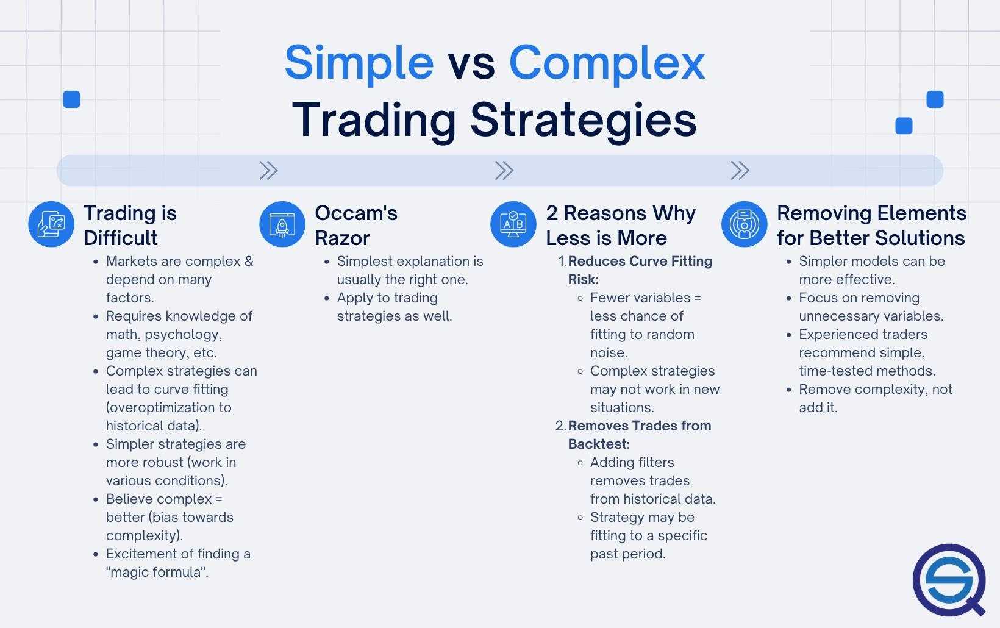

## Table of Contents

## What is a trading strategy?

A trading strategy is a set of rules and guidelines that a trader follows to make decisions about buying and selling financial assets like stocks, currencies, or commodities. It helps traders to be consistent and disciplined in their approach, reducing the impact of emotions on their trading decisions. A good trading strategy considers factors like market trends, economic indicators, and the trader's own risk tolerance and financial goals.

There are many different types of trading strategies, and the best one for a trader depends on their individual goals, experience, and the amount of time they can dedicate to trading. Some common strategies include day trading, where traders buy and sell assets within the same day, and swing trading, where traders hold onto assets for a few days or weeks to take advantage of short-term price movements. Other strategies might focus on technical analysis, using charts and patterns to predict future price movements, or fundamental analysis, which involves studying a company's financial health and market position to make trading decisions.

## What is the difference between simple and complex trading strategies?

Simple trading strategies are easy to understand and follow. They usually involve basic rules like buying when a stock price goes up and selling when it goes down. These strategies are good for beginners because they don't need a lot of time to learn or use. An example of a simple strategy is buying a stock and holding it for a long time, hoping its value will grow.

Complex trading strategies, on the other hand, can be hard to understand and use. They often involve many rules and need a lot of time to learn and follow. These strategies might use advanced math or special computer programs to decide when to buy and sell. They are usually used by experienced traders who have a lot of time and money to spend on trading. An example of a complex strategy is using algorithms to trade many times a day based on tiny changes in the market.

## What are some examples of simple trading strategies?

One example of a simple trading strategy is the "buy and hold" method. With this strategy, you buy a stock and keep it for a long time, like years or even decades. You believe that over time, the stock will grow in value. This strategy is easy to follow because you don't need to check the stock prices every day. You just wait and hope the company does well.

Another simple strategy is called "dollar-cost averaging." This means you invest a fixed amount of money into a stock at regular times, like every month. By doing this, you buy more shares when the price is low and fewer shares when the price is high. Over time, this can help you pay a lower average price for the stock. It's a good way to reduce the risk of investing all your money at the wrong time.

A third simple strategy is the "moving average crossover." This involves using two moving averages, one short-term and one long-term, to decide when to buy or sell. If the short-term average goes above the long-term average, it might be a good time to buy. If the short-term average goes below the long-term average, it might be a good time to sell. This strategy helps you follow trends in the market without needing to do a lot of complicated analysis.

## What are some examples of complex trading strategies?

One example of a complex trading strategy is "algorithmic trading." This involves using computer programs to buy and sell stocks very quickly, often many times in a single day. These programs use math and data to make decisions faster than a human can. Traders using this strategy need to know a lot about programming and how markets work. It can be risky because the market can change quickly, and the computer might make mistakes.

Another complex strategy is "options trading." This involves buying and selling options, which are contracts that give you the right to buy or sell a stock at a certain price in the future. Options trading can be very complicated because there are many different kinds of options and ways to use them. Traders need to understand things like "call options," "put options," and "strike prices." This strategy can be used to make money in many different market conditions, but it also has a lot of risks and can be hard to learn.

A third example is "statistical arbitrage." This strategy uses math to find small differences in the prices of related stocks or other assets. Traders use computers to find these differences and then buy and sell quickly to make a profit. This strategy needs a lot of data and fast computers to work well. It's not easy to do because the market can be unpredictable, and the small profits can add up to big losses if things go wrong.

## How can a beginner start with simple trading strategies?

A beginner can start with simple trading strategies by first learning about the "buy and hold" method. This means you pick a stock you believe in and keep it for a long time, like years. You don't need to watch the stock every day; you just wait and hope the company does well. To start, you can research companies you like and see if they have a good track record. Then, you can buy their stock and hold onto it. This strategy is easy because it doesn't require a lot of time or complex decisions.

Another simple strategy for beginners is "dollar-cost averaging." This means you invest a set amount of money into a stock at regular times, like every month. This way, you buy more shares when the price is low and fewer when it's high. Over time, this can help you pay a lower average price for the stock. To get started, decide how much money you can invest each month and stick to that plan. This strategy helps reduce the risk of putting all your money in at the wrong time and is easy to follow because it's a regular, simple action.

Lastly, beginners can try the "moving average crossover" strategy. This involves using two moving averages, one short-term and one long-term, to decide when to buy or sell. If the short-term average goes above the long-term average, it might be a good time to buy. If it goes below, it might be a good time to sell. To start, you'll need to learn how to read stock charts and understand what moving averages are. This strategy helps you follow market trends without needing to do a lot of complicated analysis, making it a good choice for beginners who want to start trading with a bit more action.

## What are the advantages of using simple trading strategies?

Simple trading strategies are great for beginners because they are easy to understand and follow. You don't need to spend a lot of time learning about them. For example, with the "buy and hold" strategy, you just pick a good stock and keep it for a long time. You don't have to check the stock every day. This makes it easier for people who don't have a lot of time to spend on trading. Also, simple strategies help you avoid making quick, emotional decisions that can lead to mistakes.

Another advantage of simple trading strategies is that they can help you manage risk better. For example, with "dollar-cost averaging," you invest the same amount of money regularly. This way, you buy more shares when the price is low and fewer when it's high. Over time, this can help you pay a lower average price for the stock. Simple strategies like these don't need a lot of fancy tools or math, so they are less likely to go wrong. They help you stay calm and stick to your plan, even when the market is going up and down.

## What are the disadvantages of using simple trading strategies?

Simple trading strategies can sometimes miss out on big chances to make money. Because they are easy to follow, they don't look at all the little details that can help you make better choices. For example, if you just use the "buy and hold" strategy, you might not sell your stock even when it's a good time to do so because the market is changing. This means you could lose money if the stock goes down a lot.

Also, simple strategies might not work well in all kinds of markets. If the market is moving fast and changing a lot, a simple strategy like "dollar-cost averaging" might not help you make the most money. You might end up buying stocks at high prices and selling them at low prices if you're not watching closely. Simple strategies can be good for beginners, but they might not be the best choice if you want to make the most money or if the market is very unpredictable.

## How do complex trading strategies improve upon simple strategies?

Complex trading strategies can help you make more money because they look at a lot more details than simple strategies. They use fancy math and computer programs to find the best times to buy and sell stocks. For example, with algorithmic trading, you can buy and sell stocks many times a day, making small profits each time. This can add up to a lot of money over time. Complex strategies like options trading let you make money even when the market is going down, not just when it's going up. This means you have more ways to make money and can take advantage of more opportunities.

However, complex strategies also have some downsides. They are harder to learn and use because they need a lot of time and knowledge. You might need to learn about programming or how options work, which can be confusing. Also, because they are so detailed, there's a bigger chance of making mistakes. If the market changes quickly, your computer program might not be able to keep up, and you could lose money. So, while complex strategies can help you make more money, they also come with more risks and need more work to use correctly.

## What are the risks associated with complex trading strategies?

Complex trading strategies can be risky because they are hard to understand and use. You need to learn a lot about things like math, computer programs, and how markets work. If you don't know enough, you might make big mistakes. For example, if you use a computer program to trade stocks quickly, the program might not work right if the market changes fast. This can lead to big losses because the program might buy or sell at the wrong times.

Another risk is that complex strategies can be more expensive. You might need to pay for special software or data to make these strategies work. Also, because you're trying to make money in many different ways, there's a bigger chance that something will go wrong. If you're using options trading, for example, the market might move in a way you didn't expect, and you could lose more money than you planned. So, while complex strategies can help you make more money, they also come with more risks and need more work to use correctly.

## How can one transition from simple to complex trading strategies?

To move from simple to complex trading strategies, you need to learn more about how markets work and get better at using tools like computers and math. Start by learning about more advanced strategies like algorithmic trading or options trading. You can read books, take online courses, or join trading communities to learn from experienced traders. Practice these new strategies with a small amount of money or use a trading simulator to see how they work without risking a lot. As you get more comfortable, you can slowly start using more complex strategies with more money.

It's important to take your time and not rush into complex strategies too quickly. They can be risky, so you need to understand them well before using them with a lot of money. Keep using your simple strategies while you learn the complex ones. This way, you can still make money with what you know while you get better at the new strategies. Over time, as you gain more experience and confidence, you can start to use the complex strategies more and the simple ones less. Always remember to manage your risks carefully and be ready to go back to simpler strategies if the complex ones aren't working out.

## What tools and technologies are necessary for implementing complex trading strategies?

To use complex trading strategies, you need special tools and technologies. One important tool is a computer program that can trade stocks very fast. This is called algorithmic trading software. It uses math to decide when to buy and sell stocks. You also need a lot of data about the stock market, like prices and how much people are buying and selling. This data helps the computer program make good decisions. Another tool you might need is a platform for trading options, which lets you buy and sell contracts that give you the right to trade stocks at certain prices in the future.

Using these tools can be hard because you need to know how to use the software and understand the data. You might need to learn how to program or use special software to analyze the market. It can also be expensive because you have to pay for the software and the data. But if you learn how to use these tools well, they can help you make more money by finding small chances to trade that other people might miss. Just remember, these tools are powerful, but they also come with more risks, so you need to be careful and keep learning as you go.

## How can one evaluate the performance of both simple and complex trading strategies?

To evaluate the performance of simple trading strategies, you need to look at how much money you made or lost over time. For example, if you used the "buy and hold" strategy, you can check if the stock's value went up over the years. You can also see if you made more money than if you had just put your money in a savings account. Another thing to look at is how well your strategy worked in different market conditions, like when the market was going up or down. If your strategy made money no matter what the market did, it's a good sign that it's working well. Simple strategies are easier to evaluate because they don't have a lot of moving parts.

For complex trading strategies, evaluating performance is a bit harder because they use a lot of data and math. You need to look at how much money you made or lost, just like with simple strategies, but you also need to check if the computer programs and math formulas you used were right. You can use special software to see how well your strategy did compared to the market or other traders. It's also important to see if your strategy can make money in different market conditions. Because complex strategies are more detailed, you need to keep a close eye on them and make sure they are working the way you planned. This way, you can see if the extra work and risk are worth it.

## What are the components of simple algo trading strategies?

Trend following and mean reversion represent foundational approaches within the field of algorithmic trading, characterized by their reliance on straightforward interpretations of market behaviors rather than complex predictive models.

Trend following strategies focus on identifying and capitalizing on ongoing market trends. The principle driving these strategies is that prices tend to move in a given direction over time due to market dynamics and behavioral biases. A simple moving average (SMA) crossover is a classic example of a trend-following strategy. In this model, signals to buy or sell are triggered when a short-term moving average crosses above or below a long-term moving average, respectively. The mathematical representation of a simple moving average for a period $N$ can be expressed as:

$$
\text{SMA}_t = \frac{1}{N} \sum_{i=0}^{N-1} P_{t-i}
$$

where $P_t$ is the price at time $t$. These systems are adaptable to various market conditions due to their inherent simplicity, requiring minimal parameters and reducing the risk of curve fitting.

Mean reversion strategies, on the other hand, are based on the premise that prices will eventually return to their mean or average level. This concept assumes that extremes in price will reverse towards the mean, providing opportunities for profit. A basic example includes the construction of Bollinger Bands, which defines the mean and the levels of standard deviation to identify overbought or oversold conditions. The bands are calculated as:

$$
\text{Upper Band} = \text{SMA}_t + k \times \sigma_t
$$
$$
\text{Lower Band} = \text{SMA}_t - k \times \sigma_t
$$

where $\sigma_t$ is the standard deviation of the price over the last $N$ periods, and $k$ is a selected number of standard deviations. Traders might consider buying when the price reaches the lower band and selling when it approaches the upper band.

A critical component in the development and utilization of these simple strategies is proper [backtesting](/wiki/backtesting). Backtesting involves applying a trading strategy to historical data to assess its effectiveness before risking capital in live markets. This process helps estimate potential profitability and identify any structural flaws in the strategy. For example, using Python, a simple backtest for a moving average crossover strategy could involve importing price data, calculating the moving averages, and iterating through the data to simulate buy and sell signals. Essential libraries such as Pandas for data manipulation and NumPy for numerical analysis are frequently used in these processes.

```python
import pandas as pd
import numpy as np

# Assuming data is in a pandas DataFrame with a 'Price' column
data['Short_MA'] = data['Price'].rolling(window=short_window).mean()
data['Long_MA'] = data['Price'].rolling(window=long_window).mean()

# Generate signals
data['Signal'] = 0
data['Signal'][short_window:] = np.where(data['Short_MA'][short_window:] > data['Long_MA'][short_window:], 1, -1)

# Calculate returns
data['Returns'] = data['Signal'].shift(1) * data['Price'].pct_change()
cumulative_returns = data['Returns'].cumsum()
```

In conclusion, while trend following and mean reversion strategies are fundamental and straightforward, they provide robust frameworks for engaging with financial markets. Their success greatly hinges on rigorous backtesting and simulation to ensure their applicability to real-world scenarios, ensuring these strategies meet the dynamic conditions of financial markets.

## References & Further Reading

[1]: Bergstra, J., Bardenet, R., Bengio, Y., & Kégl, B. (2011). ["Algorithms for Hyper-Parameter Optimization."](https://papers.nips.cc/paper/4443-algorithms-for-hyper-parameter-optimization) Advances in Neural Information Processing Systems 24.

[2]: ["Advances in Financial Machine Learning"](https://www.amazon.com/Advances-Financial-Machine-Learning-Marcos/dp/1119482089) by Marcos Lopez de Prado

[3]: ["Evidence-Based Technical Analysis: Applying the Scientific Method and Statistical Inference to Trading Signals"](https://www.amazon.com/Evidence-Based-Technical-Analysis-Scientific-Statistical/dp/0470008741) by David Aronson

[4]: ["Machine Learning for Algorithmic Trading"](https://github.com/stefan-jansen/machine-learning-for-trading) by Stefan Jansen

[5]: ["Quantitative Trading: How to Build Your Own Algorithmic Trading Business"](https://www.amazon.com/Quantitative-Trading-Build-Algorithmic-Business/dp/0470284889) by Ernest P. Chan