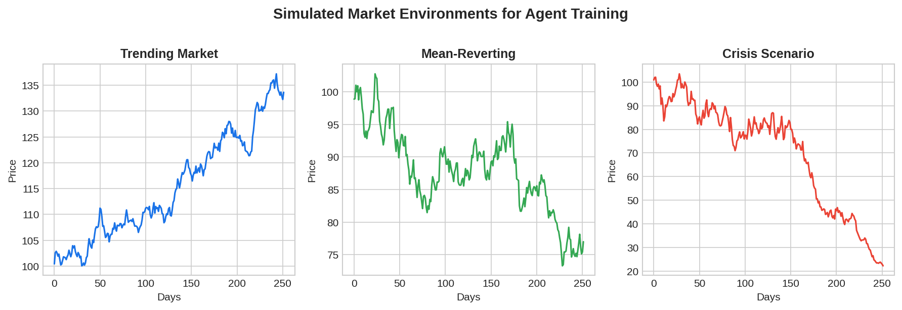

A **simulated market environment** is a computational sandbox that reproduces the dynamics of financial markets — price movements, order execution, transaction costs, and market microstructure — allowing traders to train, test, and validate strategies without risking real capital. These simulators serve as the "world model" for model-based RL agents and as the testing ground for all systematic strategies. The quality of a trading simulator directly determines whether [backtest results](https://paperswithbacktest.com/wiki/backtesting-with-python) will generalize to live trading.

## Types of Market Simulators

| Type | Approach | Realism | Use Case |
|------|----------|---------|----------|
| Historical replay | Replay real price data with simulated execution | High (real prices) | Strategy backtesting |
| Parametric simulation | Generate returns from statistical models (GBM, GARCH) | Medium | Monte Carlo risk analysis |
| Agent-based | Multiple agents interact via order book | High (microstructure) | Market impact, HFT research |
| Learned simulators | Neural network trained on market data | Variable | RL agent training |

## Key Components of a Realistic Simulator

A production-quality market simulator must model: price dynamics (trending, mean-reverting, and random phases), transaction costs (spread, commission, slippage), market impact (price moves against large orders), partial fills (not all orders execute immediately), latency (delay between decision and execution), and regime changes (shifting volatility and correlation structures).



## Python Implementation: Configurable Market Simulator

```python
import numpy as np

class MarketSimulator:
    """Configurable market environment for strategy testing."""
    
    def __init__(self, mu=0.0005, sigma=0.012, spread=0.0002,
                 impact=0.0001, regime_switch_prob=0.02):
        self.mu = mu
        self.sigma = sigma
        self.spread = spread
        self.impact = impact
        self.regime_switch_prob = regime_switch_prob
        self.regime = 0  # 0 = normal, 1 = crisis
        self.price = 100.0
        self.t = 0
    
    def reset(self):
        self.price = 100.0
        self.regime = 0
        self.t = 0
        return self._get_state()
    
    def step(self, action):
        """action: -1 (short), 0 (flat), 1 (long), with position size."""
        # Regime switching
        if np.random.rand() < self.regime_switch_prob:
            self.regime = 1 - self.regime
        
        # Generate return based on regime
        if self.regime == 0:
            ret = np.random.normal(self.mu, self.sigma)
        else:
            ret = np.random.normal(-self.mu, self.sigma * 2.5)
        
        # Transaction costs
        cost = abs(action) * (self.spread + self.impact * abs(action))
        
        # PnL
        pnl = action * ret - cost
        self.price *= (1 + ret)
        self.t += 1
        
        return self._get_state(), pnl, self.regime
    
    def _get_state(self):
        return np.array([self.price, self.sigma, self.regime])

# Run simulation
np.random.seed(42)
sim = MarketSimulator()
state = sim.reset()
total_pnl = 0

for _ in range(252):
    action = 1 if state[2] == 0 else -0.5  # Simple regime-aware policy
    state, pnl, regime = sim.step(action)
    total_pnl += pnl

print(f"Total PnL: {total_pnl:.4f}")
```

## Open-Source Simulation Frameworks

Several open-source frameworks provide ready-made market simulators: **OpenAI Gym trading environments** provide RL-compatible interfaces, **ABIDES** (J.P. Morgan) simulates realistic order book microstructure, **FinRL** provides end-to-end RL frameworks with multiple market environments, and [VectorBT](https://paperswithbacktest.com/wiki/vectorbt-guide) provides fast vectorized backtesting that can serve as a simulation layer.

## Limitations and Risks

Every simulator is a simplification. The primary risk is overfitting to simulator artifacts — patterns that exist in the simulation but not in real markets. Always validate simulator-trained strategies on out-of-sample historical data and paper trade before deploying capital.

## Conclusion

Simulated market environments are essential infrastructure for modern algorithmic trading. They enable safe exploration, rapid iteration, and systematic validation of strategies. The key is building simulators that are realistic enough to produce transferable results while being fast enough for extensive testing.

---

**Explore further on PapersWithBacktest:**
- Browse [backtested strategies](https://paperswithbacktest.com/strategies) with Python code and performance metrics
- Access [clean historical market data](https://paperswithbacktest.com/datasets) for equities, crypto, and futures
- Take the [algo trading course](https://paperswithbacktest.com/course) — 60+ video lessons and notebooks
- Related wiki pages: [Backtesting with Python](https://paperswithbacktest.com/wiki/backtesting-with-python) · [VectorBT Guide](https://paperswithbacktest.com/wiki/vectorbt-guide) · [Geometric Brownian Motion Simulation](https://paperswithbacktest.com/wiki/geometric-brownian-motion-simulation-with-python)
