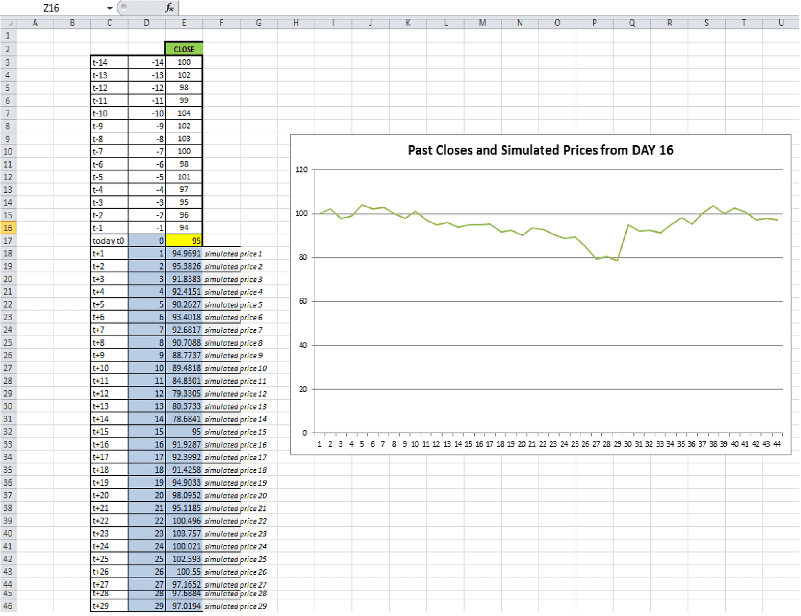

## Table of Contents

## What are stock prices and why would someone want to simulate them?

Stock prices are the values at which shares of a company are bought and sold on the stock market. They change all the time because they are influenced by many things, like how well the company is doing, news about the economy, and what people think will happen in the future. When a lot of people want to buy a stock, its price goes up. When many people want to sell, the price goes down.

Someone might want to simulate stock prices to understand how they might change in the future without risking real money. By using a computer to create pretend stock prices, people can test their investment ideas and see how they might work out in different situations. This can help them make better choices about buying and selling stocks in real life. Simulating stock prices is also useful for learning about the stock market and for teaching others how it works.

## How can Excel be used to simulate stock prices?

Excel can be used to simulate stock prices by using formulas to create pretend prices that act like real stock prices. You start by putting in a starting price for a stock. Then, you can use a formula to make the price go up or down a little bit for each pretend day. This small change can be based on a random number that Excel can make for you. You can use a formula like this: `=PreviousPrice * (1 + RandomChange)`, where `PreviousPrice` is the price from the day before, and `RandomChange` is a small random number that can be positive or negative.

To make the simulation more like the real stock market, you can add more things to your Excel sheet. For example, you can make the random changes bigger or smaller to show how the stock market can be calm or wild. You can also add pretend news or events that make the stock price jump up or down a lot on certain days. By playing around with these things in Excel, you can see how different situations might affect a stock's price over time. This can help you learn about the stock market and test your ideas without using real money.

## What basic Excel functions are needed to start simulating stock prices?

To start simulating stock prices in Excel, you'll need to use a few basic functions. The first function you'll use is `RAND()` or `RANDBETWEEN()`. These functions help you make random numbers. You need random numbers to make your stock prices go up and down in a way that feels real. For example, you can use `RAND()` to get a number between 0 and 1, and then use that to decide how much the stock price changes each day.

Another important function is simple math like addition, subtraction, multiplication, and division. You'll use these to change the stock price based on the random number you got from `RAND()`. For example, if your stock starts at $100, you might use a formula like `=100 * (1 + RAND() - 0.5)` to make the price go up or down a bit. The `-0.5` part makes it so the stock price can go up or down equally.

Lastly, you'll use the `IF` function if you want to add more details to your simulation. The `IF` function lets you make the stock price change in special ways based on certain conditions. For example, you might use `IF` to make the stock price drop a lot if a pretend news event happens. By using these basic functions together, you can start to build a simple simulation of stock prices in Excel.

## How do you generate random numbers in Excel for stock price simulation?

To generate random numbers in Excel for simulating stock prices, you can use the `RAND()` function. This function makes a random number between 0 and 1 every time your Excel sheet recalculates. You can use this number to decide how much the stock price changes each day. For example, if you want the stock price to go up or down by up to 1%, you could use a formula like `=CurrentPrice * (1 + RAND() - 0.5) * 0.01`. The `-0.5` part makes sure the stock price can go up or down equally, and multiplying by `0.01` limits the change to 1%.

Another way to generate random numbers is with the `RANDBETWEEN(bottom, top)` function. This function lets you choose the smallest and largest numbers you want. If you want the stock price to change by a whole number between -5 and +5, you could use `=CurrentPrice + RANDBETWEEN(-5, 5)`. This method is good if you want to keep things simple and only have the stock price change by whole numbers. Both `RAND()` and `RANDBETWEEN()` help make your stock price simulation feel real and unpredictable, just like the real stock market.

## What is a geometric Brownian motion model and how can it be implemented in Excel?

A geometric Brownian motion model is a way to pretend how stock prices might change over time. It's based on the idea that stock prices go up and down in a random way, but the changes are linked to how much time has passed and how much the stock moves around. The model uses two main things: a drift term, which is like a steady push that makes the price go up or down over time, and a [volatility](/wiki/volatility-trading-strategies) term, which is how much the price jumps around. By using these two things together, the model can make pretend stock prices that look a lot like real ones.

To use this model in Excel, you start with a beginning stock price and then use a formula to make it change over time. The formula you need is `=PreviousPrice * EXP((Drift - 0.5 * Volatility^2) * TimeStep + Volatility * SQRT(TimeStep) * NORMSINV(RAND()))`. Here, `PreviousPrice` is the stock price from the last step, `Drift` is how much the price tends to go up or down over time, `Volatility` is how much the price jumps around, `TimeStep` is how much time has passed, and `NORMSINV(RAND())` makes a random number that helps the price change in a way that fits the model. By putting this formula into Excel and copying it down a column, you can watch the stock price change over many pretend days, helping you see how it might behave in the real world.

## How can you use historical stock price data in Excel to inform your simulations?

You can use historical stock price data in Excel to make your stock price simulations more realistic. First, you need to get the historical data, which you can usually find on financial websites or from stock market data services. Once you have this data in Excel, you can calculate things like the average change in the stock price each day, which is called the drift, and how much the stock price jumps around, which is called the volatility. By using these numbers in your simulation, you can make the pretend stock prices behave more like the real stock did in the past.

To put this into practice, you can use the historical data to find the drift and volatility. For drift, you can take the average of the daily percentage changes in the stock price. For volatility, you can use the standard deviation of those daily percentage changes. Once you have these numbers, you can plug them into the geometric Brownian motion formula in Excel. This way, your simulation will use real data to guide how the pretend stock prices change, making your simulation a better tool for understanding how the stock might behave in the future.

## What are the steps to create a Monte Carlo simulation of stock prices in Excel?

To create a Monte Carlo simulation of stock prices in Excel, you start by setting up your spreadsheet with some basic information. You need a starting stock price, a time period you want to simulate, and estimates for the drift and volatility. You can get the drift and volatility from historical stock price data. The drift is the average daily percentage change in the stock price, and the volatility is how much those daily changes jump around. Once you have these numbers, you can set up your Excel sheet with columns for the time steps and the stock prices.

Next, you use a formula to make the stock price change over time. The formula you use is based on the geometric Brownian motion model, and it looks like this: `=PreviousPrice * EXP((Drift - 0.5 * Volatility^2) * TimeStep + Volatility * SQRT(TimeStep) * NORMSINV(RAND()))`. In this formula, `PreviousPrice` is the stock price from the last step, `Drift` is how much the price tends to change each day, `Volatility` is how much the price jumps around, `TimeStep` is how much time has passed, and `NORMSINV(RAND())` makes a random number that helps the price change in a way that fits the model. You put this formula into the first cell under your starting price, then copy it down the column to simulate many days. By running this simulation many times, you can see a range of possible future stock prices, helping you understand how the stock might behave.

## How do you incorporate volatility and drift in stock price simulations using Excel?

To incorporate volatility and drift in stock price simulations using Excel, you start by figuring out what these numbers are from past stock prices. Drift is like the average change in the stock price each day. You can find it by looking at how much the stock price changed each day in the past and taking the average of those changes. Volatility is how much the stock price jumps around. You can find it by looking at how much those daily changes vary from the average. Once you have these numbers, you can use them in a formula to make your pretend stock prices change in a way that feels real.

The formula you use in Excel to make the stock price change is called the geometric Brownian motion model. It looks like this: `=PreviousPrice * EXP((Drift - 0.5 * Volatility^2) * TimeStep + Volatility * SQRT(TimeStep) * NORMSINV(RAND()))`. In this formula, `PreviousPrice` is the stock price from the last step, `Drift` is the average daily change you found, `Volatility` is how much the price jumps around, `TimeStep` is how much time has passed, and `NORMSINV(RAND())` makes a random number that helps the price change in a way that fits the model. By putting this formula into Excel and copying it down a column, you can watch the stock price change over many pretend days, helping you see how it might behave in the real world.

## What Excel formulas can be used to calculate and project future stock prices?

To calculate and project future stock prices in Excel, you can use the geometric Brownian motion model. This model helps you make pretend stock prices that act like real ones. You start with a beginning stock price and use a formula to make it change over time. The formula you need is `=PreviousPrice * EXP((Drift - 0.5 * Volatility^2) * TimeStep + Volatility * SQRT(TimeStep) * NORMSINV(RAND()))`. In this formula, `PreviousPrice` is the stock price from the last step, `Drift` is how much the price tends to change each day, `Volatility` is how much the price jumps around, `TimeStep` is how much time has passed, and `NORMSINV(RAND())` makes a random number that helps the price change in a way that fits the model. By putting this formula into Excel and copying it down a column, you can watch the stock price change over many pretend days, helping you see how it might behave in the real world.

To find the `Drift` and `Volatility` numbers you need for the formula, you can use historical stock price data. `Drift` is the average daily percentage change in the stock price. You can find it by taking the average of the daily percentage changes in the stock price from the past. `Volatility` is how much those daily percentage changes jump around. You can find it by calculating the standard deviation of those daily percentage changes. Once you have these numbers, you can plug them into the geometric Brownian motion formula in Excel. This way, your simulation will use real data to guide how the pretend stock prices change, making your simulation a better tool for understanding how the stock might behave in the future.

## How can you use Excel's Solver to optimize stock price simulations?

Excel's Solver can help you find the best values for things like drift and volatility in your stock price simulations. You start by setting up your simulation in Excel with the geometric Brownian motion formula. Then, you tell Solver what you want to find out, like the drift and volatility that make the pretend stock prices match the real ones the best. You do this by telling Solver to make the difference between your pretend prices and the real prices as small as possible. Solver will then try different numbers for drift and volatility until it finds the ones that work best.

Once Solver has done its job, you can use the drift and volatility numbers it found to make your stock price simulations better. These numbers will help your pretend stock prices act more like the real ones. This way, you can see how the stock might behave in the future more accurately. By using Solver, you can make your simulations more useful for understanding and planning your investments.

## What advanced Excel features can enhance the accuracy of stock price simulations?

To make your stock price simulations more accurate in Excel, you can use the Data Analysis ToolPak. This tool helps you find out things like the average daily change (drift) and how much the prices jump around (volatility) from past stock prices. You can use these numbers to make your pretend stock prices act more like real ones. The ToolPak has features like regression analysis that can show you how different things affect stock prices, helping you make your simulations better.

Another way to improve your simulations is by using Excel's Solver. Solver can find the best numbers for drift and volatility that make your pretend prices match the real ones as closely as possible. You tell Solver what you want to find out, and it tries different numbers until it finds the ones that work best. By using Solver, you can make your simulations more accurate and useful for understanding how stocks might behave in the future.

## How can you validate and test the accuracy of your stock price simulation models in Excel?

To check if your stock price simulation in Excel is working well, you can compare the pretend prices you made with real past stock prices. You can do this by looking at how much your pretend prices go up and down compared to the real ones. If your pretend prices are going up and down in a similar way to the real prices, then your simulation is doing a good job. You can use Excel's charts to see this comparison easily. If the lines on your chart for pretend and real prices look similar, it means your simulation is accurate.

Another way to test your simulation is by using Excel's Data Analysis ToolPak. This tool can help you figure out how much your pretend prices are different from the real ones. You can use something called regression analysis to see if the things you used in your simulation, like drift and volatility, are making the right kind of changes in the pretend prices. If the numbers from the regression analysis show that your simulation is close to the real data, then you know your model is working well. By using these methods, you can make sure your stock price simulation in Excel is as accurate as possible.

## What is Financial Modeling for Stocks and How Can It Be Understood?

Financial modeling is a crucial technique employed to create a detailed representation of a real-world financial situation. The goal is to predict a company's future financial performance by analyzing historical data alongside various assumptions. For stocks, these models can simulate potential price variations due to factors such as earnings reports, economic indicators, and investor sentiment. This is particularly important in aiding investors to forecast future stock prices and make informed decisions grounded in quantitative analysis.

Excel emerges as a robust platform in this context, providing essential tools required for building financial models. Leveraging Excel's capabilities such as Visual Basic for Applications (VBA) and various data analysis functions enhances the accuracy in forecasting stock price movements. The integration of these tools allows users to design complex models that can adapt to ever-changing market conditions and offer insights based on historical performance trends.

A standard approach in financial modeling for stocks involves using discounted cash flow (DCF) analysis. This method calculates the present value of expected future cash flows using a discount rate, typically the company's weighted average cost of capital (WACC). The formula applied is:

$$
\text{DCF} = \sum_{t=1}^{n} \frac{CF_t}{(1 + r)^t}
$$

where $CF_t$ represents the cash flow in period $t$, $r$ is the discount rate, and $n$ is the total number of periods.

In Excel, this can be implemented using built-in financial functions like NPV (Net Present Value) and IRR (Internal Rate of Return) to streamline the calculations.

Moreover, Excel supports the creation of stock valuation models through dynamic data analysis and the visualization of complex datasets. For instance, using statistical functions like CORREL can help in understanding the relationships between different market variables, thus providing deeper insights into the factors driving stock performance.

The advantage of using Excel lies not only in its widespread availability but also in its flexibility and adaptability in integrating various parameters into financial models. However, the complexity of financial modeling means that continuous refinement is required to ensure models are up-to-date with the latest market developments. By effectively utilizing Excel's capabilities, analysts and investors can enhance their ability to predict stock price trends and establish sound investment strategies.

## How can you simulate stock prices in Excel?

Simulating stock prices involves creating hypothetical scenarios to predict how stock prices could change over time. Excel's Monte Carlo simulation method is a commonly used approach, enabling traders to input various variables and examine potential outcomes. This method relies on computing random price movements by assuming a normal distribution and calculating daily returns. 

At the core of the Monte Carlo simulation in Excel are the functions NORMSINV and RAND. The RAND function generates random numbers uniformly distributed between 0 and 1, which are then transformed into a normal distribution using NORMSINV. The formula for a simulated stock price $S_t$ at time $t$ can be expressed as:

$$

S_t = S_{t-1} \times e^{(\mu - \frac{\sigma^2}{2})\Delta t + \sigma \sqrt{\Delta t} Z}
$$

where:
- $S_{t-1}$ is the stock price at time $t-1$,
- $\mu$ is the expected return,
- $\sigma$ is the volatility,
- $\Delta t$ is the time increment, and
- $Z$ is a random variable drawn from a standard normal distribution, generated by Excel's NORMSINV(RAND()).

By simulating multiple scenarios, traders can assess potential risks and returns, aiding in the development of robust risk management strategies. This simulated environment allows traders and investors to gauge the impact of various inputs on stock prices, enhancing decision-making processes without risking actual capital.

## Can you perform back-testing with historical data?

Back-testing is a crucial step in developing a reliable trading strategy, as it allows traders to assess their models against historical market data. This practice helps in determining how well a strategy might perform, providing insights into its potential profitability before engaging in real-world trading.

To begin back-testing in Excel, the first step involves importing historical data. One common data source is Yahoo Finance, which provides comprehensive datasets for various securities. To fetch data from Yahoo Finance, users can either download CSV files directly or use Excel's built-in data import functionalities.

Once the historical data is imported, the actual back-testing process can start. This involves setting up the trading strategy logic within Excel, typically using formulae or VBA macros. Traders define entry and [exit](/wiki/exit-strategy) points for trades based on specific indicators or conditions. For instance, a basic moving average crossover strategy might involve buying a stock when a short-term moving average crosses above a long-term moving average and selling when it crosses below.

An example formula for a simple moving average crossover strategy in Excel is as follows:

1. **Compute the moving averages**:  
$$
   \text{SMA\_short} = \frac{\sum_{i=0}^{n} \text{Price}_i}{n} 
   \] 
$$
   \text{SMA\_long} = \frac{\sum_{i=0}^{m} \text{Price}_i}{m} 

$$

   Where $n < m$.

2. **Trading Signals**:
   - Buy: If $\text{SMA\_short}(t) > \text{SMA\_long}(t)$
   - Sell: If $\text{SMA\_short}(t) < \text{SMA\_long}(t)$

Excel's analytical tools can then be utilized to calculate performance metrics such as total returns, maximum drawdown, and Sharpe ratio. Formulas are employed to track the trade outcomes over the back-test period, while also managing variables like transaction costs and slippage.

For example, the Sharpe Ratio, a measure of risk-adjusted return, is calculated as:

$$
\text{Sharpe Ratio} = \frac{\overline{R_p} - R_f}{\sigma_p}
$$

Where:
- $\overline{R_p}$ is the average return of the portfolio
- $R_f$ is the risk-free rate
- $\sigma_p$ is the standard deviation of the portfolio's excess return

After executing these calculations, traders can assess the effectiveness of their strategies. Excel offers the flexibility to visualize data through charts and graphs, which can highlight trends and outcomes over the test period.

Finally, optimization of the trading strategy is necessary to enhance its performance. By adjusting parameters such as moving averages lengths or thresholds for other technical indicators, traders can find the most effective configuration.

In conclusion, the back-testing workflow in Excel allows traders to substantiate the potential success of their trading strategies in a methodical manner. This practice not only verifies the viability of the strategy but also aids in identifying areas of improvement, ensuring that traders are better prepared before committing real capital to their strategies.

## References & Further Reading

[1]: ["Financial Modeling in Excel For Dummies"](https://www.dummies.com/book/technology/software/microsoft-products/excel/financial-modeling-in-excel-for-dummies-281721/) by Danielle Stein Fairhurst

[2]: ["A Random Walk Down Wall Street: The Time-Tested Strategy for Successful Investing"](https://www.amazon.com/Random-Walk-Down-Wall-Street/dp/0393358380) by Burton G. Malkiel

[3]: ["Algorithmic Trading: Winning Strategies and Their Rationale"](https://www.amazon.com/Algorithmic-Trading-Winning-Strategies-Rationale-ebook/dp/B00CY5HC0U) by Ernest P. Chan

[4]: Glasserman, P. (2004). ["Monte Carlo Methods in Financial Engineering."](https://link.springer.com/book/10.1007/978-0-387-21617-1) Springer.

[5]: Pardo, R. (2011). ["The Evaluation and Optimization of Trading Strategies, 2nd Edition."](https://onlinelibrary.wiley.com/doi/book/10.1002/9781119196969) Wiley.