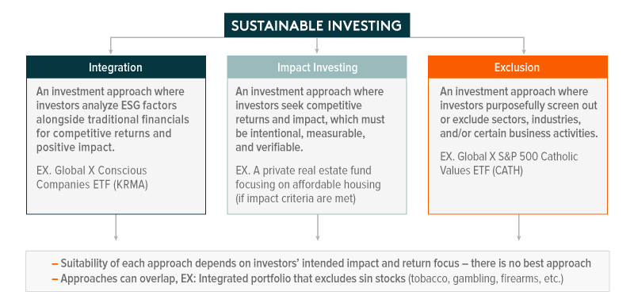

## Table of Contents

## What is sin investing?

Sin investing is when people put their money into companies that make things some people think are bad, like alcohol, tobacco, gambling, and weapons. These are called "sin stocks" because they are linked to activities that can be harmful or go against some people's beliefs.

Even though these activities are seen as bad by some, the companies that make these products can still make a lot of money. This means their stocks can grow and give good returns to investors. So, some people choose to invest in these companies because they want to make more money, even if they don't agree with what the companies do.

## What are the common sectors considered in sin investing?

Sin investing includes putting money into businesses that some people think are not good. The most common areas for sin investing are alcohol, tobacco, gambling, and weapons. These are called "sin stocks" because they are connected to things that can hurt people or go against what some believe is right.

Even though these activities might be seen as bad, the companies that make these products can still make a lot of money. This means their stocks can do well and give good returns to people who invest in them. So, some people choose to invest in these companies to make more money, even if they don't agree with what the companies do.

Sometimes, other areas like adult entertainment and cannabis can also be part of sin investing. These areas are also seen as controversial by some people. But like the other sin stocks, they can still be profitable, which is why some investors are interested in them.

## How does sin investing differ from ethical or socially responsible investing?

Sin investing and ethical or socially responsible investing are two very different ways to put your money into companies. Sin investing is when people choose to invest in companies that make things like alcohol, tobacco, gambling, and weapons. These are called "sin stocks" because they are linked to activities that some people think are bad or harmful. Even though these activities might be seen as wrong, the companies can still make a lot of money, so their stocks can grow and give good returns to investors. People who do sin investing might not agree with what these companies do, but they want to make more money.

On the other hand, ethical or socially responsible investing is when people choose to invest in companies that do good things for the world. These investors look for companies that care about the environment, treat their workers well, and help the community. They avoid companies that harm people or the planet. The goal of ethical investing is to make money while also making the world a better place. So, while sin investing focuses on making money from controversial activities, ethical investing focuses on supporting good causes and making a positive impact.

## What are the potential financial benefits of sin investing?

Sin investing can offer good financial benefits because the companies involved often make a lot of money. People always want things like alcohol, tobacco, and gambling, so these companies can have steady sales and profits. This means their stocks can grow and give investors good returns. Even when the economy is not doing well, people might still spend money on these things, which can make sin stocks more stable than other investments.

Also, sin stocks can be less affected by what people think is right or wrong. Some investors might not care about the moral side of these companies and just want to make money. Because fewer people might want to invest in these companies for ethical reasons, there can be fewer investors, which might mean the stock prices stay lower than they could be. This can create a chance for investors to buy these stocks at a lower price and then sell them later for a profit.

## What are the ethical considerations and controversies surrounding sin investing?

Sin investing brings up big ethical questions because it means putting money into companies that make things like alcohol, tobacco, gambling, and weapons. These things can hurt people and go against what some people believe is right. So, people who care about ethics might not want to invest in these companies, even if they could make a lot of money. They think it's more important to do what's right than to make more money.

There are also arguments about whether sin investing is good or bad for society. Some people say that by investing in these companies, you're helping them grow and keep doing harmful things. On the other hand, others say that these companies will keep making their products no matter what, so it's better to invest and make money from them. This way, at least the investors can use that money to do good things. But this still doesn't solve the problem of whether it's right to profit from harm.

The controversy around sin investing also touches on the idea of personal responsibility. Some investors believe they should not be judged for their investment choices because everyone has different values and needs. They might need the money from sin stocks to take care of their families or support other causes. But critics argue that investing in harmful industries makes you part of the problem, no matter why you do it. This debate shows how hard it can be to balance making money with doing what's right.

## How can sin stocks be identified and evaluated for investment?

To find sin stocks, you can look at companies that make things like alcohol, tobacco, gambling, and weapons. These are the main areas where sin stocks come from. You can use websites and tools that help you find stocks in these industries. Sometimes, other areas like adult entertainment and cannabis are also counted as sin stocks. You can check financial news and reports to see which companies are doing well in these areas.

Once you find these companies, you need to see if they are good investments. Look at their financial reports to see how much money they are making and if they are growing. You can also check if their stock prices are going up or down. It's important to think about how stable their business is. Even if some people don't like what these companies do, they can still be good investments if they make a lot of money. You might also want to see what other investors think about these stocks and if there are any risks you should know about.

## What are the risks associated with investing in sin stocks?

Investing in sin stocks can be risky because these companies make things like alcohol, tobacco, gambling, and weapons. These products can be harmful, so governments might make new laws to control them. If that happens, it could hurt the companies and make their stocks lose value. Also, if people start to care more about being healthy or doing the right thing, they might buy less of these products. This would mean less money for the companies, which could make their stock prices go down.

Another risk is that sin stocks can be affected by what people think is right or wrong. Some investors might not want to put their money into these companies because they think it's not ethical. This can make fewer people want to buy the stocks, which might keep the prices lower than they could be. But if more people decide it's okay to invest in these companies, the stock prices could go up quickly. So, the way people feel about sin stocks can make them go up and down a lot, which is risky for investors.

## How can sin investing be integrated into a diversified investment portfolio?

Sin investing can be part of a diversified investment portfolio by adding stocks from companies that make things like alcohol, tobacco, gambling, and weapons. These sin stocks can help spread out the risk in your portfolio because they might do well even when other parts of the economy are not doing so great. People often keep buying these products no matter what, so the companies can have steady sales and profits. By including sin stocks, you can balance out the ups and downs of other investments and maybe make more money overall.

But it's important to think about how much of your portfolio should be in sin stocks. You don't want to put all your money into just one type of investment because that can be risky. A good idea is to mix sin stocks with other kinds of stocks, like those from companies that help the environment or treat their workers well. This way, you can still make money from sin stocks while also supporting companies that do good things. Balancing your investments like this can help you feel better about your choices and keep your money safer.

## What are some examples of successful sin investments in recent years?

In recent years, some sin stocks have done really well. For example, companies that make alcohol, like Diageo, have seen their stocks go up a lot. Diageo makes popular drinks like Johnnie Walker and Guinness. Even when the economy is not doing great, people still want to buy these drinks, so the company keeps making money. This makes their stock a good choice for investors looking to make money from sin stocks.

Another example is the gambling industry. Companies like Las Vegas Sands, which runs big casinos, have also seen their stocks grow. Even with ups and downs, people still love to gamble, so these companies can make a lot of money. This makes their stocks attractive to investors who are okay with the risks that come with sin investing.

## How do regulatory changes impact sin investing strategies?

Regulatory changes can really shake up sin investing strategies. When governments make new rules about things like alcohol, tobacco, gambling, or weapons, it can change how much money these companies make. For example, if a new law makes it harder to sell cigarettes, tobacco companies might lose money. This can make their stock prices go down, which is bad for investors. So, people who invest in sin stocks need to keep an eye on what the government is doing and be ready to change their plans if new rules come out.

Even though regulatory changes can be risky, they can also create new chances for investors. Sometimes, a company might find a way to make more money even with new rules. For example, if a new law makes people buy less of one product, the company might start selling something else that's still okay to sell. This can help the company keep making money, and their stock might still be a good investment. So, while sin investors need to be careful about new rules, they can also look for ways to make money from the changes.

## What are advanced strategies for managing a sin investment portfolio?

Managing a sin investment portfolio well means you need to keep an eye on what's happening in the world and how it might affect the companies you've invested in. Since sin stocks are in industries like alcohol, tobacco, gambling, and weapons, you need to watch out for new laws or rules that could change how much money these companies make. For example, if a new law makes it harder to sell cigarettes, tobacco companies might lose money, and their stock prices could go down. So, you should always be ready to change your investments if you see new rules coming. Also, it's a good idea to spread your money across different sin stocks so that if one company does badly, you still have other investments that might do well.

Another important thing is to look at how the companies are doing over time. You can check their financial reports to see if they are making more money and growing. Sometimes, even if people don't like what these companies do, they can still be good investments if they are making a lot of money. You might also want to use tools and websites that help you find out which sin stocks are doing well and which ones might be risky. By keeping track of all this information, you can make smarter choices about when to buy or sell your sin stocks. This way, you can try to make more money while also managing the risks that come with sin investing.

## How can performance of sin investments be measured and compared to other investment types?

To measure the performance of sin investments, you can look at how much money the companies are making and how their stock prices are changing over time. You can check their financial reports to see if they are growing and making more profits. Another way is to compare the returns of sin stocks to a general stock market index, like the S&P 500. If sin stocks are doing better than the index, they might be a good investment. You can also use tools and websites that track stock performance to see how sin stocks are doing compared to other types of investments.

When comparing sin investments to other investment types, you need to think about things like risk and how steady the returns are. Sin stocks can be less affected by what's happening in the economy because people often keep buying things like alcohol and tobacco no matter what. This can make sin stocks more stable than other investments. But they also come with risks, like new laws that could hurt the companies. Other investments, like ethical or socially responsible stocks, might not make as much money but could be seen as safer because they are less likely to be affected by new rules. So, when you're deciding between sin investments and other types, you need to weigh the potential for higher returns against the risks and how well they fit with your values.

## References & Further Reading

[1]: Hawley, J. P., Johnson, K. L., & Waitzer, E. J. (2014). ["Reclaiming Fiduciary Duty Balance."](https://iri.hks.harvard.edu/files/iri/files/reclaiming-fiduciary-duty-balance.pdf) Springer.

[2]: Ahrens, D. (2004). ["Investing in Vice: The Recession-Proof Portfolio of Booze, Bets, Bombs, and Butts."](https://archive.org/details/investinginvicer0000ahre) St. Martin's Press.

[3]: Chan, E. (2009). ["Algorithmic Trading: Winning Strategies and Their Rationale."](https://github.com/ftvision/quant_trading_echan_book) Wiley.

[4]: Friede, G., Busch, T., & Bassen, A. (2015). ["ESG and financial performance: aggregated evidence from more than 2000 empirical studies."](https://www.tandfonline.com/doi/full/10.1080/20430795.2015.1118917) Journal of Sustainable Finance & Investment, 5(4), 210-233.

[5]: Rudd, A. (1981). ["Social responsibility and portfolio performance."](https://journals.sagepub.com/doi/10.2307/41164931) California Management Review, 23(4), 55-61.

[6]: Global Sustainable Investment Alliance. (2020). ["Global Sustainable Investment Review 2020."](http://www.gsi-alliance.org/wp-content/uploads/2021/08/GSIR-20201.pdf) 

[7]: López de Prado, M. (2018). ["Advances in Financial Machine Learning."](https://www.amazon.com/Advances-Financial-Machine-Learning-Marcos/dp/1119482089) Wiley.

[8]: Tang, Y. N., & Zhang, Y. (2017). ["Strategy diversification in most-liquid and least-liquid hedge fund strategies: An approach based on overlapping portfolio."](https://www.sciencedirect.com/science/article/pii/S2468519424004713) European Actuarial Journal, 7(1), 151-184.

[9]: Jansen, S. (2018). ["Machine Learning for Algorithmic Trading."](https://searchworks.stanford.edu/view/13246850) Packt Publishing.