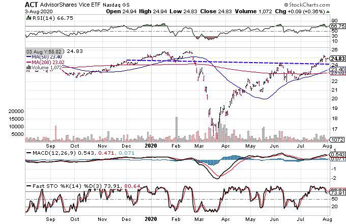

Ethical investing has become increasingly popular as investors aim to align their financial activities with their personal values. This practice involves allocating capital to companies and sectors that demonstrate a commitment to positive social, environmental, and governance practices. Ethical investing is often synonymous with socially responsible investing (SRI) and is guided by Environmental, Social, and Governance (ESG) criteria. Investors focusing on these areas tend to channel funds into sectors such as renewable energy, healthcare, and education, while consciously avoiding industries considered harmful to society or the environment.

In contrast, sin stocks represent companies operating in industries often deemed unethical by certain societal standards. These typically include sectors such as tobacco, alcohol, gambling, and firearms. Despite the social stigma attached to these industries, sin stocks frequently attract investors due to their consistent performance and high dividends. The success of sin stocks can be attributed to factors such as inelastic demand and robust market barriers that protect these industries from new competitors, ensuring a steady flow of revenue and profitability.

In today's financial markets, ethical investing and sin stocks coexist, reflecting the diverse values and priorities of global investors. This duality presents a unique landscape where traditional investment wisdom intersects with modern ethical considerations. These opposing investment strategies highlight the complexities involved in balancing personal values with financial goals. Factors such as individual risk tolerance, regulatory environments, and regional societal norms further contribute to the dynamics of investing in socially responsible stocks versus sin stocks.

Algorithmic trading, the use of sophisticated computer algorithms to execute trades, adds yet another layer to this investment landscape. These algorithms optimize trading strategies based on predefined criteria and can be adapted for both ethical and sin stocks. Through rapid trade execution and data analysis, algorithmic trading impacts market movements and can influence the performance of both investment styles. This emerging technology poses both opportunities and challenges as investors strive to combine ethical considerations and financial gains.

As this article will demonstrate, understanding the nuances of ethical investing, sin stocks, and algorithmic trading is crucial for investors navigating today's complex markets. By grasping these intricacies, investors can make more informed decisions, balancing their personal values with their financial aspirations in the ever-evolving investment landscape.

## Table of Contents

## Understanding Ethical Investing

Ethical investing involves the selection of stocks that aim to achieve positive social, environmental, and governance outcomes. This investment approach is designed to align financial choices with individual or collective values, supporting businesses that contribute positively to the world while avoiding those perceived as harmful. Two primary methodologies at the heart of ethical investing are Socially Responsible Investing (SRI) and the application of Environmental, Social, and Governance (ESG) criteria. Both frameworks serve as guidelines for investors seeking to integrate ethical considerations into their investment decisions. 

Socially Responsible Investing focuses on the broader ethical ideals of investors, often aligning with moral or religious principles. It emphasizes capital allocation to industries that foster well-being and sustainability, such as renewable energy, healthcare, and education. SRI goes beyond mere avoidance of certain sectors, advocating for proactive engagement with companies that adhere to, and promote, values enhancing societal welfare. [1]

[ESG](/wiki/esg-investing) criteria, on the other hand, provide a structured way to gauge a company's operations across three dimensions: environmental impact, social responsibility, and governance practices. These criteria offer measurable parameters for evaluating the ethical implications of investing in specific stocks or businesses. Companies score higher on ESG when they exhibit a reduced carbon footprint, commitment to diversity and inclusion, and strong corporate governance. This systematic evaluation aids investors in making informed choices that reflect their commitment to sustainable and principled investing.

The demand for ethical investment options has been growing, evidenced by the notable rise of ESG funds within the financial sector. This increase is driven by an expanding consumer base that prioritizes sustainability and social responsibility, along with an awareness of potential financial risks associated with unethical practices, such as regulatory fines and reputational damage. Such funds often outperform traditional investments due to a strong emphasis on risk management and forward-thinking strategies.

Despite the flourishing interest in ethical investments, investors face significant challenges. Balancing profit motives with ethical standards is a complex endeavor, as ethical stocks may not always yield the highest returns in the short term. Moreover, what constitutes 'ethical' can vary greatly among cultures and individuals, leading to conflicting opinions on investment eligibility. These divergent definitions necessitate a personalized approach in portfolio construction to accommodate different ethical perspectives.

In conclusion, ethical investing provides a pathway for investors to reflect their values through financial markets. By implementing SRI and ESG frameworks, investors can align their portfolios with goals that extend beyond profit, contributing positively to society and the environment. However, ongoing challenges such as profitability balance and ethical definitions require careful consideration. Understanding and adapting to these dynamics enables investors to make informed decisions that resonate with their ethical convictions.

References:

[1] "Socially Responsible Investing and SRI Funds in a Nutshell." The Balance. (https://www.thebalance.com/socially-responsible-investing-4173835)

## Defining Sin Stocks

Sin stocks are equities of companies engaged in industries that some investors deem unethical, such as tobacco, alcohol, gambling, and firearms. These industries are often criticized for their negative social and health impacts. However, the financial performance of sin stocks frequently challenges these perceptions. The resilience of sin stocks can be attributed in part to the inelastic demand for their products. Consumers tend to purchase these goods regardless of economic conditions, which can stabilize the revenue streams of these companies. Additionally, high barriers to entry, such as regulatory requirements and significant capital investments, limit competition and protect market share, potentially leading to strong financial performance.

Societal and regional perceptions of sin stocks can vary substantially, influenced by cultural norms and legal frameworks. For example, a company producing alcohol might be viewed negatively in one society due to religious beliefs, while being completely acceptable in another where alcohol is a significant cultural component. This geographic variability adds a layer of complexity for investors considering sin stocks in global markets.

From a financial perspective, sin stocks have a history of delivering robust returns and dividends, attracting investors interested in steady income and capital appreciation. This attractiveness persists despite social disapproval, as evidenced by studies showing that sin stocks often outperform the general market. For instance, a study by Hong and Kacperczyk (2009) found that sin stocks generated higher expected returns compared to their non-sin counterparts. This outperformance is sometimes attributed to the "neglect effect," suggesting that because sin stocks are shunned by some investors, they are less efficiently priced, creating opportunities for higher returns.

However, investing in sin stocks comes with its own set of challenges. Regulatory risks are prominent as governments might impose stricter laws or higher taxes on these industries, directly affecting profitability and stock valuation. For example, increased tobacco taxes can lead to higher prices, potentially reducing consumption and revenues. Sin stocks also [carry](/wiki/carry-trading) social stigma, which can impact public perception and investor sentiment, leading to [volatility](/wiki/volatility-trading-strategies).

These dynamics underscore the complexities involved in investing in sin stocks, where potential financial gains must be balanced against ethical considerations and regulatory uncertainties.

## Algorithmic Trading in Ethical and Sin Stocks

Algorithmic trading employs sophisticated computer algorithms to automate the buying and selling of stocks based on pre-set guidelines. This method is prevalent in both ethical and sin stock markets due to its ability to enhance trade execution by leveraging speed, efficiency, and precision, thereby achieving specific investment objectives.

One of the key benefits of [algorithmic trading](/wiki/algorithmic-trading) is its versatility in catering to various investment strategies, whether they emphasize socially responsible investing (SRI) or target sin stocks. For ethical investing, algorithms can be designed to screen and select stocks that meet Environmental, Social, and Governance (ESG) criteria. By systematically analyzing large datasets and applying these criteria, algorithms can quickly identify companies that align with investors' ethical standards.

Conversely, algorithms can also be programmed to seek out undervalued sin stocks, which typically operate in sectors like tobacco, alcohol, and gambling. These sectors often exhibit unique market behaviors such as inelastic demand and high barriers to entry, which can be well-captured and exploited using algorithmic trading strategies.

The rapid execution capability of algorithmic trading not only optimizes trade efficiency but can also magnify market fluctuations. When large volumes of trades are executed almost instantaneously, it can lead to swift price movements in both ethical and sin stock portfolios. This feature makes it imperative for traders to meticulously program and monitor their algorithms to minimize the impact of unintended market volatility.

However, the use of algorithmic trading is not without its challenges. For ethical investors, ensuring that trading algorithms faithfully adhere to ethical standards can be complex, especially when ethical definitions can vary. Additionally, algorithms must be robust enough to accurately evaluate market risks and react appropriately. Failure to do so may result in considerable financial losses or reputational harm, particularly if the algorithm inadvertently invests in stocks or industries contrary to the investor’s values.

Overall, algorithmic trading adds a technological dimension to stock trading by facilitating sophisticated market analysis and enhancing decision-making processes. However, the integration of ethical considerations poses unique challenges that must be addressed to fully leverage the benefits of this approach in both socially responsible and sin stock trading contexts.

## Investing Dilemmas and Opportunities

Ethical investing often requires individuals to forego the potential profits associated with high-performing sin stocks, instead opting for socially responsible alternatives. Sin stocks, which include industries such as tobacco, alcohol, gambling, and firearms, traditionally present compelling financial opportunities due to their high demand, inelasticity, and substantial dividends. The financial performance of sin stocks often clashes with ethical considerations, leading investors to face a dilemma between profit and principles.

Algorithmic trading offers a significant advantage by optimizing investment strategies across both ethical and sin stock portfolios. Through the use of sophisticated computational algorithms, trading can be automated to maximize returns while adhering to specified ethical or financial objectives. This approach enables investors to better navigate the complexities of these investing styles. For instance, algorithms can be tailored to screen for stocks that meet certain ESG criteria or to detect undervalued opportunities within the sin stock sector. The efficiency and speed associated with algorithmic trading have the potential to amplify market dynamics, impacting both ethical and sin stock valuations.

Investors are tasked with balancing personal values against financial goals, assessing risks and potential returns inherent in each strategy. This balance requires a nuanced understanding of both market conditions and personal ethical boundaries. For example, an investor might calculate the expected return $R$ of a portfolio using the formula:

$$
R = \sum_{i=1}^{n} w_i \cdot r_i
$$

where $w_i$ is the weight of the $i$-th asset in the portfolio and $r_i$ is the expected return of the $i$-th asset. The challenge lies in selecting $w_i$ values that reflect both financial and ethical considerations.

The shifting consumer sentiment toward ethical and sin stocks could potentially redefine the investment landscape. As societal values evolve, demand for ethically aligned investments may increase, possibly altering the profitability landscape of sin stocks. This evolution presents uncertainties and opportunities for investors aiming to align their portfolios with changing market and societal dynamics. Investors need to remain vigilant and adaptable to capture emerging opportunities while managing ethical considerations and financial targets.

## Conclusion

As investment landscapes evolve, both ethical investing and sin stocks continue to play significant roles. Investors face complex decisions, requiring an understanding of each approach to create informed portfolio choices. Ethical investing prioritizes social and environmental values, often adhering to ESG criteria, while sin stocks cater to sectors traditionally viewed as controversial, such as tobacco and gambling. Each approach presents unique opportunities and challenges, influenced by market dynamics and societal perspectives.

Algorithmic trading adds a new dimension to these investment strategies. By leveraging computer algorithms, investors can efficiently manage portfolios aligned with ethical standards or optimize returns from sin stocks. Algorithms offer precision and speed, enhancing the ability to screen stocks or react to market changes. However, ensuring algorithms align with ethical standards and accurately assess risks remains a challenge.

Investors must weigh ethical considerations against potential financial gains, taking into account individual risk tolerance and investment goals. The interplay between ethical values and financial returns underscores the nuanced nature of investment decisions. While ethical investing may involve sacrificing higher returns from sin stocks, it aligns portfolios with personal or societal values. Conversely, sin stocks may offer substantial financial gains but pose ethical dilemmas.

As the debate continues, opportunities and challenges persist in navigating ethical versus sin-based investment practices. Economic conditions, regulatory changes, and shifting consumer sentiments will influence investor strategies, potentially redefining traditional views. By understanding the nuances of ethical investing and sin stocks and incorporating technological advancements like algorithmic trading, investors can navigate this evolving landscape, balancing personal values with financial objectives for sustainable portfolio development.

## References & Further Reading

[1]: Hong, H., & Kacperczyk, M. (2009). ["The Price of Sin: The Effects of Social Norms on Markets."](https://www.sciencedirect.com/science/article/abs/pii/S0304405X09000634) The Review of Financial Studies, 22(11), 4419-4460.

[2]: Geczy, C., Stambaugh, R. F., & Levin, D. (2005). ["Investing in socially responsible mutual funds."](https://papers.ssrn.com/sol3/papers.cfm?abstract_id=416380) SSRN Electronic Journal.

[3]: Friede, G., Busch, T., & Bassen, A. (2015). ["ESG and financial performance: aggregated evidence from more than 2000 empirical studies."](https://www.tandfonline.com/doi/full/10.1080/20430795.2015.1118917) Journal of Sustainable Finance & Investment, 5(4), 210-233.

[4]: Statman, M., & Glushkov, D. (2009). ["The wages of social responsibility."](https://www.jstor.org/stable/40390194) Financial Analysts Journal, 65(4), 33-46.

[5]: Ben-David, I., & Roulstone, D. (2010). ["Socially responsible investing and sin stocks: A protest against controversial firms or a feel-good look-good act?"](https://www.jstor.org/stable/26966427) American Economic Journal: Applied Economics, 2(2), 1-15.