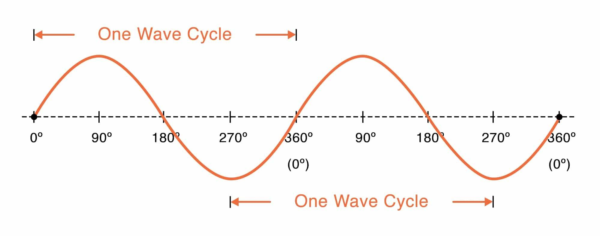

## Table of Contents

## What is a sine wave?

A sine wave is a smooth, repeating curve that looks like a gentle wave. It's a type of wave that you can see in many places, like in sound, light, and electricity. Imagine throwing a stone into a pond and watching the ripples spread out. Those ripples are a lot like sine waves. The wave goes up and down smoothly, and it keeps repeating the same pattern over and over.

In math and science, sine waves are important because they help us understand how things move and change in a regular way. They are described by a simple formula that shows how the wave's height changes over time. This formula uses the sine function, which is why it's called a sine wave. You can find sine waves in music, where they make pure tones, and in electronics, where they help carry signals in radios and TVs.

## How is a sine wave mathematically defined?

A sine wave is mathematically defined by the sine function, which is part of trigonometry. The basic equation for a sine wave is y = sin(x), where 'x' represents the angle in radians, and 'y' is the height of the wave at that point. The sine function tells us how high or low the wave is at any given point along the x-axis. The wave starts at zero, goes up to a peak of 1, then comes back down through zero to a trough of -1, and then rises back to zero again, repeating this pattern forever.

To make the sine wave more flexible, we can add a few more parts to the equation. The general form of a sine wave is y = A * sin(Bx + C) + D. Here, 'A' is the amplitude, which controls how high and low the wave goes. 'B' affects the period, or how quickly the wave repeats. 'C' is the phase shift, which moves the wave left or right along the x-axis. And 'D' is the vertical shift, which moves the whole wave up or down. By changing these values, you can make the sine wave bigger, smaller, faster, slower, or shift it around as needed.

## What are the basic properties of a sine wave?

A sine wave is a smooth, repeating wave that goes up and down in a regular pattern. It starts at zero, rises to a peak, falls back to zero, drops to a trough, and then rises back to zero again. This cycle repeats over and over. The highest point of the wave is called the peak, and the lowest point is called the trough. The distance from the peak to the trough is called the amplitude. The amplitude tells us how big the wave is.

Another important part of a sine wave is its period. The period is the distance it takes for the wave to complete one full cycle, from one peak to the next peak, or from one trough to the next trough. If you know the period, you can figure out how fast the wave is moving. The wave also has a frequency, which is the number of cycles it completes in one second. The frequency and the period are related; if the period is short, the frequency is high, and if the period is long, the frequency is low.

## What are some common real-world examples of sine waves?

Sine waves are all around us, and they show up in many everyday things. One common place to see a sine wave is in sound. When you play a musical note on an instrument, like a guitar or a piano, the sound wave that comes out looks a lot like a sine wave. These waves make the air move in a smooth, up-and-down pattern, which our ears pick up as sound. You can see these waves on a screen if you use a special tool called an oscilloscope, which shows the shape of sound waves.

Another place where sine waves are important is in electricity. If you look at the power coming out of a wall socket, it's in the form of a sine wave. This is called alternating current (AC), and it's how electricity moves back and forth in a smooth, repeating pattern. This type of power is used in homes and buildings to run lights, appliances, and other devices. Engineers use sine waves to make sure the electricity works well and safely.

Sine waves also appear in nature, like in the way ocean waves move. When you watch the ocean, you might see waves coming in and out on the shore in a smooth, repeating pattern. These waves can be thought of as sine waves because they go up and down in a regular way. This pattern helps scientists study how waves move and how they affect the shore.

## How are sine waves used in music and sound?

Sine waves are super important in music and sound because they make the purest kind of sound you can hear. When you play a musical note on an instrument like a guitar or a piano, the sound wave that comes out is a lot like a sine wave. It's smooth and goes up and down in a regular pattern. This smooth wave makes a clear, single tone that sounds nice to our ears. If you use a special tool called an oscilloscope, you can see these waves on a screen. They help musicians and sound engineers make sure the sound is just right.

In music, sine waves are the building blocks of all sounds. Every note you hear is made up of a main sine wave, called the fundamental frequency, and other smaller waves, called harmonics, that make the sound richer and more interesting. For example, when you hear a violin, it's not just one sine wave but a mix of many, each adding to the overall sound. Sound engineers use sine waves to mix and change the sounds they record, making music sound better on the radio or in movies. By understanding sine waves, they can make sure the music sounds clear and full.

## What role do sine waves play in electrical engineering?

In electrical engineering, sine waves are really important because they help us understand how electricity moves. Most of the electricity we use in our homes and buildings is called alternating current (AC), and it comes out of the wall socket in the shape of a sine wave. This means the electricity goes back and forth in a smooth, repeating pattern. Engineers use sine waves to make sure the electricity works well and safely. They can measure how strong the electricity is by looking at the amplitude of the sine wave, and they can figure out how fast it's moving by looking at its frequency.

Sine waves also help engineers design and fix things like power grids and electronic devices. When engineers are working on a new machine or trying to fix a problem, they use tools like oscilloscopes to see the sine waves and check if everything is working right. If the sine wave looks different from what it should, it can tell them that there's a problem. By understanding sine waves, engineers can make sure that the electricity in our homes and devices is safe and reliable.

## How are sine waves applied in physics, particularly in wave mechanics?

In physics, sine waves are super important for understanding how waves move and behave. Waves are all around us, like in sound, light, and even the ripples on a pond. When scientists study these waves, they often use sine waves to describe them because sine waves are simple and regular. They go up and down in a smooth, repeating pattern. This helps scientists predict how a wave will move and change over time. For example, when you throw a stone into a pond, the ripples that spread out can be thought of as sine waves. By studying these waves, scientists can learn about how energy moves through different materials.

Sine waves also help us understand more complicated waves. In wave mechanics, scientists often break down complex waves into smaller parts called Fourier series. This means they take a big, messy wave and split it into a bunch of smaller sine waves. Each sine wave adds a little bit to the overall shape of the big wave. This helps scientists understand how different parts of a wave work together. For example, when you hear a musical note, it's not just one simple sine wave but a mix of many sine waves at different frequencies. By studying these sine waves, scientists can figure out how sound travels and how it can be changed or controlled.

## What is the historical origin of the sine function?

The sine function has a long history that goes back to ancient times. It started in ancient India, where mathematicians were trying to figure out the lengths of the sides of triangles. Around the 5th century, an Indian mathematician named Aryabhata came up with something called the "jya-ardha," which means "half-chord." This was a way to measure the length of a half-chord in a circle, which is similar to what we now call the sine of an angle. Later, another Indian mathematician named Varahamihira used the term "jiva," which also meant "chord." These early ideas about chords and half-chords were the beginnings of the sine function.

The idea of the sine function then spread to the Arab world. In the 8th century, an Arab mathematician named Muhammad ibn Musa al-Khwarizmi translated the Indian term "jiva" into Arabic as "jayb." When this word was later translated into Latin, it was mistakenly thought to mean "sinus," which means "bay" or "curve" in Latin. This is where we get the word "sine" from. Over time, European mathematicians like Leonhard Euler in the 18th century developed the sine function into the form we use today, with the familiar equation y = sin(x). So, the sine function has a rich history that started in ancient India and grew over many centuries through the work of mathematicians around the world.

## How have sine waves influenced the development of modern technology?

Sine waves have played a big role in the development of modern technology, especially in how we use electricity and sound. In the world of electricity, sine waves are the shape of the power that comes out of our wall sockets. This power, called alternating current (AC), moves in a smooth, repeating pattern that's safe and easy to use. Engineers use sine waves to make sure the electricity in our homes and devices works well. Without sine waves, it would be much harder to design and fix things like power grids and electronic devices.

Sine waves are also important in sound technology. They help us understand and create the sounds we hear every day. In music, sine waves are the building blocks of all sounds. When we play a musical note, it's made up of a main sine wave and other smaller waves that make the sound richer. Sound engineers use sine waves to mix and change the sounds they record, making music sound clear and full on the radio or in movies. Without sine waves, it would be much harder to work with sound and make the music and movies we enjoy.

## What advanced mathematical techniques are used to analyze sine waves?

Advanced math helps us understand sine waves better. One way is by using something called Fourier analysis. This technique breaks down a complicated wave into a bunch of simple sine waves. It's like taking a big puzzle and figuring out all the small pieces that make it up. By doing this, scientists can see how different parts of a wave work together. They can also find out the main frequency of the wave, which tells them how fast it's moving. This is really useful in fields like sound engineering and signal processing, where understanding the details of a wave is important.

Another technique is called the Laplace transform. This is a bit more complicated, but it helps us solve problems with sine waves that change over time. The Laplace transform changes a problem from the time world to the frequency world, making it easier to solve. It's like looking at a problem from a different angle. Engineers use this to study how electrical circuits work, especially when they have sine waves moving through them. By using the Laplace transform, they can predict how the circuit will behave and make sure it works the way they want it to.

## How do sine waves contribute to signal processing and telecommunications?

Sine waves are really important in signal processing and telecommunications because they help us send and receive information. In telecommunications, like when you make a phone call or use the internet, the information is sent as waves. These waves are often sine waves because they are smooth and regular, which makes them good for carrying signals without losing information. Engineers use sine waves to make sure the signals stay strong and clear as they travel from one place to another. For example, when you talk on the phone, your voice is turned into a sine wave and sent over the phone lines or through the air. If the sine wave stays the same, your voice will sound clear on the other end.

In signal processing, sine waves help us understand and change the signals we work with. Engineers use something called Fourier analysis to break down a complex signal into lots of simple sine waves. This helps them see what's inside the signal and make it better. For example, if there's noise in the signal, they can use sine waves to take it out and make the signal clearer. Sine waves also help in filtering, where engineers use them to keep the important parts of a signal and get rid of the parts they don't want. This is important in things like radio and TV, where sine waves help make sure the sound and pictures are clear and easy to understand.

## What are the current research areas involving sine waves and their applications?

Sine waves are still a big part of new research, especially in the field of signal processing. Scientists are working on better ways to use sine waves to clean up signals and make them clearer. They use something called machine learning to help with this. Machine learning is a type of computer program that can learn and get better over time. By using machine learning, scientists can find and remove noise from signals more easily. This is important for things like hearing aids, where sine waves help make sounds clearer for people who have trouble hearing.

Another area where sine waves are being studied is in quantum physics. Scientists are using sine waves to understand how tiny particles, like atoms and electrons, move and behave. In quantum physics, everything is a bit weird and different from what we see in everyday life. Sine waves help scientists make sense of this weird world. They use sine waves to study things like quantum computers, which are super fast and powerful. By understanding how sine waves work in quantum physics, scientists can make better quantum computers and other cool technologies.

## What are the applications of sine waves in algorithmic trading?

Sine waves find a significant application in algorithmic trading, primarily because they model market cycles and trends effectively. Market behaviors often exhibit periodic characteristics, and sine waves are adept at capturing these patterns, enabling traders to identify potential trading opportunities.

Technical indicators in algorithmic trading frequently use sine wave functions to assist in predicting market movements. One such example is the use of cosine and sine oscillators, which help in identifying overbought or oversold conditions in the market. These oscillators are mathematically defined functions that can represent the cyclical nature of asset prices. For instance, the sine oscillator function can be expressed as:

$$
S(t) = \sin(2\pi ft + \phi)
$$

where $S(t)$ is the sine wave value at time $t$, $f$ is the frequency, and $\phi$ is the phase of the oscillator. These functions generate signals that traders use to make decisions about entering or exiting trades, relying on the cyclical patterns modeled by sine and cosine functions.

Historically, several case studies highlight the success of sine wave-based models in predicting market movements. These models have been particularly effective in markets known to exhibit clear cycles, such as commodities and currencies, where seasonal factors influence price trends. By adjusting the amplitude and frequency of the sine wave functions, traders can effectively align the model with the observed market cycles.

Fourier transforms play a crucial role in the conversion of market signals into sine wave components, which allows for refined analysis. The Fourier transform decomposes complex market signals into simpler sinusoidal components, making it easier to study the frequencies and amplitudes associated with these components. In Python, this transformation can be executed using libraries like NumPy:

```python
import numpy as np

# Assuming signal is a time-series market signal
signal = np.array([...])
fourier_transform = np.fft.fft(signal)
```

The Fourier transform is instrumental in isolating dominant frequencies within market data, enabling traders to focus on specific cyclical patterns that may signal buying or selling opportunities. By reconstructing the signal from its frequency components, traders can obtain a clearer understanding of the underlying cyclical trends within the market data, which can significantly enhance predictive accuracy and trading success.

## References & Further Reading

[1]: ["Advances in Financial Machine Learning"](https://www.amazon.com/Advances-Financial-Machine-Learning-Marcos/dp/1119482089) by Marcos Lopez de Prado

[2]: ["Evidence-Based Technical Analysis: Applying the Scientific Method and Statistical Inference to Trading Signals"](https://www.amazon.com/Evidence-Based-Technical-Analysis-Scientific-Statistical/dp/0470008741) by David Aronson

[3]: ["Machine Learning for Algorithmic Trading"](https://github.com/PacktPublishing/Machine-Learning-for-Algorithmic-Trading-Second-Edition) by Stefan Jansen

[4]: ["Quantitative Trading: How to Build Your Own Algorithmic Trading Business"](https://www.amazon.com/Quantitative-Trading-Build-Algorithmic-Business/dp/1119800064) by Ernest P. Chan

[5]: Bergstra, J., Bardenet, R., Bengio, Y., & Kégl, B. (2011). ["Algorithms for Hyper-Parameter Optimization."](https://dl.acm.org/doi/10.5555/2986459.2986743) Advances in Neural Information Processing Systems 24.