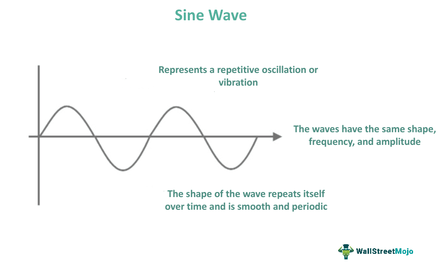

Sine waves, fundamental to trigonometry, are smooth, periodic oscillations characterized by their repetitive form. Mathematically represented as $y = A \sin(Bx + C) + D$, where $A$ stands for amplitude, $B$ determines the frequency which influences the number of cycles within a unit interval, $C$ modifies the phase, and $D$ alters the vertical displacement. The sinusoidal pattern of a sine wave makes it an essential tool in modeling periodic phenomena.

Sine waves play a critical role in various fields, notably in physics and engineering. In physics, they describe phenomena such as the propagation of sound and light waves, evident in the representation of alternating current (AC) where electrical signals alternate sinusoidally over time. Engineers leverage sine wave applications for signal processing, ensuring the accurate transmission of data across communication systems due to their predictable oscillatory nature.



Algorithmic trading, a cornerstone of modern financial markets, relies heavily on mathematical models to automate and optimize trading strategies. This form of trading uses computers to execute predefined trading rules for sending small, rapid orders. It has revolutionized trading, enhancing efficiency and decision-making processes through sophisticated algorithms that utilize pattern recognition and predictive modeling.

This raises an intriguing question: How are sine waves related to algorithmic trading? Given their periodic nature, sine waves naturally lend themselves to modeling cycles and patterns observed within financial markets. As traders and systems aim to identify and exploit cyclical movements and trends, understanding the interplay between sine waves and market cycles becomes pivotal. Exploring this relationship elucidates the utilization and applications of sine waves in algorithmic trading, paving the way for advanced strategies rooted in robust mathematical modeling.

## Table of Contents

## Understanding Sine Waves

Sine waves are a fundamental concept in mathematics and science, characterized by their smooth, periodic oscillations. Mathematically, a sine wave is expressed as $y(t) = A \sin(2\pi ft + \phi)$, where $A$ represents the amplitude, $f$ denotes the frequency, $\phi$ symbolizes the phase, and $t$ is the time variable. 

The amplitude $A$ indicates the peak deviation of the wave from its central axis, essentially measuring the height of the peaks and the depth of the troughs. Frequency $f$, measured in hertz (Hz), describes how many complete cycles the wave undergoes per second. Phase $\phi$ determines the wave's horizontal shift, influencing the wave's starting point in its cycle.

Sine waves naturally occur in numerous physical phenomena. They are prevalent in sound waves, where different frequencies correspond to different pitches. In acoustics, instruments produce sound waves that can often be modeled as combinations of sine waves, a foundational principle in Fourier analysis. Light waves, particularly when considering electromagnetic waves in physics, also exhibit sinusoidal properties. Similarly, electrical currents and alternating current (AC) in circuits are modeled using sine waves, essential for understanding and designing electrical systems.

These intrinsic properties of sine waves make them ideal for modeling periodic phenomena in both natural and engineered systems. Their predictability and uniformity enable precise simulation and analysis of cyclical processes. In engineered systems, for instance, sine waves are used extensively in signal processing to filter, modulate, and synthesize complex waveforms. Their ability to be decomposed into fundamental components through Fourier transforms is pivotal in various applications across communications, audio engineering, and beyond. 

By providing a consistent framework to model oscillations, sine waves play a crucial role in both theoretical and practical applications, underpinning the analysis and engineering of systems that exhibit periodic behavior. Their widespread presence across different domains underscores their versatility and utility in scientific and engineering endeavors.

## Algorithmic Trading: An Overview

Algorithmic trading, often referred to as algo trading, is a method of executing trading orders using automated pre-programmed trading instructions accounting for variables such as time, price, and [volume](/wiki/volume-trading-strategy). This approach leverages computer algorithms to perform high-speed transactions with minimal human intervention, significantly impacting modern financial markets. Algorithmic trading has increased market efficiency, [liquidity](/wiki/liquidity-risk-premium), and transparency while reducing trading costs and the likelihood of human error. It allows for the rapid execution of trades, facilitating strategies that are infeasible via manual trading.

The evolution of [algorithmic trading](/wiki/algorithmic-trading) can be traced back to the advent of electronic trading platforms in the late 20th century. With technological advancements, the capability to process vast amounts of data at high speeds has enabled the proliferation of more sophisticated trading systems. The introduction of direct market access, smart order routing, and co-location services are notable milestones in this evolution, allowing for low-latency trading and the ability to exploit minute price discrepancies in real time.

Central to algorithmic trading is the use of mathematical models and signals. These models are employed to analyze market data and generate trading signals, which indicate when to buy or sell financial instruments. Mathematical models can range from simple moving averages to complex statistical and [machine learning](/wiki/machine-learning) models. They aim to identify profitable trading opportunities by extrapolating patterns and trends in historical data.

Pattern recognition and predictive modeling play pivotal roles in algorithmic trading. Pattern recognition involves identifying and analyzing recurring patterns or cycles in market data, which can suggest future price movements. For instance, algorithms can be programmed to detect technical chart patterns like head-and-shoulders or double tops. Predictive modeling, on the other hand, uses historical data to make forecasts about future market behavior. These models often utilize regression analysis, neural networks, and other machine learning techniques to predict price movements or market trends.

Algorithmic trading systems continuously evolve, with ongoing improvements in data analytics, computational power, and machine learning techniques. These advancements have enabled traders to develop robust algorithms capable of adapting to changing market conditions and leveraging vast, diverse datasets to enhance prediction accuracy. As a result, algorithmic trading remains a critical component of modern financial markets, driving innovation and efficiency.

## Applications of Sine Waves in Algorithmic Trading

Sine waves find a significant application in algorithmic trading, primarily because they model market cycles and trends effectively. Market behaviors often exhibit periodic characteristics, and sine waves are adept at capturing these patterns, enabling traders to identify potential trading opportunities.

Technical indicators in algorithmic trading frequently use sine wave functions to assist in predicting market movements. One such example is the use of cosine and sine oscillators, which help in identifying overbought or oversold conditions in the market. These oscillators are mathematically defined functions that can represent the cyclical nature of asset prices. For instance, the sine oscillator function can be expressed as:

$$
S(t) = \sin(2\pi ft + \phi)
$$

where $S(t)$ is the sine wave value at time $t$, $f$ is the frequency, and $\phi$ is the phase of the oscillator. These functions generate signals that traders use to make decisions about entering or exiting trades, relying on the cyclical patterns modeled by sine and cosine functions.

Historically, several case studies highlight the success of sine wave-based models in predicting market movements. These models have been particularly effective in markets known to exhibit clear cycles, such as commodities and currencies, where seasonal factors influence price trends. By adjusting the amplitude and frequency of the sine wave functions, traders can effectively align the model with the observed market cycles.

Fourier transforms play a crucial role in the conversion of market signals into sine wave components, which allows for refined analysis. The Fourier transform decomposes complex market signals into simpler sinusoidal components, making it easier to study the frequencies and amplitudes associated with these components. In Python, this transformation can be executed using libraries like NumPy:

```python
import numpy as np

# Assuming signal is a time-series market signal
signal = np.array([...])
fourier_transform = np.fft.fft(signal)
```

The Fourier transform is instrumental in isolating dominant frequencies within market data, enabling traders to focus on specific cyclical patterns that may signal buying or selling opportunities. By reconstructing the signal from its frequency components, traders can obtain a clearer understanding of the underlying cyclical trends within the market data, which can significantly enhance predictive accuracy and trading success.

## Why Sine Waves are Effective in Algorithmic Trading

Financial markets often exhibit periodic behavior that can be effectively modeled using sine waves. These periodic patterns arise from various economic cycles, including business cycles, seasonal cycles, and even investor sentiment cycles, which can display a rhythm similar to sine waves. A sine wave's repetitive oscillation pattern mirrors the recurrent nature of these market cycles, making it a valuable tool for modeling market behaviors.

Sine waves also play a crucial role in filtering market noise, which is essential for precise data analysis. Financial market data can be cluttered with random and erratic movements, often referred to as 'noise', obscuring the underlying trends that are crucial for making informed trading decisions. By applying techniques such as Fourier transforms, market data can be decomposed into sine wave components. This decomposition allows analysts to separate the noise from the significant signals, thereby enhancing the clarity of data analysis.

Moreover, the psychological aspect of trading cycles aligns well with sine waves. Human behavior in trading, driven by emotions such as fear and greed, often leads to cyclic patterns observable in price movements. These cyclic behaviors can be approximated using sine waves, which reflect the ebb and flow of investor psychology. By modeling these patterns, traders can anticipate potential market movements, thus aiding in decision-making processes.

From a computational standpoint, sine waves are mathematically efficient for use in real-time trading algorithms. The mathematical representation of a sine wave is simple, typically expressed as $y(t) = A \sin(\omega t + \phi)$, where $A$ is the amplitude, $\omega$ is the angular frequency, and $\phi$ is the phase shift. This simplicity allows for quick computations, an asset in the fast-paced environment of trading. Algorithms utilizing sine wave models can process data and execute trades with minimal delay, a critical [factor](/wiki/factor-investing) for capitalizing on short-lived market opportunities.

In conclusion, the periodic nature of financial markets and the properties of sine waves make them apt for algorithmic trading. By filtering noise, reflecting psychological trading cycles, and enabling efficient computations, sine waves offer an effective mechanism for understanding and predicting market behavior.

## Challenges and Limitations

Sine wave models, while integral in modeling periodic phenomena, face limitations in capturing non-periodic market events. Financial markets are often influenced by sudden events such as geopolitical tensions or macroeconomic announcements, which do not conform to the regular cycles typically represented by sine waves. As a result, reliance on these models may lead to misinterpretations of market behavior during such unpredictable events.

An additional challenge lies in overfitting, a common risk in algorithmic models that utilize sine wave applications. Overfitting occurs when a model is excessively complex, capturing noise and fluctuations in historical data instead of the underlying trend. This leads to poor performance when faced with new data. Sine wave models, by nature, can become overly tailored to the periodical components of past market data, resulting in limited adaptability to changes in market dynamics.

The dependence on historical data is another significant constraint. Sine wave-based models frequently rely on past price movements and trends to forecast future market directions. However, historical data cannot always account for sudden anomalies or structural shifts in the market, making predictions based solely on such data unreliable.

To overcome these limitations, integrating sine wave applications with other analytical techniques is advisable. For instance, combining sine wave models with non-linear methods, such as machine learning algorithms, can enhance the model's robustness. These hybrid approaches can help distinguish between predictable patterns and random market noise more effectively.

Furthermore, adopting a multi-model strategy can provide a more comprehensive understanding of market dynamics. Utilizing complementary techniques like moving averages, [volatility](/wiki/volatility-trading-strategies) indices, or [momentum](/wiki/momentum) indicators alongside sine wave models can offer additional insights and improve predictive accuracy.

Implementing these supplementary approaches allows traders and analysts to better navigate non-periodic market events and prevent overfitting, ultimately leading to more resilient and adaptable algorithmic trading strategies.

## Future Prospects

The future of sine wave applications in algorithmic trading looks promising with several emerging trends poised to enhance trading strategies. One significant development is the integration of [artificial intelligence](/wiki/ai-artificial-intelligence) (AI) and machine learning (ML) with sine wave models. These technologies provide the ability to learn from historical data, recognize patterns, and adapt to new information. When combined with the regularity and predictability of sine waves, AI algorithms could improve the accuracy of trading predictions by dynamically adjusting to changing market conditions. This integration enables the creation of adaptive trading systems that can potentially outperform traditional static models.

Moreover, the development of more sophisticated hybrid models is on the horizon, combining the strengths of sine wave-based approaches with other mathematical and statistical methods. For instance, integrating sine wave models with neural networks, decision trees, or support vector machines could facilitate the development of multifaceted predictive models. These hybrid models could enhance predictive capabilities by leveraging the unique strengths of each method to capture complex market dynamics more effectively.

Advancements in computational power will significantly impact the utilization of sine waves in trading algorithms. With the increasing availability of high-performance computing resources and cloud-based platforms, algorithmic trading systems can process larger datasets and perform more complex calculations in real-time. This computational boost allows for the execution of advanced algorithms and the rapid analysis of market signals, thus enabling traders to exploit even marginal opportunities in financial markets.

As computational capabilities continue to grow, the potential to simulate numerous trading scenarios and optimize algorithmic strategies using sine wave models becomes increasingly feasible. This evolution will likely lead to more efficient trading systems, capable of executing thousands of trades simultaneously while minimizing risk and maximizing returns.

In summary, the integration of AI and ML with sine wave applications, the development of hybrid predictive models, and advancements in computational power collectively foreshadow a future where algorithmic trading becomes increasingly sophisticated, adaptive, and effective in navigating the complexities of financial markets.

## Conclusion

In summarizing the critical role of sine waves within algorithmic trading, it is evident that these mathematical curves provide an indispensable tool for modeling the cyclical nature of markets. Sine waves, characterized by their periodicity, offer profound insights into the rhythmic patterns observable in financial data. Understanding market cycles, which are often mirrored by these periodic functions, is crucial for traders aiming to optimize their strategies and enhance predictive accuracy.

Moreover, the application of mathematical modeling, exemplified by the use of sine waves, underscores the potential benefits of leveraging complex mathematical constructs in finance. Models based on these principles facilitate a nuanced analysis of market dynamics, enabling traders to uncover trends and anticipate shifts. As such, further exploration and refinement of these mathematical methods hold the promise of unlocking deeper insights in trading and risk assessment.

Looking ahead, the landscape of trading technologies is poised for transformation. The integration of advanced computational power, artificial intelligence, and machine learning with sine wave applications suggests a future of sophisticated hybrid models that could revolutionize market predictions. These developments will likely spur enhancements in real-time data processing and analysis, allowing traders to better navigate the ever-evolving financial frontier. As technology progresses, the incorporation of sine waves into trading algorithms will continue to be a cornerstone of strategic market engagement.

## References & Further Reading

[1]: ["Advances in Financial Machine Learning"](https://www.amazon.com/Advances-Financial-Machine-Learning-Marcos/dp/1119482089) by Marcos Lopez de Prado

[2]: ["Evidence-Based Technical Analysis: Applying the Scientific Method and Statistical Inference to Trading Signals"](https://www.amazon.com/Evidence-Based-Technical-Analysis-Scientific-Statistical/dp/0470008741) by David Aronson

[3]: ["Machine Learning for Algorithmic Trading"](https://github.com/PacktPublishing/Machine-Learning-for-Algorithmic-Trading-Second-Edition) by Stefan Jansen

[4]: ["Quantitative Trading: How to Build Your Own Algorithmic Trading Business"](https://www.amazon.com/Quantitative-Trading-Build-Algorithmic-Business/dp/1119800064) by Ernest P. Chan

[5]: Bergstra, J., Bardenet, R., Bengio, Y., & Kégl, B. (2011). ["Algorithms for Hyper-Parameter Optimization."](https://dl.acm.org/doi/10.5555/2986459.2986743) Advances in Neural Information Processing Systems 24.