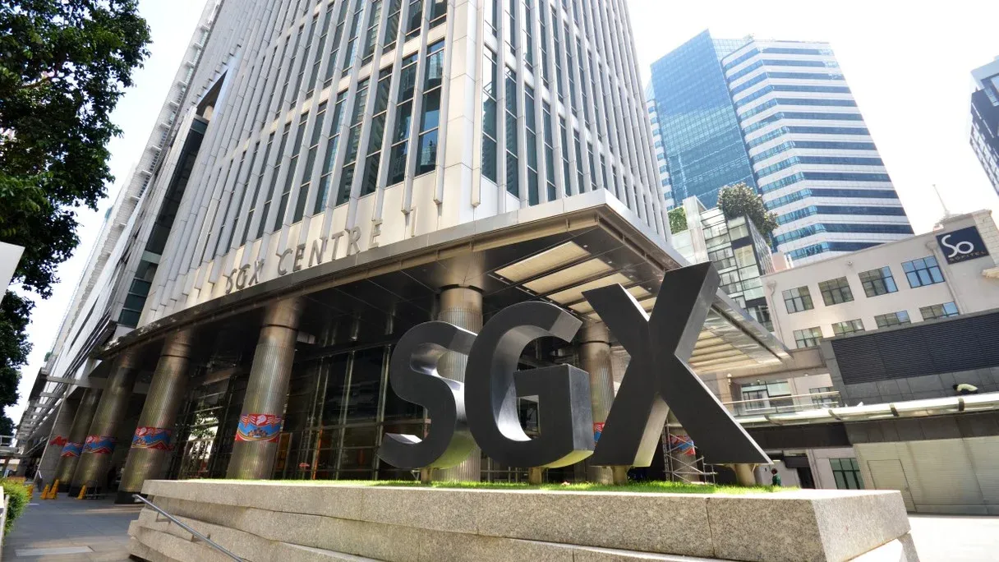

## Table of Contents

## What is the Singapore Mercantile Exchange (SMX)?

The Singapore Mercantile Exchange, or SMX, is a place where people can buy and sell things like gold, silver, and other commodities. It started in 2008 and is located in Singapore. People use SMX to trade these items because it helps them manage the risks of price changes. For example, if someone thinks the price of gold will go up, they can buy gold on SMX to make money later.

SMX is important because it helps businesses and investors from around the world. It makes trading easier and safer. The exchange follows strict rules to make sure trading is fair for everyone. This helps build trust among the people who use SMX. Overall, SMX plays a big role in the global market for commodities.

## When was the Singapore Mercantile Exchange established?

The Singapore Mercantile Exchange, or SMX, was established in 2008. This was an important year because it marked the start of a new place where people could trade things like gold and silver.

SMX is located in Singapore and helps people from all over the world. It makes trading easier and safer by following strict rules to make sure everyone trades fairly. This helps build trust among the people who use SMX.

## What types of products are traded on the SMX?

The Singapore Mercantile Exchange, or SMX, is a place where people trade different kinds of products. The main things they trade are gold and silver. These are called precious metals, and people buy and sell them because they can be worth a lot of money.

Besides gold and silver, SMX also trades other things like iron ore and other metals. These are important for industries that need raw materials to make things. Trading these products on SMX helps businesses manage the risks of price changes and plan better for the future.

## Who are the main participants in the SMX?

The main participants in the Singapore Mercantile Exchange, or SMX, are businesses and investors from around the world. These businesses often deal with commodities like gold, silver, and iron ore. They use SMX to buy and sell these products because it helps them manage the risks of price changes. For example, a company that needs gold for its products can buy it on SMX to make sure they have it when they need it, even if the price goes up later.

Investors also play a big role in SMX. They might not need the commodities themselves, but they trade them to make money. If an investor thinks the price of silver will go up, they can buy it on SMX and sell it later for a profit. Both businesses and investors help make SMX a busy and important place for trading commodities.

## How does the SMX contribute to the global commodities market?

The Singapore Mercantile Exchange, or SMX, plays a big role in the global commodities market by providing a place where people can trade things like gold, silver, and iron ore. It helps businesses and investors from all over the world manage the risks of price changes. For example, if a company needs gold to make jewelry, they can buy it on SMX to make sure they have it even if the price goes up later. This helps them plan better and avoid big surprises.

SMX also makes trading easier and safer by following strict rules. These rules make sure that everyone trades fairly and that the market works smoothly. This builds trust among the people who use SMX, which is important for a healthy global market. Overall, SMX helps connect buyers and sellers from different countries, making it easier for them to trade and do business together.

## What are the trading hours of the SMX?

The Singapore Mercantile Exchange, or SMX, has trading hours that help people from different time zones trade easily. The main trading hours are from 8:00 AM to 11:30 PM Singapore time, Monday to Friday. This long trading window means that people from many different countries can trade at a time that works for them.

During these hours, traders can buy and sell things like gold, silver, and iron ore. The long hours help make sure that the market is always busy and that there are always people ready to trade. This is important for keeping the market active and helping businesses and investors manage their risks well.

## What are the key features of the SMX's trading platform?

The Singapore Mercantile Exchange, or SMX, has a trading platform that is designed to be easy to use and reliable. One of the key features is that it allows traders to buy and sell commodities like gold, silver, and iron ore quickly and efficiently. The platform is electronic, which means traders can use it from anywhere in the world as long as they have an internet connection. This makes it very convenient for people from different countries to trade at times that work for them.

Another important feature of the SMX's trading platform is its transparency and security. The platform follows strict rules to make sure that all trading is fair and that everyone has the same information. This helps build trust among the traders. The platform also has strong security measures to protect the traders' information and money. This makes it a safe place for businesses and investors to trade commodities.

## How does the SMX ensure the integrity and transparency of its markets?

The Singapore Mercantile Exchange, or SMX, makes sure its markets are fair and open by following strict rules. These rules help everyone see what is happening in the market. For example, all trades are recorded and shown to everyone. This means that no one can hide what they are doing. SMX also checks trades to make sure they follow the rules. If someone breaks the rules, SMX can take action to keep the market fair.

Another way SMX keeps its markets honest is by using technology to watch for anything unusual. They use special software to look for signs of cheating or mistakes. This helps them catch problems early and fix them before they get big. By doing these things, SMX makes sure that everyone can trust the market. This is important because it helps more people want to trade on SMX, which makes the market stronger and better for everyone.

## What are the regulatory bodies overseeing the SMX?

The Singapore Mercantile Exchange, or SMX, is overseen by the Monetary Authority of Singapore, or MAS. This is the main body that makes sure the financial markets in Singapore work well and are safe. The MAS checks that SMX follows all the rules and helps keep the market fair for everyone.

Another important body is the Singapore Exchange Regulation, or SGX RegCo. They work closely with SMX to make sure that trading is done the right way. They look at how SMX runs its market and make sure it meets all the rules set by the government. Together, these two bodies help keep SMX honest and trustworthy.

## How does the SMX handle risk management and what are its clearing processes?

The Singapore Mercantile Exchange, or SMX, helps people manage risks by letting them trade things like gold and silver. When people trade on SMX, they can use futures contracts. These are agreements to buy or sell a product at a set price in the future. This helps businesses and investors protect themselves if prices go up or down. SMX also has rules that everyone must follow to make sure trading is fair and safe. This helps everyone feel more secure when they trade on the exchange.

SMX also has a special process called clearing to make sure trades happen smoothly. When someone buys or sells something on SMX, the clearing process checks that the trade is okay and that both sides can do what they promised. This means making sure the buyer can pay and the seller can deliver the product. SMX uses a clearing house to do this. The clearing house acts like a middle person, making sure everything goes right. This helps keep the market stable and trustworthy.

## What are some recent developments or expansions at the SMX?

The Singapore Mercantile Exchange, or SMX, has been working on making its services better. One big change is that they started offering more products to trade. Now, along with gold and silver, people can also trade things like iron ore and other metals. This gives businesses and investors more choices and helps them manage their risks better. SMX is always looking for new ways to help its users, so adding these products is a big step forward.

Another important development at SMX is that they have been working on making their trading platform even easier to use. They've added new tools and features that help traders see what's happening in the market more clearly. This makes it easier for people to make smart decisions when they buy and sell things. SMX also keeps improving its technology to make sure the platform is fast and safe. These changes help make trading on SMX smoother and more reliable for everyone.

## How does the SMX compare to other major commodity exchanges like the CME or LME?

The Singapore Mercantile Exchange, or SMX, is different from other big commodity exchanges like the Chicago Mercantile Exchange (CME) and the London Metal Exchange (LME) in some ways. SMX focuses a lot on trading precious metals like gold and silver, and it also trades other commodities like iron ore. It's based in Singapore, which makes it easier for people in Asia to use. SMX also has trading hours that cover a big part of the day, from 8:00 AM to 11:30 PM Singapore time, which helps people from different time zones trade easily.

On the other hand, the CME, which is in the United States, is much bigger and trades a wider variety of products. It's not just about commodities; the CME also deals with things like interest rates and stock indexes. The LME, based in London, is the world's biggest market for trading metals like copper and aluminum. Both the CME and LME have been around for a long time and have a lot of history and trust built up. They also have trading hours that work well for people in their own time zones, but might not be as convenient for people in Asia like SMX's hours are.

## References & Further Reading

[1]: Intercontinental Exchange. (n.d.). [ICE Futures Singapore](https://www.ice.com/publicdocs/futures/IFEu_Christmas_and_New_Year_2024.pdf) - Official site of ICE Futures Singapore.

[2]: Monetary Authority of Singapore. (2021). [Regulations and Licensing](https://www.allenandgledhill.com/sg/publication/articles/19622/mas-implements-contractual-recognition-requirement-for-certain-financial-institutions) - Overview of Singapore's approach to regulation and licensing of financial markets.

[3]: Zhang, L. (2016). ["The role of algorithmic trading in the financial markets of Asia"](https://pubs.aip.org/aip/acp/article/2919/1/090014/3279012/The-role-of-algorithmic-trading-in-the). Asia-Pacific Financial Markets, 23(2), 95–110.

[4]: Lopez de Prado, M. (2018). ["Advances in Financial Machine Learning"](https://www.amazon.com/Advances-Financial-Machine-Learning-Marcos/dp/1119482089) - A comprehensive guide to applying machine learning in trading.

[5]: BlackRock Investment Institute. (2020). ["Technological Disruption in Global Financial Markets"](https://www.blackrock.com/corporate/insights/blackrock-investment-institute) - Examination of technological changes in financial markets. 

[6]: Chan, E. P. (2009). ["Quantitative Trading: How to Build Your Own Algorithmic Trading Business"](https://github.com/ftvision/quant_trading_echan_book) - Insights on starting and running a quantitative trading business.

[7]: Singapore Exchange. (2022). ["Securities and Derivatives"](https://investorrelations.sgx.com/static-files/8c8c8644-80d0-43ca-b34e-eba3ad3c90f2) - Information on trading securities and derivatives in Singapore. 

[8]: Gai, J., & Wang, B. (2019). ["Blockchain in the finance sector: A review"](https://www.sciencedirect.com/science/article/pii/S2452414X24002103). Financial Innovation, 5, 12. 

[9]: Jansen, S. (2020). ["Machine Learning for Algorithmic Trading: Predictive models to extract signals from market and alternative data for systematic trading strategies with Python"](https://www.amazon.com/Machine-Learning-Algorithmic-Trading-alternative/dp/1839217715) - Practical guide to applying machine learning in trading.