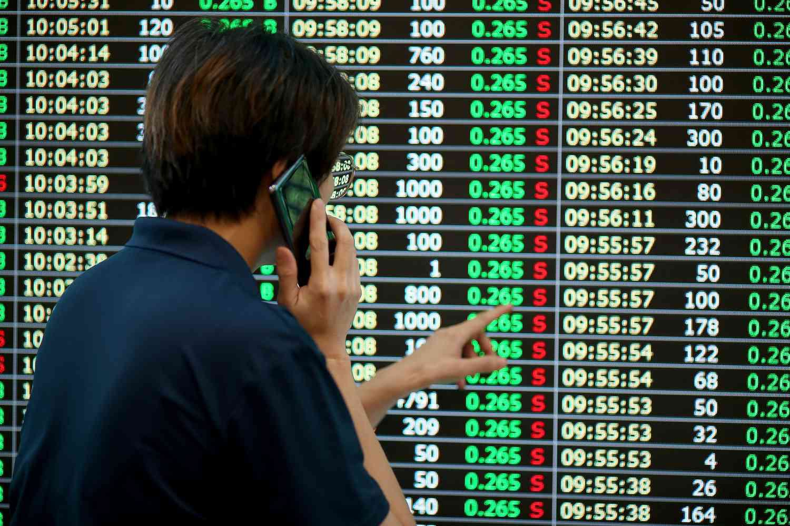

Navigating the world of finance often requires an understanding of a variety of terms and slang that are fundamental to comprehending market dynamics. The financial landscape is peppered with specific jargon and colloquial expressions that both capture the nuances of trading activities and reflect broader economic trends. This article explores some of these important financial terms, primarily focusing on the concept of a "single-digit midget" and the practice of algorithmic trading. 

The term "single-digit midget" refers to companies whose stock prices have fallen below the $10 mark after previously being valued much higher, a phenomenon notably observed during the burst of the dotcom bubble. This slang can serve as an indicator of significant market shifts, highlighting both the volatility of stock valuations and investor sentiment. We will examine the term's historical usage and the lessons it imparts on market overvaluation and risk management.

Alongside this, algorithmic trading represents a modern approach to investing, where computer algorithms are employed to make expedited and data-driven trading decisions. This method has revolutionized how trades are conducted, allowing for precision and speed that far surpass traditional human capabilities. Understanding the mechanics and applications of algorithmic trading is increasingly crucial for investors seeking to capitalize on rapid market movements and optimize their trading strategies.

By dissecting these concepts, both novices and experienced investors can enhance their ability to make informed decisions and effectively navigate the complexities of the trading world. As the financial markets continue to evolve, grasping the intricacies of such terminology and methodologies will be essential for maintaining relevance and achieving success in investing.

## Table of Contents

## Understanding Financial Terminology

Finance has its own specialized language, replete with terms and phrases that may initially seem mystifying to newcomers. However, mastering this lexicon is crucial for anyone seeking success in the financial markets. Understanding financial terminology not only aids in navigating market reports and news but also enhances decision-making when it comes to investing and trading.

At its core, financial terminology includes fundamental concepts such as assets, liabilities, equities, and securities. An asset is anything that an individual or entity owns that has value, potentially being converted into cash. Liabilities, conversely, are obligations that require settling through cash or equivalent resources. Equity represents ownership in an asset after deducting liabilities. Securities are tradable financial instruments used to raise capital in public and private markets, and they include stocks, bonds, and options.

Moreover, there are specific terms that detailed various market movements and strategies. For instance, 'bull market' and 'bear market' describe periods of rising and falling stock prices, respectively. A bull market indicates a strong economy and increasing investor confidence, while a bear market reflects downturns and pessimism.

Modern financial discourse often incorporates jargon like '[liquidity](/wiki/liquidity-risk-premium)', which refers to how quickly an asset can be converted into cash without affecting its price. Another pivotal concept is 'diversification', the strategy of spreading investments across various asset classes to minimize risk. 

Additionally, more casual terms have made their way into financial vocabulary, often with roots in past market events or trends. The term 'single-digit midget', for example, describes stocks that trade for less than $10 after experiencing much higher valuations; this reflects on periods of intense market [volatility](/wiki/volatility-trading-strategies), like the dot-com bubble burst.

For any investor, beginner or seasoned, it is imperative to familiarize oneself with these terms and their practical applications. This knowledge not only provides a competitive edge but also ensures more informed and strategic engagement with the financial markets. Understanding this financial jargon is a stepping stone towards mastering the complex world of finance and serves as a foundation for adopting more advanced trading strategies.

## Single-Digit Midget: Definition and Origins

The term 'single-digit midget' describes stocks trading below $10, having once commanded significantly higher prices. This term gained prominence during the dotcom bubble burst in the early 2000s, a period marked by excessive speculation in internet-based companies. The bubble was characterized by a massive surge in equity valuations for technology startups, often without the backing of profitable or even viable business models. When the bubble burst, many of these once high-flying stocks plummeted to single-digit values, hence [earning](/wiki/earning-announcement) the moniker 'single-digit midget'.

The origins of 'single-digit midget' are closely linked to this tumultuous chapter in financial history, when investors faced severe losses as market optimism rapidly turned to pessimism. The term encapsulates not only a stock's diminished market value but also the emotional and financial toll exacted on investors who experienced the steep devaluation of their investments. During the dotcom boom, the NASDAQ Composite index rose from under 1,000 points in 1995 to more than 5,000 by March 2000, only to plummet to around 1,100 by October 2002. This dramatic rise and fall serve as a backdrop for understanding the phenomenon of single-digit midgets.

Understanding the history and implications of terms like 'single-digit midget' is crucial for recognizing market trends and anomalies. It highlights issues such as overvaluation, speculative bubbles, and market volatility—phenomena still relevant in today's financial landscape. Learning from the past, investors become better equipped to identify unsustainable market exuberance and prepare for potential downturns. Such historical context aids in crafting informed and prudent investment strategies, focusing on sustainable value rather than fleeting market hype.

## The Emotional and Market Impact of Single-Digit Midgets

The term "single-digit midget" emerged during a tumultuous period in financial history, evoking strong emotional responses from investors amidst the dotcom bust of the late 1990s and early 2000s. This term described stocks that had plummeted to trade below $10, despite having once been valued significantly higher. It became a stark reminder of the volatility and risks inherent in the stock market, particularly involving technology companies that lacked robust and sustainable business models.

During the dotcom bubble, exuberance around internet-based companies led to substantial overvaluations. Investors, eager to capitalize on the perceived limitless potential of technology startups, poured capital into these entities without due diligence or concern for fundamental financial health. The burst of this bubble exposed the fragility of many of these companies, as their stock prices tumbled into the single-digit range. This dramatic fall in value was not only a financial blow but also carried significant emotional implications for investors who had invested their savings, fueled by optimism and, at times, speculative frenzy.

The aftermath highlighted a critical lesson in financial prudence—the danger of overvaluation. During the bubble, many tech startups presented business models that were not yet profitable or sustainable. When the market corrected itself, these inadequacies became apparent, leading to negative financial outcomes for investors who had failed to critically assess the long-term viability and intrinsic value of their investments. Thus, the term "single-digit midget" serves as a cautionary tale underscoring the necessity of evaluating a company's financial fundamentals and market positioning, rather than succumbing to speculative hype.

In today's financial landscape, while the term "single-digit midget" is less frequently used, the narrative persists as a warning about market volatility and the potential pitfalls of investing solely based on trends or speculation. For investors, understanding these past events fosters better investment strategies and decision-making, encouraging a balanced approach that considers both potential growth and underlying risks. This historical context emphasizes that thorough research and assessment remain pillars of successful investing, especially in fast-evolving sectors like technology.

## Algorithmic Trading: A Modern Approach to Investing

Algorithmic trading involves the use of complex computer algorithms to guide trading decisions, significantly impacting the financial markets. This method, often referred to as "algo trading," enables the execution of trades at speeds and volumes far beyond human capabilities, providing a critical edge in modern markets.

The essence of [algorithmic trading](/wiki/algorithmic-trading) lies in its ability to automate predefined trading strategies. These strategies can range from simple guidelines for buying or selling to intricate systems using [artificial intelligence](/wiki/ai-artificial-intelligence) and [machine learning](/wiki/machine-learning). The algorithms assess vast datasets to identify trading opportunities based on predetermined criteria such as price movements, timing, or specific market conditions.

One of the key advantages of algorithmic trading is its speed. Trades are executed in fractions of a second, meaning traders can capitalize on even the smallest market fluctuations before these opportunities vanish. This speed is particularly advantageous in high-frequency trading ([HFT](/wiki/high-frequency-trading-strategies)), a subset of algorithmic trading, where thousands of trades occur within seconds, aiming to capture minute spreads.

Algorithmic trading also reduces the emotional and psychological factors that often affect human traders. By adhering strictly to a set of programmed rules, algo trading minimizes human error and bias, ensuring consistent decision-making processes. This objective approach can potentially enhance trading outcomes over time.

For novice traders, understanding algorithmic trading opens new opportunities to engage in the markets without the need for in-depth technical expertise traditionally required for manual trading. Many platforms offer user-friendly interfaces allowing users to implement and backtest basic algorithms with little to no programming knowledge. As traders gain more experience, they can develop more sophisticated strategies, progressively leveraging the computational power of algo trading to optimize performance.

Experienced traders, on the other hand, can benefit from developing proprietary algorithms tailored to specific market conditions or leveraging advanced techniques such as sentiment analysis, where algorithms interpret social media and news data to predict market movements.

Overall, mastering algorithmic trading is becoming increasingly important in navigating today's complex financial landscape. As computational power and data accessibility continue to grow, so too will the potential for algo trading to transform investment strategies for traders across the spectrum of experience.

## Integrating Financial Terminology with Trading Strategies

Combining the understanding of terms like "single-digit midget" with algorithmic trading strategies can significantly enhance decision-making processes for investors. A "single-digit midget," a term used to describe stocks trading under $10 after once being valued much higher, serves as a reminder of market volatility and the dramatic shifts that can occur. Recognizing such opportunities or risks can aid traders in developing more effective trading strategies, especially when integrated with algorithmic methods.

Algorithmic trading, a modern staple in financial markets, involves using computer algorithms to make trading decisions, execute orders, and analyze data. These algorithms can identify patterns and signals for buying or selling assets at optimal times. By considering financial terminology like "single-digit midget," traders can incorporate qualitative insights into quantitative models, thus bridging the gap between traditional market instincts and modern computing prowess.

A balanced trading strategy might explore both short-term and long-term investment opportunities. For short-term market plays, algorithms can be designed to detect rapid fluctuations or price signals associated with stocks nearing a "single-digit midget" status. Alternatively, long-term strategies could focus on identifying companies poised for recovery after significant devaluation, thus capitalizing on potential rebounds.

Successful trading often requires a combination of knowledge, experience, and strategic use of financial terminology. Traders who effectively integrate this lexicon with algorithmic strategies can better understand market dynamics, reduce emotional trading biases, and execute trades with precision. By consistently updating their understanding of financial terms and leveraging algorithmic advancements, investors are better equipped to navigate complex and evolving market landscapes.

## The Future of Financial Slang and Trading Techniques

Financial markets are continuously evolving, leading to the development and adoption of new slang and trading technologies. This adaptation is necessary for modern investors to stay ahead in an ever-changing landscape. New jargon often emerges from technological advancements, significant market events, or the introduction of novel financial instruments. Technology plays a critical role, significantly changing how trading is executed and perceived.

The integration of artificial intelligence (AI) and machine learning (ML) into trading systems exemplifies a growing trend towards more sophisticated trading techniques. These technologies enable the processing of vast amounts of data at unprecedented speeds, allowing for informed decision-making and efficient market predictions. Algorithms can now incorporate complex variables and execute orders in milliseconds, far beyond what human capabilities allow. For instance, predictive models can evaluate historical data to forecast future market trends using advanced statistical methods like regression analysis or neural networks.

As trading technology advances, so does the vocabulary used by professionals in the field. Terms such as "high-frequency trading" (HFT), "quant trading," and "robo-advisors" have become commonplace. HFT relies on complex algorithms that perform large numbers of orders in fractions of a second, capitalizing on minute price discrepancies. On the other hand, quant trading employs mathematical models and quantitative analysis to make decisions, which requires traders to be versed in statistical and data-driven vocabularies.

Moreover, the rise of decentralized finance (DeFi) and cryptocurrencies introduces its own lexicon—terms like "blockchain," "smart contracts," and "yield farming" are just a few examples. DeFi represents a shift towards blockchain-based financial systems that operate without traditional intermediaries, utilizing smart contracts for automated transaction processing. This paradigm shift encourages investors to learn new terminologies and adapt trading strategies accordingly.

The convergence of technology and finance heralds a future with highly sophisticated trading methodologies. Investors need to remain updated on these advancements to capitalise on innovative opportunities while mitigating risks associated with rapid market and technological changes. As financial slang and technologies continue to evolve, a forward-thinking approach, continuous learning, and adaptability remain critical components of successful investing.

## Conclusion

Mastering financial slang and algorithmic trading can significantly improve trading acumen. The phrase 'single-digit midget,' though less common today, serves as a poignant reminder of the importance of perceiving market volatility and recognizing the perils of overvaluation. Investors who understand such terms gain insights into historical market behaviors and better evaluate current investment contexts.

Algorithmic trading continues to transform the financial landscape by enabling unprecedented trading speed and efficiency. This modern approach to trading offers investors, both novice and seasoned, tools to strategize and execute trades with precision. By automating processes, traders can capitalize on market opportunities with reduced emotional interference, maintaining objectivity in volatile conditions.

As finance evolves, continuously adapting to new trading technologies and terminologies becomes crucial. Advances such as machine learning and artificial intelligence are merging with traditional financial strategies, leading to increasingly complex and nuanced trading environments. For investors, staying informed of these developments is vital to maintaining competitiveness and achieving success in the market.

Understanding historical financial slang and integrating it with emerging trading techniques not only broadens an investor's perspective but also fortifies their ability to navigate an ever-changing financial world. Therefore, a commitment to lifelong learning and adaptability will equip investors to thrive amid the complexities of modern financial markets.

## References & Further Reading

[1]: Lo, A. W. (2004). ["The Efficient Market Hypothesis and Its Critics."](https://papers.ssrn.com/sol3/papers.cfm?abstract_id=602222) Journal of Economic Perspectives, 18(1), 29-60.

[2]: ["Advances in Financial Machine Learning"](https://www.amazon.com/Advances-Financial-Machine-Learning-Marcos/dp/1119482089) by Marcos Lopez de Prado

[3]: ["Flash Boys: A Wall Street Revolt"](https://en.wikipedia.org/wiki/Flash_Boys) by Michael Lewis

[4]: ["Algorithmic and High-Frequency Trading"](https://www.amazon.com/Algorithmic-High-Frequency-Trading-Mathematics-Finance/dp/1107091144) by Álvaro Cartea, Sebastian Jaimungal, and José Penalva

[5]: ["Quantitative Trading: How to Build Your Own Algorithmic Trading Business"](https://www.amazon.com/Quantitative-Trading-Build-Algorithmic-Business/dp/1119800064) by Ernest P. Chan

[6]: Shreve, S. E. (2004). ["Stochastic Calculus for Finance I: The Binomial Asset Pricing Model."](https://link.springer.com/book/10.1007/978-0-387-22527-2)

[7]: ["An Engine, Not a Camera: How Financial Models Shape Markets"](https://academic.oup.com/mit-press-scholarship-online/book/20588) by Donald MacKenzie