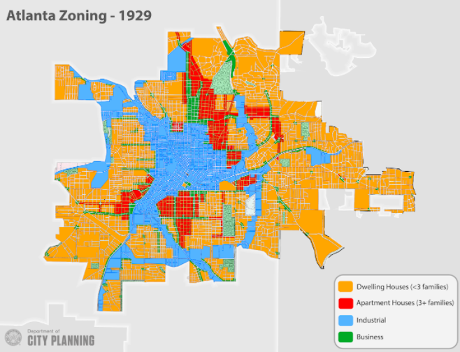

## Table of Contents

## What is single-family zoning?

Single-family zoning is a type of rule that cities and towns use to control how land can be used. It means that in certain areas, only one house can be built on one piece of land. This rule is meant to keep neighborhoods quiet and with lots of space between homes. People who support single-family zoning think it helps keep their neighborhoods the way they like them, with big yards and fewer people living close together.

However, single-family zoning can also make it hard for some people to find a place to live. Because only one house can be built on each lot, it can make housing more expensive. This is because there are fewer homes available, and more people want to live in these nice, quiet areas. Some people think that single-family zoning can make it harder for families who don't have a lot of money to find a home in these neighborhoods. They believe that allowing more types of housing, like apartments or townhouses, could help more people find a place to live.

## How does single-family zoning differ from other types of zoning?

Single-family zoning is different from other types of zoning because it only allows one house to be built on one piece of land. This means that in areas with single-family zoning, you can't build apartments, townhouses, or other types of homes where more than one family lives. The goal of single-family zoning is to keep neighborhoods quiet and spacious, with lots of room between houses.

Other types of zoning, like multi-family zoning, allow for different kinds of buildings. For example, multi-family zoning might let you build an apartment building where many families can live in one big building. There's also mixed-use zoning, which lets you have homes, stores, and offices all in the same area. These other types of zoning can help make more homes available and can make neighborhoods more lively and diverse.

The main difference is that single-family zoning focuses on keeping things the same and quiet, while other types of zoning can allow for more variety and more people to live in an area. This can affect how neighborhoods look and feel, and it can also impact how easy or hard it is for people to find a place to live.

## What is racial segregation?

Racial segregation means keeping people of different races separate from each other. This can happen in schools, neighborhoods, or even public places like restaurants and buses. In the past, laws and rules were made to keep people of different races apart, especially in the United States. These laws were called "Jim Crow" laws, and they made life very hard for Black people and other people of color.

Today, even though those old laws are gone, racial segregation can still happen. Sometimes, it's because of the way neighborhoods are set up or because of how schools are funded. For example, if only rich people can afford to live in certain areas, and most rich people are of one race, then that area might end up being mostly one race. This kind of segregation can make it hard for people of different races to meet and get to know each other, and it can lead to unfair treatment and fewer opportunities for some groups.

Racial segregation is a big problem because it can lead to inequality. When people are kept separate, they might not have the same chances to go to good schools, get good jobs, or live in safe neighborhoods. This can make life harder for people who are kept out of certain areas or opportunities. Many people are working to end racial segregation and make sure everyone has a fair chance, no matter their race.

## How has single-family zoning historically contributed to racial segregation?

Single-family zoning has played a big part in keeping people of different races separate in the past. When cities started using single-family zoning rules, they often used them to keep certain neighborhoods white. This happened because only people who could afford to buy a whole house and a big piece of land could live in these areas. Back then, many Black families and other families of color didn't have as much money, so they couldn't afford to live in these neighborhoods. This made it hard for them to move into areas with good schools and safe streets.

Even though the old laws that forced people to live apart are gone, single-family zoning still affects where people live today. Because these zones limit the number of homes that can be built, they can keep housing prices high. This means that only people with more money can afford to live in these areas, and often, more money means more white people. So, even without trying to, single-family zoning can help keep neighborhoods mostly one race, making it hard for people of different races to live together and share the same opportunities.

## What are the mechanisms through which single-family zoning can lead to racial segregation?

Single-family zoning can lead to racial segregation by making housing more expensive. When a city or town says that only one house can be built on one piece of land, it means fewer homes can be built overall. This makes the homes that are built more expensive because there are fewer of them and more people want to live in nice, quiet neighborhoods. Historically, many Black families and other families of color did not have as much money as white families. So, when housing is expensive, it's harder for these families to afford to live in single-family zoned areas. This keeps neighborhoods mostly white and keeps people of different races apart.

Another way single-family zoning can lead to racial segregation is by keeping certain neighborhoods the same over time. When only one type of housing is allowed, it stops new kinds of homes like apartments or townhouses from being built. This means that even as time goes on and more people need places to live, the neighborhood stays the same. If a neighborhood started out mostly white because of old rules and practices, single-family zoning can help keep it that way. This makes it hard for people of different races to move into these areas and share in the good schools, safe streets, and other benefits that come with living there.

## Can you provide examples of cities where single-family zoning has been linked to racial segregation?

In Minneapolis, Minnesota, single-family zoning has been a big reason why some neighborhoods are mostly white. For a long time, the city had rules that only allowed one house on one piece of land in many areas. This made housing expensive, and only people with more money could afford to live there. Since many white families had more money, these neighborhoods stayed mostly white. In 2018, Minneapolis changed its rules to allow more types of housing, like apartments and townhouses, to help make housing more affordable and mix up the neighborhoods.

Another example is in Seattle, Washington. The city used single-family zoning to keep certain areas the same for a long time. These areas were often where richer, mostly white families lived. Because only one house could be built on each piece of land, it was hard for other types of homes to be built. This kept the neighborhoods expensive and mostly white. Like Minneapolis, Seattle has been trying to change its zoning rules to allow more types of housing and help make neighborhoods more diverse.

These examples show how single-family zoning can keep people of different races apart. By making housing more expensive and keeping neighborhoods the same, single-family zoning can stop people of color from moving into certain areas. This can lead to less mixing of races and fewer chances for everyone to live together and share the same opportunities.

## What are the legal and policy frameworks surrounding single-family zoning and racial segregation?

Single-family zoning rules have been a big part of keeping people of different races apart in the United States. These rules were often used to make sure that only rich, mostly white people could live in certain neighborhoods. In the past, laws like the Fair Housing Act of 1968 were passed to stop this kind of discrimination. This law says that it's against the rules to treat people differently when they're trying to buy or rent a home because of their race. But even with this law, single-family zoning can still make it hard for people of color to move into these neighborhoods. This is because these rules can keep housing prices high, and when homes are expensive, it's harder for families with less money to afford them.

To try to fix this problem, some cities have started to change their zoning rules. For example, Minneapolis and Seattle have made new rules that let more types of homes, like apartments and townhouses, be built in areas that used to only allow one house per lot. These changes are meant to make housing more affordable and help more people of different races live in the same neighborhoods. But changing zoning rules is not easy. People who live in these neighborhoods might not want things to change, and they might fight against new rules. So, even though there are laws and policies trying to stop racial segregation, single-family zoning can still make it hard for people of different races to live together.

## How do economic factors interplay with single-family zoning and racial segregation?

Single-family zoning can make housing more expensive. When a city says that only one house can be built on one piece of land, it means fewer homes can be built overall. This makes the homes that are built more expensive because there are fewer of them and more people want to live in nice, quiet neighborhoods. Historically, many Black families and other families of color did not have as much money as white families. So, when housing is expensive, it's harder for these families to afford to live in single-family zoned areas. This can keep neighborhoods mostly white and keep people of different races apart.

Economic factors also affect how people can move into different neighborhoods. If a neighborhood has good schools, safe streets, and other nice things, people want to live there. But if single-family zoning keeps the housing prices high, only people with more money can afford to live in these areas. Often, more money means more white people. So, even without trying to, single-family zoning can help keep neighborhoods mostly one race. This makes it hard for people of different races to live together and share the same opportunities.

## What are the social impacts of single-family zoning on minority communities?

Single-family zoning can make life harder for minority communities. When only one house can be built on one piece of land, it makes homes more expensive. Many minority families don't have as much money as white families, so it's harder for them to afford to live in these neighborhoods. This can keep minority families out of areas with good schools and safe streets. Over time, this can make it harder for minority kids to get a good education and for families to have the same chances as others.

This kind of zoning can also make neighborhoods less diverse. When neighborhoods are mostly one race because of high housing costs, it can be hard for people of different races to meet and get to know each other. This can lead to less understanding and more division between different groups. When people are kept apart, it can also mean that minority communities miss out on the benefits that come from living in mixed neighborhoods, like better job opportunities and access to community resources.

## What reforms have been proposed or implemented to address the role of single-family zoning in racial segregation?

Some cities have started to change their single-family zoning rules to help make neighborhoods more diverse and affordable. For example, Minneapolis and Seattle have made new rules that allow more types of homes, like apartments and townhouses, to be built in areas that used to only allow one house per lot. These changes are meant to make housing more affordable so that more people, including those from minority communities, can live in these neighborhoods. By allowing more homes to be built, these cities hope to break down the barriers that keep people of different races apart.

Other places are also looking at ways to change their zoning laws. Some ideas include making it easier to build different kinds of homes in single-family zones, like adding small apartments to existing houses or building townhouses. These changes can help more people afford to live in these areas. But changing zoning rules is not easy. People who live in these neighborhoods might not want things to change, and they might fight against new rules. So, even though there are efforts to fix the problem, it takes time and effort to make sure everyone can live in the same neighborhoods and have the same opportunities.

## How can urban planning and policy be used to mitigate the effects of single-family zoning on racial segregation?

Urban planning and policy can help make neighborhoods more mixed by changing single-family zoning rules. Cities can allow more types of homes, like apartments and townhouses, to be built in areas that used to only allow one house per lot. This can make housing cheaper, so more people, including those from minority communities, can afford to live there. By building more homes, cities can help break down the barriers that keep people of different races apart. This means more people can share in the good things that come from living in these neighborhoods, like good schools and safe streets.

But changing zoning rules is not easy. People who live in these neighborhoods might not want things to change, and they might fight against new rules. So, cities need to talk to everyone and explain why these changes are important. They can also offer help to people who might be worried about changes, like giving them money to fix up their homes or helping them find new places to live. By working together and making smart plans, cities can make sure everyone has a fair chance to live in the same neighborhoods and have the same opportunities.

## What are the ongoing debates and future directions in research concerning single-family zoning and racial segregation?

There are big debates about single-family zoning and how it affects racial segregation. Some people think that single-family zoning keeps neighborhoods the same and makes housing too expensive for many families, especially those from minority communities. They argue that changing these rules to allow more types of homes, like apartments and townhouses, could help make neighborhoods more mixed and affordable. But others worry that changing zoning rules might change the way their neighborhoods look and feel. They might not want more people living close together and think that keeping things the same is important.

Researchers are looking into these issues to find out more about how single-family zoning affects where people live and how it can be changed to help everyone. They are studying how different zoning rules can make housing more affordable and help more people from different races live in the same neighborhoods. They also want to know how to talk to people about these changes so that everyone feels heard and included. In the future, research might focus on finding the best ways to change zoning rules without causing too much upset in communities. This could help make sure that everyone has a fair chance to live in good neighborhoods with good schools and safe streets.

## References & Further Reading

[1]: Rothstein, R. (2017). ["The Color of Law: A Forgotten History of How Our Government Segregated America."](https://books.google.com/books/about/The_Color_of_Law_A_Forgotten_History_of.html?id=SdtDDQAAQBAJ) Liveright.

[2]: Rothwell, J. (2012). ["The Effects of Density Zoning on Racial Segregation in U.S. Urban Areas."](https://cayimby.org/research/the-effect-of-density-zoning-on-racial-segregation-in-u-s-urban-areas/) Brookings Institution.

[3]: Gyourko, J., & Malloy, R. (2014). ["Regulation and the Rise of Housing Prices in Greater San Francisco."](https://www.nber.org/papers/w20536) American Economic Review, 6(1), 29-34.

[4]: Shiller, R. J. (2014). ["Irrational Exuberance"](https://press.princeton.edu/books/paperback/9780691173122/irrational-exuberance) (3rd ed.). Princeton University Press.

[5]: Williams, J. C. (2019). ["The Work That Goes Into Upzoning."](https://onlinelibrary.wiley.com/doi/abs/10.1111/1475-6773.13222) Shelterforce.

[6]: Fischer, C. S. (2008). ["Urban Exodus: Why the Jews Left Boston and the Catholics Stayed."](https://www.jstor.org/stable/j.ctv21hrgq0) Harvard University Press.

[7]: Massey, D. S., & Denton, N. A. (1993). ["American Apartheid: Segregation and the Making of the Underclass."](https://www.jstor.org/stable/pdfplus/2781105.pdf) Harvard University Press.