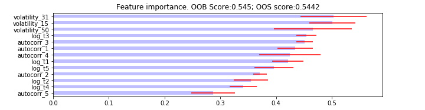

## Table of Contents

## What is Single Feature Importance (SFI)?

Single Feature Importance (SFI) is a way to understand how much a single piece of information, or feature, affects the results of a prediction model. Imagine you are trying to guess if it will rain based on the humidity, temperature, and wind speed. SFI helps you figure out how important each of these pieces of information is in making that guess. For example, if humidity is the most important feature, then changes in humidity will have a bigger impact on whether you think it will rain or not.

To calculate SFI, you can use different methods, but one common way is to see how much the model's accuracy changes when you mix up or remove that one feature. If the model's predictions get a lot worse when you mess with the humidity data, then humidity must be very important. This method helps people who build models to focus on the most useful information and make their predictions better.

## How does SFI differ from other feature importance techniques?

Single Feature Importance (SFI) focuses on understanding the impact of one feature at a time on a model's predictions. It's like looking at each piece of a puzzle separately to see how important it is. SFI is often calculated by messing with one feature, like mixing up its values or removing it, and then checking how much the model's accuracy changes. If the model's predictions get a lot worse, that feature must be very important. This method helps people see the direct effect of each feature on the model's results.

Other feature importance techniques might look at multiple features at once or use different ways to measure importance. For example, some methods, like permutation importance, might mix up the values of all features together to see which ones, when changed, affect the model the most. Another method, like SHAP (SHapley Additive exPlanations), considers how features work together to affect the model's predictions, giving a more complete picture of feature importance. Unlike SFI, these methods can show how features interact with each other, which can be important for understanding complex models.

In simple terms, SFI is about understanding the role of each feature one by one, while other techniques might give a broader view by considering how features work together or by using different approaches to measure importance. Both approaches have their uses, depending on what you want to learn about your model and how you want to improve it.

## What are the basic steps to calculate SFI?

To calculate Single Feature Importance (SFI), you start by choosing the feature you want to check. Let's say you're trying to predict if it will rain, and you want to see how important humidity is. You take your model and the data you've been using to train it. Then, you mix up the values of just the humidity feature. This means you shuffle the humidity numbers around so they don't match the other data anymore. After that, you run your model again with this mixed-up humidity data and see how well it predicts rain.

Next, you compare the model's performance with the mixed-up humidity to its performance with the original data. If the model's predictions get a lot worse when you mess with the humidity, it means humidity is very important for the model. If the predictions don't change much, then humidity isn't that important. You can do this for each feature one by one to see which ones matter the most to your model's predictions.

## Can you explain SFI with a simple example?

Imagine you're trying to guess if it will rain today, and you have three pieces of information to help you: the temperature, the humidity, and the wind speed. You want to know how important each piece of information is for your guess. So, you start by looking at humidity. You take all your past data where you know if it rained or not, and you mix up the humidity numbers. Then, you use this mixed-up data to make your rain guesses again.

When you mix up the humidity numbers, your guesses about rain get a lot worse. This means humidity is really important for predicting rain. If mixing up the humidity numbers didn't change your guesses much, then humidity wouldn't be that important. You can do the same thing with temperature and wind speed to see which one helps the most with your rain guesses. This way, you learn which piece of information is the most useful for making good predictions.

## What types of models can use SFI?

Single Feature Importance (SFI) can be used with many types of models that make predictions. This includes simple models like decision trees, where the model splits data into groups based on different features. It can also be used with more complex models like random forests, which use many decision trees to make predictions, and even with models like neural networks, which learn patterns in data in a more complicated way.

The key thing is that the model needs to be able to make predictions using data. Once you have a model that can do this, you can use SFI to see how important each piece of information is for the model's predictions. This works whether you're trying to predict something simple, like if it will rain, or something more complex, like the price of a house based on many different features.

## How does SFI help in model interpretation?

Single Feature Importance (SFI) helps in model interpretation by showing which pieces of information, or features, are most important for the model's predictions. Imagine you have a model that predicts if it will rain based on temperature, humidity, and wind speed. SFI helps you figure out that humidity might be the most important [factor](/wiki/factor-investing) in the model's decision. This means if you want to improve your model or understand why it makes certain predictions, you should pay close attention to humidity.

By understanding which features are important, you can make better decisions about how to use your model. For example, if humidity is very important for predicting rain, you might want to make sure you have accurate humidity data. Also, if you're trying to explain your model to someone else, you can say, "This model relies a lot on humidity to predict rain," which makes the model's workings clearer and easier to understand.

## What are the limitations of using SFI?

Using Single Feature Importance (SFI) can be helpful, but it has some downsides. One big problem is that SFI looks at each feature by itself, without considering how features might work together. In real life, features often affect each other. For example, if you're trying to predict if it will rain, both temperature and humidity might be important, and they might work together in ways that SFI doesn't show. So, you might think one feature is not important when it really is, just because it's being looked at alone.

Another limitation is that SFI can be affected by how the model was made. If the model was trained in a certain way, SFI might show that some features are more important than they really are. Also, SFI can be tricky to use with some types of models, like neural networks, which are very complex. If you don't understand how the model works, you might not trust the SFI results. So, while SFI can give you a good idea about which features matter, it's not perfect and should be used carefully.

## How can SFI be used in feature selection?

Single Feature Importance (SFI) can help you pick the best pieces of information, or features, to use in your model. Imagine you're trying to guess if it will rain, and you have a lot of different pieces of information like temperature, humidity, and wind speed. SFI lets you mix up each piece of information one at a time and see how much it changes your guesses. If mixing up humidity makes your guesses a lot worse, then humidity is very important. You can use this to choose the most important features and leave out the ones that don't help much.

Using SFI for feature selection can make your model simpler and better. If you find out that only a few pieces of information are really important, you can focus on those and ignore the rest. This can make your model easier to understand and faster to use. But remember, SFI looks at each piece of information by itself, so you might miss how they work together. So, while SFI is a good tool for [picking](/wiki/asset-class-picking) features, it's best to use it along with other methods to make sure you're not missing anything important.

## What advanced techniques can enhance the accuracy of SFI?

To make Single Feature Importance (SFI) more accurate, you can use a method called cross-validation. Imagine you're trying to guess if it will rain, and you have data from many days. Instead of using all your data at once, you split it into smaller parts and use some parts to train your model and other parts to test it. You do this many times, mixing up which parts you use for training and testing. This way, you can see how important each piece of information is across different parts of your data, making your SFI results more reliable.

Another way to improve SFI is by using a method called bootstrapping. This is like taking many samples from your data, with some data points showing up more than once in different samples. You calculate SFI for each sample and then look at the average importance of each feature across all the samples. This helps you see if the importance of a feature is consistent, even when you're looking at different parts of your data. By using these advanced techniques, you can get a better and more trustworthy picture of which pieces of information are most important for your model's predictions.

## How does SFI interact with correlated features?

When you use Single Feature Importance (SFI) to figure out how important different pieces of information are for your model, it can be tricky if some of those pieces are related to each other. Imagine you're trying to guess if it will rain, and you have two pieces of information: humidity and dew point. These two are often related because they both have to do with how much water is in the air. If you mix up the humidity numbers and see that your guesses get worse, SFI might say humidity is very important. But because humidity and dew point are related, you might not realize that dew point is also important.

To deal with this, you need to be careful when you're using SFI with pieces of information that are related. One way to handle it is to look at how the model's guesses change when you mix up both related pieces at the same time. This can help you understand if the importance you're seeing is because of one piece of information or because of how it works with another. By thinking about how pieces of information might be connected, you can get a better idea of what's really important for your model's predictions.

## Can SFI be applied to non-linear models? If so, how?

Yes, Single Feature Importance (SFI) can be used with non-linear models, like neural networks or decision trees. Non-linear models are a bit trickier because they can find complex patterns in data, but SFI still works by messing with one piece of information at a time. Imagine you have a model that predicts if it will rain, and it uses temperature, humidity, and wind speed. You want to see how important humidity is. You mix up the humidity numbers in your data and see how much the model's guesses change. If the guesses get a lot worse, then humidity is important, even in a non-linear model.

The key thing with non-linear models is that the relationships between different pieces of information can be hard to understand. But SFI helps by showing you how much each piece matters on its own. By mixing up one piece of information and seeing how the model's performance changes, you can figure out which pieces are most important for the model's predictions. This helps you understand and improve your non-linear model, even though it's more complex than simpler models.

## What are the best practices for implementing SFI in a machine learning pipeline?

When you want to use Single Feature Importance (SFI) in your machine learning project, start by making sure your data is clean and ready to use. This means checking for any missing numbers or mistakes in your data and fixing them. Then, split your data into two parts: one for training your model and one for testing it. This helps you see if your model is good at guessing things it hasn't seen before. When you're ready to use SFI, pick one piece of information at a time, mix up its numbers, and see how much your model's guesses change. If the guesses get a lot worse, that piece of information is important.

It's also a good idea to use SFI with other ways of checking how important each piece of information is. This can help you understand if the results you're seeing with SFI make sense. For example, you might use cross-validation, which means trying SFI on different parts of your data to see if the results stay the same. Or you could use bootstrapping, which means taking many samples from your data and looking at the average importance of each piece. By doing these things, you can trust your SFI results more and make better choices about which pieces of information to use in your model.

## What is the importance of SFI in Financial Machine Learning?

In [algorithmic trading](/wiki/algorithmic-trading), understanding the significance of various features is crucial for developing models that generalize well to unseen data, thereby reducing the risk of overfitting. Single Feature Importance (SFI) serves as an essential tool by providing a mechanism to isolate and assess the contribution of individual features to predictive performance. By examining features individually, SFI enables traders and analysts to focus on the most relevant variables, consequently minimizing the noise that can often obscure model predictions.

SFI is particularly advantageous for filtering noise and pinpointing robust features that possess the capability to predict market movements reliably over extended periods. In contrast to methods that assess multivariate influences, SFI's approach of examining each feature separately is instrumental in preventing biases that may arise from multicollinearity. Multicollinearity can skew the weight of correlated variables, leading to inaccurate interpretations of their importance in predicting outcomes.

Mathematically, if we denote the prediction function as $f(\mathbf{x})$ where $\mathbf{x}$ is the feature vector, SFI evaluates the performance metric, such as accuracy or mean squared error, by fitting a model on each feature $x_i$ independently:

$$
\text{SFI}(x_i) = \text{Performance}\left(f(x_i)\right)
$$

Here, $\text{Performance}$ indicates the chosen metric reflecting the model's ability to predict outcomes using only the feature $x_i$. This independent assessment ensures that each feature's isolated effect on the target variable is accurately measured, eliminating interferences caused by other features.

While SFI might be resource-intensive due to the necessity of fitting multiple models, its capacity to discern and elevate features that genuinely contribute to predictive accuracy makes it a vital component of feature selection in financial [machine learning](/wiki/machine-learning) contexts.

## References & Further Reading

[1]: Bergstra, J., Bardenet, R., Bengio, Y., & Kégl, B. (2011). ["Algorithms for Hyper-Parameter Optimization."](https://dl.acm.org/doi/10.5555/2986459.2986743) Advances in Neural Information Processing Systems 24.

[2]: ["Advances in Financial Machine Learning"](https://www.amazon.com/Advances-Financial-Machine-Learning-Marcos/dp/1119482089) by Marcos Lopez de Prado

[3]: ["Evidence-Based Technical Analysis: Applying the Scientific Method and Statistical Inference to Trading Signals"](https://www.amazon.com/Evidence-Based-Technical-Analysis-Scientific-Statistical/dp/0470008741) by David Aronson

[4]: ["Machine Learning for Algorithmic Trading"](https://github.com/stefan-jansen/machine-learning-for-trading) by Stefan Jansen

[5]: ["Quantitative Trading: How to Build Your Own Algorithmic Trading Business"](https://books.google.com/books/about/Quantitative_Trading.html?id=j70yEAAAQBAJ) by Ernest P. Chan