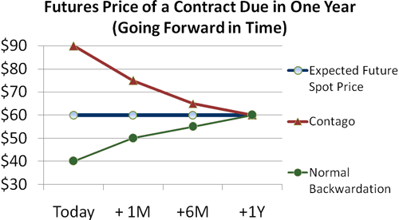

Algorithmic trading has fundamentally transformed the landscape of financial markets by enabling the automation of intricate trading strategies using computer programs. These algorithms execute trades with speed and precision that far surpass human capabilities. A prominent and promising area within this field is the trading of single futures contracts, with the Nifty futures market emerging as a significant focus for traders.

Single futures contracts involve agreeing to buy or sell an asset at a fixed price on a specific future date. Trading these contracts algorithmically allows traders to leverage computational power to identify optimal buy/sell signals, thus maximizing efficiency and potentially enhancing profitability. The Nifty futures market, which comprises derivatives based on the Nifty 50 index in India, represents a diversified basket of the top 50 companies in the country, offering traders opportunities for substantial gains and risk management through diversification.



This article explores the concept of single future rolls within the context of algorithmic trading, highlighting the potential benefits for traders engaged in this practice. A single future roll strategy involves managing and rolling over futures contracts systematically as they approach expiry, ensuring continuous exposure to the desired market indices such as Nifty. By implementing advanced algorithmic techniques, traders can optimize the timing and execution of rolling these contracts to minimize associated costs and slippage, allowing them to maintain strategic market positions effectively.

## Table of Contents

## Understanding Single Futures in Algo Trading

Single futures are financial derivatives that obligate the contract holder to buy or sell an underlying asset at a predetermined date and price. This type of futures contract is widely used in various financial markets and is a staple instrument in trading strategies. In the context of [algorithmic trading](/wiki/algorithmic-trading), single futures play a significant role due to the capabilities of computers to process large volumes of data and execute trades at high speeds.

Algorithmic trading of single futures involves using computer programs or algorithms to identify buy and sell signals based on predefined criteria or models. These algorithms are designed to analyze market data including price movements, [volume](/wiki/volume-trading-strategy) changes, and other indicators to make informed trading decisions. The processes are designed to mitigate human biases and attempt to capitalize on market inefficiencies with precision and speed.

In India, the Nifty futures market is a principal platform through which traders can engage with single futures contracts. Nifty futures are derivatives of the Nifty 50 Index, which represents the weighted average of 50 of India's largest and most liquid companies. Therefore, trading Nifty futures allows investors to gain broad exposure to the Indian equity market.

One of the key advantages of trading in Nifty futures is the opportunity for diversification and potential financial gains. As traders engage in futures contracts on the Nifty, they obtain exposure to a diversified portfolio encompassing leading firms across different sectors. This exposure can mitigate specific risks associated with individual stocks and instead align with broader market trends.

Incorporating such strategies algorithmically can enhance these benefits. Algorithms are adept at tracking and responding to market trends as they develop, offering traders the potential to optimize their investment portfolio involved in Nifty futures. This can involve strategies ranging from trend-following to more sophisticated approaches that utilize statistical [arbitrage](/wiki/arbitrage) or [machine learning](/wiki/machine-learning) techniques to dissect market patterns and investor behavior.

Overall, single futures in algorithmic trading present a sophisticated and systematic approach to engage in financial markets, with the Nifty futures offering a prime example of how traders can strategically tap into India's market potential.

## Advantages of Algorithmic Trading in Single Futures

Algorithmic trading in single futures stands out for its ability to execute trades with remarkable speed and precision. Unlike manual trading, where the process is burdened by human reaction times and potential errors, algorithmic systems can react to market conditions in milliseconds. This rapid execution allows traders to capitalize on fleeting market opportunities that would otherwise be missed.

Moreover, algorithmic trading minimizes emotional bias and human error, leading to more consistent and rational decision-making. Human traders can be influenced by emotions such as fear or greed, potentially compromising their judgement. By contrast, algorithmic systems adhere strictly to predefined criteria, ensuring that trades are executed based on logic and data rather than impulse.

Furthermore, algorithmic trading provides scalability that manual trading cannot match. Traders can program algorithms to handle multiple orders across various markets simultaneously, significantly expanding the scope of trading activities. This capability is particularly advantageous in markets like Nifty futures, where traders can manage diversified portfolios with efficiency and accuracy.

Overall, the adoption of algorithmic trading in single futures offers traders a robust framework to enhance their trading strategies, reduce inefficiencies, and improve overall performance.

## Implementing Single Future Roll Strategies

Traders use rolling strategies in Nifty futures to manage positions efficiently as expiry dates approach. Rolling involves transferring positions from maturing contracts to those with later expiration dates. By automating these strategies, participants can leverage algorithmic solutions to minimize slippage and transaction costs while ensuring optimal entry and [exit](/wiki/exit-strategy) points.

Algorithmic management of rollovers can be mathematically represented by evaluating the cost and timing of entering a new contract relative to the existing one. This requires considering factors such as bid-ask spreads, [liquidity](/wiki/liquidity-risk-premium), and [volatility](/wiki/volatility-trading-strategies). An important aspect is determining the best moment to execute a rollover, which could be modeled through predictive analytics and trend analysis.

The primary goal in optimizing rollover strategies is to enhance market execution efficiency. Algorithms analyze historical and real-time data, using indicators such as moving averages or Bollinger Bands, to generate signals for rolling positions. Here's an example in Python using a simple moving average crossover as an indicator for rollovers:

```python
import numpy as np
import pandas as pd

# Sample price data for Nifty Futures
data = pd.DataFrame({'Price': [10100, 10150, 10200, 10250, 10230, 10275]})

# Calculate Simple Moving Averages
data['SMA_short'] = data['Price'].rolling(window=3).mean()
data['SMA_long'] = data['Price'].rolling(window=5).mean()

# Generate Rollover Signal
data['Signal'] = np.where(data['SMA_short'] > data['SMA_long'], 'Roll', 'Hold')

print(data)
```

In this example, a signal to roll occurs when the short-term moving average surpasses the long-term moving average, suggesting a trend likely to continue upwards, favoring entry into a new longer-term contract.

Additionally, algorithms can consistently maintain portfolio exposure by switching positions from expiring contracts to further-out contracts. This involves automating the decision process through predefined rules or machine learning systems that evaluate market conditions, ensuring that traders maintain their desired market exposure without interruptions or manual oversight.

Regulating rollovers algorithmically also aids in maintaining a balanced risk-return profile by preventing sudden exposure changes or leveraging issues that might arise from holding expired or suboptimal contracts. As algorithmic solutions evolve, they provide an increasingly refined approach to managing rollovers with precision and control.

## Building Your Algorithm for Single Futures

To effectively build an algorithm for trading single futures, particularly in markets like Nifty futures, several key steps are involved. A popular choice among traders for this task is Python, owing to its robust ecosystem of libraries designed for quantitative and algorithmic trading. Python's flexibility makes it ideal for creating custom trading algorithms, [backtesting](/wiki/backtesting) them, and executing trades in live markets.

Firstly, selecting an appropriate programming language is critical. Python stands out due to its extensive resources tailored for algorithmic trading. Libraries such as NumPy and pandas enable efficient data manipulation, while tools like scikit-learn can support sophisticated machine learning applications. For direct market access and trade execution, APIs such as [Interactive Brokers](/wiki/interactive-brokers-api) or Zerodha offer seamless integration with Python.

Developing a robust backtesting environment is the next crucial step. This involves simulating the algorithm against historical market data to evaluate its potential profitability and risk profile. Backtesting helps in understanding how a strategy would have performed under different market conditions. During backtesting, it is essential to account for transaction costs, market impact, and other real-world factors to get a realistic assessment. Python libraries such as Backtrader, PyAlgoTrade, and Zipline provide comprehensive frameworks to conduct thorough backtests. A typical backtesting loop may involve iterating over historical price data, applying the trading strategy's logic, and recording the outcomes.

```python
import numpy as np
import pandas as pd
from backtrader import Cerebro, Strategy

class MyStrategy(Strategy):
    def __init__(self):
        self.data_close = self.datas[0].close

    def next(self):
        if self.data_close[0] > self.data_close[-1]:
            self.buy(size=1)
        elif self.data_close[0] < self.data_close[-1]:
            self.sell(size=1)

cerebro = Cerebro()
cerebro.addstrategy(MyStrategy)
data = pd.read_csv('historic_data.csv', parse_dates=True, index_col=0)
cerebro.run()
```

Incorporating risk management practices is paramount to protect against market volatility. Two essential components of risk management in algorithmic trading are stop-loss orders and position sizing. Stop-loss orders automatically exit a position when the price moves against the trade beyond a predefined level. This helps in capping the potential loss from any single trade. Position sizing, on the other hand, determines the number of futures contracts to be traded, based on the risk capital and the market's volatility. Techniques such as the Kelly Criterion or volatility-based sizing can optimize this decision. By managing risk appropriately, traders can improve the stability and safety of their algorithmic trading strategy.

In conclusion, building an algorithm for single futures involves methodical planning and attention to detail. Selecting a flexible programming language like Python, establishing a robust backtesting environment, and employing effective risk management practices are fundamental to successfully deploying algorithmic strategies in financial markets.

## Practical Example: Single Future Roll in Nifty Futures

To implement a single future roll strategy in Nifty futures using algorithmic trading, traders can design an algorithm that systematically transfers positions from expiring contracts to contracts farther in the future, based on specific market indicators. This approach can help maintain a continuous exposure to the Nifty index, capitalizing on its trends and market movements while avoiding the impact of contract expirations.

### Strategy Outline

1. **Monthly Rollover Mechanism:**
   The algorithm executes rollovers on a monthly schedule, transitioning from near-month contracts to the next month's contracts prior to expiration. The precise timing of this rollover is crucial and can be optimized by analyzing liquidity patterns and volatility around expiry days.

2. **Market Indicator Analysis:**
   Key market indicators such as moving averages, volatility indices, and open interest data guide the algorithm in determining optimal rollover times. For instance, utilizing moving averages might help in smoothing out price fluctuations and identifying trends. A common choice could be a combination of short-term and long-term moving averages to assess market [momentum](/wiki/momentum).

3. **Input Parameters:**
   - **Moving Averages:** Use exponential moving averages (EMA) for sensitivity to recent price changes, e.g., a 20-day EMA for short-term trends and a 50-day EMA for long-term trends.
   - **Volatility Index (VIX):** Monitor changes in the India VIX to gauge market sentiment and adjust rollover timing to avoid periods of high uncertainty.
   - **Open Interest:** Analyzing changes in open interest can signal shifts in market dynamics and inform rollover decisions.

### Machine Learning Integration

Machine learning algorithms can enhance strategy efficiency by providing predictive insights into market trends, thereby informing rollover timing and execution. Tools like random forests or support vector machines can be trained on historical market data to predict price movements and identify non-obvious patterns or correlations.

**Example Code Snippet:**

```python
from sklearn.ensemble import RandomForestRegressor
import numpy as np

# Sample data for model training
X_train = np.array([...])  # Features such as historical prices, indicators
y_train = np.array([...])  # Target variable - future price movement

# Initialize and train the model
model = RandomForestRegressor(n_estimators=100, max_depth=5, random_state=42)
model.fit(X_train, y_train)

# Predict future trends
future_trends = model.predict(np.array([...]))  # New market data for prediction
```

### Mitigating Potential Pitfalls

1. **Backtesting and Strategy Validation:**
   Rigorously backtest the algorithm over an extended period, using historical Nifty futures data to assess performance, return profiles, and risk metrics. Evaluate the strategy's success across different market environments, ensuring robustness.

2. **Real-time Monitoring:**
   Real-time system monitoring is crucial to respond swiftly to unexpected market movements or system errors. This can include automatic alerts and failsafe mechanisms to prevent significant losses in case market conditions deviate sharply from norms.

3. **Risk Management:**
   Implement robust risk management strategies, including diversification and position sizing, to mitigate potential drawdowns. Employ dynamic stop-loss mechanisms and adjust position sizes based on real-time volatility assessments.

By leveraging machine learning for predictive analysis and ensuring a rigorous backtesting and monitoring framework, a single future roll strategy in Nifty futures can be efficiently executed, reducing transaction costs and maximizing the potential for positive returns.

## Conclusion

Single future roll strategies in algorithmic trading provide a systematic and efficient method for engaging with markets such as Nifty futures. These strategies take advantage of algorithmic trading's speed, precision, and scalability, allowing traders to respond to market changes more swiftly and effectively than human traders can manage. The leveraging potential of futures markets further amplifies these benefits, offering traders the opportunity to optimize their returns through efficient capital allocation.

The implementation of such strategies requires meticulous development and execution. Traders need to ensure robust algorithmic systems to manage orders, calculate the best entry and exit points, and execute rollovers efficiently as futures contracts approach expiration. Careful consideration of factors like transaction costs, slippage, and market liquidity is essential to maximize performance and maintain the desired market exposure.

By integrating these strategies, traders can potentially enhance their trading performance, reducing the cognitive load and emotional bias that often accompany manual trading decisions. The combination of algorithmic precision with the futures market's leverage capabilities holds significant potential for traders looking to optimize their market engagement.

## References & Further Reading

[1]: ["Advances in Financial Machine Learning"](https://www.amazon.com/Advances-Financial-Machine-Learning-Marcos/dp/1119482089) by Marcos Lopez de Prado

[2]: ["Quantitative Trading: How to Build Your Own Algorithmic Trading Business"](https://books.google.com/books/about/Quantitative_Trading.html?id=j70yEAAAQBAJ) by Ernest P. Chan

[3]: ["Machine Learning for Algorithmic Trading"](https://github.com/stefan-jansen/machine-learning-for-trading) by Stefan Jansen

[4]: ["Evidence-Based Technical Analysis: Applying the Scientific Method and Statistical Inference to Trading Signals"](https://www.amazon.com/Evidence-Based-Technical-Analysis-Scientific-Statistical/dp/0470008741) by David Aronson

[5]: Bergstra, J., Bardenet, R., Bengio, Y., & Kégl, B. (2011). ["Algorithms for Hyper-Parameter Optimization."](https://dl.acm.org/doi/10.5555/2986459.2986743) Advances in Neural Information Processing Systems 24.