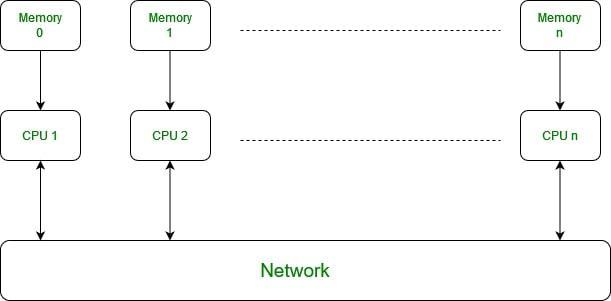

## Table of Contents

## What is Single Program / Multiple Data (SPMD) in the context of machine learning?

Single Program / Multiple Data (SPMD) is a way to make computers work faster by using many processors at the same time. In the context of machine learning, SPMD means that we use the same program on different pieces of data. This is very helpful when we have a lot of data to process, like when we are training a big machine learning model. By splitting the data into smaller parts and processing them at the same time on different processors, we can finish the job much quicker.

For example, if we are training a model to recognize pictures, we can give different processors different pictures to work on. Each processor runs the same training program, but on its own set of pictures. This way, the model can learn from all the pictures faster. SPMD is used a lot in big machine learning projects because it helps to use the power of many processors together to solve hard problems more quickly.

## How does SPMD differ from other parallel processing paradigms?

SPMD is different from other parallel processing ways because it uses the same program on different pieces of data. In contrast, other methods like Multiple Program / Multiple Data (MPMD) use different programs on different data. With SPMD, all the processors run the same code, but they work on different parts of the data at the same time. This makes it easier to manage and coordinate the processors because they are all doing the same thing, just on different data.

Another common parallel processing method is SIMD, or Single Instruction / Multiple Data. In SIMD, all processors do the same thing at the same time, but they do it on different data. The big difference between SPMD and SIMD is that in SPMD, processors can move at different speeds and work on different parts of the program, while in SIMD, they all have to do the same thing at the same time. This makes SPMD more flexible and able to handle more complex tasks, but it can also be harder to manage because the processors are not always in sync.

A third way to process in parallel is called MIMD, or Multiple Instruction / Multiple Data. This method lets different processors run different programs on different data. MIMD is very flexible because each processor can do its own thing, but it can also be hard to manage because the processors are not doing the same thing. SPMD sits in the middle: it's easier to manage than MIMD because all processors run the same program, but it's more flexible than SIMD because processors can work at different speeds and on different parts of the program.

## What are the basic components of an SPMD machine learning system?

The basic components of an SPMD [machine learning](/wiki/machine-learning) system include multiple processors, a shared or distributed memory system, and a communication network. The processors are the main workers in the system. They run the same program but on different pieces of data. This allows them to work together to process large amounts of data quickly. The memory system is where the data and the program are stored. It can be shared among all processors or distributed, where each processor has its own memory. The communication network is what allows the processors to talk to each other and share information or results.

Another key component is the synchronization mechanism. This helps make sure that the processors are working together correctly. Sometimes, processors need to wait for each other to finish certain parts of the program before they can move on. The synchronization mechanism helps manage this. Lastly, there is the data distribution strategy. This decides how the data is split up among the processors. A good strategy can make the system work faster and more efficiently. Together, these components make up an SPMD machine learning system, allowing it to handle big data and complex tasks effectively.

## Can you explain how SPMD is implemented in a typical machine learning workflow?

In a typical machine learning workflow using SPMD, the first step is to divide the data into smaller pieces. This data is then distributed among multiple processors. Each processor runs the same machine learning program, but it works on its own piece of the data. For example, if we are training a model to recognize pictures, different processors would each get a different set of pictures to work on. The program on each processor calculates the model's predictions and updates the model based on these predictions. This happens at the same time on all processors, speeding up the training process.

As the processors work, they need to communicate with each other. This is done through a communication network. The processors share their results and updates with each other, so the model can be updated correctly across all processors. A synchronization mechanism ensures that the processors wait for each other when needed, so the model updates happen in the right order. Once all the data has been processed and the model has been trained, the results from all processors are combined to give the final trained model. This way, SPMD helps to train complex machine learning models much faster than using just one processor.

## What are the advantages of using SPMD in machine learning applications?

Using SPMD in machine learning applications has several big advantages. First, it makes the training of machine learning models much faster. When you have a lot of data, training can take a long time on just one computer. With SPMD, you can use many processors at the same time, each working on a different part of the data. This means you can finish training your model much quicker. For example, if you are training a model to recognize pictures, different processors can work on different pictures at the same time, speeding up the whole process.

Another advantage of SPMD is that it can handle very large datasets. Sometimes, the amount of data you need to train a model is too big to fit on one computer. With SPMD, you can spread the data across many processors, so you can use all of it to train your model. This helps to make your model more accurate because it can learn from more data. Also, SPMD is good at using the power of many processors together, which makes it a great choice for big machine learning projects.

## What challenges might one face when implementing SPMD in machine learning?

One challenge when using SPMD in machine learning is managing how the processors talk to each other. When many processors are working at the same time, they need to share information and updates. This can be hard to manage because if the processors are not in sync, the model might not train correctly. For example, if one processor finishes its part of the data before another, it might need to wait, which can slow things down. Also, the communication network needs to be fast and reliable, or the processors might spend too much time waiting for each other instead of working on the data.

Another challenge is making sure the data is split up in the right way. If the data is not divided evenly among the processors, some might finish their work much faster than others. This can lead to some processors sitting idle while others are still working, which is not efficient. Also, if the data is not split in a way that makes sense for the machine learning task, the model might not learn as well as it could. For example, if you are training a model to recognize pictures, you want to make sure each processor gets a good mix of different types of pictures, not just one type. This can be tricky to get right and might need a lot of testing and tweaking.

## How does SPMD enhance the scalability of machine learning models?

SPMD helps make machine learning models bigger and better by using many processors at the same time. When you have a lot of data to train a model, it can take a long time if you use just one computer. But with SPMD, you can split the data into smaller pieces and give each piece to a different processor. This way, all the processors can work on the data at the same time, making the training much faster. For example, if you are training a model to recognize pictures, different processors can work on different pictures at the same time. This means you can use more data to train your model, which can make it more accurate and better at its job.

Another way SPMD helps with scalability is by handling very large datasets. Sometimes, the amount of data you need to train a model is too big to fit on one computer. With SPMD, you can spread the data across many processors, so you can use all of it to train your model. This is important because the more data your model can learn from, the better it can perform. Also, SPMD is good at using the power of many processors together, which makes it easier to handle big machine learning projects. By making it possible to use more data and more processors, SPMD helps make machine learning models more scalable and powerful.

## What are some common machine learning algorithms that benefit from SPMD?

Many machine learning algorithms can benefit from SPMD because it helps them process large amounts of data faster. For example, [deep learning](/wiki/deep-learning) algorithms like Convolutional Neural Networks (CNNs) and Recurrent Neural Networks (RNNs) often use a lot of data to train. With SPMD, you can split the data among many processors, so they can all work on it at the same time. This makes the training much quicker and allows the model to learn from more data, which can make it more accurate. For instance, when training a CNN to recognize pictures, different processors can work on different pictures, speeding up the whole process.

Another type of algorithm that benefits from SPMD is gradient boosting, which is often used in tasks like regression and classification. Gradient boosting builds many small decision trees and combines them to make predictions. With SPMD, you can have different processors build different trees at the same time, which can make the whole process much faster. This is important because gradient boosting can take a long time to train on large datasets, and SPMD helps make it more manageable. By using SPMD, these algorithms can handle bigger datasets and train more quickly, making them more useful in real-world applications.

## How can SPMD be optimized for performance in machine learning tasks?

To make SPMD work better in machine learning tasks, you can start by making sure the data is split up evenly among all the processors. If some processors get more work than others, they might finish later, making the whole process slower. A good way to do this is to use a smart data distribution strategy. For example, if you are training a model to recognize pictures, you want to make sure each processor gets a good mix of different types of pictures. This way, all processors can work at the same speed and finish at the same time, making the training faster.

Another way to optimize SPMD is by making the communication between processors faster and more efficient. When processors need to share information or updates, they use a communication network. If this network is slow or not working well, the processors might spend too much time waiting for each other instead of working on the data. To fix this, you can use techniques like data compression to make the information smaller and faster to send, or use a better communication network that can handle more data at once. By doing these things, you can make SPMD work better and train your machine learning models faster and more efficiently.

## What are the best practices for debugging SPMD machine learning applications?

Debugging SPMD machine learning applications can be tricky because many processors are working at the same time. A good way to start is by using logging and monitoring tools. These tools help you see what each processor is doing and where problems might be happening. For example, if one processor is taking longer than others, the logs can show you why. You can also use these tools to check if the data is being split up correctly among the processors. If the data is not split evenly, some processors might finish their work much faster than others, which can slow down the whole process.

Another important practice is to test your application on a smaller scale before running it on a large number of processors. This way, you can find and fix problems more easily. Start with just a few processors and see if everything works as expected. If you find any issues, you can fix them before scaling up. Also, using a debugger that can handle parallel processing can be very helpful. These debuggers let you stop the program at certain points and check what each processor is doing. By following these practices, you can make sure your SPMD machine learning application works well and efficiently.

## How does SPMD interact with other distributed computing frameworks in machine learning?

SPMD works well with other distributed computing frameworks in machine learning by using the same program on different pieces of data across multiple processors. For example, frameworks like Apache Spark and Hadoop can be used to manage and process large datasets. SPMD can be integrated into these frameworks to speed up machine learning tasks. In Apache Spark, SPMD can be used in the form of Resilient Distributed Datasets (RDDs), where the same operations are applied to different data partitions. This helps to make the training of machine learning models faster and more efficient, as the data can be processed in parallel across many nodes.

Another way SPMD interacts with distributed computing frameworks is through communication and synchronization. Frameworks like MPI (Message Passing Interface) provide tools for processors to talk to each other and share information. SPMD can use these tools to make sure all processors are working together correctly. For example, during the training of a [neural network](/wiki/neural-network), different processors might need to share their updates to the model's weights. By using MPI, SPMD can ensure these updates happen smoothly and in the right order, helping to improve the overall performance of the machine learning application.

## What future developments can we expect in SPMD for machine learning?

In the future, we can expect SPMD to become even better at handling big machine learning tasks. One way this might happen is through better ways to split up data and manage how processors work together. For example, new algorithms might be developed to make sure data is divided more evenly among processors, so they all finish their work at the same time. Also, smarter communication methods could be created to make it easier for processors to share information quickly and efficiently. These improvements would help make machine learning models train faster and work better, even with huge amounts of data.

Another thing to look forward to is how SPMD might work with new types of hardware. As computers get more powerful and new types of processors are developed, SPMD will need to adapt to use these new resources. For instance, special processors designed just for machine learning, like GPUs and TPUs, could be used more effectively with SPMD. This could lead to even faster training times and the ability to handle even bigger and more complex models. By keeping up with these hardware advancements, SPMD will continue to be a key tool in making machine learning more powerful and useful.

## References & Further Reading

[1]: Gropp, W., Lusk, E., & Skjellum, A. (1999). ["Using MPI: Portable Parallel Programming with the Message Passing Interface."](https://ieeexplore.ieee.org/book/6981847) MIT Press.

[2]: Dean, J., & Ghemawat, S. (2008). ["MapReduce: Simplified Data Processing on Large Clusters."](https://dl.acm.org/doi/10.1145/1327452.1327492) Communications of the ACM, 51(1), 107-113.

[3]: Krizhevsky, A., Sutskever, I., & Hinton, G. E. (2012). ["ImageNet Classification with Deep Convolutional Neural Networks."](https://dl.acm.org/doi/10.1145/3065386) Advances in Neural Information Processing Systems 25.

[4]: Goodfellow, I., Bengio, Y., & Courville, A. (2016). ["Deep Learning."](https://link.springer.com/article/10.1007/s10710-017-9314-z) MIT Press.

[5]: Zaharia, M., Chowdhury, M., Das, T., Dave, A., Ma, J., McCauley, M., Franklin, M. J., Shenker, S., & Stoica, I. (2012). ["Resilient Distributed Datasets: A Fault-Tolerant Abstraction for In-Memory Cluster Computing."](https://dl.acm.org/doi/10.5555/2228298.2228301) Proceedings of the 9th USENIX Conference on Networked Systems Design and Implementation.

[6]: Agakov, F. V., Bonilla, E. V., Lawrence, N. D., & Osborne, M. A. (2004). ["Optimization for Machine Learning"](https://www.academia.edu/10453617/Kernel_Multitask_Learning_using_Task_specific_Features) MIT Press.