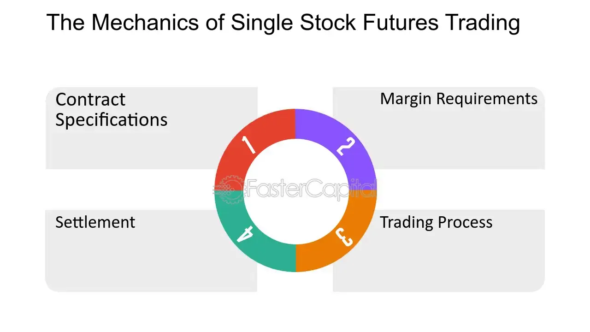

## Table of Contents

## What are single stock futures?

Single stock futures are financial contracts where two parties agree to buy or sell a specific stock at a set price on a future date. They are similar to futures contracts for commodities like oil or wheat, but instead of a physical item, the contract is for shares of a single company's stock. This allows investors to bet on the future price of a stock without actually owning it.

These futures can be used for various purposes. For example, an investor might use them to hedge against potential drops in the stock's price, protecting their investments. Alternatively, speculators might use single stock futures to try to profit from predicted changes in stock prices without having to buy the actual stock. This makes them a versatile tool in the financial markets, but they also come with risks due to their leverage and the potential for significant losses.

## How do single stock futures differ from other types of futures?

Single stock futures are different from other types of futures because they focus on just one company's stock, instead of a whole group of things like commodities or indexes. For example, while commodity futures might be for oil or wheat, a single stock future is for shares of a specific company, like Apple or Microsoft. This means that when you trade single stock futures, you're betting on what will happen to the price of that one company's stock, not on a broader market or product.

Another way single stock futures differ is in how they are used. People might use them to protect their investments in a specific stock, which is called hedging. If someone owns a lot of stock in a company and is worried the price might go down, they can use a single stock future to lock in a price for the future. On the other hand, other types of futures, like commodity futures, are often used by companies to manage the risks of price changes in the things they buy or sell. So, while both types of futures help manage risk, single stock futures are more about individual stocks, and other futures are more about broader market or commodity risks.

## What is the basic mechanism of trading single stock futures?

Trading single stock futures involves agreeing to buy or sell a certain number of shares of a specific company at a set price on a future date. For example, if you think the price of a stock will go up, you can buy a single stock future. This means you agree to buy the stock at today's price, but you don't have to pay for it until the future date. If the stock price goes up as you expected, you can then buy the stock at the lower price you agreed on and sell it at the higher market price, making a profit.

On the other hand, if you think the stock price will go down, you can sell a single stock future. This means you agree to sell the stock at today's price, but you don't have to deliver it until the future date. If the stock price does go down, you can buy the stock at the lower market price and then sell it at the higher price you agreed on, again making a profit. Both buying and selling single stock futures involve risk, because if the stock price moves the opposite way of what you expected, you could lose money.

## Who are the typical participants in the single stock futures market?

The typical participants in the single stock futures market are often investors and traders who want to manage their risk or make money from price changes. Investors might use single stock futures to protect their stock investments. For example, if they own a lot of stock in a company and are worried the price might go down, they can use a single stock future to lock in a price for the future. This helps them avoid big losses if the stock price does drop.

Speculators are another common type of participant. They use single stock futures to bet on what they think will happen to stock prices. If they think a stock's price will go up, they might buy a future. If they think it will go down, they might sell a future. They don't own the actual stock but are trying to make money from the price difference. This can be risky because if their guess about the stock price is wrong, they could lose money.

## What are the benefits of trading single stock futures?

Trading single stock futures can help people manage risk. If you own a lot of stock in a company and are worried the price might drop, you can use a single stock future to lock in a price for the future. This way, even if the stock price goes down, you are protected because you agreed on a price earlier. It's like an insurance policy for your stock, helping you avoid big losses.

Single stock futures also let people make money from price changes without buying the actual stock. If you think a stock's price will go up, you can buy a future. If you're right and the price does go up, you can make a profit. If you think the price will go down, you can sell a future and still make money if you're right. This can be a good way to try to make money, but it's important to remember it's risky because if you guess wrong, you could lose money.

## What are the risks associated with single stock futures?

Trading single stock futures can be risky because they are very sensitive to changes in the stock's price. If you guess wrong about where the stock price is going, you could lose a lot of money. For example, if you buy a future thinking the stock price will go up but it goes down instead, you'll have to buy the stock at a higher price than it's worth on the market, which means you lose money. This risk is bigger because futures use leverage, which means you can control a large amount of stock with a small amount of money, making both gains and losses bigger.

Another risk is that single stock futures have an expiration date. If you don't close your position before the future expires, you might have to buy or sell the actual stock, which could be at a bad time if the price isn't what you expected. This can lead to unexpected losses. Also, because futures markets can be less liquid than stock markets, it might be harder to find someone to trade with, which can make it harder to get out of a position if you need to.

## How are single stock futures priced?

Single stock futures are priced based on the current price of the stock they are for, plus some other factors. The main thing that sets the price is what people think the stock will be worth on the future date when the contract expires. If people think the stock price will go up, the future's price will be higher than the current stock price. If they think it will go down, the future's price will be lower.

Another thing that affects the price of single stock futures is the cost of holding the stock until the future date. This includes things like interest rates and any dividends the stock might pay. If interest rates are high, it costs more to hold the stock, so the future's price will be higher. If the stock pays dividends, the future's price will be lower because the person who buys the stock later won't get those dividends. All these things together help decide the price of a single stock future.

## What are the margin requirements for trading single stock futures?

Trading single stock futures requires you to put up a certain amount of money, called a margin, to cover the risk of the trade. This margin is like a deposit that you have to keep in your account. The exact amount can change depending on the rules of the exchange where you're trading and how much the stock price might move. Usually, the margin is a small part of the total value of the stock you're trading, which means you can control a lot of stock with a little bit of money. This is called leverage, and it can make your gains bigger, but it also makes your losses bigger if things don't go your way.

There are two types of margins you need to know about: the initial margin and the maintenance margin. The initial margin is the amount you need to put up when you first start the trade. The maintenance margin is a smaller amount that you need to keep in your account while the trade is open. If the value of your trade goes down and your account balance falls below the maintenance margin, you'll get a margin call. This means you have to add more money to your account to bring it back up to the initial margin level. If you can't do that, your position might be closed out, and you could lose money.

## How does settlement work for single stock futures?

When a single stock future reaches its expiration date, it has to be settled. There are two main ways this can happen: physical settlement or cash settlement. In physical settlement, the person who bought the future has to buy the actual stock at the price they agreed on, and the person who sold the future has to sell the stock at that price. This means they have to exchange the real shares of the stock. In cash settlement, no actual stock changes hands. Instead, the two people just pay each other the difference between the future's price and the stock's price on the expiration date. If the stock price went up, the buyer gets money from the seller. If it went down, the seller gets money from the buyer.

The way settlement works can affect how people use single stock futures. Physical settlement might be better for someone who wants to own the stock later, while cash settlement is easier for people who just want to bet on the stock's price without dealing with the actual shares. It's important to know which type of settlement your future uses because it can change how much risk you're taking and how you plan your trades.

## What are the regulatory considerations for single stock futures?

Trading single stock futures has to follow rules set by government agencies and financial groups. In the United States, the Commodity Futures Trading Commission (CFTC) and the Securities and Exchange Commission (SEC) both watch over single stock futures. The CFTC makes sure that futures markets work fairly and openly, while the SEC looks after the stock part of the futures. These agencies have rules to stop fraud, protect people who trade, and make sure the market is fair.

There are also rules about how much money you need to trade single stock futures, which is called margin. These rules can change depending on where you're trading and how risky the trade is. Exchanges and clearinghouses, which help make sure trades happen smoothly, also have their own rules. These rules can affect how much money you need to start trading and how much you need to keep in your account while you're trading. It's important to know these rules because they can change how you trade and what risks you take.

## How can single stock futures be used in advanced trading strategies?

Single stock futures can be used in advanced trading strategies to manage risk and make money. One way is through hedging, where an investor who owns a lot of stock in a company can use single stock futures to protect against a drop in the stock's price. For example, if you own shares of a company and are worried the price might go down, you can sell a future for that stock at today's price. If the stock price does fall, you can buy the stock at the lower market price and then sell it at the higher price you agreed on in the future, reducing your losses. This strategy helps investors avoid big losses without selling their stock.

Another way to use single stock futures in advanced strategies is through [arbitrage](/wiki/arbitrage). This is when traders look for price differences between the stock and the future. If the future's price is lower than the stock's price, a trader can buy the future and sell the stock at the same time, making money from the difference. This can be a complex strategy because it involves quick trades and understanding how prices move, but it can be profitable if done right. Both hedging and arbitrage show how single stock futures can be powerful tools in the hands of experienced traders looking to manage risk or take advantage of market opportunities.

## What impact do single stock futures have on the broader financial market?

Single stock futures can affect the broader financial market by helping to set stock prices. When people trade these futures, they are betting on what they think the stock price will be in the future. This can cause the stock price to move because a lot of people trading futures can change what others think about the stock. If many people are buying futures, it might make others think the stock price will go up, which can make the stock price go up too. On the other hand, if many people are selling futures, it might make others think the stock price will go down, which can make the stock price go down.

Single stock futures also help the market work better by letting people manage risk. When investors use futures to protect their stock investments, it can make them feel safer about owning stocks. This can lead to more people buying stocks, which can make the market more active and stable. Also, because futures markets are watched closely by regulators, they help keep the market fair and open. This can make people trust the market more, which is good for the whole financial system.

## References & Further Reading

[1]: Abhyankar, A. H., Ghosh, D., Levin, E. J., & Limmack, R. J. (1997). ["Bid-ask spreads, trading volume and volatility: Intra-day evidence from the London Stock Exchange"](https://papers.ssrn.com/sol3/papers.cfm?abstract_id=5538). Journal of Empirical Finance, 4(2-3), 339-368.

[2]: Burghardt, G., Duncan, R., Liu, L., & Pulli, J. (2004). ["Single Stock Futures: An Overview"](https://www.risk.net/sites/default/files/import_unmanaged/risk.net/data/risk/pdf/investor/0903_risk.pdf). The Journal of Futures Markets.

[3]: Katz, J. O., & McCormick, D. L. (2000). ["The Encyclopedia of Trading Strategies"](https://www.amazon.com/Encyclopedia-Trading-Strategies-Jeffrey-Ph-D/dp/0070580995). McGraw-Hill.

[4]: Murphy, J. J. (1999). ["Technical Analysis of the Financial Markets: A Comprehensive Guide to Trading Methods and Applications"](https://archive.org/details/technicalanalysi0000murp). New York Institute of Finance.

[5]: Narang, R. K. (2009). ["Inside the Black Box: A Simple Guide to Quantitative and High Frequency Trading"](https://onlinelibrary.wiley.com/doi/book/10.1002/9781118267738). John Wiley & Sons.

[6]: Taleb, N. N. (1997). ["Dynamic Hedging: Managing Vanilla and Exotic Options"](https://archive.org/details/dynamichedgingma0000tale). John Wiley & Sons.