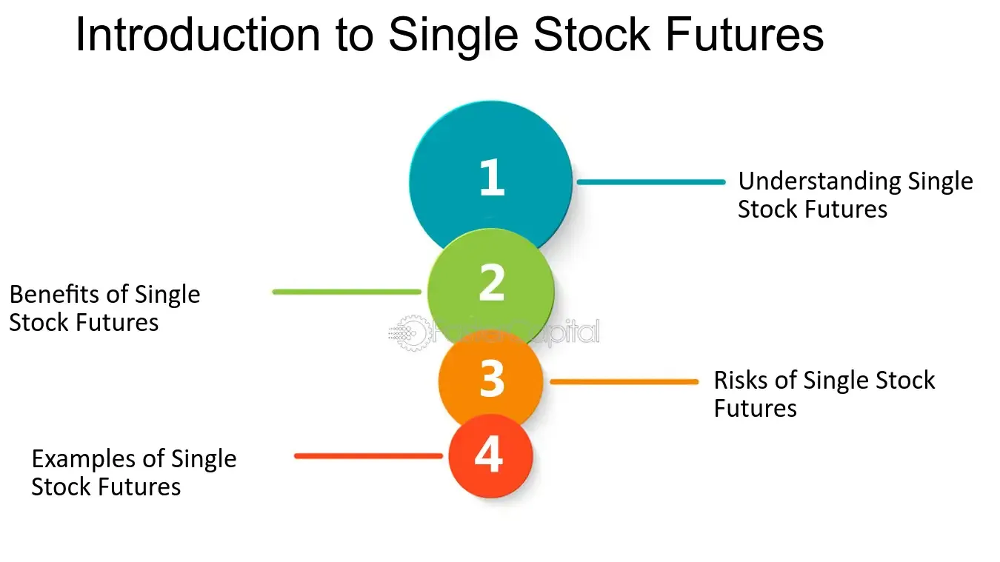

## Table of Contents

## What are single stock futures?

Single stock futures are contracts where you agree to buy or sell a specific stock at a set price on a future date. They are like a bet on where you think the stock price will go. If you think the stock price will go up, you can buy the future now and sell it later for a profit. If you think the price will go down, you can sell the future now and buy it back later at a lower price.

These futures can be useful for investors who want to hedge their investments or speculate on stock prices without owning the actual stock. For example, if you own a stock and are worried its price might drop, you can sell a future on that stock to protect yourself. On the other hand, if you think a stock will rise but don't want to buy the stock itself, you can buy a future instead. However, single stock futures can be risky because they are often traded on margin, meaning you can lose more money than you initially put in if the stock price moves against you.

## How do single stock futures work?

Single stock futures are agreements to buy or sell a specific stock at a set price on a future date. Imagine you think the price of a company's stock will go up. You can buy a single stock future for that stock now. If the stock price does go up by the future date, you can then sell the future for more than you paid, making a profit. On the other hand, if you think the stock price will go down, you can sell a future now. If the price does drop, you can buy it back later at a lower price, also making a profit.

These futures are useful for both protecting your investments and betting on stock prices. If you already own a stock and are worried its price might fall, you can sell a future on that stock to hedge your investment. This means if the stock price drops, the gain from the future can help offset the loss on the stock. But, single stock futures can be risky. They are often traded on margin, which means you only need to put down a small amount of money to enter the contract. If the stock price moves against you, you could lose more money than you initially invested.

## What are the basic requirements for trading single stock futures?

To trade single stock futures, you need to have a brokerage account that allows futures trading. Not all brokers offer this service, so you might need to find a specific one that does. Once you have the right account, you'll need to meet the financial requirements set by the broker and the futures exchange. This usually means having enough money in your account to cover the margin, which is a deposit to enter the futures contract.

Trading single stock futures also involves understanding the contract specifications. Each future has a set size, expiration date, and price. You need to know these details to make informed trades. It's also important to be aware of the risks. Futures are often traded on margin, which means you can lose more money than you initially put in if the stock price moves against you. So, it's a good idea to only trade with money you can afford to lose and to have a clear trading plan.

## What are the main benefits of investing in single stock futures?

Single stock futures can help you make money if you think you know where a stock's price is going. If you think the price will go up, you can buy a future now and sell it later for more money. If you think the price will go down, you can sell a future now and buy it back later for less money. This way, you can bet on stock prices without actually buying the stock itself, which can be cheaper and easier.

Another big benefit is that single stock futures can protect your other investments. If you already own a stock and are worried its price might drop, you can sell a future on that stock. This means if the stock price does go down, the money you make from the future can help cover the loss on your stock. This is called hedging, and it's like buying insurance for your investments.

## What are the potential risks associated with single stock futures?

Single stock futures can be risky because they are often traded on margin. This means you only need to put down a small amount of money to enter the contract, but if the stock price moves against you, you could lose more money than you initially put in. If the stock price goes down a lot, you might have to add more money to your account to keep the future, or the broker might close your position and you could lose a lot of money.

Another risk is that single stock futures can be hard to understand. They have a set size, expiration date, and price, and you need to know these details to trade them well. If you don't understand how they work, you might make bad trades and lose money. Also, the stock market can be unpredictable, and even if you think you know where a stock's price is going, you could be wrong and lose money on your future.

## How can single stock futures be used for hedging purposes?

Single stock futures can be used for hedging to protect your investments from losing value. If you own a stock and you're worried its price might go down, you can sell a future on that stock. This means if the stock price does drop, the money you make from selling the future can help cover the loss on your stock. It's like buying insurance for your stock, so you don't lose as much money if things go wrong.

For example, let's say you own 100 shares of a company, and you think the price might fall in the next month. You can sell a future for those 100 shares that expires in a month. If the stock price does go down, you'll lose money on your shares, but you'll make money on the future. This can help balance out your losses, so you don't lose as much overall. Hedging with single stock futures can give you peace of mind and protect your investments from big drops in value.

## What is the difference between single stock futures and equity options?

Single stock futures and equity options are both ways to bet on or protect against changes in a stock's price, but they work differently. A single stock future is a contract where you agree to buy or sell a stock at a set price on a future date. If you think the stock price will go up, you buy the future now and sell it later for a profit. If you think it will go down, you sell the future now and buy it back later at a lower price. Futures are often traded on margin, meaning you can lose more money than you put in if the stock price moves against you.

Equity options, on the other hand, give you the right, but not the obligation, to buy or sell a stock at a set price before a certain date. There are two types: call options, which let you buy the stock, and put options, which let you sell it. If you buy a call option and the stock price goes up, you can buy the stock at the lower set price and then sell it for a profit. If you buy a put option and the stock price goes down, you can sell the stock at the higher set price and make money. Unlike futures, options limit your risk to the amount you paid for the option, but they also limit your potential profit.

## How does leverage in single stock futures affect potential returns and risks?

Leverage in single stock futures means you can control a big investment with a small amount of money. This can make your potential returns much bigger. If you think a stock's price will go up, you can buy a future with just a small deposit. If the stock price does go up, you can sell the future for a lot more than you paid, making a big profit compared to what you put in.

But, leverage also makes the risks bigger. If the stock price goes down instead of up, you can lose more money than you put in. Because you're trading on margin, you might have to put in more money if the stock price drops a lot, or the broker might close your position and you could lose a lot of money. So, while leverage can help you make more money, it can also lead to bigger losses if things don't go your way.

## What are the tax implications of trading single stock futures?

Trading single stock futures can have tax implications that you need to know about. When you make money from trading futures, it's usually considered a short-term capital gain. This means you have to pay taxes on your profits at your regular income tax rate, which can be higher than the tax rate for long-term capital gains. If you lose money on your trades, you can use those losses to reduce your taxable income, but there are rules about how much you can deduct each year.

The tax rules can be complicated, so it's a good idea to talk to a tax professional. They can help you understand how to report your gains and losses correctly and make sure you're taking advantage of all the tax benefits you can. Remember, tax laws can change, so staying informed or getting professional advice is important when trading single stock futures.

## How do market conditions influence the performance of single stock futures?

Market conditions can really change how well single stock futures do. If the market is doing well and stock prices are going up, the value of your futures can go up too. This is great if you bought futures thinking the stock price would rise. But, if the market is not doing well and stock prices are falling, the value of your futures can drop. This can be bad if you were betting on the stock price going up. Things like economic news, company earnings, and overall market trends can all affect how your futures perform.

Sometimes, big events can cause the market to move a lot in a short time. For example, if a company reports better earnings than expected, its stock price might jump, making your futures more valuable if you bought them. On the other hand, if there's bad news like a company not doing well or a big economic downturn, stock prices can fall fast, hurting the value of your futures if you were betting on a price increase. So, keeping an eye on market conditions and news can help you make better decisions when trading single stock futures.

## What are some advanced strategies for trading single stock futures?

One advanced strategy for trading single stock futures is called spread trading. This involves buying and selling different futures contracts at the same time to reduce risk. For example, you might buy a future for a stock that you think will go up in price, and sell a future for another stock that you think will go down. This way, if one stock doesn't do well, the other might help balance out your losses. Spread trading can help you make money in different market conditions and can be less risky than just betting on one stock.

Another strategy is using single stock futures for [arbitrage](/wiki/arbitrage). This means taking advantage of price differences between the stock and its future. If the future is priced lower than the stock, you can buy the future and sell the stock at the same time. When the future expires, you can use it to buy the stock at the lower price and make a profit from the difference. Arbitrage can be a smart way to make money if you can spot these price differences quickly, but it needs a lot of attention and quick action.

A third strategy is delta hedging, which is a way to manage risk by balancing your futures with the stock itself. If you own a stock and buy a future to hedge it, you need to make sure the future's price movement (its delta) matches the stock's price movement. By adjusting the number of futures you hold, you can keep your overall position stable even if the stock price changes a lot. Delta hedging can be complicated, but it's a powerful tool for managing risk in single stock futures trading.

## How can one effectively manage a portfolio that includes single stock futures?

Managing a portfolio with single stock futures means keeping an eye on both your stocks and futures to make sure they work well together. You need to watch how the stock prices are moving and how that affects your futures. If you think a stock's price is going to go up, you might buy a future to make money if you're right. But if you're worried a stock might go down, you can sell a future to protect your investment. It's important to keep checking your portfolio and making changes as needed. If the market changes or new news comes out, you might need to buy or sell futures to keep your portfolio balanced.

Using strategies like spread trading, arbitrage, and delta hedging can help manage your portfolio better. Spread trading means buying and selling different futures at the same time to reduce risk. Arbitrage is about finding price differences between the stock and its future to make a profit. Delta hedging helps you balance your futures with your stocks to manage risk. These strategies can be a bit tricky, but they can help you make money and protect your investments. Remember, single stock futures can be risky, so it's good to only trade with money you can afford to lose and to always keep learning about the market.

## What are the differences between Single Stock Futures and Stock Options?

Single Stock Futures (SSFs) and stock options are pivotal tools in financial derivatives, utilized by investors to either speculate on future stock price movements or hedge existing positions. While both instruments are grounded in the expectation of future price changes, they differ fundamentally in their structure, execution, and risk profiles.

SSFs represent a binding contract to buy or sell a specified stock at a predetermined future date and price. This contractual obligation means that both parties involved are required to fulfill the contract terms at expiration, regardless of the stock's market price at that time. As a result, SSFs might be preferred by investors who are certain about their market predictions and are willing to face the consequences if the market moves against them.

In contrast, stock options provide the holder with the right, but not the obligation, to buy (call option) or sell (put option) the underlying stock at a specified price on or before a certain date. This asymmetry grants an element of flexibility, allowing option holders to let the contract expire worthless if the market movement is unfavorable, thereby limiting potential losses to the premium paid for the option.

Leverage plays a crucial role in both SSFs and stock options, magnifying the potential for both gains and losses. This leverage allows investors to control a significant amount of stock with a relatively small initial investment. For example, leveraging an SSF or an options contract could be expressed mathematically as:

$$
\text{Leverage} = \frac{\text{Contract Value}}{\text{Required Margin or Premium}}
$$

While the use of leverage offers the possibility of substantial profits, it simultaneously increases the risk of significant losses, especially in volatile markets.

The choice between SSFs and stock options ultimately depends on an investor's risk tolerance and market outlook. Investors who seek defined outcomes and are prepared to meet the obligation at expiration may find SSFs more suitable. Alternatively, those who prefer flexibility and a capped downside risk might opt for stock options, despite the upfront cost of buying the option premium.

In summary, understanding the distinctions between SSFs and stock options is essential for investors who wish to effectively utilize these instruments within their trading strategies. Awareness of their inherent risks and potential rewards enables more informed decision-making regarding hedging strategies or speculative opportunities.

## References & Further Reading

[1]: Chance, D. M., & Brooks, R. (2015). ["An Introduction to Derivatives and Risk Management."](https://books.google.com/books/about/Introduction_to_Derivatives_and_Risk_Man.html?id=b8PgBQAAQBAJ) Cengage Learning.

[2]: Hull, J. C. (2017). ["Options, Futures, and Other Derivatives."](https://www.semanticscholar.org/paper/Options%2C-Futures%2C-and-Other-Derivatives-Hull/89bdee500c8623864fc9eb7a471546aa713acc44) Pearson Education.

[3]: Aldridge, I. (2009). ["High-Frequency Trading: A Practical Guide to Algorithmic Strategies and Trading Systems."](https://www.ahmetbeyefendi.com/wp-content/uploads/2020/07/High-Frequency-Trading-Irene-Aldridge.pdf) Wiley Finance.

[4]: Leising, M. (2010). ["Thirteen Seconds of 'Flash Crash' May 6 Still Baffle SEC."](https://en.wikipedia.org/wiki/2010_Flash_Crash) Bloomberg.

[5]: Narang, R. K. (2013). ["Inside the Black Box: A Simple Guide to Quantitative and High-Frequency Trading."](https://onlinelibrary.wiley.com/doi/book/10.1002/9781118662717) Wiley.