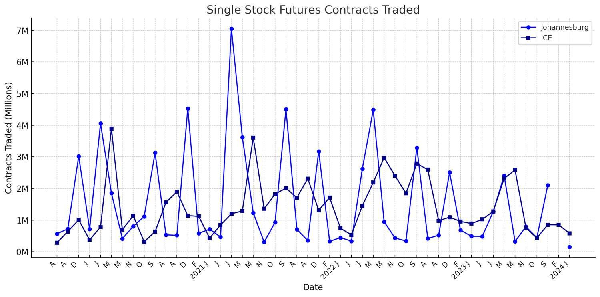

## Table of Contents

## What are single stock futures?

Single stock futures are financial contracts where you agree to buy or sell a specific stock at a set price on a future date. They are similar to futures contracts for commodities like oil or wheat, but instead of a commodity, you're dealing with shares of a single company. This can be useful for investors who want to bet on the future price of a stock without having to own the stock right away.

These futures can be used for different purposes. Some investors use them to hedge, which means they want to protect themselves against potential drops in the stock's price. Others might use them to speculate, hoping to make a profit if the stock's price goes up or down as they expect. It's important to know that trading single stock futures can be risky because the stock's price can be very unpredictable.

## How do single stock futures differ from other types of futures?

Single stock futures are different from other types of futures because they focus on just one company's stock, not on things like oil, gold, or corn. Other futures, like commodity futures, are about buying or selling a certain amount of a product at a future date. But with single stock futures, you're dealing with shares of a specific company. This means that the value of the future depends on how well that one company does, not on the overall market for a product.

Another way single stock futures differ is in how they are used. While commodity futures are often used by businesses to manage the risk of price changes in the things they buy or sell, single stock futures are more commonly used by investors. These investors might want to bet on the future price of a stock without owning it right now, or they might want to protect other investments they have in that stock. This makes single stock futures a tool for both speculation and hedging, but with a focus on individual company performance rather than broader market trends.

## What are the benefits of trading single stock futures?

Trading single stock futures can be a good way to make money if you think you know where a stock's price is going. If you believe a stock will go up in the future, you can buy a single stock future now and sell it later at a higher price. This means you don't have to pay for the stock right away, which can save you money. Also, if you think a stock's price will go down, you can sell a single stock future now and buy it back later at a lower price, making a profit from the difference.

Another benefit is that single stock futures can help you protect other investments. If you own a stock and are worried its price might fall, you can use a single stock future to hedge your risk. This means you can make a deal to sell the stock at a set price in the future, which can help limit how much money you might lose if the stock's price does drop. This way, you can feel more secure about your investments without having to sell your stock right away.

## What are the risks associated with single stock futures trading?

Trading single stock futures can be risky because the price of the stock can change a lot. If you bet that the stock will go up and it goes down instead, you could lose a lot of money. This is called market risk. Since you're dealing with just one company's stock, there's no way to spread out the risk like you might with other types of investments. If something bad happens to that company, like a big scandal or a drop in sales, the stock price could fall a lot, and you could lose more money than you put in.

Another risk is called leverage. When you trade single stock futures, you usually only have to put down a small amount of money upfront, called margin. This means you can control a big position with just a little money. While this can help you make more money if things go your way, it can also make you lose more money if they don't. If the stock price moves against you, you might have to put in more money quickly to keep your position, or you could be forced to close it at a loss. This is known as a margin call, and it can happen fast, leaving you with big losses.

It's also important to think about [liquidity](/wiki/liquidity-risk-premium) risk. Not all stocks have single stock futures available, and even when they do, there might not be a lot of people trading them. This can make it hard to buy or sell the futures when you want to, especially if you need to get out of a position quickly. If there aren't many buyers or sellers, you might have to accept a worse price than you hoped for, which can add to your losses.

## How can someone start trading single stock futures?

To start trading single stock futures, you first need to find a broker that offers these kinds of futures. Not all brokers do, so you might need to do some research. Once you find a broker, you'll need to open an account with them. This usually involves filling out some forms and maybe sending in some documents to prove who you are. After your account is set up, you'll need to put some money into it. This money is called margin, and it's what you use to trade the futures.

Once your account is ready and you have money in it, you can start looking at different single stock futures. You'll need to decide if you want to buy a future (which means you think the stock price will go up) or sell one (which means you think the stock price will go down). When you make your trade, you'll agree to buy or sell the stock at a certain price on a future date. Remember, trading futures can be risky, so it's a good idea to learn as much as you can about the stocks you're interested in and maybe even practice with a demo account before you start trading for real.

## What are the margin requirements for single stock futures?

Margin requirements for single stock futures are the amount of money you need to put down to start trading. This is usually a small percentage of the total value of the futures contract. For example, if a single stock future is worth $10,000, you might only need to put down $1,000 as margin. This is called initial margin, and it's set by the exchange where the futures are traded. The exact amount can change depending on the stock and how much risk the exchange thinks there is.

Once you start trading, you also need to keep enough money in your account to cover any losses. This is called maintenance margin. If the value of your futures goes down and your account balance drops below the maintenance margin level, you'll get a margin call. This means you have to add more money to your account quickly, or the broker might close your position to limit their risk. It's important to keep an eye on your account and be ready to add more money if you need to.

## How are single stock futures priced?

Single stock futures are priced based on what people think the stock will be worth on the date the future expires. The price of the future is usually close to the current price of the stock, but it can be a little different because of things like interest rates, how long until the future expires, and how much the stock's price might move around. If people think the stock will go up, the future's price will be higher than the stock's current price. If they think it will go down, the future's price will be lower.

The price also changes every day as people buy and sell the futures. If more people want to buy the future than sell it, the price will go up. If more people want to sell it than buy it, the price will go down. This is just like how the price of a stock changes on the stock market. So, the price of a single stock future is always moving, trying to guess where the stock will be in the future.

## What strategies can be used when trading single stock futures?

One strategy for trading single stock futures is called hedging. If you own a stock and you're worried its price might go down, you can sell a future on that stock. This way, if the stock price does drop, you can still sell it at the price you agreed on in the future. This helps you lose less money. Another way to hedge is if you're planning to buy a stock later but you think the price might go up before you can. You can buy a future now and lock in the price, so you don't have to pay more later.

Another strategy is called speculating. This is when you think you know where the stock's price is going and you want to make money from it. If you think the stock will go up, you can buy a future now and sell it later at a higher price. If you think it will go down, you can sell a future now and buy it back later at a lower price. This can make you a lot of money if you're right, but it can also make you lose a lot if you're wrong.

A third strategy is called spread trading. This is when you buy and sell futures on the same stock but with different expiration dates. For example, you might buy a future that expires in one month and sell a future that expires in three months. The idea is to make money from the difference in prices between the two futures. This can be less risky than just buying or selling one future, because you're not betting on the stock's price going up or down as much. You're betting on how the prices of the futures will move compared to each other.

## How do dividends and corporate actions affect single stock futures?

Dividends and corporate actions can change the price of single stock futures. When a company pays a dividend, the stock price usually goes down by the amount of the dividend on the day it's paid. This means the price of the future will also go down. To make up for this, the future's price is adjusted before the dividend is paid. This adjustment makes sure that people who own the future don't lose money just because of the dividend. They still get the same value as if they owned the stock.

Corporate actions, like stock splits or mergers, can also affect single stock futures. If a company does a stock split, the number of shares goes up and the price per share goes down. The future's price and the number of shares in the contract will be adjusted to match this change. If there's a merger or acquisition, the future might be changed or even canceled, depending on what happens to the stock. Traders need to keep an eye on these events because they can change the value of their futures and might need them to make new trades or adjust their positions.

## What are the tax implications of trading single stock futures?

Trading single stock futures can have tax effects that you need to think about. When you make money from trading futures, it's usually seen as a short-term capital gain. This means you have to pay taxes on it at the same rate as your regular income. If you lose money, you can use those losses to lower your taxes, but there are rules about how much you can use each year. It's a good idea to keep good records of all your trades so you can report them correctly on your taxes.

Sometimes, the tax rules can be different depending on where you live and how you trade. If you trade a lot and it's your main job, you might be able to treat your trading like a business. This can change how you report your income and what kinds of deductions you can take. It's always smart to talk to a tax professional who can help you understand the rules and make sure you're doing everything right.

## How does the settlement process work for single stock futures?

When it's time for a single stock future to end, it goes through a process called settlement. This can happen in two ways: cash settlement or physical delivery. With cash settlement, you don't actually get the stock. Instead, you get paid the difference between the future's price and the stock's price at the end. If the stock's price is higher than what you agreed on, you get money. If it's lower, you have to pay money. This is easier because you don't have to worry about buying or selling the actual stock.

With physical delivery, you do get the stock. If you bought the future, you have to buy the stock at the price you agreed on. If you sold the future, you have to sell the stock at that price. This can be more complicated because you need to make sure you have the stock or the money to buy it. Most single stock futures use cash settlement because it's simpler and faster. Either way, the settlement happens on the last day of the future's life, and it's important to know which type you're dealing with so you can be ready.

## What are some advanced techniques for managing a portfolio of single stock futures?

One advanced technique for managing a portfolio of single stock futures is using delta hedging. Delta is a measure of how much the price of a future changes when the stock's price changes. By buying or selling the right amount of the stock to match the delta of your futures, you can make your portfolio less risky. This means if the stock's price goes up or down, the value of your futures and the stock you own will balance each other out. It's like having an insurance policy for your futures, but you need to keep adjusting your position because the delta can change over time.

Another technique is called portfolio diversification. Instead of focusing on just one stock, you can spread your money across futures for different stocks. This way, if one stock does badly, the others might do well and help balance out your losses. You can also mix single stock futures with other types of investments, like commodity futures or options, to spread out your risk even more. By diversifying, you're not putting all your eggs in one basket, which can help protect your money and give you more chances to make a profit.

A third technique is using [algorithmic trading](/wiki/algorithmic-trading). This means using computer programs to make trades based on certain rules or patterns. For example, you might set up a program to buy a future when the stock's price hits a certain level, or to sell it when it reaches another level. This can help you make trades faster and more accurately than you could by yourself. It's a good way to take advantage of small changes in the market, but you need to be careful because the market can be unpredictable, and what works one day might not work the next.

## References & Further Reading

[1]: Hull, J. C. (2018). ["Options, Futures, and Other Derivatives"](https://books.google.com/books/about/Options_Futures_and_Other_Derivatives.html?id=yfr0DQAAQBAJ). Pearson.

[2]: Chance, D. M., & Brooks, R. (2015). ["An Introduction to Derivatives and Risk Management"](https://books.google.com/books/about/Introduction_to_Derivatives_and_Risk_Man.html?id=b8PgBQAAQBAJ). Cengage Learning.

[3]: Aldridge, I. (2013). ["High-Frequency Trading: A Practical Guide to Algorithmic Strategies and Trading Systems"](https://www.amazon.com/High-Frequency-Trading-Practical-Algorithmic-Strategies/dp/1118343506). Wiley.

[4]: Black, F., & Scholes, M. (1973). ["The Pricing of Options and Corporate Liabilities."](https://www.cs.princeton.edu/courses/archive/fall09/cos323/papers/black_scholes73.pdf) Journal of Political Economy, 81(3), 637-654.

[5]: Harris, L. (2003). ["Trading and Exchanges: Market Microstructure for Practitioners"](https://academic.oup.com/book/52292). Oxford University Press.

[6]: Carver, R. (2019). ["Systematic Trading: A Unique New Method for Designing Trading and Investing Systems"](https://www.amazon.com/Systematic-Trading-designing-trading-investing/dp/0857194453). Harriman House.

[7]: Patterson, S. (2012). ["Dark Pools: High-Speed Traders, A.I. Bandits, and the Threat to the Global Financial System"](https://dl.acm.org/doi/10.5555/2385786). Crown Business.