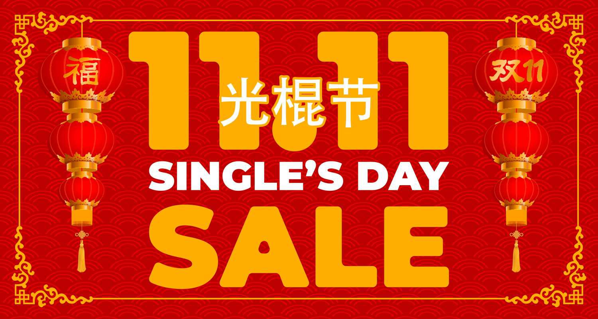

## Table of Contents

## What is Singles' Day?

Singles' Day is a special day that started in China. It happens every year on November 11th. The date, 11/11, looks like four single people standing together, so it's called Singles' Day. It began as a fun day for single people to celebrate being single and to enjoy time with friends.

Now, Singles' Day is also known for big sales and shopping. Many stores in China and around the world offer big discounts on this day. It has become one of the biggest shopping days of the year, even bigger than Black Friday in some places. People buy a lot of things online and in stores, making it a very busy day for shopping.

## When and where did Singles' Day originate?

Singles' Day started in China. It began at Nanjing University in 1993. A group of friends decided to create a day just for single people. They chose November 11th because the date looks like four single people standing together. It was a fun way to celebrate being single and enjoy time with friends.

Over time, Singles' Day grew bigger. It became very popular in China and then around the world. Now, it's not just about celebrating being single. It's also known for huge shopping sales. Stores offer big discounts, and it has become one of the biggest shopping days of the year.

## How is Singles' Day traditionally celebrated?

Singles' Day started as a fun day for single people to celebrate being single. It began at Nanjing University in China. Friends would get together on November 11th to enjoy time with each other. They might go out to eat, watch movies, or do fun activities together. It was a day to enjoy being single and not feel left out because they didn't have a partner.

Over the years, Singles' Day has grown bigger. It's not just about celebrating being single anymore. Now, it's also a big shopping day. Stores offer huge discounts on November 11th, and people buy a lot of things online and in stores. It has become one of the biggest shopping days of the year, even bigger than Black Friday in some places. So, while some people still celebrate being single, many others use the day to shop and take advantage of the sales.

## What are the common symbols associated with Singles' Day?

The most common symbol for Singles' Day is the date itself, 11/11. It looks like four single people standing together, which is why it was chosen for Singles' Day. The four ones represent four single people, making it a fun and easy symbol to remember.

Another symbol often used is the color red. Red is a lucky color in China, and it's used a lot during Singles' Day. You might see red decorations, red clothes, or red shopping bags. It adds to the festive feeling of the day.

## How has Singles' Day evolved since its inception?

Singles' Day started in 1993 at Nanjing University in China. It was a fun day for single people to celebrate being single. Friends would get together on November 11th to enjoy time with each other. They might go out to eat, watch movies, or do other fun activities. It was all about celebrating being single and not feeling left out because they didn't have a partner.

Over time, Singles' Day has changed a lot. It became very popular in China and then around the world. Now, it's not just about celebrating being single. It's also known for huge shopping sales. Stores offer big discounts on November 11th, and people buy a lot of things online and in stores. It has become one of the biggest shopping days of the year, even bigger than Black Friday in some places. So, while some people still celebrate being single, many others use the day to shop and take advantage of the sales.

## What impact has Singles' Day had on global retail?

Singles' Day has had a big impact on global retail. It started as a fun day in China, but now it's one of the biggest shopping days in the world. Stores offer huge discounts on November 11th, and people buy a lot of things online and in stores. This has made Singles' Day a very important day for businesses. They prepare all year for this one day, hoping to sell a lot of products and make a lot of money.

Because of Singles' Day, many stores around the world have started to offer big sales on November 11th too. They want to join in on the shopping fun and attract customers with big discounts. This has changed the way people shop during this time of year. Now, it's not just about celebrating being single; it's also about finding the best deals and buying things you need or want.

## How do different countries celebrate Singles' Day?

In China, Singles' Day started as a fun day for single people to celebrate being single. Friends would get together on November 11th to do fun things like eating out or watching movies. But now, it's also a big shopping day. Stores offer huge discounts, and people buy a lot of things online and in stores. It's become one of the biggest shopping days in China.

Other countries have also started to celebrate Singles' Day, but they do it in different ways. In some places, it's still about celebrating being single. People might go out with friends or do something fun. But in many countries, it's also become a big shopping day. Stores offer big discounts, and people take advantage of the sales. So, while the way it's celebrated can be different, the idea of Singles' Day has spread around the world.

## What are the economic effects of Singles' Day in China?

Singles' Day has a big effect on China's economy. It happens on November 11th every year and has become one of the biggest shopping days in the world. Stores offer huge discounts, and people buy a lot of things online and in stores. This means that businesses make a lot of money on this day. They prepare all year for Singles' Day, hoping to sell as much as they can. The money they make helps the economy grow.

The shopping on Singles' Day also helps other parts of the economy. When people buy things, it creates jobs for people who make and sell those things. It also means more money is moving around in the economy. This can help businesses grow and create more jobs. So, Singles' Day is not just a big shopping day; it's also important for the whole economy in China.

## How do businesses prepare for Singles' Day?

Businesses get ready for Singles' Day all year. They start planning early to make sure they have enough products to sell. They work with factories to make more things and with delivery companies to get the products to customers fast. They also set up special sales and discounts to attract more shoppers. It's a big day for them, so they want to make sure everything goes smoothly.

On Singles' Day, businesses use a lot of advertising to get people excited about their sales. They might have special deals that only last for a short time or offer big discounts on popular items. They also make sure their websites can handle a lot of people shopping at once. This way, customers can buy things easily without waiting too long. It's all about making the shopping experience good so people will come back next year.

## What are the technological advancements that have influenced Singles' Day?

Technological advancements have made a big difference for Singles' Day. One big change is how easy it is to shop online. Websites and apps can handle a lot of people shopping at the same time, so customers can buy things quickly and easily. Also, new ways to pay, like using your phone or apps, make it even easier to shop. These technologies help make Singles' Day a huge shopping day.

Another important technology is how businesses use data to plan for Singles' Day. They look at what people bought in the past to know what to sell this year. They also use technology to send ads to people who might want to buy their products. This helps businesses sell more things and make more money. So, technology has made Singles' Day bigger and better for both shoppers and businesses.

## What are the social and cultural implications of Singles' Day?

Singles' Day started as a fun way for single people in China to celebrate being single. It was a day for friends to get together and enjoy each other's company without feeling left out because they didn't have a partner. Over time, this idea spread to other countries, where people also celebrate being single by spending time with friends or doing fun activities. This shows how Singles' Day has helped to change the way people think about being single, making it something to celebrate rather than feel bad about.

However, Singles' Day has also become a big shopping day. This change has had a big impact on society and culture. Now, many people think of Singles' Day as a time to find good deals and buy things they need or want. This focus on shopping can make people feel pressure to spend money, even if they don't have a lot to spend. It has also made Singles' Day a global event, showing how shopping and consumer culture can spread around the world.

## How can one maximize savings during Singles' Day sales?

To save the most money during Singles' Day sales, start planning early. Look at what you need or want to buy, and make a list. Check out different stores and see what they are offering. Some stores might have better deals than others. Also, sign up for emails or follow stores on social media. They often send out special deals or codes that can help you save more money.

On the day of the sale, be ready to shop early. Some of the best deals might only last for a short time, so you want to be ready to buy them as soon as they start. Use technology to help you. Some apps can tell you when prices drop or when new deals start. Also, think about buying things that you can use for a long time. This way, you are saving money now and in the future.

## What has contributed to the rise of Singles' Day as a shopping phenomenon?

Singles' Day, originally conceived as an informal celebration among Chinese university students, has undergone a remarkable transformation into the largest online shopping phenomenon globally. This day, originally intended to honor the joys of singlehood, gained commercial significance in the late 2000s when major e-commerce platforms identified its potential for retail expansion.

### Transformation from Student Celebration to Global Retail Day

Initially celebrated at Nanjing University in the early 1990s, Singles' Day, observed on November 11 (11/11), was marked by social gatherings among singles, offering an antidote to the pressures of Valentine's Day. Recognizing the potential of this date, Alibaba, China’s largest e-commerce company, reimagined Singles' Day in 2009 as a shopping holiday, offering deep discounts and promotions to attract consumers. Since its inception as a shopping day, the exponential growth in sales and participation has been unprecedented.

### Sales Statistics and Consumer Spending Growth

The evolution of Singles' Day into a major retail event is best illustrated through its sales [statistics](/wiki/bayesian-statistics). For example, Alibaba’s Singles' Day sales have grown from $7.8 million in 2009 to $74.1 billion in 2020, underscoring the massive consumer outreach and participation. The event consistently breaks its own sales records, highlighting significant year-over-year growth in consumer spending. The rate of this increase can be analyzed through the compound annual growth rate (CAGR) formula:

$$
\text{CAGR} = \left( \frac{\text{Ending Value}}{\text{Beginning Value}} \right)^\frac{1}{n} - 1
$$

Taking the sales figures from 2009 to 2020, the CAGR indicates a growth rate exceeding 60%, exemplifying its sharp trajectory. This statistic alone highlights the escalating consumer engagement and the increasing allure of the discounts and promotions offered.

### Key Retailers and Platforms Driving Growth

Alibaba has been central to the growth of Singles' Day. As a pioneer in its commercialization, Alibaba utilized its Taobao and Tmall platforms to create a shopping festival that combines entertainment, social interaction, and commerce. Other e-commerce giants like JD.com have also capitalized on this trend, contributing to the day's expansion. These platforms employ sophisticated marketing strategies and deploy vast data resources to streamline operations, optimize deals, and manage consumer interactions effectively.

Additionally, Singles' Day has attracted a coalition of international brands across various sectors, from electronics to fashion, further driving its global influence. Retailers adopt a blend of exclusive product launches, limited-time offers, and creative marketing campaigns to maximize engagement and sales. The confluence of these strategies has not only sustained but amplified the shopping appeal of Singles' Day, transforming it into a key event on the global retail calendar.

## References & Further Reading

[1]: Reed, J. (2021). ["Alibaba's Singles Day sales hit $84.5 billion, but growth rate slows."](https://www.businessinsider.com/alibaba-record-85-billion-dollars-singles-day-sales-2021-11) CNBC.

[2]: Lopez de Prado, M. (2018). ["Advances in Financial Machine Learning."](https://www.amazon.com/Advances-Financial-Machine-Learning-Marcos/dp/1119482089) Wiley.

[3]: Aronson, D. R. (2006). ["Evidence-Based Technical Analysis: Applying the Scientific Method and Statistical Inference to Trading Signals."](https://www.amazon.com/Evidence-Based-Technical-Analysis-Scientific-Statistical/dp/0470008741) Wiley.

[4]: Jansen, S. (2018). ["Machine Learning for Algorithmic Trading."](https://github.com/stefan-jansen/machine-learning-for-trading) Packt Publishing.

[5]: Chan, E. P. (2013). ["Quantitative Trading: How to Build Your Own Algorithmic Trading Business."](https://github.com/ftvision/quant_trading_echan_book) Wiley.