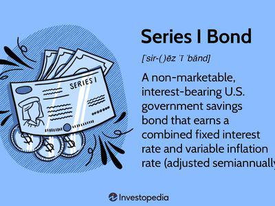

In the evolving landscape of financial investments, sinkable bonds emerge as a robust option for both issuers and investors. These bonds, characterized by their unique structure involving a sinking fund, offer mechanisms that distinguish them from other fixed-income securities. The sinking fund, a reserve set aside by the issuer, serves to repurchase portions of the bond gradually over its term, effectively mitigating the risk of default and offering a structured approach to debt retirement. This feature not only enhances the bond's safety for investors but also facilitates a more predictable debt management strategy for issuers.

Understanding the intricacies of sinkable bonds involves examining how their mechanisms operate within the broader financial markets. These bonds, through their sinking fund structure, provide a form of investor protection and can influence market perceptions of credit risk. Moreover, the interplay between these bonds and market conditions can lead to varying levels of volatility in returns, making them a dynamic component of fixed-income portfolios.



The potential for algorithmic trading to augment investment strategies in sinkable bonds presents exciting opportunities. By leveraging advanced trading systems, investors can optimize returns by capitalizing on market trends and efficiently managing portfolio adjustments in response to shifting interest rates. This integration of technology signifies a modernization of investment approaches, aligning with the contemporary need for agile and informed decision-making.

This introduction sets the stage for a detailed exploration into how sinkable bonds operate and their place in modern finance. By focusing on their mechanisms, benefits, and the strategic advantages they offer, we can appreciate their relevance in today's financial environment. Through understanding these instruments, investors and issuers alike can navigate the complexities of financial markets with greater assurance and insight.

## Table of Contents

## What is a Sinkable Bond?

A sinkable bond is a type of debt security where the issuer commits to setting aside funds at regular intervals to retire a portion of the bond before its maturity. This process is achieved through a mechanism known as a sinking fund, which acts as a financial reserve specifically earmarked for repurchasing parts of the bond over time. By gradually whittling down the principal, sinkable bonds provide a level of security for both issuers and investors.

The essence of a sinkable bond lies in its structured debt retirement strategy. Upon issuance, the issuer allocates part of the bond proceeds or other financial resources into the sinking fund. This fund is used to periodically repurchase bonds, usually at regular intervals, thereby diminishing the outstanding debt obligation. This proactive approach to debt management can be especially beneficial if prevailing interest rates become favorable, allowing issuers to retire debt inexpensively.

The inherent structure of a sinkable bond makes it relatively safer compared to other bonds. Since a portion of the principal is repaid prior to maturity, the risk of a large, lump-sum repayment is alleviated, thus enhancing the bond’s attractiveness to risk-averse investors. Although they provide a level of security, the returns on sinkable bonds can be unpredictable due to fluctuating market conditions, which can affect the timing and price of bond buybacks.

Utilizing a sinking fund has implications on the cost of borrowing for issuers. If interest rates dip, issuers can use the sinking fund more aggressively to repurchase bonds at lower costs, effectively reducing total interest expenses over the life of the bond. This strategic use of funds can improve the issuer’s financial leverage and credit profile, making future bond issuance potentially more attractive to market participants.

Understanding the workings of a sinkable bond involves grasping their dual benefit of capital preservation and potential cost savings. Issuers can better manage cash flows and maintain financial stability through systematic debt reduction, while investors enjoy reduced default risk due to the regular buybacks funded by the sinking mechanism. This structured approach to debt management and investor protection underscores why sinkable bonds remain a preferred choice in varied financial landscapes.

## Advantages of Sinkable Bonds

Sinkable bonds offer distinct advantages for both issuers and investors, solidifying their role as a prudent financial instrument. For issuers, sinkable bonds provide a cost-effective method to manage debt obligations over time. By establishing a sinking fund, issuers can strategically repurchase portions of their debt, which not only stabilizes debt levels but also potentially lowers the cost of borrowing. This structured repayment schedule can enhance the issuer’s credit profile, as regular reductions in outstanding debt are seen favorably by credit rating agencies. This improvement in credit quality can lead to more favorable borrowing terms in the future.

From an investor's perspective, sinkable bonds present a mechanism for risk mitigation. The presence of a dedicated sinking fund acts as a cash reserve, reducing the likelihood of default. This feature makes sinkable bonds particularly attractive to risk-averse investors who prioritize capital preservation. Furthermore, these bonds offer a balanced investment opportunity that combines security with the potential for yield appreciation. As market interest rates and economic conditions evolve, sinkable bonds can provide competitive returns, especially when issuers undertake buybacks at advantageous times.

In addition to reducing default risk, sinkable bonds afford investors greater flexibility in their portfolios. The periodic repurchase of bonds can lead to a more predictable cash flow, and investors can adjust their strategies accordingly to capture potential gains. This flexibility is particularly valuable in volatile market environments, where adaptability can significantly impact investment outcomes.

The structured nature of sinkable bonds, with their regular, planned buybacks, also allows for more precise forecasting and financial planning on the part of both issuers and investors. This predictability can lead to a more stable investment experience, aligning with long-term investment goals and risk management strategies. In summary, sinkable bonds combine safety, flexibility, and the potential for yield, making them a compelling addition to diversified financial portfolios.

## Calculating Yield to Average Life

Sinkable bonds are characterized by their periodic buybacks, which contribute to a reduced duration compared to their stated maturity dates. This characteristic necessitates a distinct method of evaluating potential returns, known as the yield to average life (YAL). The yield to average life provides a more accurate assessment of an investor's expected return given the bond's buyback schedule and prevailing market conditions.

### Understanding Yield to Average Life

To calculate the yield to average life, investors need to evaluate various factors, such as the bond's call schedule, market interest rates, and the schedule of the sinking fund. The yield to average life typically assumes that the bond will be retired at the average life date rather than its final maturity date, accounting for the periodic retirements facilitated by the sinking fund.

### Yield to Average Life Formula

The calculation of the yield to average life involves estimating the bond proceeds' present value from each buyback date instead of the final maturity date. This approach makes it easier to adjust for the bond's earlier redemption.

The formula for yield to average life is typically not a single straightforward equation because it requires iterative methods, often using tools like a spreadsheet or specialized financial software to solve it. However, the core idea involves solving for the discount rate (yield) that equates the present value of the bond's cash flows (including buybacks) to its current market price. This is similar to calculating the yield to maturity but adapted for periodic redemptions.

### Application of Yield to Average Life

Investors use yield to average life to assess the viability of sinkable bonds as an investment. By understanding how call schedules and market rates influence this yield, investors can determine whether the bond offers an adequate return compared to other available investment opportunities.

Here's a simple Python script fragment that demonstrates the iterative calculation of yield to average life using a financial library like NumPy or SciPy:

```python
from scipy.optimize import fsolve
import numpy as np

def cash_flow_present_value(yield_rate, cash_flows, dates):
    return np.sum([cf / (1 + yield_rate)**(d/365) for cf, d in zip(cash_flows, dates)])

def calculate_yield_to_avg_life(price, cash_flows, dates):
    # Define a function for fsolve to find the yield rate that zeros the net present value
    func = lambda yield_rate: cash_flow_present_value(yield_rate, cash_flows, dates) - price
    yield_to_avg_life = fsolve(func, 0.05)[0]  # Initial guess of 5%
    return yield_to_avg_life

# Example usage
current_price = 950
cash_flows = [50, 50, 50, 1050]  # Includes periodic coupons and principal at average life
dates = [365, 730, 1095, 1460]  # Corresponding to annual coupon dates

yield_avg_life = calculate_yield_to_avg_life(current_price, cash_flows, dates)
print(f"Yield to Average Life: {yield_avg_life:.2%}")
```

This code snippet demonstrates calculating the yield to average life for a hypothetical bond with periodic coupon payments and principal repayment at the average life date. By adapting simple calculations like this, investors can better understand this yield metric's nuances and evaluate sinkable bonds' potential returns effectively.

## Example of a Sinkable Bond

In the context of financial management and investment, a practical illustration of a sinkable bond can be observed with the fictional corporation Mars Inc. Suppose Mars Inc. issues $20 million worth of bonds, employing a sinking fund strategy wherein it repurchases a portion of the bonds annually. Each year, the company commits to buying back 5% of the initial principal amount through a sinking fund mechanism.

The annual repurchase amounts equate to:

$$
\text{Annual Repurchase Amount} = \text{Total Bond Issue} \times \text{Repurchase Percentage}
$$

Substituting the given values:

$$
\text{Annual Repurchase Amount} = \$20,000,000 \times 0.05 = \$1,000,000
$$

By repurchasing $1,000,000 of its bonds each year, Mars Inc. provides predictability to its investors. This approach not only stabilizes the company's debt profile but also potentially enhances its bond ratings due to the systematic reduction in outstanding debt. Since the sinkable bond structure allows the issuer to decrease its liabilities gradually, Mars Inc.’s ability to meet financial obligations can positively influence the company's creditworthiness and possibly lower the interest rates demanded by investors for holding the remaining bonds.

The reliable reduction in debt through annual repurchases mitigates the risk of default, which enhances the attractiveness of these bonds to conservative investors seeking reliable income over time. The impact on bond ratings can further lower the borrowing costs for Mars Inc., as investors often equate lower risk with lower yield requirements.

In summary, the case of Mars Inc. shows how a well-structured sinkable bond strategy can offer financial predictability and security for investors, while also improving financial outcomes for the issuer through decreased debt burden and potentially favorable credit terms. This strategic maneuverability is one reason why sinkable bonds are regarded as effective instruments in managing corporate debt.

## Algo Trading and Sinkable Bonds

Algorithmic trading, commonly known as algo trading, refers to the use of computer algorithms to execute trading orders at optimal speeds and prices. In the context of sinkable bonds, [algorithmic trading](/wiki/algorithmic-trading) can significantly enhance investment strategies by leveraging market conditions and improving execution efficiency.

One of the critical features of sinkable bonds is the presence of a sinking fund, which allows issuers to retire the debt in planned stages. This regular buyback and the predictable cash flow provide a fertile ground for algorithmic trading strategies. By monitoring market trends and adjusting for [interest rate](/wiki/interest-rate-trading-strategies) fluctuations, algorithms can optimize decisions on buying or selling bonds based on real-time data.

Automated systems are particularly beneficial in volatile markets, where interest rates can change rapidly. By using pre-set criteria, such algorithms can execute trades instantly, ensuring that investors capitalize on favorable conditions while minimizing exposure to adverse price movements. For instance, when interest rates drop, the value of existing bonds generally rises, creating an opportunity for profit. Algorithmic trading systems can detect such movements and execute trades faster than humanly possible.

Furthermore, integrating algorithmic trading with sinkable bonds involves quantitative models that assess various factors such as yield curves, interest rate changes, and market [liquidity](/wiki/liquidity-risk-premium). These models process historical data and project future market conditions to recommend the best trading strategies. For example, a Python script employing libraries like NumPy and pandas could analyze trends and predict the most opportune times to engage or disengage with sinkable bonds.

```python
import numpy as np
import pandas as pd

def calculate_optimal_trades(bond_data, interest_rate_trend):
    # bond_data: dataframe containing historical bond prices and yields
    # interest_rate_trend: array of recent interest rate changes

    # Example trading strategy: Buy if interest rate trend is downward, sell if upward
    bond_data['decision'] = np.where(interest_rate_trend < 0, 'buy', 'sell')

    return bond_data

# Hypothetical data
bond_data = pd.DataFrame({
    'bond_id': ['B1', 'B2', 'B3'],
    'prices': [100, 105, 102],
    'yields': [0.03, 0.035, 0.032]
})
interest_rate_trend = np.array([-0.01, 0.005, -0.002])

optimal_trades = calculate_optimal_trades(bond_data, interest_rate_trend)
print(optimal_trades)
```

In conclusion, the integration of algorithmic trading with sinkable bonds allows investors to make more informed and timely decisions, capitalizing on the bonds' structured nature and scheduled buybacks. This leads to optimized portfolio management and can significantly improve profitability in a dynamic financial market.

## Conclusion: Sinkable Bonds as a Financial Strategy

Sinkable bonds represent a sophisticated blend of security and potential yield enhancement, making them appealing in turbulent financial environments. By employing a structured repayment approach, these bonds mitigate risk for investors, offering a reliable return mechanism. The fundamental characteristic of sinkable bonds is their reliance on backing funds, often in the form of a sinking fund, which ensures the gradual repayment of principal, thus reducing default risk. This mechanism not only safeguards investors but also aids issuers in managing debt obligations effectively, often leading to improved credit standings.

The integration of algorithmic trading further amplifies the attractiveness of sinkable bonds to investors. Automated trading systems can capitalize on market fluctuations, adjusting portfolios swiftly in response to interest rate changes or emerging market trends. This adaptability is crucial for maximizing returns and optimizing investment strategies. Algorithmic trading algorithms can be designed to utilize predictive analytics and [machine learning](/wiki/machine-learning), ensuring that buybacks are timed to capitalize on market conditions most effectively.

Python, with its extensive libraries like NumPy and pandas, provides robust tools for implementing such strategies. Investors can leverage these tools to build models that predict optimal buy and sell points, process large datasets to identify trends, and execute trades at high speed. A simple Python code snippet could illustrate retrieving market data and executing a buyback strategy:

```python
import numpy as np
import pandas as pd
from sklearn.linear_model import LinearRegression

# Load market data
data = pd.read_csv('market_data.csv')
X = np.array(data['interest_rate']).reshape(-1, 1)
y = np.array(data['bond_price'])

# Model to predict bond prices based on interest rates
model = LinearRegression()
model.fit(X, y)

# Predict price movement
predicted_price = model.predict([[current_interest_rate]])

# Decision (simplified example)
if predicted_price < current_bond_price:
    execute_trade('buyback')
```

In conclusion, sinkable bonds offer a dual advantage: they provide a stable investment foundation through structured repayments and open avenues for enhanced returns through algorithmic trading. This combination of stability and potential growth renders sinkable bonds a versatile instrument in modern financial strategy, catering to both risk-averse and opportunistic investors.

## References & Further Reading

[1]: Fabozzi, F. J. (2007). ["Fixed Income Analysis, Second Edition."](https://books.google.com/books/about/Fixed_Income_Analysis.html?id=lujLawVLS3YC) Wiley.

[2]: Marrison, C. (2002). ["The Fundamentals of Risk Measurement."](https://archive.org/details/fundamentalsofri0000marr) McGraw-Hill.

[3]: "Algorithmic Trading Basics: How Much? How Fast?" (2018). [Investopedia](https://www.ishares.com/us/investor-education/etf-education/what-is-an-etf).

[4]: ["Principles of Managerial Finance"](https://www.pearson.com/en-us/subject-catalog/p/principles-of-managerial-finance/P200000006446/9780136945758) by Lawrence J. Gitman and Chad J. Zutter

[5]: de Prado, M. L. (2018). ["Advances in Financial Machine Learning."](https://www.amazon.com/Advances-Financial-Machine-Learning-Marcos/dp/1119482089) Wiley.