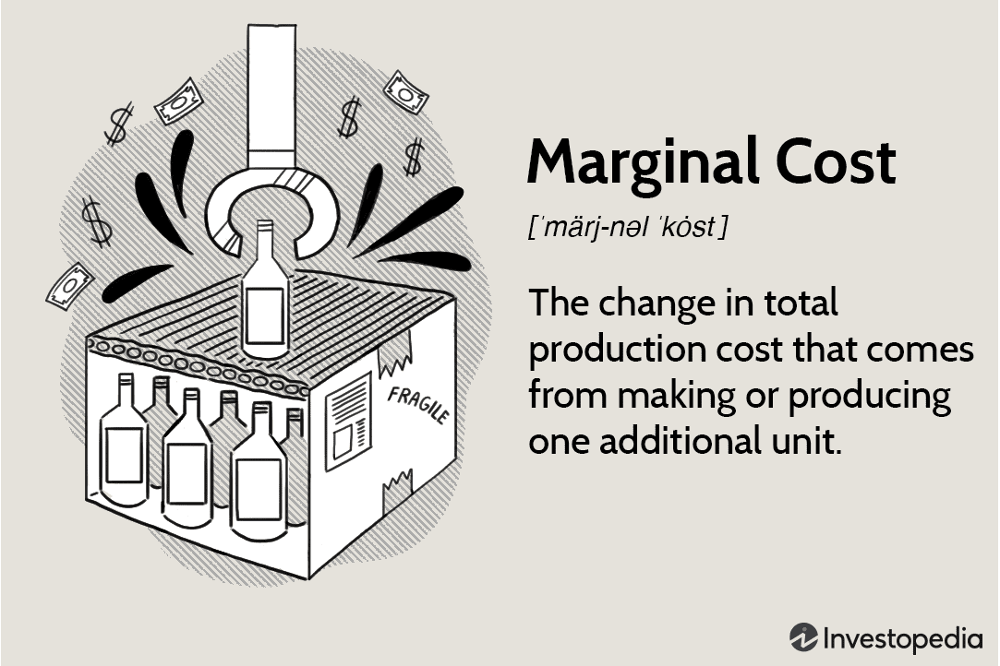

In today's fast-paced financial markets, algorithmic trading, commonly known as algo-trading, has become an essential strategy for both retail and institutional investors. Algo-trading uses advanced mathematical models and high-speed data networks to automate and optimize trading decisions, allowing for enhanced speed, accuracy, and execution. This technological advancement significantly surpasses human capabilities in processing large datasets, recognizing patterns, and executing trades instantaneously, leading to improved market efficiency and liquidity.

The integration of algorithmic trading with advanced bond mechanisms such as sinker bonds highlights its potential to increase efficiency and returns on investment. Sinker bonds, characterized by their structured and periodic capital repayment scheme, offer a reliable option in the vast landscape of fixed-income securities. Unlike traditional bonds, which return the principal at maturity, sinker bonds are backed by a sinking fund, ensuring periodic contributions are set aside by the issuer to redeem parts of the debt before maturity. This reduces default risk and provides more predictable cash flows, which can be advantageous for investors seeking stability in volatile markets.



With their consistent payment schedules and reduced default risk, sinker bonds align well with the algorithmic frameworks designed to assess and respond to financial instruments' inherent risks and yields. The systematic nature of sinker bonds complements algorithms programmed to execute strategic trading decisions based on predefined rules, thus offering an edge in crafting modern trading strategies. By optimizing bond portfolio construction and management through algo-trading, traders can leverage these bonds' features for enhanced risk management and steady returns.

Understanding how sinker bonds and algorithmic trading work together is crucial for traders aiming for deeper insights and effective investment strategies. By integrating these complementary tools, traders can access a comprehensive suite of strategies to target diversified and balanced portfolios. As financial landscapes continue to evolve, this synergy not only empowers traders to make more informed decisions but also enhances the robustness and resilience of their investment portfolios.

## Table of Contents

## Understanding Sinker Bonds

A sinker bond is a type of bond where the issuer is obligated to set aside money periodically to retire a portion of the bond issue before its maturity date. This mechanism helps in minimizing the default risk for bondholders. The defining feature of sinker bonds is the presence of a sinking fund, which assures that regular payments are made towards both principal and interest. This structured approach serves to bolster investor confidence, as it significantly reduces the probability of the issuer defaulting on its obligations.

The key benefit for investors in holding sinker bonds is the enhanced certainty regarding repayment. The structured financial mechanism provided by the sinking fund ensures that the issuer systematically reduces the principal amount owed over time. Consequently, investors are more assured of receiving their invested capital back, reducing the anxiety typically associated with bond investments, particularly during economic downturns.

From the issuer's perspective, the presence of a sinking fund gradually decreases the bond's outstanding liability. By methodically lowering the principal, the issuer's risk profile improves, which could result in more favorable borrowing terms compared to traditional bonds. This reduction in liability over time not only aids in managing debt levels but also enhances the issuer's creditworthiness.

The unique characteristics of sinker bonds make them an attractive investment option for those looking for a stable income stream. They present a reduced reinvestment risk, as the periodic repayments allow investors to reinvest in other opportunities, locking in consistent returns. This can be particularly advantageous in a volatile [interest rate](/wiki/interest-rate-trading-strategies) environment, where traditional bonds might expose investors to the risk of fluctuating returns upon maturity.

Overall, sinker bonds offer a viable investment avenue by combining the regularity and predictability of income with a reduced risk profile, providing a reliable option for diversifying investment portfolios.

## The Role of Sinker Bonds in Algorithmic Trading

Algorithmic trading, often characterized by its speed and precision, leverages sophisticated algorithms to execute trades based on predefined rules. This approach revolutionizes financial markets by minimizing human intervention and errors while optimizing trading efficiency. Sinker bonds, with their systematic and predictable payment structures, integrate seamlessly into these automated trading strategies.

Sinker bonds are particularly advantageous for [algorithmic trading](/wiki/algorithmic-trading) due to their inherent design to reduce issuer liability over time via a sinking fund, which regularly sets aside money to retire portions of the bond issue. This feature provides predictability and stability, both highly valued in algorithmic models. Algorithms can be programmed to account for such predictability, optimizing the timing of buying and selling activities based on the bond’s scheduled redemptions.

The integration of sinker bonds into algo-trading platforms is a powerful strategy for portfolio optimization. By utilizing these bonds, traders can better manage risks associated with default and interest rate fluctuations, which are crucial considerations in bond markets. These platforms are capable of efficiently managing adjustments in yield and maturity strategies that are characteristic of sinker bonds. Algorithms can incorporate functions to analyze market trends and execute trades that align with the bond's redemption schedule, thus enhancing [liquidity](/wiki/liquidity-risk-premium) management.

Moreover, the algorithmic adaptation to the systematic nature of sinker bonds helps in capturing ideal pricing and timing in the bond markets. By taking into account the bond’s redemption timelines within algorithms, traders can strategically adjust their trading positions, ensuring that they capitalize on favorable market conditions. This methodology also facilitates improved market positioning by allowing algorithms to rapidly respond to market developments, thus seizing optimal opportunities for trading sinker bonds.

Here is an example of a Python function that can be used to simulate trading strategies around the predictable redemption schedule of sinker bonds:

```python
def optimal_trade_schedule(bond_issuance, redemption_schedule, market_conditions):
    # Simulate trading decisions based on sinking fund schedules
    trades = []
    cash_flow = 0

    for period, redemption in enumerate(redemption_schedule):
        if market_conditions[period] == 'favorable':
            trade_action = 'buy'
            cash_flow -= bond_issuance * redemption
        else:
            trade_action = 'hold'
        trades.append((period, trade_action, cash_flow))

    return trades

# Example usage
bond_issuance = 1000000  # Example bond issuance amount
redemption_schedule = [0.05, 0.10, 0.15, 0.20, 0.25]  # Example redemption percentages
market_conditions = ['neutral', 'favorable', 'favorable', 'unfavorable', 'favorable']

trading_plan = optimal_trade_schedule(bond_issuance, redemption_schedule, market_conditions)
for plan in trading_plan:
    print(f"Period: {plan[0]}, Action: {plan[1]}, Cash Flow: {plan[2]}")
```

In this example, the `optimal_trade_schedule` function determines trading actions based on market conditions and pre-defined redemption schedules, reflecting how sinker bonds can systematically guide trading decisions.

Overall, combining sinker bonds with algorithmic trading platforms enables more strategic and calculated financial maneuvers, aligning trading activities with the consistent and reliable payment structures offered by these bonds. This approach enhances both risk management and trade efficiency, ultimately contributing to more robust investment portfolios.

## Benefits of Combining Sinker Bonds with Algo-Trading

Combining sinker bonds with algorithmic trading introduces a range of advantages, facilitating enhanced risk management and the potential for consistent returns. The structured nature of sinker bonds, characterized by periodic setting aside of funds by the issuer, aligns well with automated trading systems. This alignment provides a stable base during volatile market conditions, as the fixed-income approach of sinker bonds offers predictable cash flows, thus minimizing market unpredictability's impact.

Algorithmic trading leverages precise, rule-based decision processes, significantly reducing human error and ensuring that trades are executed swiftly and accurately in accordance with the predictable income streams provided by sinker bonds. This reduces discrepancies that human traders might introduce due to emotional and psychological biases. Additionally, the precision offered by algorithmic systems allows for fine-tuned alignment with the cash flow characteristics of sinker bonds, ensuring that trading activities optimize the income and liquidity benefits these bonds offer.

Data analysis capabilities inherent in algorithmic trading systems further refine investment decision-making by effectively incorporating historical and projected yield data of sinker bonds. Algorithms can process vast datasets to identify patterns and optimize trade execution, forecasting potential market shifts and adjusting strategies accordingly. Such computational power enhances the effectiveness of strategies by making informed predictions and adjustments, thus managing interest rate fluctuations better.

The integration of sinker bonds into algorithmic trading strategies fosters diversified investment portfolios, allowing traders to achieve a balanced risk-return ratio. By incorporating sinker bonds within a broader array of financial instruments, traders mitigate potential losses from market [volatility](/wiki/volatility-trading-strategies) while benefitting from reliable income streams. This strategic diversification not only enhances overall portfolio performance but also strengthens the ability to withstand and manage unexpected market events, delivering a resilient investment structure resilient to market turbulence.

## Challenges and Risks

The integration of sinker bonds within algorithmic trading frameworks entails several notable challenges and risks that necessitate careful consideration and management. One primary challenge is the requirement for robust technical infrastructure capable of efficiently processing the intricate bond-related data necessary for the effective execution of trades. High-frequency trading and real-time data analysis demand substantial computational resources and sophisticated software systems. This infrastructure investment is significant, encompassing not just hardware and software, but also the continual maintenance and upgrading of systems to handle increasing volumes of data. 

Market volatility further complicates the algorithmic trading of sinker bonds by introducing unpredictability into price movements and interest rates. This volatility can lead to software malfunctions or glitches, posing substantial risks to algorithmic systems. Such glitches might result in execution errors, delayed trades, and potentially significant financial losses. Consequently, the development and implementation of comprehensive risk management protocols are crucial to mitigate these risks.

Accurately modeling the behavior of sinker bonds within trading algorithms presents another set of challenges. This task requires a deep understanding of both financial markets and advanced programming capabilities. Algorithms must be precisely formulated to reflect the performance characteristics of sinker bonds, such as their structured repayments and yield variability. This demand highlights the need for expertise in quantitative finance and sophisticated strategy development.

Finally, the complexity of navigating regulatory frameworks for both bond markets and automated trading systems can impede the successful integration of these components. Regulatory compliance is mandatory, yet can be intricate due to the diversity of rules governing financial instruments and the rapid evolution of trading technologies. This complexity underscores the necessity for continuous monitoring of regulations and the adaptation of trading strategies to maintain compliance and mitigate legal risks.

## Future Trends and Innovations

The future of algorithmic trading in bond markets is marked by significant advancements, particularly in the realms of [artificial intelligence](/wiki/ai-artificial-intelligence) (AI) and [machine learning](/wiki/machine-learning). These technologies are expected to enhance the effectiveness of trading strategies, allowing traders to implement more sophisticated models that can predict market movements with increased accuracy. One potential innovation is the development of complex algorithms that can dynamically adapt to changes in interest rates, optimizing the timing and execution of trades. By continuously learning from vast datasets, AI-driven models can refine their strategies and improve decision-making processes.

As data analysis technologies advance, there is potential for greater precision in integrating diverse financial instruments, such as sinker bonds, into comprehensive trading strategies. Machine learning algorithms excel at identifying patterns and correlations in historical data, which can be pivotal in formulating strategies that maximize return on investment. For instance, integrating sinker bonds could involve analyzing historical yield patterns and projecting future price movements under various market conditions.

The regulatory environment in bond markets is also anticipated to evolve, which might lead to clearer guidelines and standards for integrating algorithmic trading with traditional financial instruments. As regulatory frameworks adapt to the rapid developments in technology, increased adoption of these integrated strategies is likely. This could lead to a more robust market infrastructure, providing both transparency and security for investors.

Continuous innovation is expected to bridge the gap between traditional financial instruments and modern trading methodologies. By leveraging technological advancements, market participants can drive efficiencies and enhance liquidity management. Moreover, increased computational power and enhanced data processing capabilities will facilitate real-time analysis and execution, offering traders the agility needed to respond promptly to market shifts.

Overall, the convergence of AI and machine learning with algorithmic trading in bond markets promises a future of enhanced analytical capabilities and sophisticated investment strategies, fostering an environment ripe for strategic exploitation and financial growth.

## Conclusion

The integration of sinker bonds into algorithmic trading represents a significant advancement in financial strategies, providing enhanced tools for sophisticated risk management. By combining the structured repayment benefits of sinker bonds with the efficiency and precision of algorithmic trading, investors can harness unique opportunities to improve the resilience and stability of their investment portfolios. Algorithmic platforms, when updated effectively to incorporate the dynamics of sinker bonds, offer traders the ability to adapt to shifts in market conditions with agility and foresight.

However, traders and investors must remain vigilant about the associated risks. Algorithmic systems require careful calibration to avoid potential pitfalls such as software malfunctions or atypical market behaviors that can disrupt trading operations. Awareness and understanding of these risks, coupled with a proactive approach to leveraging the strengths of sinker bonds, are crucial for maximizing investment returns.

This synergy between sinker bonds and algorithmic trading facilitates innovative strategic investments and fosters financial growth. As financial markets continue to undergo rapid transformation, the seamless collaboration of human expertise with algorithmic accuracy will likely set the pace for future trading methodologies. This evolving landscape highlights the vital role algorithms play in complementing traditional financial instruments, enabling traders to achieve both strategic depth and operational efficiency.

## References & Further Reading

[1]: Lopez de Prado, M. (2018). ["Advances in Financial Machine Learning."](https://www.amazon.com/Advances-Financial-Machine-Learning-Marcos/dp/1119482089) Wiley.

[2]: Chan, E. P. (2009). ["Quantitative Trading: How to Build Your Own Algorithmic Trading Business."](https://github.com/ftvision/quant_trading_echan_book) Wiley.

[3]: Jansen, S. (2020). ["Machine Learning for Algorithmic Trading."](https://github.com/stefan-jansen/machine-learning-for-trading) Packt Publishing.

[4]: Fabozzi, F. J. (2007). ["Fixed Income Analysis."](https://www.amazon.com/Fixed-Income-Analysis-Frank-Fabozzi/dp/047005221X) CFA Institute Investment Series.

[5]: Aronson, D. R. (2006). ["Evidence-Based Technical Analysis: Applying the Scientific Method and Statistical Inference to Trading Signals."](https://www.amazon.com/Evidence-Based-Technical-Analysis-Scientific-Statistical/dp/0470008741) Wiley.