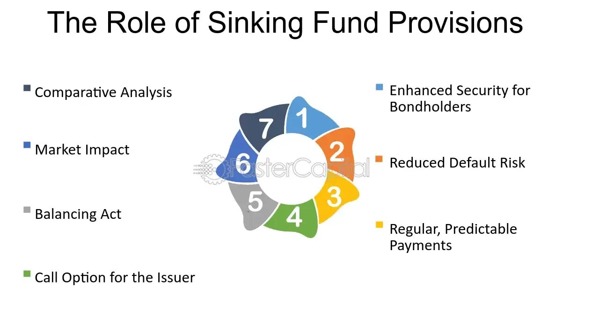

## Table of Contents

## What is a sinking fund call?

A sinking fund call is a feature of some bonds where the issuer can buy back a portion of the bonds before they mature. This is done using money set aside in a special account called a sinking fund. The purpose of this is to reduce the amount of debt the issuer has over time and to make it easier to pay off the bond when it comes due.

The process works by the issuer calling back a certain number of bonds at a set price, usually at par value or a little above it. Bondholders whose bonds are chosen for the call get their money back earlier than expected. This can be good or bad for them, depending on the interest rates at the time and what they planned to do with the money.

## How does a sinking fund work in bond investments?

A sinking fund is like a savings account that a company sets up to pay off its bonds. When a company issues bonds, it agrees to pay back the money it borrowed plus interest over time. To make sure it can do this, the company might put some money aside each year into the sinking fund. This money is used to buy back some of the bonds before they reach their full maturity date. This helps the company manage its debt better and makes sure it has the money ready to pay bondholders when the time comes.

For bond investors, a sinking fund can be both good and bad. On the good side, it shows that the company is serious about paying back its debt, which can make the bonds safer. If your bond gets picked to be bought back early, you get your money back sooner than expected. But, this can also be a downside if interest rates have gone down since you bought the bond. You might have to reinvest your money at a lower rate, which means you earn less over time. So, while a sinking fund can add security, it also adds a bit of uncertainty about when you'll get your money back.

## Why do companies issue bonds with a sinking fund provision?

Companies issue bonds with a sinking fund provision to help manage their debt more safely. By setting aside money regularly into a sinking fund, they make sure they have enough cash to pay back bondholders when the bonds come due. This can make the bonds seem less risky to investors, which might help the company get a better interest rate when they sell the bonds.

Having a sinking fund also helps companies slowly reduce their debt over time. Instead of having to pay back a big amount all at once when the bond matures, they can buy back parts of the bond early. This can make their financial situation more stable and easier to manage. It shows investors that the company is planning ahead and taking steps to handle its debts responsibly.

## What are the benefits of a sinking fund call for bondholders?

A sinking fund call can be good for bondholders because it shows that the company is serious about paying back its debt. When a company sets up a sinking fund, it puts money aside regularly to buy back some of its bonds early. This means that if your bond gets picked, you get your money back sooner than you expected. This can be great if you need the money for something else or if you want to invest it somewhere else.

However, there can also be a downside. If your bond is called back early and interest rates have gone down since you bought the bond, you might have to reinvest your money at a lower rate. This means you could end up earning less money over time. So, while a sinking fund call can add security and give you your money back early, it can also mean you might not get as much interest as you hoped for.

## What are the potential drawbacks of a sinking fund call for investors?

A sinking fund call can be a problem for investors if interest rates have dropped since they bought the bond. If their bond gets called back early, they get their money back sooner than they planned. But now, they might have to put that money into a new investment that pays less interest. This means they could end up earning less money over time than they expected.

Another issue is that investors might lose out on future interest payments. When a bond is called back, the investor only gets the principal and any interest earned up to that point. If the bond was set to pay interest for a longer time, the investor misses out on those future payments. This can be frustrating if they were counting on that steady income from the bond.

## How is the timing of a sinking fund call determined?

The timing of a sinking fund call is set out in the bond's agreement. This agreement says when the company can buy back some of the bonds. It might say that the company can call back bonds every year, or every few years, or at some other set time. The company has to follow these rules, so investors know when to expect a call.

The exact timing can also depend on how much money is in the sinking fund. If the company has saved up enough money, it can call back bonds at the next allowed time. But if there's not enough money yet, the call might be delayed until the fund has enough. This means the timing can be a bit unpredictable, but it's always based on what the bond agreement says and how much money is in the fund.

## Can you explain the process of a sinking fund call?

A sinking fund call happens when a company decides to buy back some of its bonds before they are due. This is done using money that the company has been putting into a special account called a sinking fund. The company looks at the bond agreement to see when it's allowed to call back the bonds. If there's enough money in the fund, the company will call back a certain number of bonds at the next allowed time. The bonds that get called back are usually picked randomly, so some bondholders will get their money back early while others will not.

When a bond is called back, the company pays the bondholder the face value of the bond, or sometimes a little more, as stated in the bond agreement. This means the bondholder gets their money back sooner than they expected. This can be good if they need the money or want to invest it somewhere else. But it can also be bad if interest rates have gone down since they bought the bond. They might have to reinvest the money at a lower rate, which means they'll earn less over time. So, a sinking fund call can be a bit of a surprise, and it affects bondholders in different ways depending on the timing and the interest rates.

## What are the typical terms and conditions associated with a sinking fund call?

The terms and conditions of a sinking fund call are written in the bond agreement. They tell the company when and how it can use the money in the sinking fund to buy back bonds. Usually, the company can call back a certain number of bonds at set times, like every year or every few years. The price the company pays for the bonds is also written in the agreement. It's often the face value of the bond, but it can be a bit more.

The bonds that get called back are picked randomly. This means some bondholders get their money back early, while others keep their bonds until they mature. The agreement also says how the company decides which bonds to call back. If there's not enough money in the sinking fund at the planned time, the call might be delayed until there's enough money. This makes the timing a bit unpredictable, but it's all based on what the bond agreement says and how much money is in the fund.

## How does a sinking fund call affect the yield of a bond?

A sinking fund call can change the yield of a bond. Yield is like the return you get on your investment. If a bond gets called back early because of a sinking fund call, you get your money back sooner than you expected. This can be good if you need the money or want to invest it somewhere else. But if interest rates have gone down since you bought the bond, you might have to put your money into a new investment that pays less interest. This means you could end up earning less money over time than you planned.

On the other hand, if your bond isn't called back, the yield stays the same. You keep getting the interest payments until the bond matures. But knowing that the bond could be called back at any time can make the bond seem riskier. This might make the bond less attractive to some investors, which could affect how much they're willing to pay for it. So, a sinking fund call can make the yield of a bond go up or down, depending on what happens and what the interest rates are doing.

## Can you provide examples of bonds that have used sinking fund calls?

One example of a bond that used a sinking fund call is a bond issued by Ford Motor Company. Ford issued bonds with a sinking fund to help manage its debt better. The company put money into the sinking fund each year, and then used that money to buy back some of the bonds before they matured. This helped Ford pay off its debt slowly over time and made the bonds safer for investors. If an investor's bond was called back, they got their money back early, which could be good or bad depending on the interest rates at the time.

Another example is a bond issued by General Electric (GE). GE used a sinking fund call to reduce its debt and show investors that it was serious about paying back its bonds. The company set aside money regularly into the sinking fund and then used that money to call back some of the bonds at set times. This helped GE manage its finances more smoothly and made the bonds more attractive to investors. If a bondholder's bond was picked for the call, they got their money back sooner than expected, which could affect their investment plans depending on the current interest rates.

## What strategies can investors use to manage the risks associated with sinking fund calls?

Investors can manage the risks of sinking fund calls by carefully reading the bond agreement to understand when and how the company might call back the bonds. Knowing the timing and terms can help investors plan better. They can also think about how likely it is that their bond will be called back. If interest rates are going down, there's a bigger chance the company will use the sinking fund to call back bonds early. By keeping an eye on interest rates, investors can guess when a call might happen and plan what to do with their money if it does.

Another strategy is to diversify their investments. Instead of putting all their money into one bond, investors can spread it out across different bonds and other types of investments. This way, if one bond gets called back early, it won't affect their whole investment plan. They can also look for bonds with different sinking fund terms or no sinking fund at all. This can help balance out the risks and make sure they still get the returns they want, even if some bonds get called back earlier than planned.

## How do sinking fund calls compare to other types of bond redemption mechanisms?

Sinking fund calls are one way a company can pay back its bonds early. They work by the company putting money into a special account, called a sinking fund, and then using that money to buy back some of the bonds before they're due. This is different from other redemption methods like a call option, where the company can decide to pay back all the bonds at once if it wants to. With a sinking fund call, the company buys back the bonds little by little over time, which can help them manage their debt better and make the bonds safer for investors.

Another type of bond redemption is a put option, which lets the bondholder decide to get their money back early instead of the company. With a put option, if the bondholder thinks they can get a better deal somewhere else or if they need the money, they can ask the company to pay them back before the bond matures. This is different from a sinking fund call because it gives the power to the bondholder, not the company. Each of these redemption methods has its own pros and cons, and they affect how investors think about the risks and rewards of the bond.

## What is the role of sinking funds in bond investments?

Sinking funds are financial mechanisms set up by bond issuers with the purpose of systematically setting aside money to retire debt. This proactive approach serves multiple functions and benefits both the issuer and the investors. From the issuer's perspective, establishing a sinking fund demonstrates a commitment to managing debt responsibly, which can enhance the issuer's creditworthiness. For investors, these funds act as a safety net against default, ensuring that there is a predefined pool of money available for redemption of bonds. This feature provides a layer of security, making such investments attractive due to the reduced default risk.

The impact of sinking funds on bond pricing and yields is noteworthy. When a bond is issued with a sinking fund provision, it often leads to more stable returns for investors. This stability arises because the sinking fund helps to mitigate credit risk, which is a significant component of bond yield. Consequently, bonds with sinking funds might offer lower yields compared to those without, reflecting the lower risk to investors.

Moreover, sinking funds can alleviate [volatility](/wiki/volatility-trading-strategies) in bond pricing. By assuring that a portion of the bonds will be retired over a specified period, the issuers help to stabilize the supply and demand dynamics in the market for those bonds. This planned absorption reduces uncertainty about future bond prices, subsequently decreasing price volatility.

In mathematical terms, consider the cash flow associated with the sinking fund as periodic payments contributing to a fund that will be used to buy back bonds. If an investor is evaluating the present value of these future cash flows, it aligns closely with the pricing of annuities. The formula to calculate the present value of sinking fund contributions can be expressed as:  

$$
PV = C \times \left( \frac{1 - (1 + r)^{-n}}{r} \right)
$$

where $PV$ is the present value of the sinking fund payments, $C$ is the contribution per period, $r$ is the interest rate per period, and $n$ is the total number of periods.

This formula helps investors understand how much the sinking fund provision adds to the bond's security and its implications on yields. It highlights why bonds with such provisions may have different pricing dynamics compared to those without them.

Incorporating sinking funds into bonds not only assists issuers in managing their debt more predictably but also incentivizes investors with potentially lower risk and stable returns, making them a critical component in bond investments.

## What are the risks and rewards of callable bonds?

Callable bonds are a distinct type of fixed-income security, offering both risks and rewards for investors. These bonds include a call provision, enabling the issuer to redeem them before they reach their full maturity, often at a predetermined call price. This early redemption feature serves as a strategic tool for issuers to manage their debt profiles, particularly in favorable interest rate environments.

One of the primary rewards of investing in callable bonds is their typically higher yields compared to non-callable bonds. This higher yield serves as compensation for investors, who face the risk of early redemption. When an issuer calls a bond, investors must reinvest the principal received, potentially at a lower rate of return, if prevailing interest rates have declined. Consequently, reinvestment risk is a significant consideration when investing in callable bonds.

$$
\text{Yield Spread} = \text{Yield}_{\text{Callable}} - \text{Yield}_{\text{Non-Callable}}
$$

Investors must assess whether the additional yield adequately compensates for the possibility of having to reinvest at lower yields. This evaluation hinges significantly on the interest rate environment. In a rising interest rate context, the likelihood of bonds being called diminishes, protecting investors from reinvestment risk. Conversely, in a falling interest rate environment, the risk of bonds being called increases, as issuers seek to refinance at lower rates.

Understanding the intricacies of callable bonds also necessitates a consideration of interest rate projections. Investors often use algorithmic models to predict interest rate movements and assess the probability of a bond being called:

```python
import numpy as np

def bond_call_probability(current_rate, call_rate, volatility):
    """Estimate probability of bond call based on interest rate movements."""
    # Simple probabilistic model assuming normal distribution
    z_score = (current_rate - call_rate) / volatility
    return 1 - norm.cdf(z_score)

# Example usage
current_rate = 0.03  # 3%
call_rate = 0.04     # 4%
volatility = 0.01    # 1%

probability_of_call = bond_call_probability(current_rate, call_rate, volatility)
```

In evaluating callable bonds, investors need to balance the potential for higher yields with the strategic implications of call risks. They must also consider the role of monetary policy and its impact on interest rates when forming their investment strategies. Callable bonds remain an intricate yet potentially rewarding component of a diversified bond portfolio, where the investor's perception of forthcoming interest rate trends plays a pivotal role in decision-making.

## References & Further Reading

[1]: Fabozzi, F. J. (2012). ["Bond Markets, Analysis and Strategies"](https://books.google.com/books/about/Bond_Markets_Analysis_and_Strategies_ten.html?id=bQpNEAAAQBAJ). Pearson.

[2]: Choudhry, M. (2010). ["The Bond & Money Markets: Strategy, Trading, Analysis"](https://www.sciencedirect.com/book/9780750646772/the-bond-and-money-markets). Butterworth-Heinemann.

[3]: Lopez de Prado, M. (2018). ["Advances in Financial Machine Learning"](https://www.amazon.com/Advances-Financial-Machine-Learning-Marcos/dp/1119482089). Wiley.

[4]: Chan, E. (2009). ["Quantitative Trading: How to Build Your Own Algorithmic Trading Business"](https://github.com/ftvision/quant_trading_echan_book). Wiley.

[5]: Sundaresan, S. (2009). ["Fixed Income Markets and Their Derivatives"](https://shop.elsevier.com/books/fixed-income-markets-and-their-derivatives/sundaresan/978-0-12-370471-9). Academic Press.

[6]: Aronson, D. R. (2007). ["Evidence-Based Technical Analysis: Applying the Scientific Method and Statistical Inference to Trading Signals"](https://onlinelibrary.wiley.com/doi/book/10.1002/9781118268315). Wiley.

[7]: Jansen, S. (2020). ["Machine Learning for Algorithmic Trading"](https://github.com/stefan-jansen/machine-learning-for-trading). Packt Publishing.