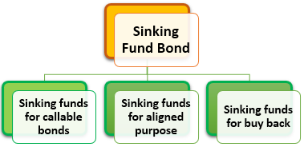

The financial landscape offers a variety of investment opportunities, each with its own unique characteristics and potential benefits. Among these, bond investments stand out for their ability to provide stable returns and capital preservation. Notably, bonds with call provisions and sinking funds present intriguing options for investors seeking to balance risk and reward.

Bond call provisions are features that allow the issuer to redeem the bonds before their maturity date. This can be beneficial for issuers aiming to refinance their debt under better interest rates but introduces a degree of reinvestment risk for investors, as their holdings can be unexpectedly redeemed when interest rates fall. To illustrate, if a bond with a 5% coupon is called when prevailing rates drop to 3%, the investor is compelled to reinvest the proceeds at the lower rate, impacting their income stream.



Sinking funds, on the other hand, are assets set aside by issuers to repay bond obligations gradually. These funds serve as a mechanism for mitigating default risk, offering investors a form of security while also potentially influencing bond yields. By providing a pre-planned redemption strategy, sinking funds can stabilize bond prices and lessen volatility in the market.

The integration of these features within bond instruments underscores the complexity and strategic depth of fixed-income investing. Furthermore, the advancement of technology allows for more sophisticated approaches to managing these investments. Algorithmic trading strategies, for example, are increasingly being employed in the bond markets to optimize and execute trades with precision and speed, taking into account factors such as call provisions and the existence of sinking funds.

This article will explore the multifaceted investment landscape characterized by bond call provisions, sinking fund investments, and the innovative use of algorithmic trading strategies. Understanding the interplay of these elements is crucial for investors aiming to navigate the intricate bond market effectively.

## Table of Contents

## Understanding Bond Call Provisions

A bond call provision is an embedded feature within a bond contract that grants the issuer the right, but not the obligation, to repurchase and retire the bond before it reaches its scheduled maturity date. This option can be exercised under predetermined terms, which include specific dates and prices. 

The primary advantage for issuers is financial flexibility. By calling bonds early, issuers can take advantage of lower prevailing interest rates, effectively refinancing their debt obligations at a reduced cost. For instance, if the market interest rates drop below the coupon rate of the bond, it becomes economically viable for the issuer to call the bond, repay the principal to investors, and issue new bonds at the lower [interest rate](/wiki/interest-rate-trading-strategies). This strategic refinancing can lead to significant interest savings over time.

However, for investors, call provisions introduce a specific reinvestment risk. If the bond is called in a low-interest rate environment, investors are faced with the challenge of reinvesting the principal received at yields lower than the original bond. This can diminish the expected income from their investments and potentially alter their portfolio's risk-return profile.

In addition, callable bonds often feature call protection periods- a timeframe within which the bond cannot be called. This grants investors a degree of predictability regarding cash flows. Yet, once this period ends, the uncertainty associated with potential calls resumes, influencing the bond's duration and convexity - key factors in bond pricing and risk assessment. Callable bonds tend to have higher yields compared to non-callable bonds to compensate investors for the additional risk of early redemption.

Investors should thoroughly assess the terms of the call provision, the interest rate environment, and the issuer's credit quality when considering callable bonds, as these factors collectively determine the likelihood of a call event and its potential impact on investment performance.

## The Role of Sinking Funds in Bond Investments

Sinking funds are financial mechanisms set up by bond issuers with the purpose of systematically setting aside money to retire debt. This proactive approach serves multiple functions and benefits both the issuer and the investors. From the issuer's perspective, establishing a sinking fund demonstrates a commitment to managing debt responsibly, which can enhance the issuer's creditworthiness. For investors, these funds act as a safety net against default, ensuring that there is a predefined pool of money available for redemption of bonds. This feature provides a layer of security, making such investments attractive due to the reduced default risk.

The impact of sinking funds on bond pricing and yields is noteworthy. When a bond is issued with a sinking fund provision, it often leads to more stable returns for investors. This stability arises because the sinking fund helps to mitigate credit risk, which is a significant component of bond yield. Consequently, bonds with sinking funds might offer lower yields compared to those without, reflecting the lower risk to investors.

Moreover, sinking funds can alleviate [volatility](/wiki/volatility-trading-strategies) in bond pricing. By assuring that a portion of the bonds will be retired over a specified period, the issuers help to stabilize the supply and demand dynamics in the market for those bonds. This planned absorption reduces uncertainty about future bond prices, subsequently decreasing price volatility.

In mathematical terms, consider the cash flow associated with the sinking fund as periodic payments contributing to a fund that will be used to buy back bonds. If an investor is evaluating the present value of these future cash flows, it aligns closely with the pricing of annuities. The formula to calculate the present value of sinking fund contributions can be expressed as:  

$$
PV = C \times \left( \frac{1 - (1 + r)^{-n}}{r} \right)
$$

where $PV$ is the present value of the sinking fund payments, $C$ is the contribution per period, $r$ is the interest rate per period, and $n$ is the total number of periods.

This formula helps investors understand how much the sinking fund provision adds to the bond's security and its implications on yields. It highlights why bonds with such provisions may have different pricing dynamics compared to those without them.

Incorporating sinking funds into bonds not only assists issuers in managing their debt more predictably but also incentivizes investors with potentially lower risk and stable returns, making them a critical component in bond investments.

## Risks and Rewards of Callable Bonds

Callable bonds are a distinct type of fixed-income security, offering both risks and rewards for investors. These bonds include a call provision, enabling the issuer to redeem them before they reach their full maturity, often at a predetermined call price. This early redemption feature serves as a strategic tool for issuers to manage their debt profiles, particularly in favorable interest rate environments.

One of the primary rewards of investing in callable bonds is their typically higher yields compared to non-callable bonds. This higher yield serves as compensation for investors, who face the risk of early redemption. When an issuer calls a bond, investors must reinvest the principal received, potentially at a lower rate of return, if prevailing interest rates have declined. Consequently, reinvestment risk is a significant consideration when investing in callable bonds.

$$
\text{Yield Spread} = \text{Yield}_{\text{Callable}} - \text{Yield}_{\text{Non-Callable}}
$$

Investors must assess whether the additional yield adequately compensates for the possibility of having to reinvest at lower yields. This evaluation hinges significantly on the interest rate environment. In a rising interest rate context, the likelihood of bonds being called diminishes, protecting investors from reinvestment risk. Conversely, in a falling interest rate environment, the risk of bonds being called increases, as issuers seek to refinance at lower rates.

Understanding the intricacies of callable bonds also necessitates a consideration of interest rate projections. Investors often use algorithmic models to predict interest rate movements and assess the probability of a bond being called:

```python
import numpy as np

def bond_call_probability(current_rate, call_rate, volatility):
    """Estimate probability of bond call based on interest rate movements."""
    # Simple probabilistic model assuming normal distribution
    z_score = (current_rate - call_rate) / volatility
    return 1 - norm.cdf(z_score)

# Example usage
current_rate = 0.03  # 3%
call_rate = 0.04     # 4%
volatility = 0.01    # 1%

probability_of_call = bond_call_probability(current_rate, call_rate, volatility)
```

In evaluating callable bonds, investors need to balance the potential for higher yields with the strategic implications of call risks. They must also consider the role of monetary policy and its impact on interest rates when forming their investment strategies. Callable bonds remain an intricate yet potentially rewarding component of a diversified bond portfolio, where the investor's perception of forthcoming interest rate trends plays a pivotal role in decision-making.

## Algorithmic Trading Strategies in Bond Markets

Algorithmic trading employs sophisticated computer algorithms to automate and enhance trading strategies with speed and precision. These algorithms analyze vast data sets to identify trading opportunities and execute orders, minimizing human intervention. In bond markets, particularly where options and specific features like call provisions and sinking funds are significant, [algorithmic trading](/wiki/algorithmic-trading) provides an opportunity for investors to optimize decision-making processes.

Bond call provisions, which grant issuers the right to repurchase bonds before maturity, introduce complexities that algorithms can adeptly handle. These provisions allow issuers to refinance debt under more favorable market conditions, posing a reinvestment risk for investors. Algorithmic trading systems can evaluate historical and real-time data on interest rates, market trends, and issuer behavior to predict the likelihood of bonds being called. This predictive capability enables investors to adjust portfolios proactively, mitigating the adverse impact of reinvestment risk.

Sinking funds, another critical feature, require issuers to periodically set aside funds to retire portions of the debt before maturity. This can affect bond pricing and perceived risk. Algorithms can assess the interaction between sinking fund schedules and market interest rates, thus helping investors anticipate changes in bond pricing due to pre-scheduled fund allocations. By analyzing data trends, these algorithms can recommend optimal entry or [exit](/wiki/exit-strategy) points in the bond market, aligning with investor risk preferences and yield expectations.

Python, given its robust ecosystem of scientific libraries such as NumPy, pandas, and SciPy, provides a suitable platform for developing these algorithmic strategies. For instance, an algorithm may use time series analysis to model interest rate movements, evaluate the probability of a bond being called, and assess the implications of sinking fund allocations. Below is a simple example of how Python can be used to assess bond call likelihood:

```python
import numpy as np
import pandas as pd
from sklearn.linear_model import LogisticRegression

# Sample data: Interest rates and historical call outcomes (0 for not called, 1 for called)
data = {
    'interest_rate': [2.5, 3.0, 3.5, 2.0, 4.0],
    'called': [0, 1, 1, 0, 1]
}

# Convert to DataFrame
df = pd.DataFrame(data)

# Define features and target
X = df[['interest_rate']]
y = df['called']

# Train logistic regression model
model = LogisticRegression()
model.fit(X, y)

# Predict call likelihood for a new interest rate
new_rate = np.array([[2.7]])
predicted_prob = model.predict_proba(new_rate)[0][1]

print(f"Predicted probability of bond being called at 2.7% interest rate: {predicted_prob:.2f}")
```

This simple model predicts the probability of a bond being called given an interest rate input, based on historical data. While this is a basic representation, in practice, models would incorporate more variables and utilize more sophisticated statistical methods to enhance predictive accuracy.

Overall, the application of algorithmic trading in evaluating call provisions and sinking funds underscores the potential for data-driven strategies in managing bond investments. This approach not only enables precise execution of trades but also allows investors to dynamically adapt to market fluctuations, optimizing yield and reducing risks associated with callable bonds.

## Implementing a Diversified Investment Strategy

Diversification plays a pivotal role in managing the distinct risks associated with callable bonds. Callable bonds, by virtue of their embedded call options, expose investors to unique challenges, prominently reinvestment risk. This risk emerges when issuers call back bonds in low-interest-rate environments, leaving bondholders with capital to reinvest at lower yields. By adopting a diversified strategy, investors can effectively mitigate these risks and optimize their portfolio's performance.

Varying maturities and credit qualities is a fundamental strategy when diversifying within callable bond investments. Differentiating maturities helps spread reinvestment risk across different timelines, reducing the impact of any single interest rate scenario. Consider a well-staggered bond portfolio comprising short, medium, and long-term bonds. Such a structure ensures continuous cash flows without overexposure to any single maturity horizon.

Credit quality variation is another critical diversification aspect. Investing in bonds across the credit spectrum—from high-grade government-backed securities to lower-grade corporate bonds—allows for a balance between risk and potential returns. Higher-rated bonds generally offer stability, while lower-rated bonds might provide higher yields to compensate for increased risk. An optimal mix aligns with the investor's risk tolerance and financial objectives.

Analyzing sinking fund schedules is another essential element in diversification. Sinking funds are periodic payments made by bond issuers into a separate account to repay part or all of the bond's principal before maturity, acting as a risk mitigation measure. Understanding these schedules helps investors anticipate cash flows and adjust their portfolios accordingly. Bonds with robust sinking fund provisions can offer additional security and stability, appealing to risk-averse investors.

Market forecasts and interest rate predictions must also be integrated into the diversification strategy. Leveraging predictive analytics enables investors to make informed decisions regarding potential call events and reinvestment conditions. Utilizing tools such as Python, investors can simulate various interest rate scenarios and their impact on callable bonds. The following Python snippet illustrates a simple simulation model for assessing interest rate impacts:

```python
import numpy as np

def simulate_interest_rate_effects(initial_rate, volatility, num_years, num_simulations):
    simulations = []
    for _ in range(num_simulations):
        rates = [initial_rate]
        for _ in range(num_years):
            change = np.random.normal(0, volatility)
            rates.append(rates[-1] + change)
        simulations.append(rates)
    return np.array(simulations)

# Parameters
initial_rate = 0.03  # 3% initial interest rate
volatility = 0.01    # Volatility in interest rates
num_years = 10       # Simulation over 10 years
num_simulations = 1000  # Number of simulations

simulated_rates = simulate_interest_rate_effects(initial_rate, volatility, num_years, num_simulations)
```

This model can help evaluate how different interest rate trajectories influence callable bond investment decisions, further aiding diversification efforts.

Incorporating these strategies—varying maturities, credit qualities, and leveraging market forecasts—enables investors to construct a resilient and diversified bond portfolio. By balancing risks across different layers, investors can achieve stable returns and reduce exposure to any single financial event or issuer action.

## Conclusion

The combination of bond call provisions, sinking funds, and algorithmic trading forms a comprehensive approach to bond market investments. Each element plays a distinct role in shaping investment strategies and enhancing decision-making capabilities for investors.

Bond call provisions offer issuers the flexibility to manage debt efficiently, but they impose reinvestment risk on investors when bonds are redeemed early in a declining interest rate environment. Understanding these dynamics helps investors anticipate potential changes in their portfolio and prepare accordingly.

Sinking funds add an element of security by mitigating default risk and providing a stable return path. By systematically setting aside funds for debt repayment, issuers offer assurances to investors that align with long-term investment goals. The presence of sinking funds influences bond pricing and yield, making it crucial for investors to assess the impact on portfolio performance.

Algorithmic trading represents a modern tool for navigating the complexities of bond markets. By using advanced algorithms to evaluate the effects of call provisions and sinking funds, investors can execute trades with precision and speed. This technological edge allows for the real-time analysis and capitalizes on nuanced market movements that might otherwise be challenging to apprehend manually.

As financial markets continue to evolve with technological advancements and economic shifts, the integration of these strategies remains essential. A well-rounded understanding of bond call provisions, sinking funds, and algorithmic trading provides investors with the capacity to tailor their strategies to suit changing market conditions. This multifaceted approach not only facilitates informed investment decisions but also helps optimize overall investment performance in a dynamic financial landscape.

## References & Further Reading

[1]: Fabozzi, F. J. (2012). ["Bond Markets, Analysis and Strategies"](https://books.google.com/books/about/Bond_Markets_Analysis_and_Strategies_ten.html?id=bQpNEAAAQBAJ). Pearson.

[2]: Choudhry, M. (2010). ["The Bond & Money Markets: Strategy, Trading, Analysis"](https://www.sciencedirect.com/book/9780750646772/the-bond-and-money-markets). Butterworth-Heinemann.

[3]: Lopez de Prado, M. (2018). ["Advances in Financial Machine Learning"](https://www.amazon.com/Advances-Financial-Machine-Learning-Marcos/dp/1119482089). Wiley.

[4]: Chan, E. (2009). ["Quantitative Trading: How to Build Your Own Algorithmic Trading Business"](https://github.com/ftvision/quant_trading_echan_book). Wiley.

[5]: Sundaresan, S. (2009). ["Fixed Income Markets and Their Derivatives"](https://shop.elsevier.com/books/fixed-income-markets-and-their-derivatives/sundaresan/978-0-12-370471-9). Academic Press.

[6]: Aronson, D. R. (2007). ["Evidence-Based Technical Analysis: Applying the Scientific Method and Statistical Inference to Trading Signals"](https://onlinelibrary.wiley.com/doi/book/10.1002/9781118268315). Wiley.

[7]: Jansen, S. (2020). ["Machine Learning for Algorithmic Trading"](https://github.com/stefan-jansen/machine-learning-for-trading). Packt Publishing.