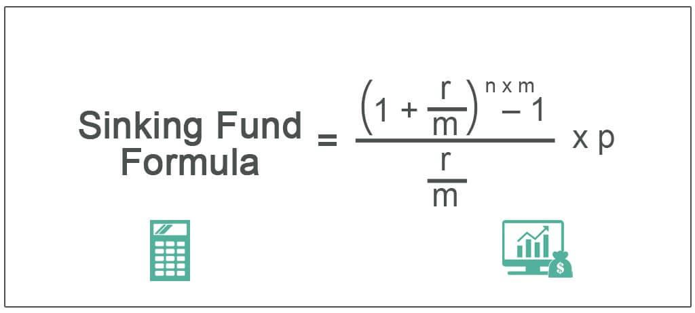

The financial world is a dynamic and ever-evolving ecosystem, where investors continuously seek innovative strategies to maximize returns while effectively managing risks. Two prominent concepts that have gained significant traction in this environment are the sinking fund investment strategy and algorithmic trading. Both methodologies present unique advantages and, when combined, offer opportunities to optimize investment outcomes.

A sinking fund investment strategy systematically sets aside money over time to pay off debt or replace an asset, providing a structured approach to financial management. It ensures that funds are readily available when required, thereby reducing the risks associated with large lump-sum payments. This strategy can also enhance financial planning by improving predictability and aiding in cash flow management.



On the other hand, algorithmic trading involves using sophisticated computer algorithms to make trading decisions based on predefined criteria. This method removes the emotional component from trading, allowing for faster and more accurate order placements. Moreover, algorithmic trading can process and analyze vast amounts of data efficiently, offering a strategic edge in the fast-paced world of financial markets.

This article provides an in-depth examination of the mechanisms and benefits of sinking funds, and explores the complexities of algorithmic trading. Furthermore, it discusses the potential enhancements in financial portfolio management achievable by integrating these strategies. By harnessing the strengths of both sinking funds and algorithmic trading, investors can improve financial predictability and enhance investment returns in a rapidly changing economic landscape.

## Table of Contents

## Understanding the Sinking Fund Method

A sinking fund is a financial strategy designed to allocate resources systematically over time to fulfill future financial obligations or replace assets. This proactive approach plays a crucial role in financial planning, as it ensures that sufficient funds are available when significant expenditures arise, thus mitigating the risks and financial strain associated with large lump-sum payments at the time of these expenditures.

The basic mechanism involves setting aside a predetermined amount of money at regular intervals, such as monthly or annually, into a dedicated account. The fund accumulates over time, potentially [earning](/wiki/earning-announcement) interest, which further aids in achieving the financial goal. For example, a company may issue bonds with an agreement to periodically set aside funds into a sinking fund, ensuring that it can pay off the bond principal at maturity. Similarly, individuals might use a sinking fund to save for major purchases, such as a car or home renovations.

The sinking fund method offers several advantages:
- **Predictability**: By regularly contributing to the fund, individuals and organizations can better predict their future financial position and plan accordingly.
- **Risk Management**: It reduces the financial risk associated with having to generate a large sum of money at once, decreasing the reliance on potentially unfavorable borrowing conditions.
- **Interest Savings**: The fund can be invested in interest-bearing accounts or securities, easing the financial burden due to interest income.

Despite its benefits, the sinking fund method can sometimes be underutilized in comparison to other accounting and finance strategies, such as straight-line depreciation. One of the reasons for its underutilization could be the perceived complexity of setting up and maintaining a sinking fund, particularly for smaller organizations or individuals with limited financial expertise. Straight-line depreciation, by contrast, is straightforward, allocating an asset's cost evenly over its useful life without additional cash flow requirements.

Moreover, the sinking fund method might require more discipline and strategic financial planning upfront, which could deter those unused to long-term financial commitments. The effectiveness of sinking funds in asset replacement or debt management is contingent on disciplined and consistent contributions, without which the intended financial security cannot be realized.

In sum, while underutilized relative to more straightforward financial strategies, the sinking fund method provides a robust mechanism for managing future financial obligations, offering enhanced predictability and risk management for both individual and corporate finance.

## Financial Instruments and Sinking Funds

Sinking funds serve as an essential component in the financial management of bonds, loans, mortgages, and preferred stocks. They provide a mechanism for systematically setting aside funds to ensure capital is available for debt redemption at maturity, thus improving financial stability and predictability.

### Bonds and Debentures

For bonds and debentures, sinking funds are instrumental in mitigating the risk associated with large lump-sum repayments. A corporation might issue bonds with a sinking fund provision, requiring it to make regular payments into a dedicated account. These payments gradually accumulate to cover the bond's face value at maturity, or to enable periodic retirement of portions of the outstanding debt. This reduces the repayment stress on the issuer and ensures that bondholders are paid regularly, enhancing the attractiveness of the bonds. Issuers may choose to purchase bonds from the open market or call them at a predetermined price, depending on market conditions and sinking fund stipulations.

### Mortgages and Loans

In mortgages and other loan agreements, sinking funds can be used to manage large future liabilities. By making incremental contributions to a sinking fund, borrowers can distribute the payment burden over time, aligning with cash flow and reducing the risk of default. This systematic approach to liability management is particularly beneficial for long-term loans where future financial conditions might be uncertain. 

### Preferred Stocks

Preferred stocks may also incorporate sinking funds to ensure the redemption of shares at a predetermined future date or to facilitate periodic share buybacks. This strategy offers investors a degree of security in receiving their capital back, thereby enhancing investor confidence and potentially reducing the cost of capital for the issuing firm. In some cases, the use of sinking funds for preferred stocks can also provide fluctuations in dividend payments, supporting the issuer's financial flexibility.

### Strategic Advantages

Sinking funds provide numerous strategic advantages across different financial instruments. They enhance creditworthiness by demonstrating a proactive approach to debt management. Additionally, they can improve asset-liability matching, thereby reducing [liquidity](/wiki/liquidity-risk-premium) risk for both corporate and individual investors. Organizations employing sinking fund strategies are often perceived as more reliable by investors and creditors, which can lead to more favorable borrowing terms in the future.

In summary, the implementation of sinking funds across various financial instruments helps manage debt obligations effectively, maintain investor confidence, and stabilize the financial landscape for both issuers and holders of these instruments. Integrating such disciplined financial planning tools is crucial for sustainable growth and long-term financial health.

## Algorithmic Trading: Overview and Benefits

Algorithmic trading uses computer algorithms to automate financial trading, relying on precisely defined parameters to execute trades. This approach effectively addresses several inherent limitations of human trading by removing emotional and psychological influences that can lead to irrational decision-making. Instead, it employs logic-based processes, enabling faster and more accurate order executions that are crucial in volatile markets.

The advent of [algorithmic trading](/wiki/algorithmic-trading) marked a significant shift in trading methodologies. Historically, trading was a manual process, heavily reliant on human judgment and the ability to interpret market conditions and financial data. However, with the rapid advancement of computational technologies and data analytical tools, the landscape of trading substantially transformed. Algorithms can analyze vast datasets beyond the capability of most human traders, identifying patterns and executing trades based on market signals that humans might overlook. This ensures a significant advantage in executing trades at optimal prices and timings, enhancing efficiency and potential for profit.

A critical advantage of algorithmic trading is its speed and precision. Algorithms can process volumes of market data at unprecedented speeds, effectively capitalizing on fleeting market opportunities. Additionally, they can implement complex strategies consistently, unaffected by the fatigue or biases that affect human traders. For example, High-Frequency Trading ([HFT](/wiki/high-frequency-trading-strategies)) is a subset of algorithmic trading that involves executing a large number of orders within fractions of a second to exploit minor price discrepancies. 

The role of algorithmic trading in contemporary financial markets is profound. According to a report by the Financial Conduct Authority (FCA), algorithmic trading activities accounted for over 50% of trading [volume](/wiki/volume-trading-strategy) in several developed markets by the early 2020s. This translates into increased market liquidity, reduced transaction costs, and tighter bid-ask spreads, enhancing overall market efficiency. However, despite these benefits, the widespread use of algorithmic trading has also raised significant regulatory concerns. The flash crash of 2010, where the Dow Jones Industrial Average dropped significantly and recovered within minutes, highlighted the potential systemic risks inherent in algorithmic trading systems. 

Today, advancements in algorithms and data processing techniques continue to evolve. Algorithms are increasingly based on statistical models and [machine learning](/wiki/machine-learning) techniques that can adapt to changing market conditions. This adaptive ability enhances the predictive power of algorithms, aligning them more closely with the unpredictable nature of financial markets.

Overall, algorithmic trading has become an integral component of modern financial ecosystems, demonstrating a clear evolution from traditional manual trading. Its ability to process information rapidly, execute orders accurately, and eliminate emotional bias presents it as an essential tool for investors looking to optimize trading strategies and outcomes in increasingly complex markets.

## Technological Advances in Algorithmic Trading

The rise of [artificial intelligence](/wiki/ai-artificial-intelligence) (AI) and machine learning has significantly transformed algorithmic trading. These technologies enhance trading strategies by providing more precise data analysis and predictive modeling capabilities, crucial for decision-making processes in financial markets.

One fundamental approach within algorithmic trading is regression analysis. This statistical method models and analyzes relationships between variables, often used to predict a security's price. Linear regression, for example, attempts to model the relationship between dependent and independent variables using a linear equation:

$$

y = \beta_0 + \beta_1x + \epsilon
$$

where $y$ is the dependent variable (e.g., stock price), $x$ is the independent variable (e.g., time), $\beta_0$ and $\beta_1$ are coefficients determined by the model, and $\epsilon$ is the error term. Using regression analysis, traders can forecast price movements and establish trading strategies that capitalize on anticipated changes.

Deep learning, a sophisticated branch of machine learning, involves neural networks with many layers that can learn complex patterns. Unlike traditional models, [deep learning](/wiki/deep-learning) models improve prediction accuracy by adapting to intricate market dynamics. Recurrent Neural Networks (RNNs) and Long Short-Term Memory (LSTM) networks, for instance, are employed to recognize temporal patterns by exploiting past data sequences, making them invaluable for predicting time-series data such as stock prices.

The incorporation of big data significantly bolsters algorithmic trading, by processing and analyzing unprecedented volumes of unstructured data at high velocity. Machine learning algorithms can ingrain insights from sources such as financial news, social media, and other real-time data feeds, offering traders a comprehensive view of market trends. Thanks to technologies like Apache Hadoop and Spark, these massive datasets can be processed efficiently, enhancing the models' predictive power.

In practical terms, the Python programming language, with libraries such as TensorFlow and Scikit-Learn, is instrumental in implementing these AI and machine learning models in algorithmic trading applications. For instance, a simple linear regression prediction in Python can be coded as:

```python
from sklearn.linear_model import LinearRegression
import numpy as np

# Sample data
X = np.array([[1], [2], [3], [4]])
y = np.array([2, 4, 6, 8])

# Create a model and fit it
model = LinearRegression()
model.fit(X, y)

# Predict a new value
predicted = model.predict(np.array([[5]]))
print(predicted)  # Outputs [10]
```

This example demonstrates how regression analysis can be used to predict stock prices based on historical data. 

These technological advancements, particularly AI and machine learning, are crucial in enhancing algorithmic trading strategies. They offer innovative ways to improve prediction accuracy and responsiveness in continuously fluctuating financial markets, making algorithmic trading a cornerstone of modern financial activities.

## Integrating Sinking Fund Strategies with Algorithmic Trading

Integrating sinking fund strategies with algorithmic trading can provide a comprehensive approach to managing financial portfolios by leveraging the strengths of both methods. A sinking fund is a planned reserve of cash set aside over time to address anticipated future liabilities, such as debt repayment or asset replacement. Meanwhile, algorithmic trading uses computer algorithms to execute trades based on predefined criteria, maximizing speed and precision while minimizing human intervention.

These combined strategies can significantly enhance asset replacement scheduling. By using algorithmic trading to predict market trends and optimize investments, the timing and growth of a sinking fund can be strategically aligned with market dynamics. For instance, the anticipated obligation covered by a sinking fund could be matched with a diversified trading strategy to maximize returns on the reserve capital until the funds are needed. Consider the following formula for optimizing sinking fund allocation:

$$

F = P \times \left(1 + \frac{r}{n}\right)^{nt} 
$$

where:
- $F$ is the final amount in the sinking fund
- $P$ is the principal amount
- $r$ is the annual interest rate
- $n$ is the number of times interest is compounded per year
- $t$ is the time in years 

Integrating algorithmic insights can also enhance risk management. Through machine learning algorithms, trading systems can identify and react to complex patterns of risk indicators that might affect the sinking fund's objectives. This adaptive risk management ensures that the sinking fund grows in a controlled manner, preserving capital against market [volatility](/wiki/volatility-trading-strategies). Algorithms can rebalance portfolios automatically, maintaining the intended asset allocation that aligns with the risk tolerance and time horizons specific to the sinking fund’s purpose.

Moreover, employing algorithmic trading can improve creditworthiness. A planned and algorithmically managed sinking fund demonstrates disciplined financial management, which is favorable for creditors. The transparency and predictability provided by algorithmic trading can facilitate better forecasting and stress testing of financial plans, presenting investors and institutions as reliable and low-risk borrowers or partners.

Here is an example of how Python can be used to simulate a simple strategy for integrating these approaches:

```python
import numpy as np

# Parameters
principal = 5000  # initial sinking fund amount
annual_rate = 0.05  # annual interest rate
periods_per_year = 12  # monthly compounding
years = 5  # investment period

# Future value of the sinking fund
future_value = principal * (1 + annual_rate / periods_per_year)**(periods_per_year * years)

# Simulating a simple trading outcome (for illustration purposes)
# Suppose in an upward market strategy yields an annual increase of compounded 7%
simulated_market_multiplier = 1.07
trading_result = future_value * simulated_market_multiplier

print(f"Future Value of Sinking Fund: ${future_value:.2f}")
print(f"Enhanced Value with Algo Trading: ${trading_result:.2f}")
```

In summary, the strategic combination of sinking fund methodologies with algorithmic trading fosters a synchronized financial practice that optimizes asset management, effectively manages risks, and improves financial standing. This integration signifies a shift towards smarter and technologically advanced investment practices, ultimately leading to more robust portfolio management outcomes.

## Tools and Technologies in Sinking Fund and Algo Trading Management

Modern financial management has significantly benefited from the integration of advanced fintech solutions, particularly in the management of sinking funds and algorithmic trading. The incorporation of technologies such as blockchain, smart contracts, and specialized financial software has streamlined operations, increased transparency, and reduced transaction costs.

### Blockchain
Blockchain technology provides a decentralized and secure way of recording transactions. In the context of sinking funds, blockchain can ensure that all allocations and payments are transparently recorded and immutable. This minimizes the risks of mismanagement or fraudulent activities. For instance, when a company creates a sinking fund for bond repayments, a blockchain ledger can track each contribution accurately, pledging to investors that funds are allocated appropriately.

### Smart Contracts
Smart contracts, often implemented on blockchain platforms like Ethereum, automatically execute and enforce contract terms when predefined conditions are met. In algorithmic trading, smart contracts can automate complex trades without the need for intermediaries, thereby speeding up transactions and reducing costs. With sinking funds, smart contracts can automate the periodic allocation of money, triggering transfers to designated accounts when specific financial conditions are satisfied.

### Financial Software
The use of sophisticated financial software enables precise management and analysis of sinking funds and algorithmic trading strategies. For sinking funds, software solutions can provide customizable dashboards, allowing financial managers to track fund growth, analyze potential risks, and make informed decisions based on real-time data. Software platforms like SAP and Oracle Financial Services offer modules designed to manage these financial activities seamlessly.

In algorithmic trading, software solutions facilitate the rapid execution of trades by analyzing large data sets to identify profitable trading opportunities instantly. These platforms often integrate with machine learning algorithms to continuously learn from market conditions and refine trading strategies.

#### Example Algorithm in Python
Consider a simple Python example illustrating a basic algorithmic trading strategy using moving averages:

```python
import pandas as pd

def moving_average_strategy(prices, short_window=40, long_window=100):
    """
    Implement a basic moving average strategy.

    :param prices: A pandas DataFrame containing 'Close' prices of the asset.
    :param short_window: Number of days for the short moving average.
    :param long_window: Number of days for the long moving average.
    :return: A pandas DataFrame with signals.
    """
    signals = pd.DataFrame(index=prices.index)
    signals['Signal'] = 0.0

    signals['Short_MA'] = prices['Close'].rolling(window=short_window, min_periods=1, center=False).mean()
    signals['Long_MA'] = prices['Close'].rolling(window=long_window, min_periods=1, center=False).mean()
    signals['Signal'][short_window:] = np.where(signals['Short_MA'][short_window:] > signals['Long_MA'][short_window:], 1.0, 0.0)   
    signals['Positions'] = signals['Signal'].diff()

    return signals

# Example usage:
# df = pd.read_csv('stock_prices.csv')
# signals = moving_average_strategy(df)
```

This code computes two moving averages of an asset's closing price and generates buy/sell signals based on their crossovers – a foundational approach in algorithmic trading.

In conclusion, the integration of blockchain, smart contracts, and financial software has modernized the management of sinking funds and algorithmic trading, providing efficiency and transparency that are vital in today's fast-paced financial landscape.

## Challenges and Mitigations

Both sinking funds and algorithmic trading offer substantial benefits yet present various challenges that need to be effectively managed to optimize their utility in financial strategies.

**Sinking Fund Challenges**

1. **Complexity in Forecasting**: Setting up a sinking fund involves predicting future liabilities, which can be complex due to fluctuating interest rates and market conditions. Accurately forecasting these factors is crucial to ensure sufficient funds are available when needed.

   *Mitigation*: Utilize financial modeling tools to simulate different scenarios and apply stress testing to understand potential impacts on the sinking fund. Regularly update forecasts to reflect current market conditions.

2. **Opportunity Cost**: Funds allocated to a sinking fund are not available for other potentially higher-yield investments. This opportunity cost can impact overall financial performance.

   *Mitigation*: Develop a diversified financial strategy whereby the sinking fund allocation is balanced with investments in growth assets. Consider staggered investments with varying maturities to optimize returns while maintaining liquidity.

**Algorithmic Trading Challenges**

1. **Risk of Overfitting**: Overfitting occurs when an algorithm is too closely tailored to historical data, making it less effective in predicting future market movements. Overfitted models can lead to poor trading decisions, increasing financial risk.

   *Mitigation*: Employ robust cross-validation techniques and out-of-sample testing to ensure models generalize well to unseen data. Implement regular reviews and updates of trading algorithms to adapt to market changes.

2. **Market Liquidity Risk**: Algorithmic trading can exacerbate market liquidity risk, especially during volatile periods, which may result in slippage or failure to execute trades at desired prices.

   *Mitigation*: Develop algorithms that prioritize liquidity management, such as slicing large orders into smaller ones and implementing adaptive trading strategies that respond to changing market conditions.

3. **Technology and Infrastructure Risk**: The reliance on sophisticated software and hardware systems introduces risks related to system failures, data latency, and cybersecurity threats.

   *Mitigation*: Invest in robust IT infrastructure with redundancy and failover mechanisms. Conduct regular security audits and implement encryption and secure data protocols to protect against cyber threats.

By identifying and addressing these challenges, investors can better leverage the benefits of both sinking funds and algorithmic trading. Continuous learning and adaptation to evolving market conditions and technological advancements are crucial for the successful implementation of these financial strategies.

## Conclusion

Sinking funds and algorithmic trading, when employed either individually or in tandem, provide significant advantages in the context of modern finance. The sinking fund method ensures that financial resources are systematically allocated over time to meet specific liabilities or capital needs, thus improving fiscal predictability and reducing the strain of large one-time payouts. This systematic planning enhances the capacity for precise financial forecasting, leading to improved portfolio management.

Simultaneously, algorithmic trading harnesses the power of computer algorithms to optimize trading decisions, thereby minimizing human error, improving order precision, and allowing for the rapid analysis of extensive datasets. These trading strategies are supported by continuous technological advancements, such as artificial intelligence and big data analytics, which allow for even greater efficiency and insight into market trends.

The integration of these methodologies empowers investors with a holistic financial strategy. By combining the disciplined savings and allocation strategies of sinking funds with the data-driven decision-making capabilities of algorithmic trading, investors can better manage risks, optimize returns, and strategically position their portfolios for long-term success. This confluence is particularly beneficial in maintaining asset allocation balances and enhancing creditworthiness through predictive financial strategies.

Staying abreast of technological advancements and committing to continuous learning is essential for effectively employing these strategies. As the financial landscape evolves, the ability to adapt and leverage new tools and methodologies is critical for investors seeking to maximize returns while managing associated risks. By embracing these strategies and technologies, investors are better positioned to navigate the complexities of modern finance and achieve enhanced financial outcomes.

## References & Further Reading

[1]: Bergstra, J., Bardenet, R., Bengio, Y., & Kégl, B. (2011). ["Algorithms for Hyper-Parameter Optimization."](https://dl.acm.org/doi/10.5555/2986459.2986743) Advances in Neural Information Processing Systems 24.

[2]: ["Advances in Financial Machine Learning"](https://www.amazon.com/Advances-Financial-Machine-Learning-Marcos/dp/1119482089) by Marcos Lopez de Prado

[3]: ["Evidence-Based Technical Analysis: Applying the Scientific Method and Statistical Inference to Trading Signals"](https://www.amazon.com/Evidence-Based-Technical-Analysis-Scientific-Statistical/dp/0470008741) by David Aronson

[4]: ["Machine Learning for Algorithmic Trading"](https://github.com/stefan-jansen/machine-learning-for-trading) by Stefan Jansen

[5]: ["Quantitative Trading: How to Build Your Own Algorithmic Trading Business"](https://www.amazon.com/Quantitative-Trading-Build-Algorithmic-Business/dp/1119800064) by Ernest P. Chan