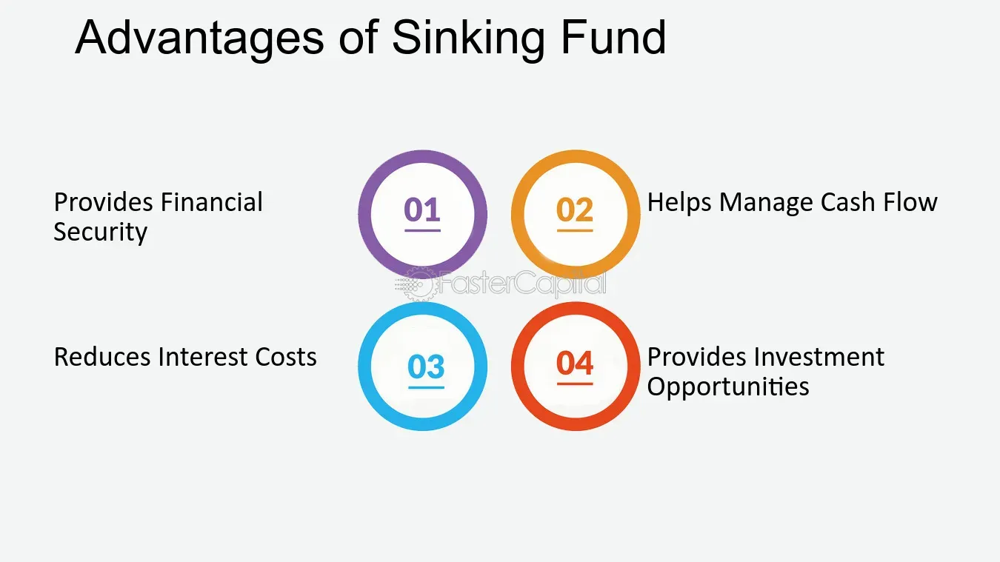

## Table of Contents

## What is a sinking fund?

A sinking fund is a way to save money for a specific big expense in the future. It's like setting aside a little money regularly so that when you need to pay for something expensive, like a new roof or a car, you already have the money saved up. This helps you avoid taking out loans or using credit cards, which can be stressful and costly.

For example, if you know you'll need a new car in five years, you can start a sinking fund now. You might decide to put away $100 every month into this fund. By the time you need the car, you'll have saved enough money to buy it without needing to borrow. This makes planning and managing big expenses much easier and less stressful.

## How does the sinking fund method work?

The sinking fund method is a simple way to save money for a big expense you know is coming. You start by figuring out how much money you need and when you'll need it. Then, you decide how much money you can save each month to reach your goal. For example, if you need $6,000 for a new car in three years, you would save $170 each month ($6,000 divided by 36 months). You put this money into a separate account, which is your sinking fund.

Once you start saving, you keep adding money to the fund every month until you reach your goal. It's important to stick to your plan and not use the money for anything else. This way, when the time comes to buy the car or pay for the roof, you have the money ready. Using a sinking fund helps you avoid the stress of last-minute borrowing and makes big purchases more manageable.

## What are the primary purposes of using a sinking fund?

The main purpose of using a sinking fund is to save money for a big expense that you know is coming in the future. This could be something like buying a new car, replacing your roof, or paying for a vacation. By saving a little bit of money each month, you can build up enough money to cover the cost without having to borrow or use credit cards. This makes it easier to manage big expenses and helps you avoid the stress of sudden, large payments.

Another purpose of a sinking fund is to help you plan your finances better. When you know exactly how much you need to save and how long you have to save it, you can create a clear plan. This helps you stay on track with your savings and makes sure you are ready when the time comes to make the purchase. It also gives you peace of mind knowing that you are prepared for future costs, which can make managing your money less stressful.

## Can you explain the difference between a sinking fund and a reserve fund?

A sinking fund and a reserve fund are both ways to save money, but they have different purposes. A sinking fund is used to save up for a specific big expense that you know is coming. For example, if you know you'll need a new car in three years, you can start a sinking fund now and save a little bit each month until you have enough money to buy the car. The main goal is to have the money ready when you need it, so you don't have to borrow or use a credit card.

On the other hand, a reserve fund is more like an emergency fund. It's money you save for unexpected expenses or emergencies, like if your car breaks down suddenly or you need to fix a leaky roof. You don't know exactly when you'll need the money, but you want to be prepared just in case something happens. The key difference is that a sinking fund is for planned expenses, while a reserve fund is for unplanned ones.

## What are the typical assets or investments used in a sinking fund?

A sinking fund is usually kept in safe and easy-to-access places. People often use regular savings accounts for their sinking funds because they are simple and you can get your money out whenever you need it. Some people might choose a money market account, which can give a little more interest than a regular savings account but still lets you take out money easily.

Sometimes, if the big expense is a long way off, people might put their sinking fund money into something like a certificate of deposit (CD). CDs can give you a bit more interest, but you have to leave your money in there for a set time. If you need the money before that time is up, you might have to pay a fee. The main thing is to pick something safe and easy to get to, so you can use the money when you need it for your big expense.

## How is the amount to be saved in a sinking fund calculated?

To figure out how much to save in a sinking fund, you first need to know how much money you'll need for your big expense and when you'll need it. Let's say you want to buy a new car that costs $6,000 and you want to have the money in three years. You start by dividing the total amount you need by the number of months until you need the money. In this case, $6,000 divided by 36 months equals $166.67. So, you need to save about $167 each month to reach your goal.

It's important to stick to this plan and put the same amount of money into your sinking fund every month. If you can, it's a good idea to put the money into a separate account so you don't mix it up with your other money. This way, you can keep track of your savings and make sure you're on track to have the money ready when you need it. If your plans change or the cost of the big expense goes up, you might need to adjust how much you save each month, but the basic idea stays the same: save a little bit regularly to cover a big cost in the future.

## What are the tax implications of using a sinking fund?

Using a sinking fund usually does not have direct tax implications because it's just a way to save money for a future expense. The money you put into a sinking fund comes from your regular income, which you've already paid taxes on. So, when you save money in a sinking fund, you don't have to worry about paying more taxes just because you're saving it.

However, how you use the money from your sinking fund can affect your taxes. If you use the money to buy something that you can claim as a tax deduction, like a new roof for your home, you might be able to deduct that expense on your taxes. But if you use it for something that's not deductible, like buying a new car for personal use, there won't be any tax benefits. It's always a good idea to talk to a tax professional to understand how your specific situation might affect your taxes.

## How does the sinking fund method help in managing debt?

The sinking fund method helps in managing debt by allowing you to save money for big expenses ahead of time. Instead of taking out a loan or using a credit card when a big expense comes up, you can use the money you've saved in your sinking fund. This means you don't have to borrow money and pay interest on it, which can save you a lot of money in the long run. By avoiding debt, you also reduce the stress and worry that comes with having to make monthly payments on something you've already bought.

Using a sinking fund also helps you plan your finances better. When you know how much you need to save and how long you have to save it, you can create a clear plan. This helps you stay on track and avoid unexpected expenses that can lead to debt. By saving a little bit each month, you build up a cushion that protects you from having to borrow money in a hurry. This way, you can keep your debt under control and focus on other financial goals, like saving for retirement or building an emergency fund.

## What are the advantages of using a sinking fund for businesses?

Using a sinking fund can be a big help for businesses. It allows them to save money little by little for big expenses that they know are coming, like buying new equipment or expanding their space. This way, when the time comes to pay for these things, the business doesn't have to borrow money and pay interest. This can save the business a lot of money and help them stay financially healthy. It also makes it easier for the business to plan their finances, knowing they have the money set aside for big costs.

Another advantage is that a sinking fund can help a business avoid the stress of sudden big expenses. By saving regularly, the business can be prepared for things like replacing a delivery truck or updating their computers. This means they can keep running smoothly without having to worry about where the money will come from. It also helps the business stay in control of their debt, which is important for long-term success.

## Can individuals benefit from using a sinking fund, and if so, how?

Yes, individuals can definitely benefit from using a sinking fund. It helps them save money for big expenses they know are coming, like a new refrigerator or a family vacation. By putting away a little money each month, they can avoid having to borrow money or use a credit card when the time comes to pay for these things. This means they won't have to pay interest on loans, which can save them a lot of money. It also makes it easier to plan their finances, knowing they have the money saved up for big costs.

Using a sinking fund also helps individuals avoid the stress of sudden big expenses. When they know they need to replace their car tires in a year, they can start saving now and be ready when the time comes. This way, they don't have to worry about where the money will come from. It's a simple way to manage money and make sure they're prepared for the future without adding to their debt.

## What are some potential risks or disadvantages associated with the sinking fund method?

One potential risk of using the sinking fund method is that the money you save might not earn much interest. If you keep your sinking fund in a regular savings account, the interest rate might be very low. This means your money won't grow much over time, and you might miss out on better investment opportunities. Another risk is that life can be unpredictable. If an emergency comes up and you need to use the money in your sinking fund for something else, you might not have enough saved when you need it for the big expense you planned for.

Another disadvantage is that saving for a sinking fund requires discipline. You need to put money into the fund every month, and it can be hard to stick to this plan, especially if other expenses come up. If you don't save enough each month, you might not reach your goal on time. Also, if the cost of the big expense goes up, you might need to save more than you planned. This can be stressful and might make it harder to manage your other financial goals, like saving for retirement or building an emergency fund.

## How can advanced financial modeling enhance the effectiveness of a sinking fund strategy?

Advanced financial modeling can make a sinking fund strategy work better by helping you plan more accurately. When you use financial models, you can figure out exactly how much money you need to save each month, taking into account things like inflation and changing costs. For example, if you know the price of the big expense you're saving for might go up over time, you can adjust your monthly savings to make sure you have enough money when you need it. This kind of planning helps you stay on track and avoid surprises.

Financial modeling also lets you see different scenarios and make better decisions. You can play around with different savings amounts and timelines to see what works best for you. If you're saving for a new car, you might use a model to see what happens if you save a little more each month or if you push back the date you want to buy the car. This helps you find the best way to reach your goal without stressing about money. By using these models, you can make your sinking fund more effective and feel more confident about your financial future.

## What are the technological advances in algorithmic trading?

The rise of [artificial intelligence](/wiki/ai-artificial-intelligence) (AI) and machine learning has significantly transformed algorithmic trading. These technologies enhance trading strategies by providing more precise data analysis and predictive modeling capabilities, crucial for decision-making processes in financial markets.

One fundamental approach within algorithmic trading is regression analysis. This statistical method models and analyzes relationships between variables, often used to predict a security's price. Linear regression, for example, attempts to model the relationship between dependent and independent variables using a linear equation:

$$

y = \beta_0 + \beta_1x + \epsilon
$$

where $y$ is the dependent variable (e.g., stock price), $x$ is the independent variable (e.g., time), $\beta_0$ and $\beta_1$ are coefficients determined by the model, and $\epsilon$ is the error term. Using regression analysis, traders can forecast price movements and establish trading strategies that capitalize on anticipated changes.

Deep learning, a sophisticated branch of machine learning, involves neural networks with many layers that can learn complex patterns. Unlike traditional models, [deep learning](/wiki/deep-learning) models improve prediction accuracy by adapting to intricate market dynamics. Recurrent Neural Networks (RNNs) and Long Short-Term Memory (LSTM) networks, for instance, are employed to recognize temporal patterns by exploiting past data sequences, making them invaluable for predicting time-series data such as stock prices.

The incorporation of big data significantly bolsters algorithmic trading, by processing and analyzing unprecedented volumes of unstructured data at high velocity. Machine learning algorithms can ingrain insights from sources such as financial news, social media, and other real-time data feeds, offering traders a comprehensive view of market trends. Thanks to technologies like Apache Hadoop and Spark, these massive datasets can be processed efficiently, enhancing the models' predictive power.

In practical terms, the Python programming language, with libraries such as TensorFlow and Scikit-Learn, is instrumental in implementing these AI and machine learning models in algorithmic trading applications. For instance, a simple linear regression prediction in Python can be coded as:

```python
from sklearn.linear_model import LinearRegression
import numpy as np

# Sample data
X = np.array([[1], [2], [3], [4]])
y = np.array([2, 4, 6, 8])

# Create a model and fit it
model = LinearRegression()
model.fit(X, y)

# Predict a new value
predicted = model.predict(np.array([[5]]))
print(predicted)  # Outputs [10]
```

This example demonstrates how regression analysis can be used to predict stock prices based on historical data. 

These technological advancements, particularly AI and machine learning, are crucial in enhancing algorithmic trading strategies. They offer innovative ways to improve prediction accuracy and responsiveness in continuously fluctuating financial markets, making algorithmic trading a cornerstone of modern financial activities.

## How can sinking fund strategies be integrated with algorithmic trading?

Integrating sinking fund strategies with algorithmic trading can provide a comprehensive approach to managing financial portfolios by leveraging the strengths of both methods. A sinking fund is a planned reserve of cash set aside over time to address anticipated future liabilities, such as debt repayment or asset replacement. Meanwhile, algorithmic trading uses computer algorithms to execute trades based on predefined criteria, maximizing speed and precision while minimizing human intervention.

These combined strategies can significantly enhance asset replacement scheduling. By using algorithmic trading to predict market trends and optimize investments, the timing and growth of a sinking fund can be strategically aligned with market dynamics. For instance, the anticipated obligation covered by a sinking fund could be matched with a diversified trading strategy to maximize returns on the reserve capital until the funds are needed. Consider the following formula for optimizing sinking fund allocation:

$$

F = P \times \left(1 + \frac{r}{n}\right)^{nt} 
$$

where:
- $F$ is the final amount in the sinking fund
- $P$ is the principal amount
- $r$ is the annual interest rate
- $n$ is the number of times interest is compounded per year
- $t$ is the time in years 

Integrating algorithmic insights can also enhance risk management. Through machine learning algorithms, trading systems can identify and react to complex patterns of risk indicators that might affect the sinking fund's objectives. This adaptive risk management ensures that the sinking fund grows in a controlled manner, preserving capital against market [volatility](/wiki/volatility-trading-strategies). Algorithms can rebalance portfolios automatically, maintaining the intended asset allocation that aligns with the risk tolerance and time horizons specific to the sinking fund’s purpose.

Moreover, employing algorithmic trading can improve creditworthiness. A planned and algorithmically managed sinking fund demonstrates disciplined financial management, which is favorable for creditors. The transparency and predictability provided by algorithmic trading can facilitate better forecasting and stress testing of financial plans, presenting investors and institutions as reliable and low-risk borrowers or partners.

Here is an example of how Python can be used to simulate a simple strategy for integrating these approaches:

```python
import numpy as np

# Parameters
principal = 5000  # initial sinking fund amount
annual_rate = 0.05  # annual interest rate
periods_per_year = 12  # monthly compounding
years = 5  # investment period

# Future value of the sinking fund
future_value = principal * (1 + annual_rate / periods_per_year)**(periods_per_year * years)

# Simulating a simple trading outcome (for illustration purposes)
# Suppose in an upward market strategy yields an annual increase of compounded 7%
simulated_market_multiplier = 1.07
trading_result = future_value * simulated_market_multiplier

print(f"Future Value of Sinking Fund: ${future_value:.2f}")
print(f"Enhanced Value with Algo Trading: ${trading_result:.2f}")
```

In summary, the strategic combination of sinking fund methodologies with algorithmic trading fosters a synchronized financial practice that optimizes asset management, effectively manages risks, and improves financial standing. This integration signifies a shift towards smarter and technologically advanced investment practices, ultimately leading to more robust portfolio management outcomes.

## References & Further Reading

[1]: Bergstra, J., Bardenet, R., Bengio, Y., & Kégl, B. (2011). ["Algorithms for Hyper-Parameter Optimization."](https://dl.acm.org/doi/10.5555/2986459.2986743) Advances in Neural Information Processing Systems 24.

[2]: ["Advances in Financial Machine Learning"](https://www.amazon.com/Advances-Financial-Machine-Learning-Marcos/dp/1119482089) by Marcos Lopez de Prado

[3]: ["Evidence-Based Technical Analysis: Applying the Scientific Method and Statistical Inference to Trading Signals"](https://www.amazon.com/Evidence-Based-Technical-Analysis-Scientific-Statistical/dp/0470008741) by David Aronson

[4]: ["Machine Learning for Algorithmic Trading"](https://github.com/stefan-jansen/machine-learning-for-trading) by Stefan Jansen

[5]: ["Quantitative Trading: How to Build Your Own Algorithmic Trading Business"](https://www.amazon.com/Quantitative-Trading-Build-Algorithmic-Business/dp/1119800064) by Ernest P. Chan