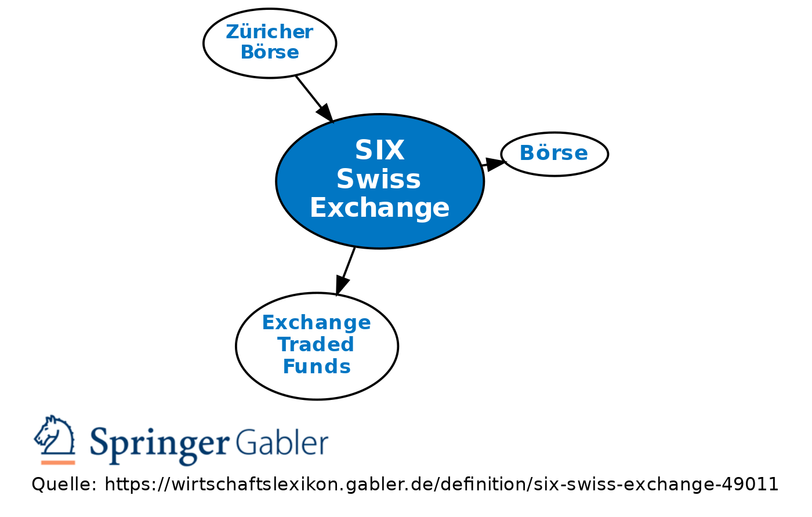

The SIX Swiss Exchange is central to Switzerland's financial markets, having been established in Zurich as a key platform for securities trading. As a critical component of the nation's economic infrastructure, it serves as the primary venue for the exchange of an array of financial instruments. This article presents an expansive view of the SIX Swiss Exchange, with particular attention given to algorithmic trading and Swiss stocks, illustrating its crucial role in shaping the European financial milieu.

Founded in 1993 through the merger of three regional exchanges, the SIX Swiss Exchange has continually adapted to evolving market dynamics and technological advancements. Its transformation from traditional floor trading to a fully electronic exchange in the 1990s marked a significant shift towards modernization, culminating in a legal restructuring as a joint-stock company in 2002. These strategic movements have positioned the Exchange as a leading participant in significant European financial collaborations, such as Eurex.

The Exchange has distinguished itself through technological innovations, particularly with the implementation of the SWXess trading platform. This high-performance platform supports high-frequency trading, a testament to the Exchange's dedication to low latency and high-capacity trading environments. Such technological solutions are indispensable for algorithmic traders who require swift and precise execution capabilities, bolstered by advanced risk management and automated tools.

In addition to its technological prowess, the Exchange serves as a critical hub for Swiss stocks, encompassing a wide array of products, including equities, ETFs, and structured products. Renowned companies listed on the Exchange contribute to increasing global investor interest, offering them access to significant capital and liquidity. The comprehensive market data services provided by the Exchange are vital for investors making informed decisions, cementing its role as an essential element of the Swiss financial ecosystem.

Strategic partnerships further amplify the Exchange's impact and reach. Collaborations with entities such as LMAX Group have led to groundbreaking initiatives like the introduction of cryptocurrency futures, showcasing innovation in novel asset classes. The acquisition of the Spanish exchange BME is another milestone, broadening SIX's influence across Europe in consolidating trading services. Despite facing regulatory challenges, notably the Switzerland-EU dispute, the Exchange continues to adeptly navigate complex international markets.

This exploration of the SIX Swiss Exchange highlights its enduring significance and capacity for adaptation, ensuring it remains at the cutting edge of trading technology and global market integration. As it continues to evolve, the Exchange stands poised to maintain its leadership position in the global financial landscape.

## Table of Contents

## Historical Context

The SIX Swiss Exchange, established in 1993, emerged from the consolidation of three regional exchanges in Switzerland: the Geneva Stock Exchange, the Basel Stock Exchange, and the Zurich Stock Exchange. This merger was a strategic move to unify the financial markets in Switzerland, creating a centralized platform for securities trading and marking a significant milestone in the Swiss financial landscape.

The transition from traditional floor trading to electronic trading in the 1990s was a pivotal moment for the Exchange, reflecting a broader trend towards modernization. By embracing electronic trading systems, the Exchange enhanced its efficiency, speed, and accessibility, aligning with global advancements in trading technology. This shift not only streamlined operations but also set a precedent for the digitization of trading platforms across Europe.

In addition to modernizing its trading infrastructure, the SIX Swiss Exchange played an instrumental role in European financial collaborations, most notably the formation of Eurex. Eurex is one of the world's leading derivatives exchanges, and the participation of the SIX Swiss Exchange in its establishment signifies its influence and commitment to fostering global financial connectivity.

The year 2002 marked another critical development in the Exchange's history with its transformation into a joint-stock company. This legal restructuring facilitated further expansion and development, enabling the Exchange to operate with greater autonomy and pursue enhanced strategic initiatives. The transition to a joint-stock company also attracted additional investment and interest, positioning the Exchange for future growth and innovation.

This historical context provides essential insights into the evolution of the SIX Swiss Exchange, underpinning its current capabilities in [algorithmic trading](/wiki/algorithmic-trading). The Exchange's journey from a regional entity to a key player in the European financial markets underscores its adaptability and foresight in navigating the challenges and opportunities of the global financial ecosystem.

## Technological Innovations and Algo Trading

SIX Swiss Exchange stands out for its advanced trading infrastructure, particularly through the SWXess trading platform, which is a cornerstone for high-frequency trading ([HFT](/wiki/high-frequency-trading-strategies)). SWXess is meticulously designed to offer low latency and high capacity, crucial features for executing algorithmic trading strategies effectively. The platform's architecture ensures quick data processing and execution speeds, enabling traders to capitalize on market opportunities swiftly.

A significant technological advancement employed by SIX Swiss Exchange is the integration of microwave technology. This communication method reduces data transmission times between financial hubs, offering traders one of the fastest connectivity solutions in Europe. Such capabilities are particularly beneficial for firms engaged in HFT, where even microsecond advantages are significant.

Further enhancing this connectivity is the provision of co-location services. By allowing traders to locate their servers physically close to the Exchange’s infrastructure, latency can be drastically reduced. This proximity ensures that data doesn't need to travel long distances, thereby providing traders with the quickest possible access to market data and the ability to execute trades with minimum delay.

Algo traders operating on the SIX Swiss Exchange also have access to sophisticated risk management features and automated execution tools. These tools are designed to monitor market changes in real-time, adjusting trading strategies automatically to manage risk and optimize returns. The incorporation of [machine learning](/wiki/machine-learning) algorithms can further enhance trading strategies by adapting to historical and real-time market data.

Such technological innovations exemplify SIX Swiss Exchange's commitment to creating a trading environment that is not only efficient but also precise. By providing state-of-the-art infrastructure and tools, the Exchange empowers traders with the capabilities required to succeed in the fast-paced world of algorithmic trading.

## Switzerland's Financial Market and Swiss Stocks

The SIX Swiss Exchange plays a central role in Switzerland's financial market, offering a wide range of products that cater to various investor needs. These include equities, exchange-traded funds (ETFs), and structured products like derivatives and exchange-traded notes. This variety of instruments makes it a comprehensive platform for both individual and institutional investors seeking diversification and risk management opportunities within the Swiss financial ecosystem.

One of the key highlights of the SIX Swiss Exchange is its listing of Swiss Blue Chip companies. These are large, financially sound, and well-established firms that attract significant global investor interest. Companies such as Nestlé, Novartis, and Roche, which have international recognition, are traded on the Exchange. Their presence not only exemplifies Switzerland's economic strength but also draws substantial foreign investment, underlining the Exchange's important role in providing [liquidity](/wiki/liquidity-risk-premium) and capital.

Listing on the SIX Swiss Exchange offers companies numerous advantages. It provides access to a large pool of capital, allowing businesses to raise funds efficiently for expansion and development projects. The liquidity offered by the Exchange ensures that shares of listed firms can be bought and sold with ease, which is crucial for attracting long-term investors.

Market data services provided by the SIX Swiss Exchange are vital for investors aiming to make informed decisions. These services offer real-time data, analytics, and trading insights, enabling participants in the market to navigate the complexities of financial investments with a data-driven approach. The availability of comprehensive information helps investors assess market conditions, analyze stock performance, and predict future trends.

The depth and diversity of products available on the SIX Swiss Exchange highlight its significance within Switzerland's financial framework. It acts as a conduit for capital flow and investment, playing a critical part in maintaining the country's robust financial infrastructure. The variety of offerings ensures that the Exchange remains a crucial hub, not only for the domestic market but also as a key player in the broader European financial landscape.

## Partnerships and Global Collaborations

SIX Swiss Exchange has consistently leveraged strategic partnerships to enhance its offerings and international reach, playing a pivotal role in the global financial market ecosystem. One notable collaboration is with the LMAX Group to launch [cryptocurrency](/wiki/cryptocurrency) futures. This partnership underscores the Exchange's commitment to entering new asset classes, reflecting a broader industry trend towards integrating digital currencies with traditional financial markets. By offering cryptocurrency futures, SIX Swiss Exchange provides institutional investors with tools to hedge and speculate on the price movements of cryptocurrencies in a regulated environment.

The acquisition of Bolsas y Mercados Españoles (BME), the operator of all stock markets and financial systems in Spain, marks another significant step in SIX's expansion strategy. Finalized in 2020, this acquisition has significantly increased SIX's influence across Europe, making it one of the continent's largest financial market infrastructures. This expanded footprint allows for consolidated trading services, providing enhanced offerings to both existing and new clients in the region. It not only strengthens the trading capabilities of SIX but also diversifies its portfolio, integrating Spanish financial markets into its existing suite of services.

Despite facing regulatory challenges, such as the ongoing Switzerland-EU dispute concerning financial equivalence, SIX has adeptly navigated complex international markets. The Exchange has maintained its operations and continues to deliver value to its stakeholders by exploring new opportunities and sustaining robust infrastructure standards. These adaptive strategies demonstrate SIX's resilience and ability to maintain prominence in the global trading arena.

Through these strategic partnerships and acquisitions, the SIX Swiss Exchange exemplifies adaptability and forward-thinking in expanding its global presence while addressing the evolving demands of the financial industry. This enhances its standing as a reliable and innovative entity within the global financial landscape.

## Conclusion

The SIX Swiss Exchange exemplifies a stronghold of innovation and reliability within the global financial market. By effectively integrating cutting-edge technological advancements, particularly in algorithmic trading, the Exchange has positioned itself as a leader in the industry. The implementation of sophisticated trading platforms like SWXess, with features tailored for low latency and high-frequency trading, underscores this commitment to technological excellence.

The Exchange offers a comprehensive suite of services and products, making it indispensable for both domestic and international investors. This includes a wide range of securities such as equities, ETFs, and structured products, all of which provide substantial capital and liquidity access to listed companies. Such offerings not only enhance market participation but also foster a dynamic trading environment, facilitating informed investment decisions through rich market data services.

As financial markets continue to evolve, the robust foundation and strategic foresight of the SIX Swiss Exchange ensure its sustained prominence as a leader in trading technology and market integration. The Exchange adeptly navigates complex regulatory landscapes and embraces new asset classes, as demonstrated by its partnerships and acquisition efforts. This adaptability is pivotal in maintaining its competitive edge on a global scale, solidifying its role and potential within the ever-changing financial landscape.

## References & Further Reading

[1]: SIX Group. ["SIX Swiss Exchange: Overview."](https://www.six-group.com/en/products-services/the-swiss-stock-exchange.html)

[2]: Eurex Group. ["Eurex - Derivatives Exchange."](https://www.eurex.com/ex-en/markets/equ)

[3]: "Trading and Electronic Markets: What Investment Professionals Need to Know" by Larry Harris

[4]: Gomber, P., Arndt, B., Lutat, M., & Uhle, T. (2011). ["High-Frequency Trading."](https://papers.ssrn.com/sol3/papers.cfm?abstract_id=1858626) Springer Handbook of Electronic Markets.

[5]: Lopez de Prado, M. (2018). ["Advances in Financial Machine Learning."](https://www.amazon.com/Advances-Financial-Machine-Learning-Marcos/dp/1119482089) Wiley.

[6]: "Trading at the Speed of Light: How Ultrafast Algorithms Are Transforming Financial Markets" by Donald MacKenzie

[7]: BME Group. ["Bolsas y Mercados Españoles (BME)."](https://www.bolsasymercados.es/ing/About-BME/Companies)

[8]: LMAX Digital. ["LMAX Group Partnership with SIX."](https://www.lmax.com/press-centre/lmaxgroup_to_launch_247_traded_crypto_futures_in_partnership_with_six)