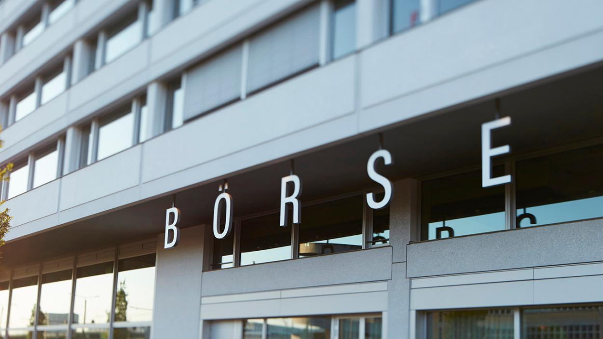

## Table of Contents

## What is the SIX Swiss Exchange?

The SIX Swiss Exchange is the main stock exchange in Switzerland. It is where people and companies can buy and sell shares of Swiss companies. The exchange is located in Zurich and is part of a larger group called SIX Group. It helps companies raise money by selling their stocks to investors.

The SIX Swiss Exchange is important because it makes it easy for people to invest in Swiss businesses. It has rules to make sure trading is fair and safe. Many big Swiss companies, like Nestlé and Roche, are listed on this exchange. This means their stocks can be bought and sold there.

## Where is the SIX Swiss Exchange located?

The SIX Swiss Exchange is located in Zurich, Switzerland. Zurich is a big city in Switzerland known for its business and finance.

The exchange is part of a bigger group called SIX Group. This group helps run the stock market where people can buy and sell shares of Swiss companies.

## What types of securities are traded on the SIX Swiss Exchange?

The SIX Swiss Exchange is a place where different types of securities are traded. The main types of securities you can find there are stocks. Stocks are pieces of ownership in companies. When you buy a stock, you own a small part of that company. Many big Swiss companies, like Nestlé and Roche, have their stocks traded on the SIX Swiss Exchange.

Besides stocks, the SIX Swiss Exchange also trades bonds. Bonds are like loans that investors give to companies or governments. In return, the company or government promises to pay back the money with interest over time. Another type of security traded there are exchange-traded funds (ETFs). ETFs are like baskets of different investments, and they can include stocks, bonds, or other assets. Trading these securities helps investors grow their money and helps companies raise funds.

## How can one invest in the companies listed on the SIX Swiss Exchange?

To invest in companies listed on the SIX Swiss Exchange, you need to open a brokerage account. A brokerage account is like a special bank account where you can buy and sell stocks. You can choose a broker that works with the SIX Swiss Exchange. Once your account is set up, you can search for the company you want to invest in, like Nestlé or Roche, and place an order to buy their stocks. You'll need to decide how many shares you want to buy and at what price.

After you buy the stocks, they will be added to your brokerage account. You can keep them for as long as you want, hoping their value will go up over time. If you decide to sell your stocks later, you can do that through your brokerage account too. Remember, investing in stocks can be risky, so it's a good idea to do some research and maybe talk to a financial advisor before you start.

## What are the trading hours of the SIX Swiss Exchange?

The SIX Swiss Exchange is open for trading from Monday to Friday. The regular trading hours are from 9:00 AM to 5:30 PM Central European Time (CET). This is the time when most people can buy and sell stocks, bonds, and other securities.

There is also a pre-market session that starts at 6:00 AM and ends at 9:00 AM CET. During this time, you can place orders, but they will only be executed when the regular trading session begins. After the regular trading hours, there is a post-market session from 5:30 PM to 10:00 PM CET, where you can still trade, but it might be less busy than during the regular hours.

## What is the history of the SIX Swiss Exchange?

The SIX Swiss Exchange started a long time ago in 1850. It was first called the "Verein zur Förderung des Handels mit Aktien, Obligationen und Effekten in Zürich," which is a long name in German that means something like "Association for the Promotion of Trade in Shares, Bonds, and Securities in Zurich." Back then, it was a place where people could meet and trade stocks and other securities. Over the years, the exchange grew and became more important. In 1968, it got a new name, the "Swiss Stock Exchange," and it started using computers to help with trading.

In 1993, the Swiss Stock Exchange merged with another exchange in Basel to become even bigger. By 2002, it changed its name to SWX Swiss Exchange. In 2008, it joined with other financial services to form the SIX Group, and that's why it's now called the SIX Swiss Exchange. Today, it's a big and modern place where people from all over the world can buy and sell stocks of Swiss companies. It uses new technology to make trading fast and safe.

## How does the SIX Swiss Exchange contribute to the Swiss economy?

The SIX Swiss Exchange helps the Swiss economy by making it easier for companies to get money. When a company wants to grow or start new projects, it can sell its stocks on the exchange. People and other investors buy these stocks, giving the company the money it needs. This helps Swiss businesses to expand and create more jobs, which is good for the whole country.

The exchange also brings money into Switzerland from other countries. Investors from around the world can buy stocks on the SIX Swiss Exchange. When they do, they are investing in Swiss companies, which helps the Swiss economy grow. Plus, the exchange has strict rules to make sure trading is fair and safe, which makes people trust it more and want to invest there.

## What are the listing requirements for companies on the SIX Swiss Exchange?

To list on the SIX Swiss Exchange, a company needs to meet certain requirements. They must have a minimum equity capital of CHF 2.5 million. This means the company needs to have enough money to be considered stable. They also need to have been in business for at least three years, unless they can prove they are financially strong enough even if they are newer. The company must provide a prospectus, which is a detailed document about their business, finances, and risks. This helps investors understand what they are buying into.

Another important requirement is that the company must have a certain number of shares available to the public. At least 25% of the company's shares, or a value of at least CHF 25 million, must be available for people to buy. This helps make sure there is enough interest in the company's stock. The company also needs to follow the rules of the exchange, like reporting their financial results regularly and being open about important changes in their business. This keeps the market fair and helps investors make good decisions.

## What are the major indices of the SIX Swiss Exchange and what do they represent?

The SIX Swiss Exchange has two main indices that people often talk about: the Swiss Market Index (SMI) and the Swiss Performance Index (SPI). The SMI is the most important one. It includes the 20 biggest and most traded companies in Switzerland, like Nestlé, Roche, and Novartis. The SMI is like a report card that shows how well these big companies are doing. When the SMI goes up, it usually means that these companies are doing well, and the Swiss stock market is doing well too.

The Swiss Performance Index (SPI) is a bit different. It includes almost all the companies that are listed on the SIX Swiss Exchange, not just the biggest ones. So, the SPI gives a broader picture of how the whole Swiss stock market is doing. It's a good way to see the overall health of the Swiss economy because it shows how well a lot of different companies are doing, not just the biggest ones. Both the SMI and SPI help investors understand the Swiss market and make decisions about where to put their money.

## How does the SIX Swiss Exchange ensure market integrity and transparency?

The SIX Swiss Exchange works hard to keep the market fair and clear for everyone. They have rules that companies must follow when they list their stocks. Companies have to share important information about their business, like how much money they are making or losing, and any big changes happening. This way, people who want to buy or sell stocks can make good choices because they know what's going on. The exchange also watches trading closely to make sure no one is cheating or doing anything wrong.

Another way the SIX Swiss Exchange keeps things honest is by making sure that all trades are done openly. They use technology to track every trade and make sure it follows the rules. If someone breaks the rules, the exchange can take action, like fining them or even stopping them from trading. This helps keep the market a safe place where people can trust that everyone is playing fair.

## What technological innovations has the SIX Swiss Exchange implemented to improve trading?

The SIX Swiss Exchange has made trading faster and easier by using new technology. One big change they made is moving to electronic trading. This means that instead of people shouting and trading in person, everything is done on computers. This makes trading much quicker and more efficient. They also use a system called the SIX x-clear, which helps make sure that trades are safe and secure. This system checks and settles trades quickly, reducing the risk for everyone involved.

Another important technology they use is called the SIX Swiss Exchange's trading platform. This platform can handle a lot of trades at the same time, making it very fast and reliable. They also have tools that help traders get information quickly, like real-time data and news updates. This helps traders make better decisions. Overall, these technologies make the SIX Swiss Exchange a modern and efficient place for buying and selling stocks.

## How does the SIX Swiss Exchange compare to other major stock exchanges globally in terms of market capitalization and trading volume?

The SIX Swiss Exchange is one of the world's leading stock exchanges, but it is smaller than some of the biggest ones like the New York Stock Exchange (NYSE) and the NASDAQ in the United States. In terms of market capitalization, which is the total value of all the stocks listed on the exchange, the SIX Swiss Exchange is usually around the top 10 globally. However, it is much smaller than the NYSE, which has a market capitalization in the tens of trillions of dollars, while the SIX Swiss Exchange is typically in the trillions. This means that the total value of all the companies listed on the SIX Swiss Exchange is less than those on the NYSE.

When it comes to trading [volume](/wiki/volume-trading-strategy), which is the total number of shares traded each day, the SIX Swiss Exchange also lags behind the NYSE and NASDAQ. These American exchanges see billions of shares traded daily, while the SIX Swiss Exchange typically sees millions of shares traded. However, the SIX Swiss Exchange is still an important player in the global market, especially for investors interested in Swiss companies. It provides a reliable and efficient platform for trading, even if it doesn't match the sheer size and volume of the biggest exchanges in the world.

## References & Further Reading

[1]: SIX Group. ["SIX Swiss Exchange: Overview."](https://www.six-group.com/en/products-services/the-swiss-stock-exchange.html)

[2]: Eurex Group. ["Eurex - Derivatives Exchange."](https://www.eurex.com/ex-en/markets/equ)

[3]: "Trading and Electronic Markets: What Investment Professionals Need to Know" by Larry Harris

[4]: Gomber, P., Arndt, B., Lutat, M., & Uhle, T. (2011). ["High-Frequency Trading."](https://papers.ssrn.com/sol3/papers.cfm?abstract_id=1858626) Springer Handbook of Electronic Markets.

[5]: Lopez de Prado, M. (2018). ["Advances in Financial Machine Learning."](https://www.amazon.com/Advances-Financial-Machine-Learning-Marcos/dp/1119482089) Wiley.

[6]: "Trading at the Speed of Light: How Ultrafast Algorithms Are Transforming Financial Markets" by Donald MacKenzie

[7]: BME Group. ["Bolsas y Mercados Españoles (BME)."](https://www.bolsasymercados.es/ing/About-BME/Companies)

[8]: LMAX Digital. ["LMAX Group Partnership with SIX."](https://www.lmax.com/press-centre/lmaxgroup_to_launch_247_traded_crypto_futures_in_partnership_with_six)