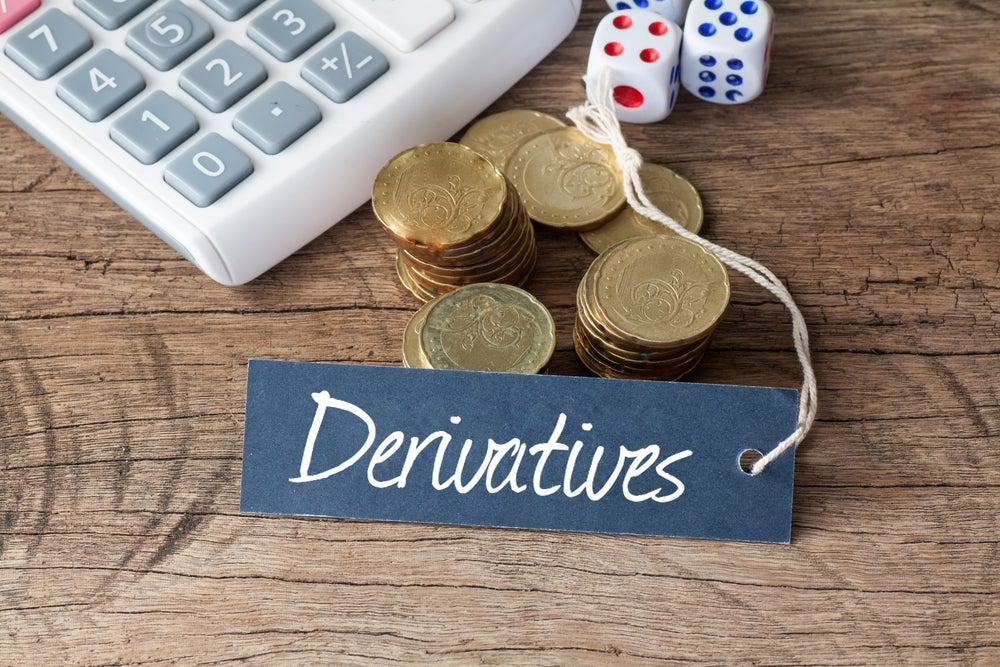

Financial derivatives are financial instruments whose value is derived from an underlying asset, index, or rate. These instruments include futures, options, swaps, and forwards. They play a crucial role in financial markets by allowing participants to hedge risk, speculate on asset price movements, and engage in arbitrage opportunities. Derivatives facilitate risk management and price discovery, thereby contributing to market efficiency and liquidity.

The derivatives market has grown significantly over the past few decades, becoming a critical component of the global economy. According to the Bank for International Settlements (BIS), the notional amount of over-the-counter (OTC) derivatives contracts was estimated to be in the hundreds of trillions of dollars as of recent years, illustrating their widespread use and importance. This vast market allows institutions to manage financial risk, trade in complex financial scenarios, and amplify returns through leverage.

Algorithmic trading, or algo trading, has emerged as a transformative force in financial markets, notably impacting the trading of derivatives. Algo trading refers to the use of computer programs and algorithms to execute trades at high speed, with minimal human intervention. This technology revolutionizes trading by increasing the efficiency and speed of transactions, reducing costs, and enabling the execution of sophisticated trading strategies that can respond to market conditions instantaneously.

Derivatives and algo trading are intrinsically linked, as the complexity and high frequency of derivative trading often necessitate the precision and speed provided by algorithms. Market participants, including hedge funds, investment banks, and proprietary trading firms, increasingly rely on algo trading to manage large volumes of derivative contracts, optimize trading opportunities, and enhance market-making activities.

The purpose of this article is to explore the size of the derivatives market and the impact of algorithmic trading. By analyzing how technological advancements influence the growth and dynamics of the derivatives market, we aim to provide insights into this evolving landscape.

## Table of Contents

## Understanding Financial Derivatives

Financial derivatives are financial instruments whose value is derived from underlying assets, such as stocks, bonds, commodities, currencies, interest rates, or market indices. Common types of derivatives include futures, options, swaps, and forwards, each serving distinct functions within financial markets.

**Futures** are standardized contracts obligating the buyer to purchase or the seller to sell an asset at a predetermined future date and price. These are traded on exchanges and are used primarily for hedging and speculation. **Options** provide the holder the right, but not the obligation, to buy or sell an asset at a specified price before a certain date, offering flexibility and risk management options. **Swaps** involve the exchange of cash flows or other financial instruments between parties, typically used to manage interest rate risk or currency exposure. **Forwards** are similar to futures but are customized, over-the-counter agreements between two parties to buy or sell an asset at a future date for a price agreed upon today.

Derivatives are instrumental in risk management, allowing market participants to hedge against potential losses in asset value. For example, an investor with a portfolio of international stocks might use currency derivatives to protect against adverse currency movements. Speculators, on the other hand, use derivatives to bet on future price movements, seeking to profit from market [volatility](/wiki/volatility-trading-strategies). Arbitrageurs exploit price differences of the same asset across different markets or derivatives to achieve risk-free profits.

Despite their advantages, trading financial derivatives comes with inherent risks. These include market risk, credit risk, [liquidity](/wiki/liquidity-risk-premium) risk, and operational risk. Market risk involves potential losses due to adverse movements in market prices. Credit risk pertains to the possibility that one party might default on their contractual obligations. Liquidity risk is the potential difficulty in entering or exiting positions without affecting asset prices significantly. Operational risks include errors in transaction processes.

Historically, derivatives have evolved significantly. Their roots trace back to ancient civilizations with basic forward contracts, progressing to modern futures contracts in the 19th century with the establishment of organized exchanges like the Chicago Board of Trade. The late 20th century saw the advent of complex financial derivatives driven by advancements in technology and financial theory, notably the Black-Scholes model for options pricing, which revolutionized the understanding and application of derivatives.

In summary, financial derivatives play a crucial role in modern finance by enabling hedging, speculation, and [arbitrage](/wiki/arbitrage). While they offer numerous benefits, they also present substantial risks that require careful management. The historical evolution of derivatives reflects their growing sophistication and integration into global financial systems.

## The Current State and Size of the Derivatives Market

The derivatives market is a critical component of the global financial landscape, characterized by its vast scale and significant growth over recent years. As of the latest data available, the total notional value of the global derivatives market is estimated to exceed $640 trillion. This figure underscores the immense scale at which derivatives operate within financial ecosystems.

Several factors contribute to the growth of the derivatives market. One primary driver is risk management. Derivatives allow institutions and investors to hedge against potential losses from fluctuations in asset prices, interest rates, or currency exchange rates. Additionally, the increased globalization of trade and finance has spurred demand for derivatives, as businesses seek ways to mitigate the risks associated with cross-border transactions. Technological advancements have also facilitated the growth of this market, enhancing the ability to price, structure, and trade complex instruments.

Regional differences in market size are notable. North America, particularly the United States, maintains a dominant position because of its robust financial infrastructure and regulatory environment. The Chicago Mercantile Exchange (CME) is a notable example, serving as a global hub for derivatives trading. Europe follows closely, driven by institutions such as the London International Financial Futures and Options Exchange (LIFFE) and the Eurex Exchange in Germany. Asia is rapidly expanding its market presence, with significant contributions from countries like China, Japan, and India, which are investing heavily in financial technology and infrastructure to support derivatives trading.

Globally, key players and institutions drive the derivatives market, including major banks, asset management firms, and hedge funds. Institutions such as Goldman Sachs, JPMorgan Chase, and Barclays have significant footprints in the derivatives space. Additionally, exchanges like the aforementioned CME, Eurex, and Intercontinental Exchange (ICE) play crucial roles by providing platforms that facilitate derivatives transactions.

In summary, the derivatives market continues to grow, powered by globalization, technological innovation, and the fundamental need for risk management. The differing regional market sizes reflect both historical financial development and future growth potential in emerging economies. Key players remain instrumental in shaping the market's trajectory, leveraging sophisticated infrastructure to maintain and expand their influence in global finance.

## Rise of Algorithmic Trading in the Derivatives Market

Algorithmic trading, often referred to as algo trading, is the process of using computer algorithms to execute trades in financial markets. These algorithms can execute orders at speeds and frequencies impossible for a human trader. The primary functionalities of [algorithmic trading](/wiki/algorithmic-trading) include order execution, arbitrage, and [trend following](/wiki/trend-following), among others. Orders are placed based on predetermined criteria using complex mathematical models and automated strategies, often considering market data in real-time.

Algo trading is transforming the derivatives market, characterized by complex and diverse financial instruments such as futures, options, and swaps. Derivatives trading involves rapid fluctuations and requires timely transactions, making it an ideal candidate for automation through algorithms. Automation minimizes human error, reduces emotional decision-making, and allows for transactions to be executed with precision and speed.

One of the prominent benefits of algo trading in derivatives is speed. Algorithms can process vast amounts of data and make trading decisions within milliseconds, a pace far beyond human capabilities. This speed allows traders to capitalize on short-lived trading opportunities and arbitrage situations. Additionally, algo trading provides efficiency by handling large sets of repetitive and complex tasks like calculating spreads, charting indicators, and monitoring other significant parameters around the clock. Consequently, algorithmic trading reduces the cost of trading as it minimizes the need for human involvement while maximizing accuracy and efficiency.

Despite its advantages, algo trading presents several challenges and risks. One primary concern is the potential for systemic risk due to the inherent complexity and interconnectivity of algorithms within markets. For instance, the infamous "flash crash" of May 2010, when major stock indices in the United States rapidly plummeted before quickly recovering, was partly attributed to algorithmic trading programs reacting negatively to feedback loops in the data. There's also the risk of overfitting, where algorithms that are too closely fitted to past data perform poorly with new, unseen data. Furthermore, regulatory and oversight challenges arise as algorithmic trading systems can sometimes operate beyond the reach of human supervision, requiring robust monitoring systems to prevent abuse and manipulation.

In summary, algorithmic trading plays a pivotal role in modernizing the derivatives market, offering unparalleled speed, efficiency, and cost-effectiveness. However, it also introduces unique challenges that require careful management to ensure the stability and fair functioning of financial markets.

## Impact of Algorithmic Trading on the Derivatives Market Size

Algorithmic trading, a process that automates trading strategies with the use of computer algorithms, has significantly influenced the derivatives market's growth and dynamics. The integration of advanced technologies has not only expanded market size but also transformed how derivatives are traded, impacting liquidity and volatility.

The derivatives market has witnessed substantial growth, partly due to the adoption of algorithmic trading. Algorithms can execute trades at speeds and volumes beyond human capability, contributing to an increase in the total [volume](/wiki/volume-trading-strategy) of derivatives traded globally. The use of complex algorithms allows traders to analyze large datasets, identify patterns, and execute trades in fractions of a second. This technological advancement drives market expansion as it attracts both institutional investors seeking efficiency and individual traders aiming for improved execution prices.

A key [factor](/wiki/factor-investing) in this expansion is the increased liquidity provided by algorithmic trading. Liquidity, the ease with which assets can be bought or sold without affecting their price, is vital in ensuring that markets function efficiently. Algorithms enable high-frequency trading ([HFT](/wiki/high-frequency-trading-strategies)), a subset of algorithmic trading that involves executing numerous trades at extremely fast speeds. HFT contributes to higher liquidity levels as it bolsters market depth, allowing for smoother trade executions. This liquidity, in turn, reduces bid-ask spreads, encouraging more participation and increasing overall market size.

Market volatility, the rate at which the price of an asset changes, is another aspect shaped by algorithmic trading. Algorithms can exacerbate or dampen volatility, depending on their design and market conditions. In highly liquid markets, algorithms can reduce volatility by quickly adjusting to new information and balancing supply and demand. However, in some scenarios, the rapid execution of large volumes of algorithmic trades can lead to abrupt price movements, increasing short-term volatility. Despite these fluctuations, the overall impact of algorithmic trading has been a more efficient market, which has further stimulated its growth.

Technological advances in trading, such as the development of [machine learning](/wiki/machine-learning) and [artificial intelligence](/wiki/ai-artificial-intelligence), have also contributed to market size expansion. These technologies allow algorithms to learn from historical data, continuously refining their strategies. As a result, algorithmic trading becomes more accurate and effective over time, attracting additional investors and further expanding the derivatives market.

Increased transparency and reduced trading costs are additional benefits provided by algorithmic trading. These factors lower barriers to entry and make derivatives trading more accessible, contributing to market growth. The transparency ensures that market participants can reliably assess pricing and market conditions, while the reduced costs attract a broader range of investors.

In summary, the adoption of algorithmic trading has been a significant driver of growth and dynamism in the derivatives market. By enhancing liquidity, impacting volatility, and leveraging technological advancements, algorithmic trading has expanded market size and transformed the landscape of derivatives trading. This trend is expected to continue as technology evolves, further shaping the market's future dynamics.

## Future Trends in the Derivatives Market and Algo Trading

Emerging technologies continue to reshape the landscape of the derivatives market and algorithmic trading, heralding significant transformations. Machine learning and artificial intelligence (AI) stand at the forefront of these technologies, offering sophisticated models to predict price movements and detect patterns in large data sets. These technologies enable the creation of more advanced trading algorithms that can adapt in real-time to market conditions, providing traders with a competitive edge.

The utilization of blockchain in derivatives trading presents another promising trend. Blockchain technology enhances transparency and reduces counterparty risk by enabling secure and immutable transaction records. It also facilitates the development of smart contracts, which can automate the execution of derivative transactions based on pre-determined criteria, increasing efficiency and reducing operational costs.

Quantum computing, although still in its nascent stages, has the potential to revolutionize algorithmic trading by exponentially increasing computational power. This advancement could lead to more accurate pricing models and risk assessment tools, enabling traders to execute strategies that were previously computationally infeasible.

Regulatory changes are anticipated to play a crucial role in shaping the future of derivatives trading. As the market becomes increasingly digital, regulators are expected to implement frameworks that ensure transparency and minimize systemic risk. These regulations may include more stringent disclosure requirements and real-time monitoring of trading activities to prevent market abuse.

Market participants can leverage algorithmic trading for competitive advantage by integrating real-time data analytics and machine learning models into their trading systems. These integrations allow traders to execute strategies at speeds and accuracies unattainable by traditional trading methods. Additionally, the ability to backtest algorithms using historical data helps in refining strategies to optimize performance.

To remain competitive, firms must invest in high-performance computing infrastructure and secure access to quality data. Collaboration with technology companies and academic institutions can also facilitate the development of proprietary algorithms and insights into emerging trading patterns.

As technology continues to advance, the intersection of derivatives trading and algorithmic strategies will likely redefine traditional financial practices, introducing efficiencies and opportunities for market growth. Market participants who adeptly navigate these technological advancements will position themselves advantageously in the evolving financial landscape.

## Conclusion

The derivatives market plays a vital role in the global financial system, offering instruments for hedging, speculation, and arbitrage. With a market size that dwarfs many other financial sectors, its influence on the economy cannot be overstated. Understanding this market's size provides insights into global economic health and risk management strategies. Algorithmic trading has emerged as a transformative element within this landscape, reshaping the way derivatives are traded. By leveraging complex algorithms, market participants can execute trades with unmatched speed and efficiency.

The interplay between derivatives and algorithmic trading is significant. Algo trading has enhanced market liquidity, reduced transaction costs, and increased the precision of trading strategies. However, it also introduces risks such as system failures and unexpected market volatility, which need careful management.

Looking ahead, the derivatives and algo trading sectors are poised for growth and evolution, influenced by technological advancements and regulatory changes. As these markets adapt, participants who can effectively harness algorithmic tools will likely gain a competitive edge. Embracing innovation while managing associated risks will be crucial for future success. Understanding the dynamics between derivatives and algorithmic trading thus remains essential for navigating the financial markets of tomorrow.

## References & Further Reading

[1]: Bank for International Settlements. (2023). ["Triennial Central Bank Survey: OTC derivatives outstanding."](https://www.bis.org/statistics/rpfx22.htm) 

[2]: Hull, J. C. (2022). ["Options, Futures, and Other Derivatives."](https://www.pearson.com/en-us/subject-catalog/p/options-futures-and-other-derivatives/P200000005938/9780136939917) Pearson.

[3]: Aldridge, I. (2013). ["High-Frequency Trading: A Practical Guide to Algorithmic Strategies and Trading Systems."](https://www.amazon.com/High-Frequency-Trading-Practical-Algorithmic-Strategies/dp/1118343506) Wiley.

[4]: Chincarini, L. B., & Kim, D. (2006). ["Quantitative Equity Portfolio Management: An Active Approach to Portfolio Construction and Management."](https://archive.org/details/quantitativeequi0000chin) McGraw-Hill.

[5]: Harris, L. (2003). ["Trading and Exchanges: Market Microstructure for Practitioners."](https://academic.oup.com/book/52292) Oxford University Press.