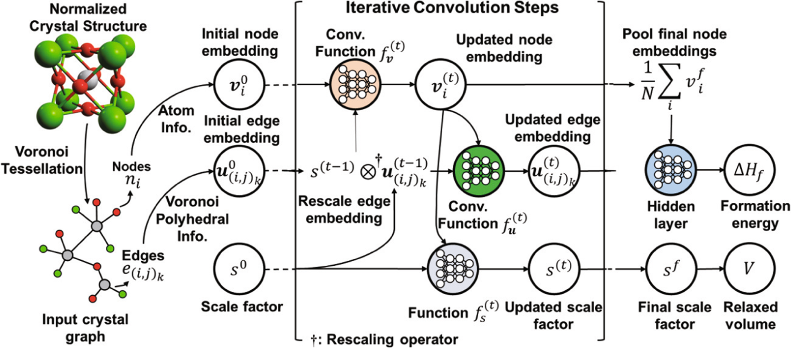

## Table of Contents

## What is size invariance in the context of machine learning?

Size invariance in machine learning refers to the ability of a model to recognize and process objects regardless of their size in an image or data set. Imagine you're trying to identify a cat in a picture. The cat could be close-up, making it appear large, or far away, making it appear small. A model with size invariance can still recognize that it's a cat, no matter how big or small it appears in the image.

This concept is crucial in applications like image recognition, where objects can appear at various scales. To achieve size invariance, machine learning models often use techniques like convolutional neural networks (CNNs). These networks apply filters that can detect features at different scales, allowing the model to understand that the same object can look different depending on its size. By training on diverse datasets with objects at varying sizes, the model learns to generalize and maintain accuracy across different scales.

## Why is size invariance important in machine learning applications?

Size invariance is important in machine learning because it helps models work well with real-world data. In the real world, things can appear in different sizes depending on how close or far away they are. For example, a car might look tiny if it's far away, but big if it's close. If a machine learning model can't recognize that it's the same car no matter its size, it won't be very useful. Size invariance makes sure the model can still do its job correctly, no matter how big or small the object appears.

This is especially important in fields like autonomous driving, where cars and pedestrians need to be recognized from various distances. Without size invariance, a self-driving car might not see a small, distant pedestrian or might mistake a close-up object for something else. By being able to recognize objects at different sizes, the model becomes more reliable and safer to use in real-life situations.

## Can you explain how size invariance differs from other types of invariance in machine learning?

Size invariance is one of several types of invariance in [machine learning](/wiki/machine-learning), each addressing different aspects of data variability. Size invariance specifically deals with the model's ability to recognize objects regardless of their scale in an image or dataset. For example, whether a dog appears large in a close-up photo or small in a distant shot, a size-invariant model will still identify it as a dog. This is crucial for applications like image recognition, where objects can appear at various sizes depending on their distance from the camera.

Another common type of invariance is rotation invariance, which allows a model to recognize objects regardless of their orientation. For instance, a model with rotation invariance can identify a car whether it's facing forward, sideways, or at an angle. This is important in scenarios where objects might be viewed from different angles, such as in security cameras or satellite imagery. Unlike size invariance, which focuses on scale, rotation invariance deals with the angle of the object.

Additionally, there's translation invariance, which enables a model to recognize objects regardless of their position within an image. If a cat moves from the left side of a picture to the right side, a translation-invariant model will still identify it as a cat. This is vital for applications like object tracking, where objects can move around within the frame. Each type of invariance addresses a specific challenge in data variability, ensuring that machine learning models remain effective across different conditions.

## What are some common techniques used to achieve size invariance in neural networks?

One common technique to achieve size invariance in neural networks is the use of convolutional neural networks (CNNs). CNNs are designed to automatically and adaptively learn spatial hierarchies of features, from low-level edges to high-level object parts. They do this through the use of convolutional layers, which apply filters across the entire image. These filters can detect features at different scales, helping the network recognize objects regardless of their size. For example, a CNN might use a series of convolutional layers to identify edges, then shapes, and finally whole objects like cars or cats, no matter how big or small they appear in the image.

Another technique is the use of pooling layers, which reduce the spatial size of the data, making the network more robust to changes in scale. Pooling layers take small regions of the data (like 2x2 or 3x3 pixels) and summarize them into a single value, usually by taking the maximum or average value. This process helps the network focus on the most important features and discard less relevant details, allowing it to recognize objects even if they appear at different sizes. By combining convolutional and pooling layers, neural networks can achieve size invariance, making them effective at tasks like image recognition where objects can vary in size.

Lastly, [data augmentation](/wiki/data-augmentation) is another way to help neural networks achieve size invariance. This involves artificially increasing the size of the training dataset by applying transformations like scaling to the existing images. By training on images where objects appear at different sizes, the network learns to recognize these objects across various scales. This approach helps the model generalize better to new, unseen data, ensuring it can identify objects whether they are close-up or far away in a new image.

## How does convolutional neural networks (CNNs) contribute to size invariance?

Convolutional neural networks (CNNs) help with size invariance by using special layers called convolutional layers. These layers apply filters across the entire image, looking for patterns like edges or shapes. The cool thing about these filters is that they can detect these patterns no matter how big or small they are in the picture. So, if you have a picture of a cat, the CNN can recognize it's a cat whether the cat is really big in the photo or really small. This is because the filters can find the cat's features at different scales.

Another way CNNs achieve size invariance is through pooling layers. These layers take small parts of the image and turn them into a single number, usually the biggest or the average number in that part. This helps the network focus on what's important and ignore the small details. When you use pooling layers with convolutional layers, the network can see the big picture and understand that a dog is still a dog, even if it looks different because it's closer or farther away. By training on lots of pictures with objects at different sizes, the CNN learns to recognize things no matter how big or small they appear.

## What are the challenges faced when implementing size invariance in machine learning models?

One of the main challenges in implementing size invariance in machine learning models is dealing with the huge variety of sizes that objects can appear in real-world images. Think about a car: it can look tiny when it's far away or huge when it's close up. To make a model that can recognize a car no matter its size, you need to train it on a lot of different images with cars at all sorts of scales. This means you need a big and diverse dataset, which can be hard to get and expensive to label. If your dataset doesn't have enough variety, your model might not be able to recognize objects when they appear in sizes it hasn't seen before.

Another challenge is balancing size invariance with other types of invariance, like rotation or translation invariance. While CNNs can help with size invariance by using convolutional and pooling layers, these layers also need to handle other changes in the image, like if the object is turned at an angle or moved to a different spot. Getting all these right at the same time can be tricky. If you focus too much on making the model good at recognizing objects at different sizes, it might not be as good at recognizing objects that are rotated or moved around. So, you have to find the right mix to make sure the model works well no matter what changes happen in the image.

## Can you describe a real-world application where size invariance is crucial?

One real-world application where size invariance is crucial is in autonomous driving systems. Imagine you're in a self-driving car. The car needs to recognize other cars, pedestrians, and road signs no matter how far away or close they are. If the car's system can't tell that a tiny dot in the distance is actually a pedestrian, it could be dangerous. Size invariance helps the car's cameras and sensors understand that a car is still a car, whether it's right in front of you or far down the road. This makes the car safer and more reliable because it can react correctly to things at all distances.

Another example is in medical imaging, like X-rays or MRIs. Doctors use these images to look for things like tumors or broken bones. These things can appear very small or very large depending on how the image is taken. A machine learning model with size invariance can help doctors by pointing out these issues no matter their size in the image. This means the model can be more accurate and help doctors make better decisions about patient care. Without size invariance, the model might miss small tumors or not recognize large ones, which could lead to wrong diagnoses.

## How do pooling layers in CNNs help in achieving size invariance?

Pooling layers in CNNs help achieve size invariance by reducing the size of the data while keeping the important information. Imagine you have a picture of a cat. The cat might be big or small in the picture, but what really matters are its features like the shape of its ears or the pattern on its fur. Pooling layers take small parts of the image, like a 2x2 or 3x3 grid of pixels, and turn them into one number. This number could be the biggest value in that grid (max pooling) or the average value (average pooling). By doing this, the network can focus on the important features of the cat and ignore tiny details that don't matter as much, helping it recognize the cat no matter its size.

When you combine pooling layers with convolutional layers, the network gets even better at size invariance. Convolutional layers use filters to look for patterns in the image, like edges or shapes, at different scales. Pooling layers then help by summarizing these patterns into a smaller, more manageable form. This combination allows the network to understand that a dog is still a dog, whether it's close-up or far away in the image. By training on lots of images with objects at different sizes, the CNN learns to recognize things no matter how big or small they appear, making it more reliable in real-world situations.

## What are the limitations of current methods for achieving size invariance?

One big problem with current ways to make machine learning models recognize objects no matter their size is that they need a lot of different pictures to work well. These pictures should show the objects in all sorts of sizes. If you don't have enough variety in your pictures, the model might not be good at recognizing objects when they appear in sizes it hasn't seen before. Getting a big and diverse set of pictures can be hard and expensive. Also, labeling all those pictures takes a lot of time and effort. If the model doesn't see enough examples of objects at different sizes during training, it might not work well in real life.

Another challenge is making sure the model can handle other changes in the picture, like if the object is turned at an angle or moved to a different spot. While CNNs with convolutional and pooling layers help with size invariance, they also need to deal with these other changes. It can be tricky to get everything right at the same time. If you focus too much on making the model good at recognizing objects at different sizes, it might not be as good at recognizing objects that are rotated or moved around. So, you have to find the right balance to make sure the model works well no matter what changes happen in the image.

## How can data augmentation be used to enhance size invariance in machine learning models?

Data augmentation helps machine learning models get better at recognizing objects no matter their size by showing them more examples. When you train a model, you can take the pictures you already have and make new ones by changing them. For example, you can make a car look bigger or smaller in a picture. By doing this, the model sees the car at lots of different sizes during training. This teaches the model that a car is still a car, whether it's close-up or far away. The more different sizes the model sees, the better it gets at recognizing objects in new pictures where the size might be different.

Using data augmentation is a smart way to make your dataset bigger and more varied without needing to find and label lots of new pictures. This is really helpful because getting a diverse set of images can be hard and expensive. By scaling images up or down, you can make sure your model learns to look at the important parts of an object, like the shape of a dog's ears, no matter how big or small the dog appears. This makes the model more reliable in real life, where objects can appear at all sorts of sizes.

## What advanced techniques exist for improving size invariance in deep learning?

One advanced technique for improving size invariance in [deep learning](/wiki/deep-learning) is the use of spatial pyramid pooling (SPP). SPP works by dividing the image into different sized regions and then pooling the features from these regions. This helps the network see the image at multiple scales all at once, making it better at recognizing objects no matter how big or small they are. By doing this, the model can focus on the important parts of the object, like the shape of a cat's ears, even if the cat is far away or close up. SPP can be added to CNNs to make them more effective at handling different object sizes.

Another technique is the use of scale-invariant feature transform (SIFT) and similar methods to help with size invariance. SIFT looks for key points in an image that stay the same even if the image is scaled up or down. These key points help the model recognize objects by focusing on their most important features. By using SIFT, the model can learn to identify things like cars or people no matter their size in the picture. This makes the model more reliable in real-world situations where objects can appear at different scales.

## How can one evaluate the effectiveness of size invariance in a trained model?

To evaluate how well a model can recognize objects no matter their size, you can use a test set with images of objects at different scales. For example, you might have pictures of dogs that are close-up and look big, and other pictures where the dogs are far away and look small. You then see how well the model can identify these dogs in all the pictures. If the model is good at recognizing the dogs no matter how big or small they appear, it means it has good size invariance. You can measure this by looking at the model's accuracy, precision, and recall on these test images.

Another way to check the model's size invariance is by using metrics like mean Average Precision (mAP). This metric looks at how well the model can find and correctly label objects at different sizes in the images. If the mAP score is high for images with objects at various scales, it shows that the model is doing a good job at size invariance. You can also use confusion matrices to see if the model is making more mistakes with objects of certain sizes, which can help you understand where the model needs to improve.

## References & Further Reading

[1]: Krizhevsky, A., Sutskever, I., & Hinton, G. E. (2012). ["ImageNet Classification with Deep Convolutional Neural Networks."](https://dl.acm.org/doi/10.1145/3065386) Advances in Neural Information Processing Systems 25.

[2]: Simonyan, K., & Zisserman, A. (2015). ["Very Deep Convolutional Networks for Large-Scale Image Recognition."](https://arxiv.org/abs/1409.1556) arXiv:1409.1556.

[3]: He, K., Zhang, X., Ren, S., & Sun, J. (2016). ["Deep Residual Learning for Image Recognition."](https://arxiv.org/abs/1512.03385) Proceedings of the IEEE Conference on Computer Vision and Pattern Recognition (CVPR).

[4]: Goodfellow, I., Bengio, Y., & Courville, A. (2016). ["Deep Learning."](https://link.springer.com/article/10.1007/s10710-017-9314-z) MIT Press.

[5]: Girshick, R. (2015). ["Fast R-CNN."](https://arxiv.org/abs/1504.08083) Proceedings of the IEEE International Conference on Computer Vision (ICCV).

[6]: Lin, T.-Y., Dollár, P., Girshick, R., He, K., Hariharan, B., & Belongie, S. (2017). ["Feature Pyramid Networks for Object Detection."](https://ieeexplore.ieee.org/document/8099589) Proceedings of the IEEE Conference on Computer Vision and Pattern Recognition (CVPR).

[7]: Lowe, D. G. (2004). ["Distinctive Image Features from Scale-Invariant Keypoints."](https://www.cs.ubc.ca/~lowe/papers/ijcv04.pdf) International Journal of Computer Vision.

[8]: Shorten, C., & Khoshgoftaar, T. M. (2019). ["A survey on Image Data Augmentation for Deep Learning."](https://journalofbigdata.springeropen.com/articles/10.1186/s40537-019-0197-0) Journal of Big Data.