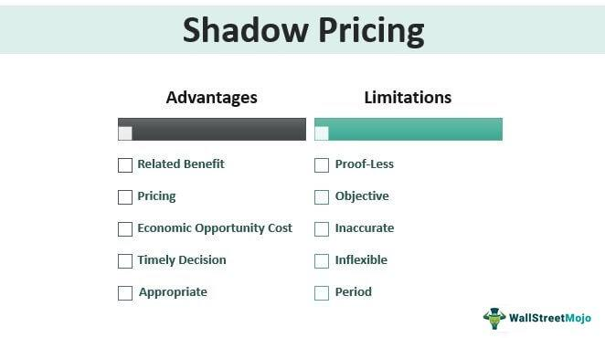

The U.S. economy operates as a multifaceted network that extends beyond the formal market to encompass a significant underground or shadow economy. This hidden segment, comprising unreported and often illicit activities, poses a complex challenge to policymakers and economists alike. In this article, we aim to unravel the U.S. underground economy by examining its size, the impact it exerts on the broader economic landscape, and the emerging role of technology, particularly algorithmic trading, within these informal markets.

The underground economy involves economic transactions that escape formal accounting, making them invisible to government scrutiny and taxation. It includes not only illegal ventures, such as drug trafficking and unlicensed gambling, but also legal activities that are simply not reported for tax purposes—ranging from cash-paid jobs to under-the-table services. Estimates suggest that the U.S. underground economy could represent between 6.4% and 12% of the nation's Gross Domestic Product (GDP), signifying its substantial, albeit hidden, contribution to economic activities.

By evaluating why individuals and organizations choose to operate within the shadow economy, we aim to understand its implications on the formal market structure. Drivers such as high taxation, cumbersome regulations, and limited access to legitimate employment often push participants into this clandestine segment. While it offers certain survival advantages—especially to marginalized groups—it simultaneously undermines tax revenues and the integrity of social safety nets.

Additionally, as technology advances, new dynamics within the underground economy emerge. Algorithmic trading—a process where computer algorithms execute trades at speeds and complexities beyond human capacity—illustrates the intersection of technology with shadow markets. While typically associated with legitimate financial practice, these algorithms can be leveraged in informal sectors, allowing for sophisticated yet concealed trading activities.

This article seeks to provide a comprehensive overview of the U.S. underground economy while examining the role of technological innovations like algorithmic trading. By understanding these elements, we aim to reflect on the hidden yet influential aspects of economic systems and their potential consequences for the formal economy.

## Table of Contents

## Understanding the Underground Economy

The underground economy, often referred to as the shadow or informal economy, comprises a range of economic activities that are not reported to government authorities, thereby escaping taxation and regulation. This global phenomenon includes a spectrum of activities from illegal operations, such as drug trafficking and unlicensed gambling, to unreported transactions involving legitimate goods and services, like cash-paid household help or freelance work.

In the United States, the size of this shadow economy is significant, with estimates suggesting it constitutes between 6.4% and 12% of the country's Gross Domestic Product (GDP). This wide range indicates the challenges in pinpointing the exact size due to the inherently secretive nature of undeclared activities. Nonetheless, these approximations suggest a substantial sideline sector operating outside official economic channels.

Despite its largely invisible operations, the underground economy plays a notable role in influencing various aspects of the formal economy. It impacts job markets by providing employment opportunities for individuals who may be unable to access or unwilling to participate in the formal economy. This includes undocumented workers or those working on a cash basis without formal contracts or benefits.

The implications extend to fiscal policy as well. Unreported incomes and transactions reduce the tax revenue collected by the government, which can decrease the funding available for public services like education, healthcare, and infrastructure. Furthermore, such economic activities can distort competitive markets since businesses operating informally can undercut prices by skirting taxes and regulations that formal businesses must adhere to.

To summarize, while the shadow economy remains a largely hidden element of the U.S. economic landscape, its breadth and consequences are far-reaching, affecting everything from individual livelihoods to national fiscal health. Understanding the scope and characteristics of these unreported activities is essential for policymakers and economists seeking to address its challenges and harness potential benefits.

## Factors Contributing to the Shadow Economy

High taxes, regulatory burdens, and government corruption are significant drivers of the shadow economy. These factors collectively push individuals and businesses to bypass formal economic channels, opting instead for the informal economy, where the perceived constraints and costs are lower.

Firstly, high taxes create a substantial financial burden for both individuals and corporations. When faced with elevated tax rates, some economic [agents](/wiki/agents) may choose to underreport income or engage in entirely off-the-[books](/wiki/algo-trading-books) transactions to maximize their net earnings. This avoidance behavior is often rationalized as a means to reclaim perceived excessive government levies. Research has shown that an increase in tax burdens is positively correlated with the size of the shadow economy (Tanzi, 1980).

Moreover, regulatory burdens exacerbate the cost and complexity of conducting business. Small enterprises, in particular, might find compliance with myriad rules related to labor laws, environmental standards, and health and safety regulations financially and logistically challenging. As a result, these businesses may operate partially or entirely within the shadow economy to sidestep these regulatory hurdles. The ease of bypassing such regulations without immediate consequence further incentivizes non-compliance.

Corruption also plays a critical role in expanding the shadow economy. In environments where public officials demand bribes or preferential treatment in exchange for permits or favorable regulation enforcement, businesses may find it more viable to operate outside the formal system. Corruption distorts the notion of a level playing field, encouraging economic activities that circumnavigate official oversight.

Finally, the lack of access to formal employment significantly contributes to the shadow economy. In the case of undocumented workers, legal barriers prevent them from accessing legitimate job markets. Consequently, they often have no option but to turn to informal employment opportunities that do not require documentation but also provide no statutory employment benefits.

These factors underscore the complex motivations for participating in the shadow economy. While they offer short-term relief from financial and regulatory pressures, they also perpetuate a cycle of informality that deprives the formal economy of potential tax revenues and economic growth. Addressing these drivers requires nuanced policy measures that balance the need for fiscal responsibility with the facilitation of more inclusive economic participation.

### References

- Tanzi, V. (1980). The Underground Economy in the United States: Estimates and Implications. *Banca Nazionale del Lavoro Quarterly Review*, 32(135), 427-443.

## Impact of the Underground Economy on the Formal Economy

The underground economy exerts a tangible impact on the formal economy by directly reducing tax revenues and thereby weakening social safety nets. When earnings go unreported, the government loses a crucial source of income that would otherwise be allocated to fund public services and programs, including Social Security, healthcare, and education. This reduction in funds has a cascading effect, limiting the reach and effectiveness of these essential services and leaving those who rely on them vulnerable.

To illustrate, consider a simple model where $T$ is the total tax revenue, $E$ is the total reported earnings, and $t$ is the tax rate. The basic relationship is:

$$
T = E \times t
$$

If $U$ represents the unreported earnings, the actual potential tax revenue, denoted as $T_{potential}$, should be:

$$
T_{potential} = (E + U) \times t
$$

The difference $\Delta T$ between the potential and actual tax revenues due to the underground economy is:

$$
\Delta T = T_{potential} - T = U \times t
$$

This equation highlights the direct financial loss to the state due to unreported economic activities, emphasizing the strain it places on funding public amenities.

Additionally, the lack of formal documentation within the underground economy means workers often miss out on the rights and protections that are standard in formal employment. This includes access to health insurance, unemployment benefits, and legal protection for workplace rights. The absence of these safeguards can lead to exploitation and poorer working conditions, further exacerbating inequalities and frustrating efforts to uphold fair labor standards.

The breadth of the shadow economy introduces challenges for policymakers striving to fortify the formal economy's resilience. Addressing these issues requires innovative approaches to uncover and integrate hidden economic activities without stifling economic freedom.

## Algorithmic Trading in the Shadow Economy

Algorithmic trading leverages computer algorithms to execute trades at speeds and efficiencies unattainable by human traders. These systems analyze market data, assess trading signals, and manage orders autonomously, offering a significant edge in both formal and shadow financial markets. In legitimate markets, [algorithmic trading](/wiki/algorithmic-trading) is used to optimize trading strategies, reduce the cost of transactions, and exploit [arbitrage](/wiki/arbitrage) opportunities. 

However, the same technology is equally adaptable to the underground economy, where it can operate free from typical market oversight. In these unregulated sectors, algorithms provide participants with the ability to execute complex and rapid trading strategies while avoiding the constraints and scrutiny of regulated markets. This can include activities such as money laundering, tax evasion, and the trading of illicit goods or services facilitated through automated systems. 

The advantages of algorithmic trading in the shadow economy include the capacity for real-time decision-making and the execution of large volumes of trades with minimal human intervention. Unscrupulous operators might exploit these benefits to conduct transactions in cryptocurrencies or other digital assets that are harder to trace or regulate. Additionally, the use of decentralized networks and advanced technologies like blockchain can exacerbate the challenges of market surveillance.

The flexibility and anonymity inherent in algorithmic systems make them particularly attractive for those looking to operate outside the bounds of traditional financial systems. For instance, trades can be programmed to execute based on specific triggers or patterns, effectively manipulating market conditions to the trader’s advantage without direct human interaction.

In essence, algorithmic trading within the shadow economy represents a double-edged sword. While it provides unprecedented capabilities and efficiencies, it also poses significant regulatory challenges. Policymakers and regulators are tasked with developing strategies to monitor and control such activities without stifling innovation in legitimate financial markets. This ongoing tension raises vital questions about the future governance of both formal and informal trading environments.

## Challenges in Addressing the Underground Economy

Measuring the size and impact of the underground economy presents a significant challenge for economists and policymakers. The clandestine nature of unreported transactions makes it difficult to ascertain precise figures, leading to a reliance on estimates and assumptions. Methodologies often involve a combination of direct and indirect approaches, such as surveys, tax audits, and the analysis of discrepancies between national expenditure and income [statistics](/wiki/bayesian-statistics). Indirect measures may also employ econometric models to estimate the scale of unreported economic activity. Despite these efforts, estimates of the U.S. underground economy's size vary widely, ranging from 6.4% to 12% of GDP, as noted in conventional studies.

Efforts to mitigate the underground economy often include reducing regulatory and bureaucratic burdens. Lowering excessive taxation and simplifying complex compliance requirements can incentivize individuals and businesses to operate within the formal economy. Enhancing enforcement of existing laws is another strategy, involving increased inspections and audits, as well as employing data analytics to identify suspicious activities. However, this can increase operational costs for businesses and potentially hamper economic freedoms. 

Improving scrutiny over informal financial flows is a critical focus area. Authorities may enhance the transparency and traceability of financial transactions through technological advancements in data analytics and blockchain systems. While such measures aim to curtail illicit financial operations, they must balance privacy concerns and the risk of stifling legitimate business innovations.

Thus, policy formulation requires carefully weighing the potential economic benefits of fostering compliance with the constraints it imposes. The delicate balance lies in crafting regulations that safeguard economic freedom and innovation while ensuring adequate enforcement to capture fiscal revenues that sustain public services and infrastructure. Addressing these challenges requires coordinated efforts across governmental agencies, a robust legal framework, and adaptive policy measures that evolve alongside economic and technological developments.

## Conclusion

The shadow economy presents an unignorable phenomenon within the U.S. economic framework. It operates parallel to the formal economy, driven by various factors such as high tax burdens, regulatory constraints, and in some cases, government corruption. Despite its informal nature, the shadow economy significantly impacts public policy, social welfare systems, and economic stability.

Understanding the dynamics and characteristics of this shadow economy is imperative for policymakers striving to manage its influence on the formal economic structure. The development and adoption of algorithmic trading within informal markets illustrate how technology continues to blur the lines between formal and informal sectors. Algorithmic systems can execute trades at high speeds and with sophisticated strategies, providing participants in the shadow economy with tools that escape traditional regulatory oversight.

Policymakers face the challenge of maintaining a fine balance between regulation and economic freedom. While regulating the shadow economy is essential to safeguarding tax revenues and ensuring fair labor practices, it is equally important to foster an environment where innovation and new technologies can thrive. This balance will require coordinated efforts aimed at reducing economic deterrents and enhancing the enforcement of existing regulations without stifling growth or discouraging creative technological applications.

In conclusion, tackling the challenges posed by the shadow economy demands comprehensive policy frameworks that address both its negative impact and its potential contributions. As technology continues to evolve, particularly in the form of algorithmic trading, these strategies must adapt to ensure the vitality and fairness of the entire economic system. This multifaceted approach will help mitigate the adverse effects of the underground economy and support sustainable economic development.

## FAQs

### What is the underground economy? Why does it exist?

The underground economy, also referred to as the shadow or informal economy, encompasses all economic activities that circumvent government regulation, taxation, and observation. These activities may include both illegal undertakings, such as drug trafficking, and legal transactions that go unreported to evade taxes or regulatory scrutiny. The primary drivers behind the existence of the underground economy are high tax rates, excessive regulatory burdens, and the lack of access to formal employment, particularly for marginalized groups such as undocumented workers. Additionally, individuals and businesses may engage in this economy to avoid corruption or inefficiencies present in formal institutions.

### How does the underground economy benefit its participants?

Participants in the underground economy gain certain immediate benefits, such as tax avoidance and regulatory circumvention, which can lead to lower operational costs and increased earnings. For businesses, operating in the shadows means bypassing various compliance measures, thereby reducing overhead expenses. For individuals, especially those who struggle to access the formal job market, the shadow economy offers an alternative route to employment and income. Consequently, they can sustain livelihoods and support families despite being outside the formal economic system.

### What are the risks or downsides of participating in the underground economy?

While the shadow economy offers short-term advantages, it exposes participants to significant risks. A key downside is the lack of legal protection, leaving individuals and businesses vulnerable to exploitation and legal repercussions. Workers in underground jobs often lose out on labor rights, such as minimum wage protections, health benefits, and safe working conditions. Moreover, forgoing formal financial documentation hinders participants’ ability to secure loans, insurance, and other economic opportunities available in the regulated economy. Businesses operating informally face the threat of penalties if caught evading taxes or regulations.

### Can algorithmic trading be effectively regulated within the shadow economy?

Regulating algorithmic trading in the underground economy presents complex challenges. By its nature, the shadow economy thrives on the very lack of oversight that regulation seeks to impose. Algorithmic trading in informal markets can exploit this absence of scrutiny to execute rapid and intricate transactions that evade detection. Effective regulation requires robust tracking mechanisms and advanced data analytics to identify unreported trading activities. However, the decentralized and covert nature of the shadow economy complicates these efforts significantly. Policymakers must balance technological advancements with regulatory frameworks to develop innovative monitoring solutions.

### What steps can governments take to reduce the size of the underground economy?

Governments can adopt a multifaceted approach to curtail the underground economy by implementing the following measures:

1. **Simplifying Tax Codes and Reducing Tax Rates:** By making tax compliance easier and less burdensome, individuals and businesses may be disincentivized from seeking tax evasion alternatives.

2. **Streamlining Regulations:** Reducing bureaucratic red tape and enhancing transparency can encourage businesses to operate within the formal economy.

3. **Enhancing Enforcement and Monitoring:** Investing in advanced technologies for tracking financial flows can aid in identifying and curbing unreported economic activities.

4. **Providing Incentives for Formalization:** Offering benefits such as access to credit and legal protection can motivate informal entities to shift towards formal economic participation.

5. **Addressing Corruption:** Implementing anti-corruption measures can restore trust in formal institutions, reducing the reliance on informal mechanisms.

By addressing these areas, governments can gradually diminish the underground economy's influence while fostering a more inclusive and equitable formal economic environment.

## References & Further Reading

[1]: Tanzi, V. (1980). ["The Underground Economy in the United States: Estimates and Implications."](https://www.jstor.org/stable/3867001) *Banca Nazionale del Lavoro Quarterly Review*, 32(135), 427-443.

[2]: Loayza, N. V. (1996). ["The Economics of the Informal Sector: A Simple Model and Some Empirical Evidence from Latin America."](https://www.sciencedirect.com/science/article/pii/S0167223196000218) *The World Bank Economic Review*, 12(1), 91-122.

[3]: Schneider, F., & Enste, D. H. (2000). ["Shadow Economies: Size, Causes, and Consequences."](https://www.jstor.org/stable/2565360) *Journal of Economic Literature*, 38(1), 77-114.

[4]: Feige, E. L. (1979). ["How Big is the Irregular Economy?"](https://www.researchgate.net/publication/23747491_How_Big_Is_the_Irregular_Economy) *Challenge*, 22(5), 5-13.

[5]: Marcos Lopez de Prado. ["Advances in Financial Machine Learning."](https://www.amazon.com/Advances-Financial-Machine-Learning-Marcos/dp/1119482089) 

[6]: David Aronson. ["Evidence-Based Technical Analysis: Applying the Scientific Method and Statistical Inference to Trading Signals."](https://www.amazon.com/Evidence-Based-Technical-Analysis-Scientific-Statistical/dp/0470008741)

[7]: Stefan Jansen. ["Machine Learning for Algorithmic Trading."](https://github.com/stefan-jansen/machine-learning-for-trading)

[8]: Ernest P. Chan. ["Quantitative Trading: How to Build Your Own Algorithmic Trading Business."](https://www.amazon.com/Quantitative-Trading-Build-Algorithmic-Business/dp/0470284889)

[9]: Schneider, F. (2005). ["Shadow Economies around the World: What Do We Really Know?"](https://www.sciencedirect.com/science/article/pii/S0176268004001107) *European Journal of Political Economy*, 21(3), 598-642.