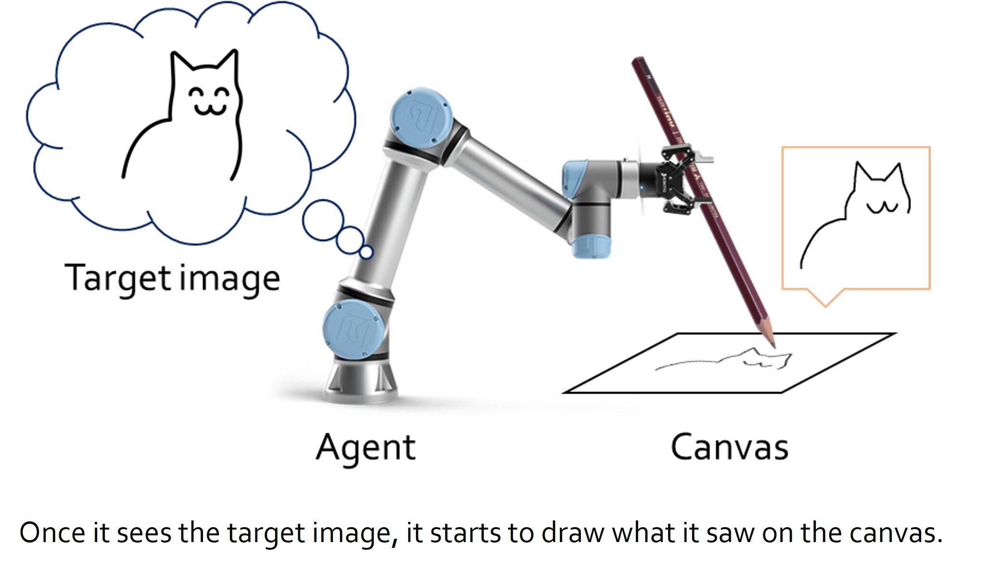

## Table of Contents

## What is sketching in the context of machine learning?

Sketching in machine learning is a technique used to simplify and speed up the processing of large datasets. It involves creating a smaller, more manageable version of the data that still retains the essential characteristics of the original dataset. This is particularly useful when dealing with big data, where traditional methods might be too slow or computationally expensive. By using sketching, machine learning algorithms can perform faster and more efficiently, making it easier to analyze and draw insights from the data.

The process of sketching typically involves selecting a subset of the data points or transforming the data into a lower-dimensional space. For example, in a dataset with millions of points, a sketch might be created by randomly sampling a smaller number of points that are representative of the whole. Alternatively, techniques like random projections can be used to reduce the dimensionality of the data. This means that instead of working with the full dataset, the algorithm operates on the sketch, which can significantly reduce the time and resources needed for computation.

## How does sketching help in reducing the dimensionality of data?

Sketching helps reduce the dimensionality of data by transforming it into a lower-dimensional space while keeping the important information. Imagine you have a big box full of different colored balls. If you want to understand what colors are in the box without looking at every ball, you can take a smaller sample of balls. This sample, or sketch, gives you a good idea of the colors in the box without needing to look at all of them. In the same way, sketching in machine learning takes a smaller, representative sample of the data, which makes it easier and faster to work with.

One common method used in sketching to reduce dimensionality is called random projection. This technique projects the high-dimensional data onto a lower-dimensional space using a random matrix. For example, if you have data in a high-dimensional space $$ \mathbb{R}^d $$, you can project it onto a lower-dimensional space $$ \mathbb{R}^k $$ where $$ k < d $$. This is done using a random matrix $$ R $$ such that the new data points are given by $$ y = Rx $$. By doing this, the data becomes easier to process and analyze, while still maintaining the essential characteristics of the original dataset.

## What are the basic algorithms used for sketching in machine learning?

Sketching in machine learning uses a few basic algorithms to make big data easier to handle. One popular method is random sampling, where you pick a smaller set of data points from the big dataset. This smaller set, or sketch, still shows what the whole dataset is like. Another method is random projection, which changes the data from a high-dimensional space to a lower-dimensional one. For example, if your data lives in a high-dimensional space $$ \mathbb{R}^d $$, random projection can move it to a lower-dimensional space $$ \mathbb{R}^k $$ where $$ k < d $$. This is done using a random matrix $$ R $$ so that the new data points are $$ y = Rx $$. This makes the data simpler to work with.

Another important sketching algorithm is the Johnson-Lindenstrauss transform. This transform also uses random projection but keeps the distances between points close to what they were in the original space. This is useful because many machine learning algorithms depend on the distances between data points. The Count-Min Sketch is another method used for data streams. It's great for counting how many times things appear in the data without needing to store all of it. These algorithms help machine learning models work faster and use less computer power, making it easier to learn from big datasets.

## Can you explain the concept of random projections in sketching?

Random projections in sketching are a way to make big data easier to work with by turning it into a smaller form. Imagine you have a huge pile of different colored balls, and you want to understand what colors are in the pile without looking at every ball. You can take a smaller sample of balls, which gives you a good idea of the colors without needing to look at all of them. In the same way, random projections take a high-dimensional dataset and project it onto a lower-dimensional space. This means you can work with the data more easily and quickly, while still keeping the important information.

The way random projections work is by using a random matrix to change the data. If you have data in a high-dimensional space $$ \mathbb{R}^d $$, you can project it onto a lower-dimensional space $$ \mathbb{R}^k $$ where $$ k < d $$. This is done using a random matrix $$ R $$ so that the new data points are $$ y = Rx $$. This transformation keeps the essential characteristics of the original dataset, making it simpler to process and analyze. By using random projections, machine learning algorithms can handle big data more efficiently, which helps them learn faster and use less computer power.

## How does the Count-Min Sketch work and where is it applied in machine learning?

The Count-Min Sketch is a way to count how many times things appear in a big stream of data without needing to store all of it. Imagine you're at a busy fruit market and you want to keep track of how many apples, bananas, and oranges are sold. Instead of writing down every single sale, you can use a few counters and a clever way to assign each fruit to a counter. The Count-Min Sketch uses a bunch of hash functions to spread out the counts across these counters. If you want to know how many apples were sold, you look at the counters the apples were assigned to and take the smallest number. This gives you a good guess of the total, even if it's not exact.

In machine learning, the Count-Min Sketch is really useful when you're dealing with data that keeps coming in, like from sensors or social media. For example, if you're trying to understand what people are talking about on Twitter, you can use the Count-Min Sketch to count how often certain words or hashtags appear without storing every tweet. This helps machine learning models learn from the data faster and use less computer power. By using the Count-Min Sketch, you can handle big streams of data more easily and still get good results.

## What are the advantages of using sketching techniques in large-scale machine learning?

Sketching techniques in large-scale machine learning help make big data easier to work with. Imagine you have a huge pile of different colored balls, and you want to understand what colors are in the pile without looking at every ball. You can take a smaller sample of balls, which gives you a good idea of the colors without needing to look at all of them. In the same way, sketching methods like random sampling or random projections let you work with a smaller version of your data. This smaller version, or sketch, still keeps the important information from the original dataset, making it quicker and easier to process.

Using sketching also saves a lot of computer power and time. When you have a lot of data, it can take a long time to run machine learning algorithms on it. By using a sketch, you can run these algorithms much faster because you're working with less data. For example, if you have data in a high-dimensional space $$ \mathbb{R}^d $$, you can project it onto a lower-dimensional space $$ \mathbb{R}^k $$ where $$ k < d $$ using a random matrix $$ R $$ so that the new data points are $$ y = Rx $$. This makes the data simpler to handle, and your machine learning models can learn from the data more efficiently.

## How can sketching be used to speed up training of machine learning models?

Sketching can speed up the training of machine learning models by letting them work with a smaller version of the data. Imagine you have a huge pile of different colored balls, and you want to understand what colors are in the pile without looking at every ball. You can take a smaller sample of balls, which gives you a good idea of the colors without needing to look at all of them. In the same way, sketching methods like random sampling or random projections let you create a smaller, more manageable version of your data. This smaller version, or sketch, still keeps the important information from the original dataset, making it quicker and easier to process.

Using sketching also saves a lot of computer power and time. When you have a lot of data, it can take a long time to run machine learning algorithms on it. By using a sketch, you can run these algorithms much faster because you're working with less data. For example, if you have data in a high-dimensional space $$ \mathbb{R}^d $$, you can project it onto a lower-dimensional space $$ \mathbb{R}^k $$ where $$ k < d $$ using a random matrix $$ R $$ so that the new data points are $$ y = Rx $$. This makes the data simpler to handle, and your machine learning models can learn from the data more efficiently.

## What are the trade-offs between accuracy and efficiency when using sketching methods?

When using sketching methods in machine learning, there's a trade-off between how accurate your results are and how fast and efficient your computations can be. Sketching lets you work with a smaller version of your data, which makes everything run quicker. Imagine you have a huge pile of different colored balls, and you want to understand what colors are in the pile without looking at every ball. You can take a smaller sample of balls, which gives you a good idea of the colors without needing to look at all of them. This is like sketching - it speeds up your machine learning models because they don't have to process as much data. But because you're only looking at a part of the data, your results might not be as exact as if you used the whole dataset.

The key is to find a balance that works for your needs. If you need very accurate results, you might have to use more of the original data, which means your computations will take longer. On the other hand, if you can accept a bit less accuracy, you can use a smaller sketch and get your results much faster. For example, if you have data in a high-dimensional space $$ \mathbb{R}^d $$, you can project it onto a lower-dimensional space $$ \mathbb{R}^k $$ where $$ k < d $$ using a random matrix $$ R $$ so that the new data points are $$ y = Rx $$. This makes the data simpler to handle, but you might lose some details in the process. So, you have to decide what's more important for your project: speed and efficiency, or getting the most accurate results possible.

## How does one evaluate the effectiveness of a sketching algorithm in machine learning?

Evaluating the effectiveness of a sketching algorithm in machine learning involves looking at how well it balances speed and accuracy. Imagine you have a huge pile of different colored balls, and you want to understand what colors are in the pile without looking at every ball. You can take a smaller sample of balls, which gives you a good idea of the colors without needing to look at all of them. In the same way, a good sketching algorithm should give you a smaller version of your data that still keeps the important information. You can measure this by comparing the results from the sketch to the results you would get from using the whole dataset. If the sketch gives you results that are close to the full data results, it's effective.

Another way to evaluate a sketching algorithm is by looking at how much it speeds up your machine learning models. When you use a sketch, your algorithms should run faster because they're working with less data. For example, if you have data in a high-dimensional space $$ \mathbb{R}^d $$, you can project it onto a lower-dimensional space $$ \mathbb{R}^k $$ where $$ k < d $$ using a random matrix $$ R $$ so that the new data points are $$ y = Rx $$. This makes the data simpler to handle, and your machine learning models can learn from the data more efficiently. By comparing the time it takes to train a model with and without sketching, you can see if the sketching algorithm is helping you save time and computer power.

## What are some advanced sketching techniques used for streaming data?

Advanced sketching techniques for streaming data help you work with data that keeps coming in, like from sensors or social media. One popular method is the Count-Min Sketch. Imagine you're at a busy fruit market and you want to keep track of how many apples, bananas, and oranges are sold. Instead of writing down every single sale, you can use a few counters and a clever way to assign each fruit to a counter. The Count-Min Sketch uses several hash functions to spread out the counts across these counters. If you want to know how many apples were sold, you look at the counters the apples were assigned to and take the smallest number. This gives you a good guess of the total, even if it's not exact. This method is great for counting how often certain things appear in the data without needing to store all of it.

Another advanced technique is the Misra-Gries algorithm. This method is useful when you want to find the most common items in a stream of data. Imagine you're watching a river flow by, and you want to know which types of fish are most common without catching every single fish. The Misra-Gries algorithm keeps track of the counts of items in the stream and updates them as new data comes in. It's designed to work with limited memory, so it's perfect for big streams of data. By using these advanced sketching techniques, you can handle streaming data more efficiently and still get good results.

## Can sketching be applied to deep learning models, and if so, how?

Yes, sketching can be applied to deep learning models to make them work faster and use less computer power. Imagine you have a huge pile of different colored balls, and you want to understand what colors are in the pile without looking at every ball. You can take a smaller sample of balls, which gives you a good idea of the colors without needing to look at all of them. In the same way, sketching techniques like random sampling or random projections can be used to create a smaller version of the data that deep learning models can train on. This smaller version, or sketch, still keeps the important information from the original dataset, making it quicker and easier for the models to learn.

For example, if you have data in a high-dimensional space $$ \mathbb{R}^d $$, you can project it onto a lower-dimensional space $$ \mathbb{R}^k $$ where $$ k < d $$ using a random matrix $$ R $$ so that the new data points are $$ y = Rx $$. This makes the data simpler to handle, and your deep learning models can learn from the data more efficiently. By using sketching, you can train deep learning models faster and with less data, which is especially useful when dealing with big datasets. This can help you get results quicker without losing too much accuracy.

## What are the current research trends and future directions in sketching for machine learning?

Current research trends in sketching for machine learning focus on improving the accuracy and efficiency of these techniques, especially for big data and streaming data. Researchers are working on new ways to create sketches that capture more of the original data's details while still keeping the data size small. For example, they are exploring advanced methods like the Count-Min Sketch and the Misra-Gries algorithm to better handle data streams. These methods help count how often things appear in the data without needing to store all of it, which is useful for applications like real-time data analysis on social media or sensor networks. Another trend is developing sketching techniques that can work well with deep learning models, making them faster to train and more efficient to use with large datasets.

Future directions in sketching for machine learning are likely to involve even more integration with advanced machine learning models and new types of data. Researchers are looking into ways to use sketching not just for speeding up training, but also for improving the models' performance on specific tasks. For example, they might use sketching to help deep learning models learn from data more effectively by focusing on the most important parts of the data. Additionally, as more types of data become available, like images, videos, and time-series data, sketching techniques will need to adapt to handle these different formats. This could involve creating new sketching algorithms that can capture the unique characteristics of these data types, making machine learning more versatile and powerful in the future.