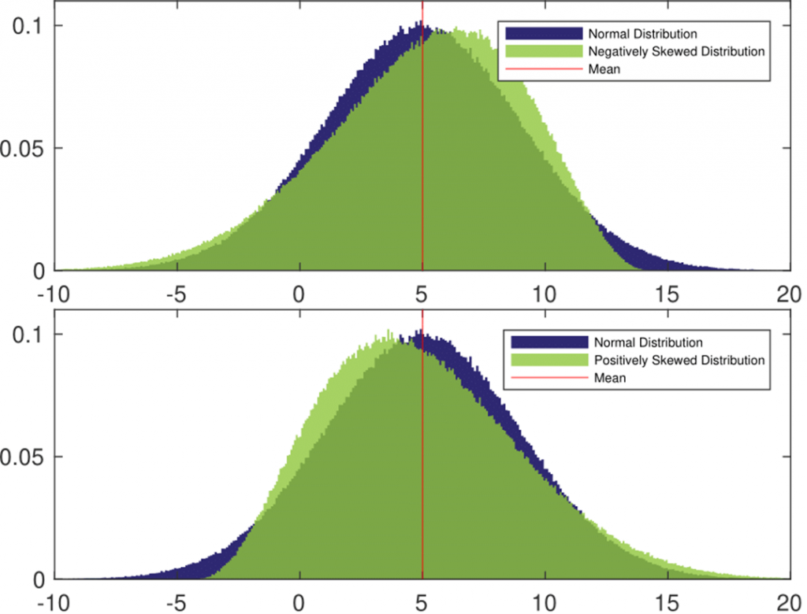

## Table of Contents

## What is skewness in statistics?

Skewness in statistics is a way to measure how much a set of data leans to one side. Imagine you have a bunch of numbers, and if they are spread out evenly on both sides of the middle, the data is not skewed. But if more numbers are on one side, making the data look stretched out on that side, then the data is skewed. This helps us understand if the data is balanced or if it's pulled more towards higher or lower values.

There are two main types of skewness: positive and negative. Positive skewness, also called right skewness, happens when the tail of the data stretches out to the right, meaning there are more low values and a few very high values. Negative skewness, or left skewness, is the opposite, where the tail stretches out to the left, showing more high values and a few very low values. Knowing the skewness helps us make better decisions based on the data, like understanding if most people earn around the same amount or if there are a few people earning a lot more.

## How does skewness affect investment returns?

Skewness can have a big impact on investment returns. When the returns of an investment are positively skewed, it means that there are more small gains and a few big gains. This can be good for investors because even though most days might not bring big profits, there's a chance for a large payoff. But, it also means there's a risk of big losses because the same thing that causes big gains can cause big drops.

On the other hand, if the returns are negatively skewed, most of the time you might see small losses, but there's a chance of a big loss. This can be scary for investors because even though most days might not lose much money, a big drop can happen. Knowing the skewness helps investors understand the risks and rewards better, so they can pick investments that match what they're comfortable with.

## What is skewness risk and why is it important?

Skewness risk is the chance that an investment's returns might not be spread out evenly. Instead of having normal ups and downs, the returns might lean more to one side. This means you might see more small gains but with a chance of a big loss, or more small losses but with a chance of a big gain. It's important because it changes how risky an investment feels. If you know the returns are skewed, you can guess better if you might lose a lot of money suddenly or if you might have a chance to make a lot of money.

Understanding skewness risk helps investors make smarter choices. If an investment has a lot of skewness risk, it might not be right for someone who doesn't like surprises or big losses. But for someone who is okay with taking risks for a chance at big gains, a skewed investment might be exciting. Knowing about skewness risk means you can pick investments that match what you're comfortable with and what you're hoping to achieve with your money.

## Can you explain positive and negative skewness in the context of financial returns?

Positive skewness in financial returns means that most of the time, you might see small gains, but there's a chance for a big win. Imagine you're playing a game where you usually win a little bit of money, but once in a while, you could win a huge amount. This can be exciting because even though most days might not bring big profits, there's always the possibility of hitting a jackpot. However, it also means there's a risk of big losses because the same thing that can cause big gains can also cause big drops. Investors who like taking risks might enjoy this kind of skewness because they're hoping for those big wins.

Negative skewness in financial returns is the opposite. Here, you might see small losses most of the time, but there's a chance of a big loss. It's like playing a game where you usually lose a little bit of money, but once in a while, you could lose a lot. This can be scary for investors because even though most days might not lose much money, a big drop can happen out of nowhere. Investors who don't like surprises or big losses might avoid investments with negative skewness because they want to keep their money safe and avoid those big drops.

## How can skewness be measured in a dataset?

Skewness in a dataset can be measured using a number called the skewness coefficient. This number tells us if the data leans to one side or is spread out evenly. To find the skewness coefficient, you first need to find the average of all the numbers in your dataset. Then, you look at how far each number is from this average, and you do some math to see if the numbers are more spread out on one side. If the skewness coefficient is zero, it means the data is not skewed and is spread out evenly. If it's more than zero, the data is positively skewed, meaning it leans to the right. If it's less than zero, the data is negatively skewed, meaning it leans to the left.

There are different ways to calculate the skewness coefficient, but one common way is called the Pearson's first coefficient of skewness. This method involves finding the mean, median, and standard deviation of the dataset. The formula is (Mean - Median) / Standard Deviation. If the result is positive, the data is positively skewed; if it's negative, the data is negatively skewed. Another way to measure skewness is using the moment coefficient of skewness, which involves more complex math but gives a more precise measure. Both methods help us understand if the data is balanced or if it's pulled more towards higher or lower values, which is useful in many fields, including finance and economics.

## What are common statistical tools used to assess skewness risk?

To assess skewness risk, one common tool is the skewness coefficient. This is a number that shows if the data leans to one side or is spread out evenly. You can find this number by looking at how far each data point is from the average and doing some math. If the skewness coefficient is zero, it means the data is balanced. If it's more than zero, the data leans to the right, and if it's less than zero, the data leans to the left. This helps investors understand if they might see more small gains with a chance of a big loss or more small losses with a chance of a big gain.

Another tool is the histogram, which is a graph that shows how often different values appear in the data. By looking at the shape of the histogram, you can see if it's leaning to one side. If the histogram is tall on the left and has a long tail on the right, it's positively skewed. If it's tall on the right with a long tail on the left, it's negatively skewed. This visual tool helps investors see at a glance if the data is skewed and what kind of risks they might be facing.

Lastly, statistical software like R or Python can be used to calculate skewness and create visualizations. These programs have built-in functions that make it easy to find the skewness coefficient and draw histograms. They also offer other ways to analyze data, like the box plot, which can show skewness by the way the whiskers extend. Using these tools, investors can get a clear picture of the skewness risk and make better decisions about their investments.

## How does skewness risk impact portfolio management?

Skewness risk affects how people manage their investment portfolios because it shows if the returns might lean more to one side. If an investment has positive skewness, it means most of the time you might see small gains, but there's a chance for a big win. This can be exciting for investors who like taking risks because they're hoping for those big wins. But it also means there's a risk of big losses, so they need to be ready for that. Portfolio managers might choose to include some investments with positive skewness if they think their clients can handle the ups and downs and are looking for big gains.

On the other hand, if an investment has negative skewness, it means you might see small losses most of the time, but there's a chance of a big loss. This can be scary for investors who don't like surprises or big losses. Portfolio managers might avoid these kinds of investments if their clients want to keep their money safe and avoid big drops. Knowing the skewness risk helps managers balance the portfolio to match what their clients are comfortable with and what they're hoping to achieve with their money.

## What are the implications of ignoring skewness risk in financial modeling?

Ignoring skewness risk in financial modeling can lead to big surprises. If you think the returns will be spread out evenly but they're actually skewed, you might not be ready for big wins or big losses. For example, if you're expecting small gains most of the time but there's a chance for a huge gain, you might miss out on that big win if you're not ready to hold onto the investment. On the other hand, if you're not expecting a big loss but it happens because the returns are negatively skewed, it can really hurt your investment.

Not considering skewness risk can also make your financial models less accurate. If you're trying to predict how your investments will do but you don't take into account that the returns might lean to one side, your predictions won't be as good. This can lead to bad decisions, like putting too much money into investments that seem safe but actually have a high risk of big losses. By understanding and including skewness risk in your models, you can make better choices and be more prepared for what might happen with your money.

## Can you discuss historical examples where skewness risk played a significant role in market events?

One big example of skewness risk affecting the market was during the 2008 financial crisis. Many people thought housing prices would keep going up, so they invested in things like mortgage-backed securities. But the returns were actually negatively skewed, meaning there were small losses most of the time, and then a huge loss when the housing market crashed. A lot of investors were not ready for such a big drop because they didn't think about skewness risk. This led to big losses for many people and even caused some big banks to fail.

Another example is the dot-com bubble in the late 1990s and early 2000s. A lot of people invested in internet companies, hoping for big gains. The returns were positively skewed, meaning there were small gains most of the time, but a chance for a huge win if a company did really well. Many investors jumped in, expecting to make a lot of money. But when the bubble burst, those who were not ready for the possibility of a big loss got hurt. Understanding skewness risk could have helped them see that while there was a chance for big wins, there was also a risk of big losses.

## How can investors mitigate skewness risk in their portfolios?

Investors can mitigate skewness risk by spreading their money across different types of investments. This is called diversification. If one investment has a big drop because of negative skewness, the other investments might not go down as much or might even go up, helping to balance things out. By having a mix of investments that lean different ways, investors can lower the chance of a big loss from any one investment.

Another way to handle skewness risk is by understanding and being ready for the ups and downs of each investment. If an investment has positive skewness, investors should know there might be a big win but also be ready for a big loss. They can set limits on how much they're willing to lose or use options to protect against big drops. By knowing the risks and having a plan, investors can feel more comfortable with the chance of big changes in their investments.

## What advanced statistical models incorporate skewness risk, and how do they work?

One advanced statistical model that takes skewness risk into account is the skew-normal distribution. This model is different from the normal distribution because it allows for the data to lean to one side. Imagine you're looking at a bell curve, but instead of being perfectly balanced, one side of the bell is longer. The skew-normal distribution helps investors understand if their investments are more likely to have small gains with a chance of a big win or small losses with a chance of a big loss. By using this model, investors can better guess what might happen with their money and plan for it.

Another model that deals with skewness risk is the generalized autoregressive conditional heteroskedasticity (GARCH) model with skewness adjustments. This model is useful for looking at how the ups and downs of an investment change over time. It's like watching a video of the stock market instead of just a snapshot. The GARCH model can be tweaked to consider skewness, which means it can show if the ups and downs are leaning more to one side. This helps investors see if the risk of big changes is growing or shrinking and adjust their plans accordingly. By using these models, investors can make smarter choices and be more ready for what might happen with their investments.

## How does skewness risk interact with other types of financial risk, such as volatility and liquidity risk?

Skewness risk, [volatility](/wiki/volatility-trading-strategies) risk, and [liquidity](/wiki/liquidity-risk-premium) risk all play together in the world of investments. Skewness risk is about how the returns might lean more to one side, either having more small gains with a chance of a big win or more small losses with a chance of a big loss. Volatility risk is about how much the price of an investment can jump around. If an investment is very volatile, its price can change a lot in a short time. When skewness risk and volatility risk mix, it can make things even trickier. For example, if an investment has positive skewness and high volatility, it might jump around a lot but with a chance of a big win. But if it has negative skewness and high volatility, it might jump around a lot with a chance of a big loss. Investors need to think about both of these risks to understand what might happen with their money.

Liquidity risk is about how easy it is to buy or sell an investment without changing its price too much. If an investment is not very liquid, it can be hard to sell it quickly without losing money. When skewness risk and liquidity risk come together, it can make things even more complicated. For example, if an investment has negative skewness and low liquidity, it might be hard to sell it quickly if there's a big drop. This means investors could lose more money than they expected because they can't get out of the investment fast enough. By thinking about how skewness risk, volatility risk, and liquidity risk work together, investors can make better plans and be more ready for what might happen with their investments.

## How can we mitigate skewness risk in trading algorithms?

To effectively address skewness risk within trading algorithms, it is essential to accurately measure and incorporate skewness into risk models. This process begins with identifying skewness in data, which quantifies the degree of asymmetry in a distribution. A positive skew indicates a longer tail on the right side, while a negative skew suggests a longer tail on the left.

### Tools and Techniques for Measuring Skewness

To measure skewness in trading data, tools such as statistical software and programming libraries in Python (e.g., NumPy, pandas) can be employed. The skewness of a dataset can be computed using the following formula for skewness (γ):

$$
\gamma = \frac{n}{(n-1)(n-2)} \sum_{i=1}^{n} \left(\frac{x_i - \bar{x}}{s}\right)^3
$$

where $x_i$ denotes each data point, $\bar{x}$ is the mean, $s$ is the standard deviation, and $n$ is the number of observations.

In Python, the skewness can be calculated as follows:

```python
import pandas as pd
from scipy.stats import skew

data = pd.Series([data_points])
skewness = skew(data)
```

Understanding the calculated skewness helps in assessing whether the data exhibits significant asymmetry necessitating model adjustments.

### Strategies for Adjusting Algorithmic Models

Once skewness is identified, several strategies can be used to adjust algorithmic models:

1. **Transformation Techniques**: Applying transformations such as logarithmic, square root, or Box-Cox transformations can help normalize the skewness. This adjustment enables algorithms to operate on a more symmetric distribution.

2. **Robust Statistical Methods**: Utilize robust statistical methods that are less sensitive to skewness. For instance, replacing mean calculations with median or using trimmed means can offer greater stability against skewed data points.

3. **Nonparametric Methods**: Employ nonparametric approaches that do not assume normality in data distribution. Methods such as bootstrapping and kernel density estimation can provide more accurate assessments by leveraging the actual data distribution.

4. **Custom Risk Models**: Build custom risk models that incorporate skewness. This could involve modifying the Value at Risk (VaR) calculations or tailoring stress tests to account for potential impacts of skewness.

By integrating these strategies into trading algorithms, traders can better accommodate skewness and mitigate its adverse effects, ultimately enhancing predictive accuracy and risk management. Continuous monitoring and updating of these models are critical to adapt to dynamic market conditions and emerging skew patterns.

## References & Further Reading

[1]: Mandelbrot, B. B. (1997). ["Fractals and Scaling in Finance: Discontinuity, Concentration, Risk"](https://link.springer.com/book/10.1007/978-1-4757-2763-0). Springer.

[2]: Cont, R. (2001). ["Empirical properties of asset returns: stylized facts and statistical issues"](https://www.tandfonline.com/doi/abs/10.1080/713665670). The Journal of Risk Finance.

[3]: Patton, A. J. (2004). ["On the out-of-sample importance of skewness and asymmetric dependence for asset allocation"](https://academic.oup.com/jfec/article/2/1/130/960723). Journal of Financial Economics.

[4]: Tsay, R. S. (2010). ["Analysis of Financial Time Series,"](https://onlinelibrary.wiley.com/doi/book/10.1002/9780470644560) 3rd Edition. Wiley.

[5]: J.P. Morgan Technical Document. (1996). ["RiskMetrics: Technical Document"](https://www.msci.com/documents/10199/5915b101-4206-4ba0-aee2-3449d5c7e95a). 

[6]: Hull, J. C. (2018). ["Options, Futures, and Other Derivatives,"](https://www.pearson.com/nl/en_NL/higher-education/subject-catalogue/finance/Options-Futures-and-Other-Derivatives-Hull.html) 10th Edition. Pearson.