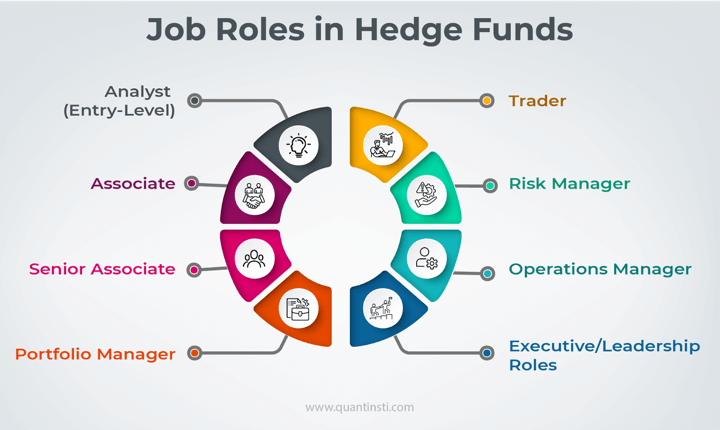

## Table of Contents

## What basic financial knowledge is required for entry-level positions at hedge funds?

To work at an entry-level position at a hedge fund, you need to understand some basic financial concepts. This includes knowing about stocks, bonds, and other investments. You should know how these investments work and how they can make money or lose money. It's also important to understand what a portfolio is and how to manage it. This means knowing how to pick different investments to balance risk and reward.

Another key area is understanding financial markets and how they work. This includes knowing about stock exchanges, like the New York Stock Exchange, and how prices of investments change. You should also be familiar with basic economic ideas, like supply and demand, and how they affect markets. Being able to read and understand financial news and reports is also crucial because it helps you make smart decisions about investments.

Lastly, having a grasp of basic accounting and financial statements is important. This means you should know how to read a company's income statement, balance sheet, and cash flow statement. These documents tell you about a company's financial health, which is important when deciding whether to invest in it. While you don't need to be an expert, having a solid foundation in these areas will help you succeed in an entry-level position at a hedge fund.

## How important is a degree in finance or a related field when applying to hedge funds?

A degree in finance or a related field can be very helpful when applying to work at a hedge fund. Many hedge funds like to hire people who have studied finance, economics, or business because these degrees show that you have a good understanding of money and markets. This knowledge can help you do well in your job right from the start. Plus, having a degree can make your application stand out among others who might not have this background.

However, a degree is not the only thing that matters. Some hedge funds also look at other things, like if you have worked in finance before or if you have special skills, like being good with numbers or understanding technology. If you don't have a finance degree, you can still get a job at a hedge fund if you can show that you have learned about finance in other ways, like through online courses or by working in related jobs. What's most important is showing that you are eager to learn and that you can handle the fast-paced world of hedge funds.

## What soft skills are hedge funds looking for in candidates?

Hedge funds look for people who can work well with others. They want team members who can talk clearly and listen to others. This is important because everyone needs to share ideas and work together to make good decisions about investments. Being able to explain hard financial ideas in a simple way is also key. This helps everyone understand the plan and makes the team stronger.

Another important skill is being able to solve problems. Hedge funds face new challenges all the time, so they need people who can think quickly and come up with smart solutions. Being able to stay calm under pressure is also crucial. The world of finance can be stressful, and hedge funds need people who can handle this stress and keep working well. Showing that you are eager to learn and adapt to new situations can make you a valuable part of the team.

## Can you explain the role of quantitative skills in hedge fund operations?

Quantitative skills are very important in hedge funds because they help with making smart investment choices. These skills involve using math and numbers to understand how investments might do in the future. Hedge funds use special math models and computer programs to look at lots of data. This helps them find patterns and make predictions about the stock market and other investments. People with good quantitative skills can create these models and use them to find the best times to buy or sell investments.

These skills also help hedge funds manage risk. By using math, they can figure out how likely it is that an investment will lose money and how much they could lose. This is important because hedge funds want to make money but also need to be careful not to lose too much. People who are good at math and numbers help the hedge fund balance making profits with keeping risks low. So, having strong quantitative skills is key to doing well in a hedge fund.

## What programming languages are most sought after by hedge funds?

Hedge funds often look for people who know how to use programming languages like Python and R. Python is popular because it's easy to learn and can do many things, like analyzing data and making math models. R is also used a lot because it's good for working with numbers and making graphs. These languages help hedge funds look at lots of information quickly and make smart choices about investments.

Another language that hedge funds like is C++. It's a bit harder to learn, but it's very fast and can handle big, complex math problems. This is important for hedge funds that need to do a lot of calculations quickly. Knowing SQL is also helpful because it lets you work with databases, which is important for managing and understanding all the data hedge funds use.

## How does experience in financial modeling enhance a candidate's appeal to hedge funds?

Experience in financial modeling makes a candidate more appealing to hedge funds because it shows they can predict how investments might do in the future. Financial modeling is about using math and data to make guesses about what might happen with stocks, bonds, or other investments. When someone knows how to do this well, hedge funds see that they can help make smart choices about where to put money. This skill is important because hedge funds want to find the best investments to make money for their clients.

Having experience in financial modeling also shows that a candidate can handle the complex tasks that come with working at a hedge fund. It means they are good at working with numbers and can use special computer programs to analyze data. This kind of experience tells hedge funds that the person can fit into their team and help them manage risks and find new investment opportunities. So, if a candidate has this experience, hedge funds are more likely to want to hire them.

## What is the significance of understanding risk management in hedge fund roles?

Understanding risk management is very important for anyone working at a hedge fund. Risk management is all about figuring out how likely it is that an investment will lose money and how much could be lost. Hedge funds need to make money, but they also need to be careful not to lose too much. People who understand risk management can help the hedge fund balance making profits with keeping risks low. This skill is key because it helps the hedge fund make safer and smarter choices about where to put their money.

Having a good grasp of risk management also shows that a person can handle the complex tasks that come with working at a hedge fund. It means they can use math and data to make smart decisions and help the fund avoid big losses. Hedge funds value this because it helps them protect their clients' money and keep their business strong. So, if someone understands risk management well, they are more likely to be seen as a valuable member of the hedge fund team.

## How can a candidate demonstrate expertise in portfolio management to hedge funds?

A candidate can show their expertise in portfolio management to hedge funds by sharing examples of past work where they managed a portfolio successfully. This could include showing how they picked different investments to balance risk and reward, and how they made decisions to buy or sell based on market changes. They can also talk about specific strategies they used, like diversification or asset allocation, and explain how these strategies helped the portfolio perform well. By giving clear examples and numbers, like how much the portfolio grew or how it did compared to the market, they can prove their skills.

Another way to demonstrate expertise is by getting certifications or taking courses in portfolio management. Certifications like the Chartered Financial Analyst (CFA) or the Certificate in Investment Performance Measurement (CIPM) show that a person has learned a lot about managing investments. They can also mention any software or tools they are good at using, like Bloomberg Terminal or Morningstar Direct, because these are important for managing portfolios. By showing they have both the knowledge and the practical skills, a candidate can make a strong case to hedge funds that they are ready to manage portfolios effectively.

## What advanced statistical skills are hedge funds looking for in experienced candidates?

Hedge funds look for experienced candidates who know advanced statistical skills like regression analysis, time series analysis, and machine learning. Regression analysis helps them understand how different things affect investment returns. Time series analysis is important for looking at how investments change over time and predicting future trends. Machine learning lets them use computers to find patterns in big data sets that people might miss. These skills help hedge funds make better guesses about the market and find the best times to buy or sell investments.

Knowing these advanced skills also shows that a candidate can handle the complex math problems that come up in hedge funds. They need to be good at using special computer programs to do these analyses quickly and correctly. Being able to explain these complicated ideas in a simple way is also important because it helps the whole team understand the plans and make smart decisions together. So, hedge funds value people who can use advanced stats to help them manage risks and find new investment opportunities.

## How important is a track record of successful trades or investment strategies for senior positions?

A track record of successful trades or investment strategies is very important for someone applying for a senior position at a hedge fund. It shows that the person knows how to make money in the market. Hedge funds want to hire people who have proven they can pick good investments and make smart decisions. When someone has a history of successful trades, it gives the hedge fund confidence that this person can help them make more money and grow their business.

Having a good track record also helps a candidate stand out from others. At the senior level, hedge funds are looking for leaders who can guide their team and make big decisions. A strong track record not only shows that the person is good at their job, but it also proves they can handle the pressure and responsibility that comes with a senior role. This makes them a valuable asset to the hedge fund, as they can bring their experience and success to help the fund reach its goals.

## What are the expectations for a candidate's knowledge of global markets and economic trends?

Hedge funds expect candidates to have a good understanding of global markets and economic trends. This means knowing how different countries' economies work and how they affect each other. For example, if something big happens in the U.S. economy, it can impact markets in Europe or Asia. Candidates should be able to read and understand news about these trends and use that information to make smart investment choices. This knowledge helps hedge funds find opportunities to make money all over the world.

Having a grasp of global markets also means knowing about different currencies and how they change in value. This can affect how much money a hedge fund makes or loses on investments in other countries. Candidates should be able to explain how things like interest rates, inflation, and government policies in different countries can impact investments. By understanding these trends, a candidate can help a hedge fund manage risks and take advantage of opportunities in the global market.

## How can one showcase leadership and strategic decision-making skills in a hedge fund setting?

To show leadership and strategic decision-making skills in a hedge fund, a person can share stories about times they led a team to make smart investment choices. They can talk about how they helped the team work together, set goals, and come up with plans to reach those goals. For example, they might explain how they led a project to analyze a new market and decided to invest in it, which ended up making money for the fund. By showing they can guide a team and make tough decisions, they prove they are ready for a leadership role in a hedge fund.

Another way to showcase these skills is by talking about how they used data and research to make strategic decisions. They can explain how they looked at lots of information to find the best investments and then convinced others to follow their plan. This shows they can think critically and make choices that help the hedge fund succeed. By giving clear examples of how they led and made smart decisions, a candidate can make a strong case that they have what it takes to be a leader in a hedge fund.

## References & Further Reading

[1]: ["Hedge Fund Market Wizards: How Winning Traders Win"](https://www.amazon.com/Hedge-Fund-Market-Wizards-Winning/dp/1118273044) by Jack D. Schwager

[2]: Markowitz, H. M. (1952). ["Portfolio Selection"](https://onlinelibrary.wiley.com/doi/abs/10.1111/j.1540-6261.1952.tb01525.x). The Journal of Finance, 7(1), 77-91.

[3]: Hill, J., & Ready, M. J. (2010). ["Algorithmic trading and the market for the timing of trading."](https://www.econstor.eu/bitstream/10419/43255/1/599235055.pdf) Journal of Financial Economics, 95(2), 213-237.

[4]: Narang, R. K. (2013). ["Inside the Black Box: A Simple Guide to Quantitative and High Frequency Trading"](https://onlinelibrary.wiley.com/doi/book/10.1002/9781118662717) 

[5]: Hasanhodzic, J., & Lo, A. W. (2007). ["Can Hedge-Fund Returns Be Replicated?: The Linear Case"](https://papers.ssrn.com/sol3/papers.cfm?abstract_id=924565). Journal of Investment Management, 5(2), 5-45.

[6]: ["Python for Data Analysis: Data Wrangling with Pandas, NumPy, and IPython"](https://wesmckinney.com/book/) by Wes McKinney