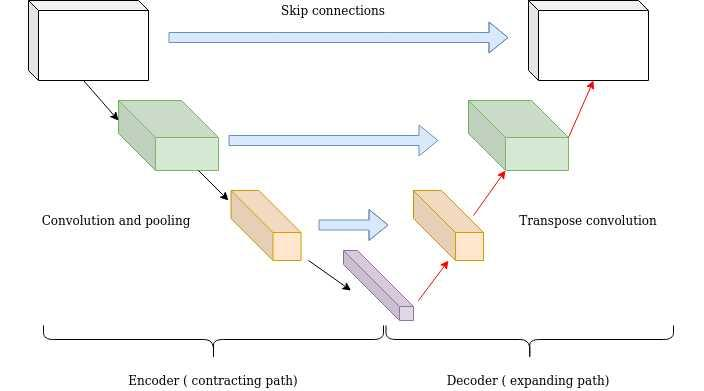

## Table of Contents

## What is a Skip Connection Block in the context of machine learning?

A Skip Connection Block, also known as a Residual Block, is a type of architectural component used in neural networks, particularly in deep learning models like Convolutional Neural Networks (CNNs). The main idea behind a Skip Connection Block is to help the network learn better by allowing the input to "skip" over some layers and be added directly to the output of those layers. This helps solve the problem of vanishing gradients, where the gradients become very small as they are backpropagated through many layers, making it hard for deep networks to train effectively.

In a Skip Connection Block, the input to the block is added to the output of the block after it has passed through some transformation layers. Mathematically, if we denote the input as $$x$$ and the transformation function as $$F(x)$$, the output of the block can be expressed as $$y = F(x) + x$$. This addition of the input to the transformed output is what creates the "skip" or "residual" connection. By doing this, the network can learn identity functions more easily, which means it can choose to keep the input unchanged if that is the best way to minimize the loss function. This has been shown to allow for the training of much deeper networks than was previously possible.

## How do Skip Connection Blocks help in training deep neural networks?

Skip Connection Blocks make it easier to train very deep neural networks. When neural networks get deeper, it becomes hard for them to learn because the information from the early layers can get very small by the time it reaches the end. This is called the vanishing gradient problem. Skip Connection Blocks help solve this by letting the input skip over some layers and go straight to the output of those layers. This way, the network can keep important information from the early layers and use it later on.

In a Skip Connection Block, the input is added to the output after it goes through some layers. If we call the input $$x$$ and the layers that change it $$F(x)$$, the output becomes $$y = F(x) + x$$. This simple addition helps the network learn better. It can choose to keep the input as it is if that helps reduce mistakes, or it can change it if needed. This makes it easier for the network to learn even when it has many layers, allowing for the creation of very deep networks that can learn complex patterns.

## What is the difference between a Residual Block and a Bottleneck Residual Block?

A Residual Block, also known as a Skip Connection Block, is a building block in deep neural networks that helps solve the problem of vanishing gradients. It does this by allowing the input to skip over some layers and be added directly to the output of those layers. If we call the input $$x$$ and the transformation function $$F(x)$$, the output of a Residual Block is $$y = F(x) + x$$. This simple addition helps the network learn better by allowing it to keep important information from early layers and use it later on.

A Bottleneck Residual Block is a variation of the Residual Block designed to reduce the number of parameters and computations. It achieves this by using a three-layer design instead of the usual two layers. The first and third layers in a Bottleneck Residual Block use 1x1 convolutions to reduce and then increase the dimensionality of the data, while the middle layer uses a 3x3 convolution. This structure helps in processing the data more efficiently, making it possible to build even deeper networks without a significant increase in computational cost.

In summary, while both types of blocks help in training deep networks by addressing the vanishing gradient problem, the Bottleneck Residual Block does so with a more efficient architecture. This efficiency comes from using 1x1 convolutions to manage the dimensionality of the data, allowing for deeper and more computationally manageable networks.

## Can you explain the concept of an Inverted Residual Block and its applications?

An Inverted Residual Block is a special kind of building block used in some neural networks, especially in mobile networks like MobileNetV2. It's called "inverted" because it does the opposite of what a normal Residual Block does. In a normal Residual Block, the network first shrinks the data and then expands it. But in an Inverted Residual Block, it first expands the data and then shrinks it back down. This is done using special layers called 1x1 convolutions. The idea is to make the network learn better and faster, especially on devices with less power like smartphones.

In an Inverted Residual Block, the input goes through a layer that makes it bigger. Then it goes through another layer that makes it smaller again. If we call the input $$x$$ and the layers that change it $$F(x)$$, the output of the block is still $$y = F(x) + x$$, just like in a normal Residual Block. But because the data gets bigger and then smaller, the network can learn more complex patterns without using too much power. This makes Inverted Residual Blocks really useful for making fast and efficient neural networks that can run on mobile devices.

## How does a Dense Block differ from other Skip Connection Blocks?

A Dense Block is a type of building block used in neural networks, particularly in DenseNets. It's different from other Skip Connection Blocks because it connects every layer to every other layer in a feed-forward fashion. In a Dense Block, the output of each layer is used as the input to all the following layers. This means if there are L layers in a Dense Block, the Lth layer gets inputs from all the previous L-1 layers. This can be written as $$x_l = H_l([x_0, x_1, ..., x_{l-1}])$$, where $$x_l$$ is the output of the lth layer, and $$H_l$$ is the function of that layer.

This dense connectivity helps the network learn better because it allows for better feature reuse and reduces the vanishing gradient problem. Unlike Residual Blocks where the input skips over some layers and is added to the output, in a Dense Block, the inputs are concatenated instead of added. This concatenation means the network can keep and use more information from earlier layers, making it easier to train very deep networks. So, while both types of blocks help with [deep learning](/wiki/deep-learning), Dense Blocks do this by connecting layers more densely and using concatenation instead of addition.

## What are the key features of a Non-Local Block and how does it enhance model performance?

A Non-Local Block is a special part of a [neural network](/wiki/neural-network) that helps the network see the whole picture, not just small parts of it. It does this by letting the network look at all the information from the input at once, instead of just looking at small areas like normal layers do. This is useful because it helps the network understand things that are far apart in the image or data. For example, if you want to recognize a person in a crowd, a Non-Local Block can help by looking at the whole scene and figuring out how different parts relate to each other.

Using Non-Local Blocks can make a model better at understanding and processing data. They do this by adding a way for the network to pay attention to important parts of the input and ignore less important parts. This is called "attention," and it helps the model focus on what really matters. By doing this, Non-Local Blocks can improve how well a model works on tasks like understanding images, videos, or even text. They make the network smarter by letting it see connections that normal layers might miss.

## How does the ResNeXt Block improve upon the traditional Residual Block?

The ResNeXt Block is a type of building block in neural networks that improves on the traditional Residual Block by making it easier for the network to learn and work better. It does this by using a special way of organizing the layers called "grouped convolutions." In a ResNeXt Block, the input is split into smaller groups, and each group goes through its own set of layers. Then, the outputs from all these groups are added together. This helps the network learn more complex patterns without needing more layers or making the network bigger. If we call the input $$x$$ and the grouped convolution function $$F(x)$$, the output of a ResNeXt Block is still $$y = F(x) + x$$, just like in a Residual Block. But because of the grouped convolutions, the network can learn better and faster.

This grouped convolution approach in ResNeXt Blocks helps the network use its resources more efficiently. It makes the network better at understanding the data without using more power or taking longer to train. This is really useful for making neural networks that can work well on devices with less power, like smartphones. So, ResNeXt Blocks are a smart way to make neural networks stronger and more efficient, improving on the traditional Residual Blocks by adding this grouped convolution trick.

## What is the role of a CBHG (Convolution Bank + Highway Network + Bidirectional GRU) in sequence modeling?

A CBHG (Convolution Bank + Highway Network + Bidirectional GRU) is a special part of a neural network that helps it understand sequences of data, like words in a sentence or sounds in speech. The CBHG has three main parts: a Convolution Bank, a Highway Network, and a Bidirectional GRU. The Convolution Bank looks at different parts of the sequence at the same time, helping the network see patterns in the data. The Highway Network makes it easier for the network to learn by letting information flow more freely through the layers. The Bidirectional GRU helps the network understand the sequence from both the past and the future, making it better at figuring out what comes next or what happened before.

Together, these parts make the CBHG really good at understanding and processing sequences. The Convolution Bank helps by looking at the data in different ways, the Highway Network makes sure important information doesn't get lost as it goes through the network, and the Bidirectional GRU helps the network see the whole sequence, not just what's happening right now. This makes the CBHG useful for tasks like turning text into speech or understanding what people are saying in a conversation. By using all these parts together, the CBHG helps the network learn and work better with sequences of data.

## How do Wide Residual Blocks address the trade-off between depth and width in neural networks?

Wide Residual Blocks are a way to make neural networks better by changing how deep and wide they are. In normal Residual Blocks, the network gets deeper by adding more layers, which can help it learn better but also makes it harder to train. Wide Residual Blocks solve this by making the network wider instead of deeper. They do this by using more filters in each layer. This means the network can learn more complex patterns without getting too deep and hard to train.

In a Wide Residual Block, the idea is to keep the network from getting too deep while still making it powerful. If we call the input $$x$$ and the transformation function $$F(x)$$, the output is still $$y = F(x) + x$$, just like in a normal Residual Block. But in a Wide Residual Block, the function $$F(x)$$ uses more filters to process the data. This helps the network learn better without needing to add more layers. So, Wide Residual Blocks help balance the trade-off between depth and width, making the network easier to train and still very good at learning.

## What makes the ShuffleNet Block efficient for mobile devices?

ShuffleNet Blocks are designed to be efficient for mobile devices because they use a special trick called "channel shuffling." This trick helps the network use its resources better by mixing up the data in a smart way. In a ShuffleNet Block, the input is split into groups, and each group goes through its own set of layers. Then, the outputs from these groups are mixed together using the channel shuffling method. This helps the network learn complex patterns without needing more power or taking longer to train. If we call the input $$x$$ and the transformation function $$F(x)$$, the output of a ShuffleNet Block is still $$y = F(x) + x$$, just like in a Residual Block. But the channel shuffling makes it more efficient, which is perfect for mobile devices.

By using channel shuffling, ShuffleNet Blocks can keep the network small and fast while still being good at understanding data. This is really important for mobile devices, which don't have a lot of power or memory. The channel shuffling method helps the network use its layers more effectively, making it easier to run on a smartphone or tablet. So, ShuffleNet Blocks are a smart way to make neural networks work well on mobile devices, improving their efficiency without losing performance.

## Can you describe the architecture and benefits of the SRGAN Residual Block in super-resolution tasks?

The SRGAN Residual Block is a special part of a neural network used for making low-quality images look better, a process called super-resolution. In an SRGAN Residual Block, the input goes through a few layers that change it, and then it's added back to the original input. If we call the input $$x$$ and the layers that change it $$F(x)$$, the output of the block is $$y = F(x) + x$$. This helps the network learn better by letting it keep important information from the early layers and use it later on. The SRGAN Residual Block uses a special kind of layer called a "parametric ReLU" (PReLU) instead of the usual ReLU, which helps the network learn even better. It also uses "batch normalization" to make the training process smoother and faster.

Using SRGAN Residual Blocks in super-resolution tasks has many benefits. They help the network learn how to make images look better without losing important details. The addition of the original input to the transformed output, called a "residual connection," makes it easier for the network to learn and train, even when it has many layers. This is really important for super-resolution because it's a hard task that needs a lot of learning. The use of PReLU and batch normalization in the SRGAN Residual Block makes the network more powerful and efficient, helping it create high-quality images from low-quality ones. This makes SRGAN Residual Blocks a great choice for improving image quality on devices like smartphones or computers.

## How do Reversible Residual Blocks contribute to memory efficiency in deep learning models?

Reversible Residual Blocks are a special type of building block in neural networks that help save memory when training deep learning models. In a normal Residual Block, the network keeps the input and the output of each block in memory to use them later. But in a Reversible Residual Block, the network only needs to keep the output in memory because it can figure out the input again when it needs to. If we call the input $$x$$ and the transformation function $$F(x)$$, the output of a Reversible Residual Block is still $$y = F(x) + x$$. But when the network needs $$x$$ again, it can find it by doing $$x = y - F(x)$$. This means the network doesn't need to store as much information, which saves a lot of memory.

This memory-saving trick is really helpful for training very deep networks. Deep networks can be hard to train because they need a lot of memory to keep all the information they need. By using Reversible Residual Blocks, the network can be much deeper without using too much memory. This makes it easier to train big models on devices that don't have a lot of memory, like some computers or even smartphones. So, Reversible Residual Blocks make deep learning more efficient by letting the network use its memory better.