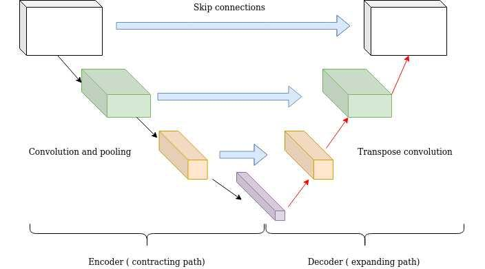

## Table of Contents

## What are skip connections in machine learning?

Skip connections are a technique used in neural networks to help improve the flow of information through the layers. They work by creating a shortcut or a direct path for the data to move from one layer to another, bypassing some of the layers in between. This can help the network learn better and faster, especially in deep networks where it might be hard for the information to travel through all the layers.

In practice, skip connections are often used in architectures like ResNet (Residual Networks). For example, if you have a layer that takes an input $$x$$ and applies some function $$F(x)$$, a skip connection would add the original input $$x$$ to the output of the function, resulting in $$F(x) + x$$. This addition helps preserve the original information and can make it easier for the network to learn identity functions, which are crucial for very deep networks.

## Why are skip connections important in neural networks?

Skip connections are important in neural networks because they help solve the problem of vanishing gradients. When training very deep networks, the gradients used to update the weights can become very small as they pass through many layers. This makes it hard for the network to learn effectively. Skip connections help by allowing the gradients to flow more easily through the network. By providing a shortcut for the gradients, they can reach the earlier layers more directly, which helps keep the training process stable and effective.

Another reason skip connections are important is that they help the network learn identity functions more easily. In deep networks, it can be hard for the network to keep the same information as it passes through many layers. Skip connections allow the network to add the original input to the output of a layer, like in the formula $$F(x) + x$$. This means the network can more easily learn to pass information through the layers without changing it too much. This is especially useful in architectures like ResNet, where these connections help the network perform better overall.

## How do skip connections help in training deep neural networks?

Skip connections help in training deep neural networks by solving the problem of vanishing gradients. When a network has many layers, the gradients that are used to update the weights can become very small as they travel through all those layers. This makes it hard for the network to learn well. Skip connections provide a shortcut for these gradients, allowing them to flow more directly to the earlier layers. This keeps the training process stable and helps the network learn better.

Another way skip connections help is by making it easier for the network to learn identity functions. In deep networks, it can be hard for the network to keep the same information as it goes through many layers. Skip connections allow the network to add the original input to the output of a layer. For example, if a layer applies some function $$F(x)$$ to the input $$x$$, the skip connection would make the output $$F(x) + x$$. This way, the network can more easily pass information through the layers without changing it too much. This is very helpful in architectures like ResNet, where these connections make the network perform better overall.

## What is a residual connection and how does it relate to skip connections?

A residual connection is a type of skip connection used in neural networks. It helps the network learn better by allowing the input to skip over some layers and be added directly to the output of those layers. This is useful in very deep networks because it makes it easier for the network to learn and keep the important information as it goes through many layers. In simple terms, a residual connection adds the original input to the output of a layer, which helps the network learn identity functions more easily.

In a [neural network](/wiki/neural-network) with residual connections, if a layer applies a function $$F(x)$$ to the input $$x$$, the output of the layer with a residual connection would be $$F(x) + x$$. This means the network can pass the original input directly to the next layers, which helps solve the problem of vanishing gradients. Vanishing gradients happen when the gradients used to update the weights become very small as they go through many layers, making it hard for the network to learn. By using residual connections, the gradients can flow more easily through the network, making the training process more effective.

## Can you explain the concept of a concatenated skip connection?

A concatenated skip connection is another way to use skip connections in neural networks. Instead of adding the input to the output like in a residual connection, a concatenated skip connection joins the input and the output together side by side. This is called concatenation. When you concatenate two things, you put them next to each other, like connecting two pieces of a puzzle.

In a neural network with concatenated skip connections, if a layer applies a function $$F(x)$$ to the input $$x$$, the output of the layer would be the result of $$F(x)$$ put next to $$x$$. So, the new output would be something like $$[x, F(x)]$$. This helps the network keep more information as it goes through the layers. By joining the original input with the output, the network can learn better and handle more complex tasks.

## What is a zero-padded shortcut connection and when is it used?

A zero-padded shortcut connection is a type of skip connection used in neural networks where the shortcut path adds zeros to match the dimensions of the output. This is useful when the dimensions of the input and the output of a layer are different. For example, if a layer changes the size of the data, the shortcut connection needs to add zeros to make sure the input can be added to the output correctly.

Zero-padded shortcut connections are often used in architectures like ResNet, especially when the network needs to change the size of the data as it goes through the layers. By adding zeros, the network can still use skip connections to help with learning and keep the training process stable. This type of connection helps the network handle different sizes of data and still benefit from the advantages of skip connections.

## What are deactivable skip connections and their benefits?

Deactivable skip connections are a type of skip connection that can be turned on or off during the training of a neural network. This means that the network can choose whether to use the skip connection or not, depending on what helps it learn better. In simple terms, if a layer applies a function $$F(x)$$ to the input $$x$$, a deactivable skip connection would let the network decide if it wants to add the original input $$x$$ to the output of the function, resulting in $$F(x) + x$$, or if it wants to just use the output of the function $$F(x)$$ without adding anything.

The main benefit of deactivable skip connections is that they give the network more flexibility. During training, the network can figure out which connections are helpful and which ones are not. This can make the network learn better and faster because it can focus on the most important paths for the data to flow through. Another benefit is that deactivable skip connections can help the network be more efficient. If some skip connections are not needed, turning them off can save computing power and make the network run faster.

## How do skip connections mitigate the vanishing gradient problem?

Skip connections help solve the vanishing gradient problem in deep neural networks by giving the gradients a shortcut to travel through the layers. When a network has many layers, the gradients that are used to update the weights can become very small as they go through all those layers. This makes it hard for the network to learn well. Skip connections fix this by allowing the gradients to flow more directly to the earlier layers. For example, if a layer applies a function $$F(x)$$ to the input $$x$$, a skip connection would add the original input $$x$$ to the output of the function, making the output $$F(x) + x$$. This way, the gradients can reach the earlier layers more easily, keeping the training process stable and helping the network learn better.

Another way skip connections help with the vanishing gradient problem is by making it easier for the network to learn identity functions. In deep networks, it can be hard for the network to keep the same information as it goes through many layers. Skip connections allow the network to add the original input to the output of a layer, which helps the network pass information through the layers without changing it too much. This is especially useful in architectures like ResNet, where these connections help the network perform better overall. By using skip connections, the network can learn more effectively and avoid the problem of vanishing gradients.

## What are the different types of architectures that use skip connections?

Skip connections are used in many different types of neural network architectures. One of the most well-known architectures that use skip connections is ResNet, which stands for Residual Network. In ResNet, skip connections help the network learn better by adding the original input to the output of a layer. For example, if a layer applies a function $$F(x)$$ to the input $$x$$, the skip connection would make the output $$F(x) + x$$. This helps the network learn identity functions more easily and solves the problem of vanishing gradients in deep networks.

Another architecture that uses skip connections is DenseNet, which stands for Densely Connected Convolutional Networks. In DenseNet, each layer is connected to every other layer in a feed-forward fashion. This means that the output of each layer is used as the input to all the following layers, creating many skip connections. This helps the network keep more information as it goes through the layers and can make it learn better and faster. DenseNet is good at handling complex tasks because it can use the information from all the layers.

Skip connections are also used in architectures like U-Net, which is often used for image segmentation tasks. In U-Net, skip connections help the network keep the important details from the earlier layers and use them in the later layers. This is done by connecting the layers in the contracting path to the layers in the expanding path, allowing the network to combine low-level features with high-level features. This helps the network make better predictions about the images it is working with.

## How can skip connections be implemented in popular deep learning frameworks like TensorFlow or PyTorch?

In TensorFlow, skip connections can be implemented by adding the input to the output of a layer. For example, if you have a layer that applies a function $$F(x)$$ to the input $$x$$, you can use a skip connection to add $$x$$ to the output of the function. This can be done using TensorFlow's `tf.add` function. Here's a simple example of how you might implement a skip connection in TensorFlow:

```python
import tensorflow as tf

def residual_block(x):
    # Apply some function to x
    F_x = tf.keras.layers.Conv2D(filters=64, kernel_size=(3, 3), padding='same', activation='relu')(x)
    F_x = tf.keras.layers.Conv2D(filters=64, kernel_size=(3, 3), padding='same')(F_x)

    # Add the input to the output of the function
    return tf.add(x, F_x)

# Example usage
input_tensor = tf.keras.Input(shape=(32, 32, 3))
output_tensor = residual_block(input_tensor)
model = tf.keras.Model(inputs=input_tensor, outputs=output_tensor)
```

In PyTorch, skip connections can be implemented in a similar way. You can create a residual block where the input is added to the output of the block. PyTorch provides the `torch.add` function to add tensors together. Here's how you might implement a skip connection in PyTorch:

```python
import torch
import torch.nn as nn

class ResidualBlock(nn.Module):
    def __init__(self):
        super(ResidualBlock, self).__init__()
        self.conv1 = nn.Conv2d(3, 64, kernel_size=3, padding=1)
        self.conv2 = nn.Conv2d(64, 64, kernel_size=3, padding=1)
        self.relu = nn.ReLU()

    def forward(self, x):
        # Apply some function to x
        out = self.relu(self.conv1(x))
        out = self.conv2(out)

        # Add the input to the output of the function
        return torch.add(x, out)

# Example usage
model = ResidualBlock()
input_tensor = torch.randn(1, 3, 32, 32)
output_tensor = model(input_tensor)
```

Both examples show how skip connections can be used to add the original input to the output of a layer, helping the network learn better and solve the problem of vanishing gradients.

## What are some advanced techniques for optimizing skip connections in neural networks?

One advanced technique for optimizing skip connections in neural networks is using adaptive skip connections. These connections can change during training based on how important they are. For example, the network might learn to turn some skip connections on or off. This can make the network more efficient because it only uses the connections that help it learn better. In practice, you can use a gating mechanism to control the skip connections. This means adding a small network that decides whether to use a skip connection or not. By doing this, the network can focus on the most important paths for the data to flow through, making it learn faster and perform better.

Another technique is using learned skip connections. Instead of just adding the input to the output, the network can learn how much of the input to add. This can be done by adding a small network that learns a weight for the skip connection. For example, if a layer applies a function $$F(x)$$ to the input $$x$$, the output with a learned skip connection would be $$F(x) + \alpha \cdot x$$, where $$\alpha$$ is a learned weight. This allows the network to fine-tune how much it uses the skip connections, making them more effective. By learning these weights, the network can better handle different types of data and tasks, improving its overall performance.

## Can you discuss any recent research or developments related to skip connections in machine learning?

Recent research in skip connections has focused on making them more adaptive and flexible. One interesting development is the use of dynamic skip connections, where the network can decide during training which connections to use. This can make the network more efficient because it only uses the connections that help it learn better. For example, a study showed that using a gating mechanism, which is a small network that decides whether to use a skip connection or not, can improve the performance of the network. By doing this, the network can focus on the most important paths for the data to flow through, making it learn faster and perform better.

Another area of research is about learning how much of the input to add through skip connections. Instead of just adding the input to the output, the network can learn a weight for the skip connection. For example, if a layer applies a function $$F(x)$$ to the input $$x$$, the output with a learned skip connection would be $$F(x) + \alpha \cdot x$$, where $$\alpha$$ is a learned weight. This allows the network to fine-tune how much it uses the skip connections, making them more effective. By learning these weights, the network can better handle different types of data and tasks, improving its overall performance.