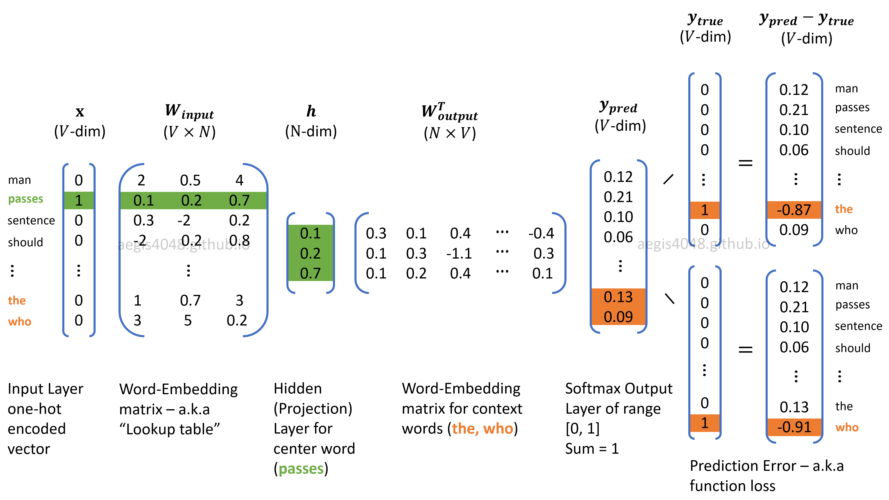

## Table of Contents

## What is Skip-Gram in the context of machine learning?

Skip-Gram is a technique used in machine learning, especially for training word embedding models like Word2Vec. It works by predicting the surrounding words (context) given a target word. For example, if you have the sentence "I love to eat pizza," and the target word is "eat," Skip-Gram tries to predict words like "love," "to," and "pizza" from "eat." This method helps the model understand the relationships between words by learning which words often appear together.

The process involves taking a word and using it to predict a set of surrounding words within a specified window size. If the window size is 2, for the word "eat," the model would try to predict "love," "to," "pizza," and "eat" itself. The Skip-Gram model uses a neural network to learn these predictions. The weights of the neural network are adjusted during training to minimize the prediction error, and these weights eventually represent the word embeddings. This technique is powerful because it captures the semantic meaning of words based on their context, which is useful for tasks like text classification, sentiment analysis, and more.

## How does Skip-Gram differ from other word embedding techniques like CBOW?

Skip-Gram and Continuous Bag of Words (CBOW) are two main techniques used to create word embeddings, but they work in opposite ways. Skip-Gram takes a single word and tries to predict the words around it. For example, if you have the word "dog," Skip-Gram would try to guess words like "the," "walks," or "barks" that often appear near "dog." This method is good at capturing rare words and their contexts because it focuses on predicting many surrounding words from one target word.

On the other hand, CBOW does the reverse. It takes the context words and tries to predict the target word. Using the same example, if you have the words "the," "walks," and "barks," CBOW would try to predict "dog." CBOW is generally faster to train and works well with more frequent words because it uses the surrounding context to make a single prediction. Both methods aim to create vector representations of words that capture their meanings based on their usage in text, but they approach the problem from different angles, leading to slightly different results in their embeddings.

In practice, the choice between Skip-Gram and CBOW depends on the specific needs of your project. Skip-Gram might be better if you need to capture the nuances of less common words, while CBOW could be more suitable for tasks where speed and handling of frequent words are more important. Both techniques are implemented in popular libraries like gensim, making it easy to experiment with them and see which one performs better for your specific use case.

## What are the main components of the Skip-Gram model?

The main components of the Skip-Gram model include the input layer, the hidden layer, and the output layer. The input layer takes in a one-hot encoded word vector, which represents a single word from the vocabulary. This word is the target word that the model will use to predict surrounding words. The hidden layer, which can be thought of as a lookup table, transforms the input into a dense vector representation, also known as the word embedding. This embedding captures the semantic meaning of the word based on its context in the training data.

The output layer is where the model makes its predictions. It consists of a set of nodes, each representing a word in the vocabulary. The model tries to predict the context words by calculating the probability of each word in the vocabulary being a context word. The weights connecting the hidden layer to the output layer are adjusted during training to minimize the difference between the predicted probabilities and the actual context words. This process is typically done using a softmax function, which normalizes the output into a probability distribution over all possible words.

To train the Skip-Gram model, you use a large corpus of text. The model iterates through the text, selecting target words and their context words within a specified window size. For each target word, the model computes the loss based on how well it predicts the context words and updates its weights accordingly. Over many iterations, the model learns to represent words in a way that captures their relationships and meanings, making the word embeddings useful for various natural language processing tasks.

## Can you explain the training process of a Skip-Gram model?

The training process of a Skip-Gram model starts with a large collection of text, known as a corpus. The model looks at each word in the text one by one. For each word, called the target word, it tries to predict the words around it, called context words. The model uses a window size to decide how many words to consider before and after the target word. For example, if the window size is 2, and the target word is "eat" in the sentence "I love to eat pizza," the context words would be "love," "to," "pizza," and "eat" itself. The model then tries to predict these context words from the target word "eat."

During training, the Skip-Gram model uses a [neural network](/wiki/neural-network) with three layers: an input layer, a hidden layer, and an output layer. The input layer takes in a one-hot encoded vector representing the target word. This vector is then transformed into a dense vector, or embedding, by the hidden layer. The output layer tries to predict the context words using a softmax function, which calculates the probability of each word in the vocabulary being a context word. The model compares these predictions to the actual context words and calculates the loss. It then adjusts the weights of the neural network to minimize this loss, using an optimization algorithm like gradient descent. Over many iterations through the corpus, the model learns better word embeddings that capture the relationships between words based on their contexts.

## What is the significance of the context window in Skip-Gram?

The context window in Skip-Gram is very important. It decides how many words around the target word the model will look at. If the window is small, the model will only look at words very close to the target word. If the window is big, it will look at more words, even ones further away. This can change how well the model learns the relationships between words. A small window might be good for learning about words that are often right next to each other, like "salt" and "pepper." A bigger window might help the model understand how words relate over longer distances, like "rain" and "umbrella."

Choosing the right context window size is a balance. A smaller window might make the model train faster and work better for understanding very close word relationships. But it might miss out on learning about words that are important but further away. On the other hand, a larger window can help the model see more of the sentence and understand broader context, but it might take longer to train and could include less relevant words. So, the context window size is a key part of setting up a Skip-Gram model and can affect how well it works for different tasks.

## How does Skip-Gram handle out-of-vocabulary words?

Skip-Gram has a hard time with words it hasn't seen before, called out-of-vocabulary words. When the model is trained, it only learns about the words in the training data. If a new word shows up that wasn't in the training data, the model doesn't know what to do with it. It can't make a good guess about what words might be around this new word because it has no information about it.

One way to deal with this problem is to use a special token for unknown words, often called "<UNK>". During training, you can replace rare words with this token. Then, when the model sees a new word, it treats it like the "<UNK>" token. This isn't perfect, but it helps the model handle new words better. Another way is to keep updating the model with new data, so it learns more words over time. But even with these tricks, Skip-Gram still struggles with completely new words it has never seen before.

## What are some common applications of Skip-Gram models?

Skip-Gram models are often used in natural language processing tasks like text classification and sentiment analysis. They help by turning words into numbers, called embeddings, that show what the words mean based on how they are used in sentences. For example, in text classification, Skip-Gram can help sort emails into spam or not spam by understanding the context of words. In sentiment analysis, it can tell if a movie review is positive or negative by looking at the words around key terms like "good" or "bad."

Another common use of Skip-Gram models is in machine translation. These models can help translate text from one language to another by understanding how words relate to each other in different languages. For example, if the model knows that "dog" and "perro" often appear in similar contexts in English and Spanish, it can use this information to translate sentences better. Skip-Gram models are also used in information retrieval, where they help search engines understand what users are looking for by analyzing the words in their queries and the documents they are searching through.

## How can the performance of a Skip-Gram model be evaluated?

The performance of a Skip-Gram model can be evaluated by looking at how well it predicts words that should be around a given word. One way to do this is by using a metric called accuracy. You can test the model on a set of words it hasn't seen during training, called a test set, and see how often it correctly guesses the surrounding words. Another way is to use a metric called perplexity, which measures how surprised the model is by the actual words it sees. A lower perplexity means the model is better at predicting the words.

Another important way to evaluate Skip-Gram models is by looking at the quality of the word embeddings they produce. This can be done by using the embeddings in tasks like text classification or sentiment analysis and seeing how well they help in those tasks. For example, if the embeddings help a model classify movie reviews as positive or negative better than random guessing, that's a good sign. You can also check how well the embeddings capture word relationships by looking at how similar words are placed close together in the vector space. This can be measured using cosine similarity, where a higher similarity between related words shows better performance.

## What are the challenges and limitations of using Skip-Gram?

One big challenge with Skip-Gram is that it can struggle with words it hasn't seen before. These are called out-of-vocabulary words. When the model sees a new word, it doesn't know what to do because it only learned from the words in its training data. To help with this, people sometimes use a special token like "<UNK>" for words that don't appear often. But even with this trick, Skip-Gram still has a hard time understanding completely new words.

Another limitation is that Skip-Gram can be slow to train, especially if you have a lot of words in your vocabulary. The model has to predict many surrounding words for each target word, which can take a long time. Also, the model might not capture the meaning of words that are used in different ways depending on the context. For example, the word "bank" can mean a place to keep money or the side of a river. Skip-Gram might not be able to tell these meanings apart if it only looks at the nearby words.

## How does negative sampling work in Skip-Gram, and why is it used?

Negative sampling in Skip-Gram is a way to make training faster and better. When the model tries to predict the words around a target word, it looks at both the real words that are there and some fake words that aren't. The model learns by trying to tell the real words from the fake ones. Instead of looking at all the words it knows, which can take a long time, the model only looks at a few fake words. This makes the training go quicker because it doesn't have to think about every single word every time.

Negative sampling is used because it helps the model focus on the most important parts of learning. By only looking at a few fake words, the model can spend more time getting better at understanding the real words. This makes the word embeddings, or the numbers that represent words, more useful for tasks like figuring out what a text is about or how people feel about something. It's like practicing with a smaller, more focused group of examples instead of trying to learn everything at once.

## Can you discuss any advanced techniques or modifications to the basic Skip-Gram model?

One advanced technique for the Skip-Gram model is called subword modeling. This method breaks words into smaller parts, like "playing" into "play" and "ing". By doing this, the model can understand new words better because it can guess their meaning from the parts it knows. For example, if the model knows "play" and "ing", it can figure out "playing" even if it hasn't seen it before. This helps with the problem of out-of-vocabulary words and makes the model more flexible. A popular model that uses this idea is called FastText, which treats each word as a bag of character n-grams.

Another modification is hierarchical softmax, which speeds up the training process. In the basic Skip-Gram model, the output layer uses a softmax function to predict the context words, which can be slow if you have a lot of words. Hierarchical softmax uses a binary tree to make predictions faster. Instead of looking at all the words at once, the model makes a series of yes-or-no decisions to find the right word. This cuts down the number of calculations the model needs to do, making it quicker to train. This technique is especially helpful when you have a very large vocabulary.

A third technique is the use of context-dependent embeddings, like those in the BERT model. Unlike Skip-Gram, which gives each word the same embedding no matter where it appears, context-dependent models change the embedding based on the surrounding words. This means the model can tell the difference between different meanings of the same word, like "bank" as a financial institution or the side of a river. By understanding the context better, these models can perform better on tasks that need a deep understanding of language, like answering questions or summarizing text.

## What are the latest research developments or trends related to Skip-Gram in machine learning?

Recent research in Skip-Gram models has focused on improving their ability to handle out-of-vocabulary words and capture context more effectively. One trend is the integration of subword modeling, as seen in models like FastText. This approach breaks words into smaller units, allowing the model to understand new words by recognizing their components. For example, if the model knows the subwords "play" and "ing", it can better predict the meaning of "playing" even if it hasn't seen it before. This technique has shown promise in enhancing the model's ability to generalize to new words and improving performance on tasks like text classification and sentiment analysis.

Another development is the use of advanced optimization techniques to speed up training and improve the quality of word embeddings. Techniques like negative sampling and hierarchical softmax have been refined to make Skip-Gram models more efficient. Negative sampling, for instance, allows the model to focus on a subset of words during training, which speeds up the process and can lead to better embeddings. Additionally, researchers are exploring ways to combine Skip-Gram with other models, such as context-dependent models like BERT, to leverage the strengths of both. This hybrid approach aims to capture both the static word relationships learned by Skip-Gram and the dynamic context-awareness of models like BERT, potentially leading to more powerful language understanding tools.

## References & Further Reading

[1]: Mikolov, T., Chen, K., Corrado, G., & Dean, J. (2013). ["Efficient Estimation of Word Representations in Vector Space."](https://arxiv.org/abs/1301.3781) arXiv preprint arXiv:1301.3781.

[2]: Rong, X. (2014). ["word2vec Parameter Learning Explained."](https://arxiv.org/abs/1411.2738) arXiv preprint arXiv:1411.2738.

[3]: Goldberg, Y., & Levy, O. (2014). ["word2vec Explained: Deriving Mikolov et al.'s Negative-Sampling Word-Embedding Method."](https://arxiv.org/abs/1402.3722) Proceedings of the 2014 International Conference on Computational Linguistics (Tutorials).

[4]: Bojanowski, P., Grave, E., Joulin, A., & Mikolov, T. (2017). ["Enriching Word Vectors with Subword Information."](https://aclanthology.org/Q17-1010/) Transactions of the Association for Computational Linguistics, 5, 135-146.

[5]: Goldberg, Y. (2016). ["A primer on neural network models for natural language processing."](https://arxiv.org/abs/1510.00726) Journal of Artificial Intelligence Research, 57, 345-420.

[6]: Devlin, J., Chang, M. W., Lee, K., & Toutanova, K. (2018). ["BERT: Pre-training of Deep Bidirectional Transformers for Language Understanding."](https://aclanthology.org/N19-1423/) arXiv preprint arXiv:1810.04805.