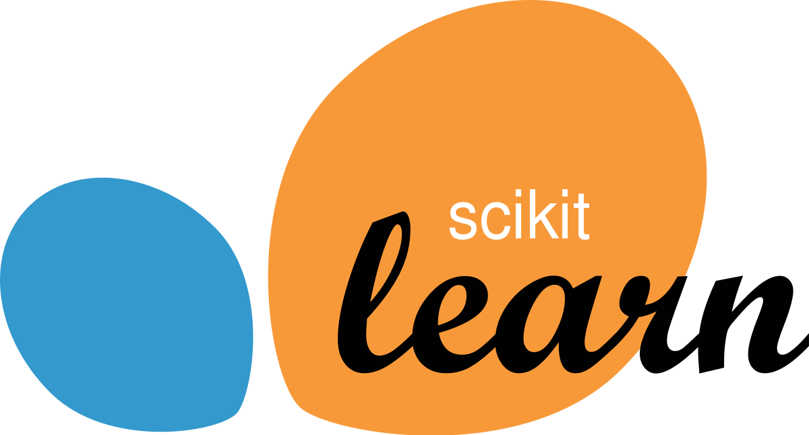

## Table of Contents

## What is Scikit-Learn and why is it important for machine learning?

Scikit-Learn is a free software tool used for machine learning in Python. It helps people build and use models to learn from data and make predictions. It has many different tools for things like sorting data into groups, guessing numbers, and finding patterns. It's easy to use because it comes with examples and clear instructions.

Scikit-Learn is important for machine learning because it makes it easier for people to start working with data and creating models. It is used by many people, from beginners to experts, because it is reliable and well-tested. This tool helps people focus on understanding their data and making better decisions, rather than spending time on writing complex code.

## How do you install Scikit-Learn and set up your environment?

To install Scikit-Learn, you need to have Python on your computer first. Once you have Python, you can use a tool called pip, which is like a package manager for Python. Open your command line or terminal and type `pip install scikit-learn`. This command will download and set up Scikit-Learn on your computer. It's a good idea to wait until the installation is finished before you start using it.

After installing Scikit-Learn, you might want to set up a special place to work on your projects, called a virtual environment. This helps keep your projects organized and prevents different projects from messing with each other's settings. To create a virtual environment, you can use a tool like `venv` that comes with Python. Just type `python -m venv myenv` in your terminal, replacing `myenv` with whatever name you want for your environment. Then, you can activate it by running `source myenv/bin/activate` on macOS/Linux or `myenv\Scripts\activate` on Windows. Once activated, you can install Scikit-Learn in this environment using pip again, and start working on your [machine learning](/wiki/machine-learning) projects.

## What are the basic data structures used in Scikit-Learn?

In Scikit-Learn, the main data structures you'll work with are called arrays and dataframes. Arrays are like lists of numbers that you can do math on easily. They come from a tool called NumPy, which Scikit-Learn uses a lot. Arrays are good for holding your data, like the numbers you want to predict or the information you use to make predictions. They can be one-dimensional, like a single row of numbers, or multi-dimensional, like a table with rows and columns.

Dataframes are another important structure, and they come from a tool called pandas. Dataframes are like tables in a spreadsheet, where you can have rows and columns with labels. This makes it easier to work with data that has different types of information, like numbers and text. In Scikit-Learn, you often convert dataframes into arrays before using them in machine learning models, but dataframes are great for organizing and looking at your data before you start building models.

## How do you preprocess data using Scikit-Learn?

Preprocessing data in Scikit-Learn means getting your data ready for machine learning models. One common thing you do is scaling your data. This means making sure all your numbers are in a similar range so one type of data doesn't overpower another. Scikit-Learn has tools like `StandardScaler` to do this. It changes your data so the average is zero and the spread is one. Another tool is `MinMaxScaler`, which squishes your data between zero and one. This helps because some machine learning models work better with data in a smaller range.

Another part of preprocessing is handling missing data. Sometimes, your data might have gaps where information is missing. Scikit-Learn has a tool called `SimpleImputer` that can fill in these gaps. You can tell it to use the average value, the most common value, or even a fixed number to fill in the missing spots. Also, you might need to turn text or categories into numbers because machine learning models usually work with numbers. The `LabelEncoder` can change categories into numbers, and `OneHotEncoder` can turn categories into a set of columns where each column represents a category. This way, your data is ready for the machine learning models to learn from it.

## What are the main types of machine learning models available in Scikit-Learn?

Scikit-Learn has many different kinds of machine learning models that you can use. Some models help you sort things into groups, like figuring out if an email is spam or not. These are called classification models. Examples include Logistic Regression, which is good for simple problems, and Support Vector Machines (SVM), which can handle more complex patterns. Another type is decision trees, which are easy to understand because they make choices based on questions about your data. Random Forests are a bunch of decision trees working together to make better guesses.

There are also models that guess numbers instead of sorting things. These are called regression models. Linear Regression is a simple one that finds a straight line to fit your data, while Polynomial Regression can fit more wiggly lines. If you want to find groups in your data without knowing what those groups are ahead of time, you can use clustering models like K-Means, which puts similar things together based on how close they are. Lastly, there are models for finding patterns or reducing the amount of data you need to look at, like Principal Component Analysis (PCA), which helps you see the most important parts of your data.

## How do you train a simple machine learning model using Scikit-Learn?

To train a simple machine learning model using Scikit-Learn, you first need to get your data ready. This means splitting it into two parts: the features, which are the things you use to make predictions, and the target, which is what you're trying to predict. For example, if you're trying to guess house prices, the features might be things like the size of the house and the number of rooms, and the target would be the price. Once you have your data split, you use Scikit-Learn to create a model. Let's say you want to use a simple model like Linear Regression. You would import the model from Scikit-Learn, create an instance of it, and then use the `fit` method to train the model on your data. This means the model looks at your features and targets and tries to learn the relationship between them.

After you've trained your model, you can use it to make predictions on new data. To do this, you use the `predict` method of your trained model. For example, if you have new data about a house, you can use your trained model to guess its price. It's also a good idea to check how well your model is doing. Scikit-Learn has tools to help with this, like splitting your data into a training set and a test set. You train your model on the training set and then see how well it does on the test set. If it's doing well, you can feel confident using it on new data. If not, you might need to try a different model or change how you're preparing your data.

## How can you evaluate the performance of a model in Scikit-Learn?

To evaluate how well a model is doing in Scikit-Learn, you first need to split your data into two parts: a training set and a test set. You train your model using the training set, and then you use the test set to see how well it works on new data it hasn't seen before. Scikit-Learn has tools like `train_test_split` to help you do this easily. Once you have your test set, you can use different ways to check the model's performance. For models that sort things into groups, like guessing if an email is spam or not, you might use accuracy, which tells you how often the model gets it right. But accuracy alone isn't always enough, so you might also look at things like precision, recall, and the F1 score, which give you more details about how well the model is doing.

For models that guess numbers, like predicting house prices, you might use measures like mean squared error (MSE) or R-squared. MSE tells you how far off your guesses are on average, and a lower number is better. R-squared tells you how much of the change in your target you can explain with your features, and a number closer to 1 is better. Scikit-Learn has tools like `mean_squared_error` and `r2_score` to help you calculate these. No matter what kind of model you're using, it's important to use the right measures to understand how well it's doing. This way, you can decide if your model is good enough or if you need to try something different.

## What are some advanced techniques for model tuning in Scikit-Learn?

One advanced way to make your model better in Scikit-Learn is called hyperparameter tuning. Hyperparameters are settings you choose before you train your model, like how deep a decision tree should go or how many neighbors to look at in a K-Nearest Neighbors model. To find the best hyperparameters, you can use something called grid search. Grid search tries out different combinations of hyperparameters and sees which one works best on your test data. Scikit-Learn has a tool called `GridSearchCV` that makes this easy. It tries all the combinations you tell it to and picks the best one. This can take a lot of time, but it can make your model a lot better.

Another cool trick is called cross-validation. Instead of just splitting your data into a training set and a test set once, cross-validation splits it many times in different ways. This helps make sure your model is good at guessing not just on one set of data, but on many different sets. Scikit-Learn's `cross_val_score` function can help you do this. It runs your model on different parts of your data and gives you a score for each part. By looking at all these scores, you can see if your model is doing well overall. Combining cross-validation with grid search, using `GridSearchCV`, is a powerful way to tune your model and make sure it works well on new data.

## How do you use pipelines to streamline your machine learning workflow in Scikit-Learn?

Pipelines in Scikit-Learn help you put together different steps of your machine learning work into one easy flow. Instead of doing things one by one, like scaling your data and then training a model, you can set up a pipeline that does all these steps in order. For example, you can make a pipeline that first uses `StandardScaler` to get your data ready and then uses a `LogisticRegression` model to make predictions. This makes your code cleaner and easier to understand because you can see all the steps in one place. It also makes sure you do the same steps on both your training data and your test data, which is important for getting good results.

Using pipelines also makes it easier to try out different models and ways of getting your data ready. You can change parts of the pipeline, like switching from `LogisticRegression` to `RandomForestClassifier`, without changing the rest of your code. This is helpful when you're trying to find the best way to solve your problem. Plus, you can use pipelines with tools like `GridSearchCV` to try out different settings for your models and data preparation steps all at once. This can save you a lot of time and help you find the best way to do your machine learning work.

## What are some best practices for using Scikit-Learn in production environments?

When using Scikit-Learn in production, it's important to keep things simple and reliable. Make sure to use version control for your code so you can keep track of changes and go back if something goes wrong. It's also a good idea to save your trained models using tools like `joblib` or `pickle` so you can use them later without having to train them again. This way, you can quickly load your model and make predictions whenever you need to. Another important thing is to keep an eye on how well your model is doing over time. You can set up a system to check its performance regularly and retrain it if it starts to get worse.

Using pipelines can help a lot in production because they make your workflow easier to manage and more consistent. Pipelines let you put all the steps of your machine learning work, like preparing your data and training your model, into one place. This makes it easier to make sure you're doing the same steps every time, which is important for getting good results. Also, when you're working in a team, make sure everyone understands the models and how they're being used. Good communication can help prevent mistakes and make sure everyone is on the same page.

## How can you handle imbalanced datasets using Scikit-Learn?

Handling imbalanced datasets in Scikit-Learn means dealing with situations where one type of data is much more common than others. For example, if you're trying to predict if a transaction is fraud, most transactions might be normal, and only a few might be fraud. This can make your model think everything is normal because it sees so many normal examples. One way to fix this is by using something called `RandomOverSampler` from the `imbalanced-learn` library, which works well with Scikit-Learn. This tool makes copies of the less common data, like the fraud transactions, so your model sees them more often and learns better.

Another way to handle imbalanced datasets is by using `RandomUnderSampler`, also from `imbalanced-learn`. This tool takes away some of the more common data, like the normal transactions, so your model doesn't see them as much. This can help balance things out. You can also try changing how your model works with imbalanced data by using something called class weights. In Scikit-Learn, many models have a `class_weight` setting that lets you tell the model to pay more attention to the less common data. This can help your model learn better from the imbalanced dataset without changing the data itself.

## What are the latest updates and future directions for Scikit-Learn?

Scikit-Learn keeps getting better with new updates. Recently, they added new tools to help with things like handling missing data and making models work faster. They also made it easier to use Scikit-Learn with other tools, like TensorFlow and PyTorch, which are popular for more complex machine learning tasks. These updates make Scikit-Learn more useful for people working on different kinds of projects.

In the future, Scikit-Learn plans to keep adding new features and making the tool easier to use. They want to make it work even better with big data and help people do more with less code. They're also thinking about adding more ways to explain how models make their guesses, which is important for understanding and trusting the models. This will help more people use Scikit-Learn for all sorts of machine learning work.

## References & Further Reading

[1]: Bergstra, J., Bardenet, R., Bengio, Y., & Kégl, B. (2011). ["Algorithms for Hyper-Parameter Optimization."](https://proceedings.neurips.cc/paper/2011/file/86e8f7ab32cfd12577bc2619bc635690-Paper.pdf) Advances in Neural Information Processing Systems 24.

[2]: ["Advances in Financial Machine Learning"](https://www.amazon.com/Advances-Financial-Machine-Learning-Marcos/dp/1119482089) by Marcos Lopez de Prado

[3]: ["Evidence-Based Technical Analysis: Applying the Scientific Method and Statistical Inference to Trading Signals"](https://www.amazon.com/Evidence-Based-Technical-Analysis-Scientific-Statistical/dp/0470008741) by David Aronson

[4]: ["Machine Learning for Algorithmic Trading"](https://github.com/PacktPublishing/Machine-Learning-for-Algorithmic-Trading-Second-Edition) by Stefan Jansen

[5]: ["Quantitative Trading: How to Build Your Own Algorithmic Trading Business"](https://www.amazon.com/Quantitative-Trading-Build-Algorithmic-Business/dp/0470284889) by Ernest P. Chan