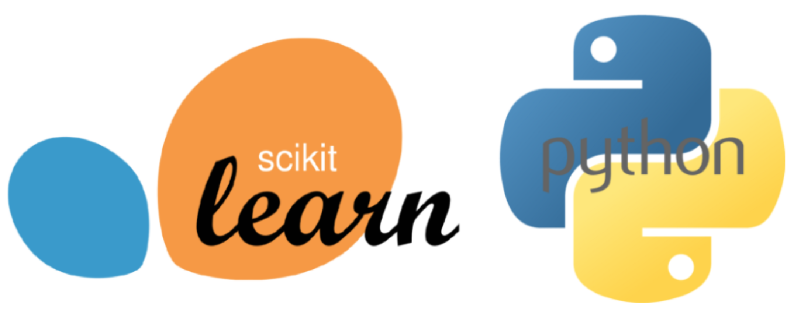

## Table of Contents

## What is Scikit-learn and what is it used for?

Scikit-learn is a free and open-source machine learning library for Python. It's like a toolbox that helps people create and use different kinds of machine learning models easily. The library has many tools that can do things like predicting future trends, understanding data patterns, and making decisions based on data.

People use Scikit-learn for many different tasks. For example, it can help with sorting data into groups, finding hidden patterns in information, and even predicting what might happen next based on past data. It's popular because it's easy to use and works well with other Python tools, making it a go-to choice for many data scientists and researchers.

## How do you install Scikit-learn?

To install Scikit-learn, you need to use a tool called pip, which is a package manager for Python. Open your computer's command line or terminal, and type in the command `pip install scikit-learn`. Press enter, and pip will download and set up Scikit-learn for you. It might take a few minutes, depending on your internet speed.

Once the installation is done, you can start using Scikit-learn in your Python projects. Just make sure you have Python installed on your computer first. If you run into any problems, you can check the official Scikit-learn website for more help or look at online forums where people share tips and solutions.

## What are the basic data preprocessing techniques available in Scikit-learn?

Scikit-learn offers several ways to get your data ready for [machine learning](/wiki/machine-learning). One common technique is scaling, which means adjusting your data so all the numbers are on a similar scale. This is important because some machine learning models work better when all the data is on the same level. Scikit-learn has tools like StandardScaler and MinMaxScaler to help with this. StandardScaler makes your data have a mean of zero and a standard deviation of one, while MinMaxScaler squeezes your data into a range between zero and one.

Another technique is handling missing data. Sometimes, your dataset might have gaps where information is missing. Scikit-learn has a tool called SimpleImputer that can fill in these gaps. You can tell it to replace missing values with the mean, median, or most frequent value of the column. This helps make sure your data is complete before you use it in a model. Also, encoding is important when you have text data that needs to be turned into numbers. Scikit-learn's LabelEncoder and OneHotEncoder can change text labels into numbers that machines can understand.

Lastly, splitting your data into training and testing sets is crucial. Scikit-learn's train_test_split function helps you do this easily. You give it your data, and it splits it into two parts: one for training your model and another for testing how well it works. This helps you check if your model is good at predicting new data it hasn't seen before. By using these preprocessing techniques, you can make sure your data is in the best shape for building accurate machine learning models.

## How do you split your dataset into training and testing sets using Scikit-learn?

To split your dataset into training and testing sets using Scikit-learn, you can use the `train_test_split` function. This function is part of the `model_selection` module in Scikit-learn. You need to import it first by writing `from sklearn.model_selection import train_test_split` at the start of your Python script. Then, you call the function and pass your dataset as arguments. For example, if you have features in a variable called `X` and labels in a variable called `y`, you would write `X_train, X_test, y_train, y_test = train_test_split(X, y, test_size=0.2, random_state=42)`. Here, `test_size=0.2` means 20% of your data will be used for testing, and the rest for training. The `random_state=42` makes sure you get the same split every time you run the code.

Once you run this code, Scikit-learn will automatically shuffle your data and split it into four parts: `X_train` and `y_train` for training, and `X_test` and `y_test` for testing. This helps you train your model on one part of the data and then check how well it works on a different part that it hasn't seen before. This way, you can see if your model is good at predicting new data, which is important for making sure it will work well in real situations.

## What are some common machine learning algorithms implemented in Scikit-learn?

Scikit-learn has many machine learning algorithms that help with different kinds of tasks. For example, if you want to sort data into groups, you can use algorithms like K-Nearest Neighbors (KNN) or Support Vector Machines (SVM). These are good for things like figuring out if an email is spam or not. Another common task is predicting numbers, like guessing how much a house might cost. For this, you can use algorithms like Linear Regression or Random Forests. These algorithms look at past data to make guesses about the future.

There are also algorithms for finding patterns in data, like clustering. Scikit-learn has tools like K-Means and DBSCAN for this. These can help you discover groups in your data without knowing what those groups are beforehand. For example, they might help you find different types of customers in a store. Additionally, if you want to reduce the number of features in your data to make it simpler, you can use techniques like Principal Component Analysis (PCA). This helps in understanding the most important parts of your data without getting overwhelmed by too many details.

## How do you perform cross-validation in Scikit-learn?

Cross-validation in Scikit-learn helps you check how well your machine learning model works. It does this by splitting your data into different parts and using some parts to train the model and other parts to test it. This way, you can see if your model is good at predicting new data it hasn't seen before. To do cross-validation, you use the `cross_val_score` function from the `model_selection` module. You need to tell it which model you want to test, what data to use, and how many times to split the data. For example, you might write `from sklearn.model_selection import cross_val_score` at the start of your code, and then use `scores = cross_val_score(model, X, y, cv=5)` to split your data into 5 parts and test your model 5 times.

When you run `cross_val_score`, it gives you a list of scores showing how well your model did on each split. You can then look at these scores to see if your model is doing well overall. Sometimes, you might want to use a different kind of cross-validation, like K-Fold or Stratified K-Fold. These are also in the `model_selection` module. For example, `KFold` splits your data into K parts and uses each part as a test set once. You can use it like this: `from sklearn.model_selection import KFold; kf = KFold(n_splits=5, shuffle=True, random_state=42)`. This helps make sure your model is tested in different ways, which can give you a better idea of how it will work in real life.

## What is the difference between supervised and unsupervised learning in Scikit-learn?

In Scikit-learn, supervised learning is like having a teacher who shows you examples and tells you the right answers. You use this kind of learning when you have data with labels, meaning you know what each piece of data means. For example, if you're trying to guess if an email is spam or not, you would use supervised learning because you already know which emails are spam and which aren't. Scikit-learn has tools like Linear Regression for guessing numbers and Support Vector Machines for sorting data into groups. These tools learn from the examples you give them and then try to make good guesses on new data.

On the other hand, unsupervised learning in Scikit-learn is like exploring without a map. You use this kind when you don't have labels for your data, so you're trying to find patterns or groups on your own. For instance, if you want to figure out different types of customers in a store without knowing anything about them beforehand, you would use unsupervised learning. Scikit-learn has tools like K-Means for finding groups in your data and Principal Component Analysis for making your data simpler by focusing on the most important parts. These tools help you discover things about your data that you didn't know before.

## How can you use Scikit-learn for feature selection?

Feature selection in Scikit-learn helps you pick the most important pieces of your data to use in your machine learning model. This is important because using too many features can make your model slow and hard to understand. Scikit-learn has tools like SelectKBest and RFE (Recursive Feature Elimination) to help with this. SelectKBest looks at each feature and picks the best ones based on how well they help predict your target. RFE starts with all your features and removes the least important ones one by one until it finds the best set.

For example, if you want to predict house prices, you might have many features like the number of rooms, the size of the garden, and the age of the house. Using SelectKBest, you could tell Scikit-learn to pick the top 3 features that are most helpful for predicting prices. With RFE, you could start with all the features and let Scikit-learn figure out which ones to keep by removing the least useful ones step by step. Both methods help you end up with a simpler, faster model that still gives good predictions.

## How do you implement a pipeline in Scikit-learn to streamline your machine learning workflow?

A pipeline in Scikit-learn is like a recipe that helps you do many steps of machine learning in order. It lets you put together different parts of your work, like cleaning your data, [picking](/wiki/asset-class-picking) the best features, and training your model, all in one go. To make a pipeline, you use the `Pipeline` class from the `pipeline` module. You start by listing the steps you want to do. For example, you might want to scale your data, then pick the best features, and finally train a model. You can do all this by writing something like `from sklearn.pipeline import Pipeline; from sklearn.preprocessing import StandardScaler; from sklearn.feature_selection import SelectKBest; from sklearn.ensemble import RandomForestClassifier; pipeline = Pipeline([('scaler', StandardScaler()), ('selector', SelectKBest(k=10)), ('classifier', RandomForestClassifier())])`. This makes it easier to keep your work organized and run it smoothly.

Once you've set up your pipeline, you can use it just like a single tool. You can fit it to your data with `pipeline.fit(X_train, y_train)`, which means it will do all the steps you listed one after the other. Then, you can use it to make predictions with `pipeline.predict(X_test)`. Pipelines are really helpful because they make your work cleaner and easier to understand. They also make it simpler to try different combinations of steps to see what works best for your data. This way, you can focus more on understanding your data and less on managing lots of separate steps.

## What are some advanced techniques for model tuning in Scikit-learn, such as grid search and random search?

Grid search and random search are two advanced ways to make your machine learning model work better in Scikit-learn. Grid search is like trying every possible combination of settings for your model. You tell it which settings to try, and it goes through all of them to find the best one. For example, if you're using a Random Forest model, you might want to try different numbers of trees and different ways to split the data. You can do this by using `GridSearchCV` from the `model_selection` module. It's thorough, but it can take a long time if you have a lot of settings to try.

Random search is another way to find the best settings, but it's quicker because it doesn't try every combination. Instead, it picks random combinations to test. This can be faster and still find good settings, especially when you have a lot of options. In Scikit-learn, you use `RandomizedSearchCV` from the `model_selection` module to do a random search. Both methods help you find the best way to set up your model without having to guess or try everything by hand. They make it easier to get good results without spending too much time.

## How can you use Scikit-learn for ensemble methods like Random Forests and Gradient Boosting?

In Scikit-learn, you can use ensemble methods like Random Forests and Gradient Boosting to make your machine learning models work better. Random Forests are like a group of decision trees working together. Each tree in the forest makes a guess, and then they all vote on the final answer. This helps because if one tree makes a mistake, the others can help fix it. In Scikit-learn, you can use the `RandomForestClassifier` or `RandomForestRegressor` to create a Random Forest. You just need to tell it how many trees you want and how deep they should be, and it will do the rest.

Gradient Boosting is another way to use a group of models to get better results. It builds decision trees one at a time, and each new tree tries to fix the mistakes of the ones before it. This means that over time, the model gets better and better at making predictions. In Scikit-learn, you can use `GradientBoostingClassifier` or `GradientBoostingRegressor` to create a Gradient Boosting model. You can set things like how many trees to use and how fast it should learn from its mistakes. Both Random Forests and Gradient Boosting can help you make more accurate predictions by using the power of many models working together.

## What are some ways to evaluate and interpret model performance in Scikit-learn?

In Scikit-learn, you can evaluate and interpret how well your machine learning model is doing in several ways. One common way is by using metrics like accuracy, precision, recall, and F1 score. Accuracy tells you how often your model gets the right answer. Precision and recall are helpful when you want to know how well your model does at finding the right things and not missing them. The F1 score is a mix of precision and recall, giving you a single number to see how well your model balances both. You can use functions like `accuracy_score`, `precision_score`, `recall_score`, and `f1_score` from the `metrics` module to calculate these.

Another way to understand your model's performance is by using tools like confusion matrices and ROC curves. A confusion matrix is like a table that shows you how many times your model guessed right and wrong for each category. It helps you see where your model might be making mistakes. An ROC curve shows how well your model can tell the difference between different categories as you change how sure it needs to be to make a guess. You can use `confusion_matrix` and `roc_curve` from the `metrics` module to create these. Both of these tools help you get a clearer picture of how your model is doing and where it might need to improve.

## How can you implement machine learning models with sklearn?

Algorithmic trading involves the application of computational techniques to automate financial market transactions at speeds and volumes that surpass human capabilities. Key to developing effective trading strategies is the ability to process historical data and make accurate predictions about future price movements. In this context, implementing machine learning models using frameworks like scikit-learn (sklearn) offers a robust solution for enhancing trading precision and outcomes.

To begin implementing a machine learning model with sklearn in the context of trading, the first step is identifying the relevant data features. These typically include time-series data such as open, high, low, and close prices of stocks, along with other variables like [volume](/wiki/volume-trading-strategy), [volatility](/wiki/volatility-trading-strategies), and perhaps technical indicators. These features constitute the input data that the model relies on to learn patterns and make predictions.

Sklearn provides a suite of regression models that traders can use to forecast future price movements or returns. Linear regression is one of the simplest models available within sklearn, which predicts an output variable (e.g., next day’s closing price) as a linear combination of input features. Given input data $(X)$ and an output variable $(y)$, linear regression aims to optimize parameters (weights) to best fit the equation:

$$
y = X \cdot \beta + \epsilon
$$

where $\beta$ denotes model parameters and $\epsilon$ the error term.

Here's a Python example using LinearRegression from sklearn to predict stock prices:

```python
import pandas as pd
from sklearn.model_selection import train_test_split, cross_val_score
from sklearn.linear_model import LinearRegression
from sklearn.metrics import r2_score

# Assume historical_data is a DataFrame with columns 'Open', 'High', 'Low', 'Close', and 'Volume'
historical_data = pd.read_csv('stock_data.csv')

# Feature selection
features = historical_data[['Open', 'High', 'Low', 'Volume']]
target = historical_data['Close']

# Splitting data into training and testing sets
X_train, X_test, y_train, y_test = train_test_split(features, target, test_size=0.2, random_state=42)

# Instantiate and train the model
model = LinearRegression()
model.fit(X_train, y_train)

# Validation using cross-validation
cv_scores = cross_val_score(model, X_train, y_train, cv=5)

# Predictions
predictions = model.predict(X_test)

# Evaluate the model
r2 = r2_score(y_test, predictions)
print(f'R-squared: {r2}')
print(f'Cross-validation scores: {cv_scores}')
```

Once the model is trained, performance validation is crucial to ensure its predictive efficacy. Techniques like cross-validation, which involves dividing the dataset into multiple folds for training and testing, help assess how well the model generalizes to unseen data. An $\text{R-squared}$ value close to 1 indicates a strong correlation between predicted and true values, essential for confidence in model predictions.

Fine-tuning the model parameters is necessary for optimal performance. Sklearn's GridSearchCV or RandomizedSearchCV can automate this process, exploring different hyperparameter values to determine the best configuration. Moreover, model selection involves comparing different algorithms, perhaps extending to more advanced methods like Random Forests or Support Vector Machines, although these are discussed further in more advanced sections.

In summary, the implementation of machine learning models in [algorithmic trading](/wiki/algorithmic-trading) using sklearn encompasses selecting pertinent data features, employing regression models for prediction, and rigorous validation to enhance model reliability. Fine-tuning and model selection are iterative processes that contribute significantly to the predictive accuracy and performance robustness of trading models.

## References & Further Reading

[1]: Bergstra, J., Bardenet, R., Bengio, Y., & Kégl, B. (2011). ["Algorithms for Hyper-Parameter Optimization."](https://proceedings.neurips.cc/paper/2011/file/86e8f7ab32cfd12577bc2619bc635690-Paper.pdf) Advances in Neural Information Processing Systems 24.

[2]: ["Advances in Financial Machine Learning"](https://www.amazon.com/Advances-Financial-Machine-Learning-Marcos/dp/1119482089) by Marcos Lopez de Prado

[3]: ["Evidence-Based Technical Analysis: Applying the Scientific Method and Statistical Inference to Trading Signals"](https://www.amazon.com/Evidence-Based-Technical-Analysis-Scientific-Statistical/dp/0470008741) by David Aronson

[4]: ["Machine Learning for Algorithmic Trading"](https://github.com/PacktPublishing/Machine-Learning-for-Algorithmic-Trading-Second-Edition) by Stefan Jansen

[5]: ["Quantitative Trading: How to Build Your Own Algorithmic Trading Business"](https://books.google.com/books/about/Quantitative_Trading.html?id=j70yEAAAQBAJ) by Ernest P. Chan