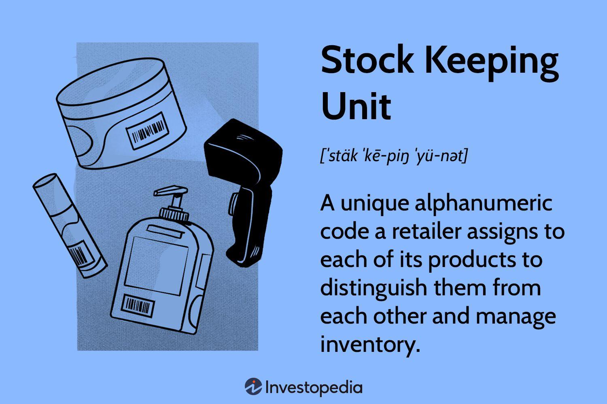

## Table of Contents

## What is a SKU?

A SKU, or Stock Keeping Unit, is a unique code that businesses use to keep track of their products. It helps them know how much of each item they have in stock. For example, if a store sells different sizes and colors of a shirt, each size and color combination would have its own SKU. This makes it easier for the store to manage inventory and reorder products when needed.

SKUs are important because they help businesses run smoothly. They are used in many places like stores, warehouses, and online shops. By using SKUs, a business can quickly find out if a product is in stock, where it is located, and how many are left. This helps prevent running out of popular items and makes sure customers can get what they want.

## How is a SKU different from a UPC or barcode?

A SKU is a code that a store or business makes up to keep track of their own products. It helps them know how much of each item they have. A SKU can be a mix of letters and numbers, and it's different for each store. For example, if two stores sell the same shirt, they might use different SKUs for it. SKUs are not the same everywhere, so they are only useful inside one business.

A UPC, or Universal Product Code, is a barcode that you see on products in stores. It's a set of black lines and numbers that is the same no matter where you go. UPCs are used all over the world to help cashiers ring up items and keep track of sales. Unlike SKUs, UPCs are made by the company that makes the product, not the store selling it. So, if you buy a can of soda, it will have the same UPC in any store.

The main difference is that SKUs are for the store's use to manage their stock, while UPCs are for everyone to use to know what the product is. SKUs can change from store to store, but UPCs stay the same. Both help businesses work better, but in different ways.

## Why are SKUs important for inventory management?

SKUs are important for inventory management because they help businesses keep track of their products easily. Each product in a store gets its own special SKU, like a name tag. This makes it simple for workers to know how many of each item they have, where the items are stored, and when they need to order more. Without SKUs, it would be hard to keep everything organized, especially in big stores with lots of different products.

Using SKUs also helps businesses save time and money. When workers can quickly find and count products using SKUs, they can spend more time helping customers and less time searching for items. This makes the store run more smoothly and helps prevent running out of popular items. Overall, SKUs make inventory management easier and more efficient, which is good for both the business and its customers.

## How do you create a SKU?

To create a SKU, you need to think about what makes each product different. Start by choosing a format that includes important details like the product type, size, color, or any other features that set it apart. For example, if you sell t-shirts, your SKU could start with "TSHIRT" followed by a code for the size like "S" for small, and then a code for the color like "BLU" for blue. So, a small blue t-shirt might have the SKU "TSHIRT-S-BLU". Make sure each SKU is unique so you can tell your products apart easily.

Once you have a format, keep it consistent for all your products. This helps everyone in your business understand and use the SKUs easily. You can use numbers, letters, or a mix of both, but keep it simple and clear. For example, if you also sell hats, you might use "HAT" at the start of the SKU, followed by size and color codes. So, a medium red hat could be "HAT-M-RED". By using a clear and consistent system, you make it easier to manage your inventory and keep track of what you have in stock.

## What are the best practices for designing a SKU?

When designing a SKU, it's important to keep it simple and clear. Use a format that includes key details about the product, like its type, size, and color. For example, if you sell shoes, your SKU could start with "SHOE" followed by "M" for medium size and "BLK" for black color, making the SKU "SHOE-M-BLK". Make sure each SKU is unique so you can easily tell your products apart. Avoid using too many characters or making it too complicated, as this can lead to mistakes and confusion.

Consistency is key when creating SKUs. Once you decide on a format, stick to it for all your products. This helps everyone in your business understand and use the SKUs easily. For instance, if you also sell bags, use "BAG" at the start of the SKU, followed by size and color codes, like "BAG-L-BRN" for a large brown bag. By keeping your SKU system simple and consistent, you make inventory management easier and more efficient, which helps your business run smoothly.

## Can SKUs be used across different sales channels?

SKUs can be used across different sales channels, but it depends on how a business sets up their system. If a business has the same SKU format for all their products, no matter if they sell them in a store, online, or through another way, it can make things easier. The SKU helps keep track of how many of each item they have, no matter where they are sold. This way, the business can see all their inventory in one place and make sure they don't run out of popular items.

However, sometimes businesses might use different SKU systems for different sales channels. For example, the SKUs used in a physical store might be different from the ones used online. This can happen if the business grew over time and added new ways to sell things without changing their old system. In this case, the business might need to keep track of different SKUs for the same product, which can make things more complicated. But if they can connect these systems, it still helps them manage their inventory across all their sales channels.

## How does SKU management affect pricing strategies?

SKU management helps businesses set their prices in a smart way. When a business knows exactly how many of each item they have, they can change the prices to sell more or to make more money. For example, if a store sees that a certain shirt is selling a lot, they might raise the price a little because people want it. Or, if they have too many of another item, they might lower the price to get rid of it faster. By using SKUs, the business can keep track of what's selling and what's not, which helps them decide on the best prices.

Also, SKU management helps businesses see how different versions of a product are doing. If a store sells the same shoe in different colors, each color will have its own SKU. This lets the store see which colors are popular and which ones aren't. They might charge more for the popular colors and less for the ones that don't sell as well. By keeping a close eye on their SKUs, a business can make sure their pricing strategy matches what customers want and helps them make the most money.

## What role do SKUs play in supply chain management?

SKUs help businesses manage their supply chain by keeping track of products from the time they are made until they are sold. Each product gets its own special SKU, which makes it easy for the business to know how many items they have, where they are, and when they need to order more. This helps the business make sure they always have enough products to sell without having too many sitting around, which can save money and keep customers happy.

In the supply chain, SKUs also help businesses work with their suppliers and shipping companies. When a business orders more products, they can use the SKU to tell the supplier exactly what they need. This makes it easier for the supplier to send the right items, and for the shipping company to keep track of everything as it moves from the factory to the store. By using SKUs, everyone in the supply chain can work together more smoothly, which helps the business run better and keep their customers happy.

## How can SKUs help in analyzing sales data?

SKUs help businesses look at their sales data by giving each product a special code. When a business sells something, they can see which SKU was sold. This lets them know exactly which items are selling well and which ones are not. By keeping track of SKUs, a business can find out if certain sizes, colors, or types of products are more popular. This information helps them make smart choices about what to order more of and what to stop selling.

Using SKUs also makes it easier for businesses to see trends over time. They can look at the sales data for each SKU and see if sales go up or down at different times of the year. For example, if a business sees that a certain SKU sells a lot more in the summer, they might order more of that item before summer starts. By analyzing SKU data, businesses can plan better, make sure they have the right products in stock, and keep their customers happy.

## What are common challenges faced in SKU management?

One common challenge in SKU management is keeping the system organized. When a business has a lot of different products, it can be hard to make sure every SKU is unique and easy to understand. If the SKUs are too complicated or not set up in a clear way, it can lead to mistakes. Workers might mix up similar SKUs or have trouble finding the right one, which can slow down the business and cause problems with inventory.

Another challenge is dealing with changes. As a business grows or adds new products, they might need to change their SKU system. This can be tricky because it means updating all their records and making sure everyone understands the new SKUs. If not done carefully, these changes can cause confusion and make it harder to keep track of inventory. It's important for businesses to plan these changes well and make sure their SKU system stays simple and easy to use.

## How can technology enhance SKU management?

Technology can make SKU management easier by using special software that keeps track of all the SKUs in one place. This software can quickly tell a business how many of each item they have, where the items are, and when they need to order more. It can also help with making SKUs, so they are always unique and easy to understand. This way, workers don't have to spend a lot of time looking for things or making mistakes with the SKUs.

Using technology also helps businesses see their sales data better. They can use the software to look at which SKUs are selling well and which ones are not. This helps them make smart choices about what to order more of and what to stop selling. By using technology, businesses can keep their inventory organized, save time, and make sure they always have the right products for their customers.

## What advanced strategies can be implemented for SKU optimization?

One advanced strategy for SKU optimization is using data analytics to understand how different products are selling. By looking at sales data, a business can see which SKUs are popular and which ones are not. They can then decide to order more of the popular items and stop selling the ones that don't sell well. This helps the business use their space and money better, making sure they have the right products for their customers. Using data analytics also helps businesses see trends over time, so they can plan ahead and make sure they have enough stock during busy times like holidays.

Another strategy is using automation to manage SKUs. Special software can keep track of all the SKUs and make sure they are always up to date. This software can also help with making new SKUs, so they are unique and easy to understand. Automation can save a lot of time and reduce mistakes, making it easier for the business to keep their inventory organized. By using automation, businesses can focus more on selling products and less on managing SKUs, which helps them run more smoothly and keep their customers happy.

## How can Inventory Management be improved by Leveraging SKU Data?

Inventory management systems are integral to modern businesses, offering a comprehensive approach to handling stock levels by utilizing Stock Keeping Unit (SKU) data to ensure accuracy and efficiency. SKUs, which are unique identifiers for products, serve as the backbone of inventory management, providing critical data that enhances real-time tracking capabilities. This real-time tracking is essential for maintaining optimal stock levels, thus ensuring products are available when needed and reducing instances of stockouts and overstock situations.

Automated inventory management systems that leverage SKU data bring significant cost savings by minimizing stockouts and overstock scenarios. Stockouts can cause missed sales opportunities and damage customer satisfaction, while overstock results in increased holding costs and potential wastage. By utilizing SKU data, businesses can create an automated system that accurately forecasts restocking needs, maintaining ideal inventory levels.

Moreover, advanced inventory tracking systems empower businesses to make data-driven decisions, improving restocking and order fulfillment processes. The data captured through SKUs enables a precise understanding of stock movements and turnover rates, allowing businesses to optimize their restocking strategies and ensure that the most in-demand products are readily available. 

SKU data also plays a pivotal role in demand forecasting and sales trend analysis. By analyzing historical sales data and SKU information, businesses can predict future demand with greater accuracy. This predictive capability allows businesses to optimize stock levels, aligning inventory with anticipated market needs. This process can be modeled using statistical techniques such as time series analysis. For instance, a simple moving average model could be represented as:

$$
\hat{D}_t = \frac{1}{n} \sum_{i=0}^{n-1} D_{t-i}
$$

where $\hat{D}_t$ is the predicted demand at time $t$, $n$ is the number of past periods considered, and $D_{t-i}$ is the actual demand $i$ periods prior.

Furthermore, businesses can enhance their inventory management by implementing [machine learning](/wiki/machine-learning) models that utilize SKU data for deeper analysis and more accurate demand prediction. In Python, businesses might use libraries such as scikit-learn or TensorFlow to build these predictive models, thus gaining insights into future trends and potential fluctuations in demand. An example Python snippet for a basic demand prediction model using scikit-learn might look like this:

```python
from sklearn.linear_model import LinearRegression
import numpy as np

# Assuming `X` is the feature set containing historical SKU data
# and `y` is the target variable for historical demand
model = LinearRegression()
model.fit(X, y)

# Predict future demand
predicted_demand = model.predict(X_new)
```

By harnessing the power of SKU data and integrating advanced technological solutions, businesses can enhance their inventory management strategies, leading to improved operational efficiency and customer satisfaction.

## References & Further Reading

[1]: Bergstra, J., Bardenet, R., Bengio, Y., & Kégl, B. (2011). ["Algorithms for Hyper-Parameter Optimization."](https://papers.nips.cc/paper/4443-algorithms-for-hyper-parameter-optimization) Advances in Neural Information Processing Systems 24.

[2]: ["Advances in Financial Machine Learning"](https://www.amazon.com/Advances-Financial-Machine-Learning-Marcos/dp/1119482089) by Marcos Lopez de Prado

[3]: ["Evidence-Based Technical Analysis: Applying the Scientific Method and Statistical Inference to Trading Signals"](https://www.amazon.com/Evidence-Based-Technical-Analysis-Scientific-Statistical/dp/0470008741) by David Aronson

[4]: ["Machine Learning for Algorithmic Trading"](https://github.com/stefan-jansen/machine-learning-for-trading) by Stefan Jansen

[5]: ["Quantitative Trading: How to Build Your Own Algorithmic Trading Business"](https://www.amazon.com/Quantitative-Trading-Build-Algorithmic-Business/dp/1119800064) by Ernest P. Chan