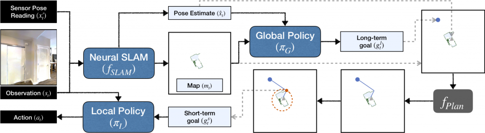

## Table of Contents

## What is SLAM and why is it important in robotics and machine learning?

SLAM stands for Simultaneous Localization and Mapping. It's a way for robots and autonomous vehicles to figure out where they are and make a map of their surroundings at the same time. Imagine you're in a new city without a map. As you walk around, you start to recognize landmarks and streets, and you slowly build a map in your head while also figuring out where you are. That's what SLAM does, but for robots. It uses sensors like cameras, lidars, and sonars to gather information about the environment, and then uses that data to both map the area and pinpoint the robot's location within that map.

SLAM is really important in robotics and machine learning because it helps robots navigate in unknown environments. Without SLAM, a robot might get lost or bump into things because it doesn't know where it is or what's around it. In applications like self-driving cars, drones, and home robots, SLAM makes it possible for these machines to move around safely and efficiently. It's also crucial for tasks like search and rescue, where robots need to explore and map dangerous areas without getting lost. By using SLAM, robots can become more independent and useful in real-world situations.

## How does SLAM differ from traditional mapping and localization techniques?

SLAM differs from traditional mapping and localization techniques because it does both jobs at the same time. Traditional methods usually split these tasks into separate steps. First, you might use localization to find out where you are based on a pre-existing map. Then, you might use mapping to build a new map of an area. But with SLAM, a robot starts in a place it doesn't know and builds the map while figuring out its own position on that map. This is really helpful in places where you don't have a map already, like exploring a new planet or navigating through a disaster zone.

Another big difference is that SLAM can handle changes in the environment better. Traditional methods might get confused if something in the environment changes, like if a building is torn down or a new one is built. SLAM, on the other hand, can update its map as it goes along, making it more flexible and useful in real-world situations. This ability to adapt and update makes SLAM a powerful tool for robots that need to work in dynamic environments, where things can change quickly and unpredictably.

## What are the basic components required for a SLAM system?

A SLAM system needs a few basic parts to work well. First, it needs sensors to gather information about the world around it. These can be cameras, lidars, or sonars, which help the robot see and understand its surroundings. The data from these sensors is used to build a map and figure out where the robot is on that map. Second, the system needs a way to process this data. This usually involves algorithms that can take the raw sensor data and turn it into a useful map and location estimate. These algorithms are at the heart of SLAM and are what make it possible for the robot to do both mapping and localization at the same time.

Another important part of a SLAM system is a way to keep track of the robot's movement. This is often done with something called odometry, which measures how far and in what direction the robot has moved. By combining this movement data with the sensor data, the SLAM system can better estimate where the robot is and update the map more accurately. Finally, the system needs a way to store and manage the map it creates. This could be a simple 2D map or a more complex 3D model, depending on what the robot needs to do. All these parts work together to make SLAM a powerful tool for robots navigating unknown environments.

## Can you explain the concept of simultaneous localization and mapping with a simple example?

Imagine you're a robot exploring a new park. You don't have a map, and you don't know where you are. As you start moving, you see a big tree. You note down its position relative to you and keep going. Then you see a bench, and you note that down too. As you keep moving and seeing more landmarks like a pond or a playground, you start to build a map in your head. At the same time, you figure out where you are on this map because you remember seeing the tree first, then the bench, and so on. This is what SLAM does - it helps you make a map and find your spot on it at the same time.

Now, let's say you turn around and see the tree again. You know where you are now because the tree is on your map. You can also update the map if you see something new or if something has changed. This ability to update and improve the map while also knowing where you are is what makes SLAM so useful. It's like solving a puzzle where you're adding pieces to the picture and figuring out where you fit in it all at once.

## What are the key challenges faced in implementing SLAM in real-world environments?

One of the main challenges in using SLAM in real-world environments is dealing with errors in the sensors. Sensors like cameras or lidars can sometimes give wrong or unclear information because of things like bad lighting, moving objects, or dust. These errors can make the map less accurate and can make it hard for the robot to know where it is. Another challenge is that the environment can change while the robot is working. For example, if a robot is mapping a construction site, new walls might go up or old ones might come down. The SLAM system has to be able to update its map quickly to keep up with these changes.

Another big challenge is the need for a lot of computing power. SLAM algorithms have to process a lot of data from sensors very quickly to build and update the map and figure out the robot's location. This can be tough for smaller robots or ones that don't have a lot of power. Also, making sure the SLAM system works well in different kinds of places, like inside buildings or outside in nature, can be tricky. Different environments can have different kinds of problems, and the SLAM system has to be able to handle all of them.

## How do DROID-SLAM and NICE-SLAM differ in their approach to SLAM?

DROID-SLAM and NICE-SLAM are two different ways to do SLAM, and they have different ways of solving the problem. DROID-SLAM focuses on using [deep learning](/wiki/deep-learning) to help with the mapping and localization. It uses something called recurrent neural networks to predict how the robot moves and where things are in the world. This helps DROID-SLAM handle errors in the sensors better and make more accurate maps. It's good at dealing with changes in the environment because it can learn from what it sees and update its map as it goes.

NICE-SLAM, on the other hand, uses a different approach. It combines traditional SLAM methods with neural networks to create a detailed 3D map of the environment. NICE-SLAM is good at making high-quality maps that look more like the real world. It uses a technique called neural implicit representation to build these maps, which means it can create very smooth and detailed models of the environment. This makes NICE-SLAM useful for applications where you need a very accurate and detailed map, like in virtual reality or robotics that need to navigate complex spaces.

## What makes NeuralRecon unique among other SLAM methods?

NeuralRecon stands out among other SLAM methods because it uses a special way of building maps called neural implicit surface reconstruction. This means it can create very detailed and smooth 3D maps of the environment. Unlike other methods that might use points or meshes to build maps, NeuralRecon uses a [neural network](/wiki/neural-network) to learn how to represent the environment as a continuous surface. This makes the maps it creates look more like the real world and can be very useful for things like virtual reality or robots that need to move around in complex spaces.

Another thing that makes NeuralRecon unique is how it handles the data it gets from sensors. It can work with different kinds of sensors and can even handle data that might be a bit messy or unclear. This makes it more flexible and able to work well in real-world situations where things might not always be perfect. By using deep learning, NeuralRecon can also keep improving its maps as it gets more data, making it a powerful tool for robots that need to explore and understand their surroundings.

## How does VDO-SLAM improve upon traditional visual SLAM techniques?

VDO-SLAM improves upon traditional visual SLAM techniques by making the process of building maps and figuring out where the robot is faster and more accurate. It does this by using something called deep learning to help understand what the robot's camera sees. Traditional visual SLAM methods might struggle with things like changes in lighting or moving objects, but VDO-SLAM can handle these better because it learns from the data it gets. This means it can build maps that are more detailed and correct, even in tricky situations.

Another way VDO-SLAM improves on traditional methods is by being more flexible. It can work well with different kinds of cameras and in different environments, which makes it useful for a lot of different robots and tasks. By using deep learning, VDO-SLAM can also keep getting better over time as it sees more of the world. This makes it a powerful tool for robots that need to explore and understand their surroundings in real-world situations.

## What are the performance metrics typically used to evaluate SLAM methods like DROID-SLAM, NICE-SLAM, NeuralRecon, and VDO-SLAM?

Performance metrics for SLAM methods like DROID-SLAM, NICE-SLAM, NeuralRecon, and VDO-SLAM usually focus on how well they can build maps and figure out where the robot is. One common metric is the Absolute Trajectory Error (ATE), which measures how far off the robot's estimated path is from its real path. Another important metric is the Relative Pose Error (RPE), which looks at how well the robot can keep track of its movement over short distances. These metrics help show how accurate the SLAM system is at both mapping and localization. For example, if a SLAM method has a low ATE, it means the robot's map and its position on that map are very close to the real world.

Another set of metrics focuses on the quality of the maps that SLAM methods create. For instance, the completeness and accuracy of the 3D maps are often evaluated. Completeness measures how much of the real environment is captured in the map, while accuracy looks at how well the map matches the real world. These metrics are especially important for methods like NICE-SLAM and NeuralRecon, which aim to create detailed and smooth 3D maps. Additionally, the computational efficiency of the SLAM method is often considered, measured by how fast it can process data and update the map. A method that can do this quickly is more useful for real-time applications where the robot needs to react quickly to its surroundings.

## How do deep learning techniques enhance the accuracy and robustness of SLAM methods?

Deep learning techniques help make SLAM methods more accurate and able to handle tricky situations better. They do this by learning from the data they get from sensors like cameras. For example, deep learning can help the SLAM system understand what it's seeing even if the lighting changes or if there are moving objects around. This means the robot can build better maps and figure out where it is more correctly, even in places that are hard to navigate. By using deep learning, SLAM methods like DROID-SLAM and VDO-SLAM can keep getting better over time as they see more of the world.

Another way deep learning helps is by making the SLAM system more flexible. It can work with different kinds of sensors and handle data that might be a bit messy or unclear. This makes it easier for the robot to use SLAM in real-world situations where things might not always be perfect. For example, NeuralRecon uses deep learning to create very detailed and smooth 3D maps, which can be really useful for robots that need to move around in complex spaces. By using deep learning, SLAM methods can build maps that are more like the real world and help robots understand their surroundings better.

## What are the current limitations of state-of-the-art SLAM methods like those mentioned?

One of the main problems with current SLAM methods like DROID-SLAM, NICE-SLAM, NeuralRecon, and VDO-SLAM is that they need a lot of computing power. These methods use deep learning, which means they have to process a lot of data very quickly to build and update maps and figure out where the robot is. This can be hard for smaller robots or ones that don't have a lot of power. Another challenge is that these methods can struggle with environments that change a lot. For example, if a robot is mapping a busy construction site, new walls might go up or old ones might come down, and the SLAM system has to be able to update its map quickly to keep up with these changes.

Another limitation is that these SLAM methods can sometimes have trouble with certain kinds of environments. For example, places with a lot of similar-looking features or very few landmarks can make it hard for the robot to build a good map and know where it is. Also, errors in the sensors, like bad lighting or moving objects, can make the maps less accurate and make it harder for the robot to figure out its position. While deep learning helps these methods handle some of these problems better, they still need to improve to work well in all kinds of real-world situations.

## What future developments can we expect in the field of SLAM, particularly with the integration of machine learning?

In the future, we can expect SLAM methods to become even better at handling tricky situations thanks to [machine learning](/wiki/machine-learning). Deep learning techniques will keep getting smarter and faster, which means robots will be able to build more accurate maps and figure out where they are more easily, even in places that are hard to navigate. For example, SLAM systems might get better at dealing with changes in lighting or moving objects, making them more useful in busy or unpredictable environments. Researchers are also working on ways to make these systems need less computing power, so even small robots can use them.

Another exciting development will be the use of more kinds of sensors with SLAM. Right now, most SLAM systems use cameras or lidars, but in the future, they might use other sensors like sonars or even smell sensors to build maps and understand the world around them. This could make the maps more detailed and help robots navigate in new ways. As machine learning keeps improving, SLAM methods will become more flexible and able to handle all sorts of real-world situations, making robots more helpful in places like homes, hospitals, and disaster zones.