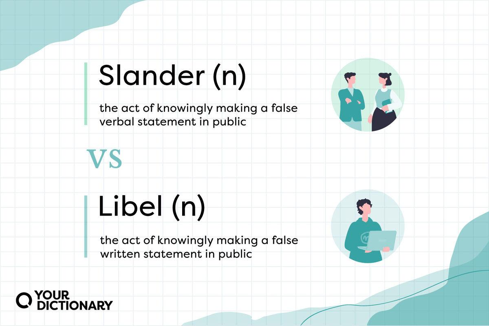

## Table of Contents

## What is slander?

Slander is a type of defamation where someone says something false and harmful about another person. It is spoken, not written. When someone spreads lies that damage another person's reputation, it can be considered slander. For example, if someone falsely says that a person stole money, and this causes others to believe it and think badly of that person, it could be slander.

To prove slander, the person who was harmed needs to show that the statement was false, that it was shared with others, and that it caused harm. This can be difficult because it involves proving what was said and the impact it had. In many places, the law allows people to sue for slander if they can prove these things. However, some statements, like opinions or true facts, are not considered slander even if they are negative.

## What is libel?

Libel is when someone writes something false and harmful about another person. It is different from slander because slander is spoken, while libel is written. If someone puts false information in a newspaper, on a website, or in a book that hurts someone's reputation, it could be libel. For example, if a newspaper writes a false story saying that a person committed a crime, and this causes people to think badly of that person, it might be libel.

To prove libel, the person who was harmed needs to show that the written statement was false, that it was shared with others, and that it caused harm. This can be hard because it involves proving what was written and the impact it had. In many places, the law allows people to sue for libel if they can prove these things. However, some statements, like opinions or true facts, are not considered libel even if they are negative.

## How do slander and libel differ legally?

Slander and libel are both types of defamation, but they differ in how they are communicated. Slander is when someone says something false and harmful about another person. It is spoken, like in a conversation or on a video. Libel, on the other hand, is when someone writes something false and harmful about another person. This can be in a newspaper, on a website, or in any written form.

Legally, the difference between slander and libel can affect how easy it is to prove defamation. In many places, it can be harder to prove slander because it is harder to show exactly what was said and who heard it. With libel, there is usually a written record, so it can be easier to prove what was written and who saw it. Both slander and libel can lead to lawsuits if the harmed person can show that the statement was false, was shared with others, and caused harm.

## Can you provide examples of slander?

Slander happens when someone says something false and bad about another person. For example, if someone tells others that a person cheated on a test, but it's not true, that can be slander. If people start to believe the lie and treat the person differently because of it, the person who was lied about might be hurt.

Another example is if someone says at a party that a person stole money from their job, but it's not true. If people at the party start to think the person is a thief because of the lie, this could be slander. The person who was lied about might have a hard time because of the false story.

## Can you provide examples of libel?

Libel is when someone writes something false and bad about another person. For example, if a newspaper writes a story saying that a person is a criminal, but it's not true, that can be libel. If people read the story and start to think the person is bad because of it, the person might be hurt by the false story.

Another example is if someone posts on a website that a person did something wrong at work, but it's not true. If people see the post and start to believe the lie, it could be libel. The person who was lied about might have a hard time because of the false information.

## What are the elements required to prove slander?

To prove slander, someone needs to show that what was said about them was not true. They also need to show that the false statement hurt their reputation. This means proving that people think less of them because of the lie.

It's also important to show that the false statement was shared with others. This means that someone else heard the lie. Finally, the person needs to show that they were harmed because of the lie. This can be hard because it involves proving what was said and who heard it, and how it affected them.

## What are the elements required to prove libel?

To prove libel, someone needs to show that what was written about them was not true. They also need to show that the false statement hurt their reputation. This means proving that people think less of them because of the lie.

It's also important to show that the false statement was shared with others. This means that someone else read the lie. Finally, the person needs to show that they were harmed because of the lie. This can be hard because it involves proving what was written and who saw it, and how it affected them.

## How does the legal process for slander cases differ from libel cases?

The legal process for slander and libel cases is similar, but there are some differences. Slander cases can be harder to prove because they involve spoken words. It's tough to show exactly what was said and who heard it. In court, the person who says they were harmed needs to bring witnesses or recordings to prove the lie was said and that it hurt their reputation. Because it's harder to prove, slander cases can be more difficult to win.

Libel cases, on the other hand, involve written words, so they can be easier to prove. There's usually a written record, like a newspaper article or a social media post, that can be shown in court. This makes it simpler to show what was written and who saw it. The person who says they were harmed still needs to prove that the statement was false and that it hurt their reputation, but having a written record can make the process smoother.

## What defenses can be used against slander accusations?

When someone is accused of slander, they can use a few defenses to fight the claim. One common defense is the truth. If the person can prove that what they said was true, it's not slander. Another defense is that the statement was just their opinion. Opinions are not considered slander because they can't be proven true or false. For example, saying "I think this person is not good at their job" might be seen as an opinion, not a fact.

Another defense is called "privilege." This means the person was allowed to say what they said because of their job or the situation. For example, if a witness in court says something false about someone, they might be protected by "absolute privilege" because they were testifying. There's also "qualified privilege," which might protect someone if they were sharing information in a way that was needed or expected, like a boss giving feedback to an employee. If the person can show they had a good reason to say what they said, it might not be considered slander.

## What defenses can be used against libel accusations?

When someone is accused of libel, they can use a few defenses to fight the claim. One common defense is the truth. If the person can prove that what they wrote was true, it's not libel. Another defense is that the statement was just their opinion. Opinions are not considered libel because they can't be proven true or false. For example, saying "I think this person is not good at their job" might be seen as an opinion, not a fact.

Another defense is called "privilege." This means the person was allowed to write what they wrote because of their job or the situation. For example, if a reporter writes something false about someone in a news article, they might be protected by "qualified privilege" if they can show they did their best to check the facts. There's also "absolute privilege," which might protect someone if they were writing something in a situation where they were expected to be honest, like a court document. If the person can show they had a good reason to write what they wrote, it might not be considered libel.

## How have landmark cases shaped the laws on slander and libel?

Landmark cases have helped shape the laws on slander and libel by setting important rules and standards. One famous case is New York Times v. Sullivan from 1964. This case made it harder for public figures to win defamation cases. The court said that public figures need to prove that the person who made the false statement knew it was false or didn't care if it was true or not. This is called "actual malice." This case helped protect free speech and made it harder for public figures to sue for defamation.

Another important case is Gertz v. Robert Welch, Inc. from 1974. This case said that private people don't need to prove actual malice to win a defamation case. They just need to show that the statement was false and hurt their reputation. This case helped balance the rights of private people to protect their reputation with the need to allow free speech. These cases have shaped how courts handle slander and libel cases today, making the laws clearer and more fair.

## What are the current trends and future directions in slander and libel law?

The current trends in slander and libel law show a growing focus on online defamation. With more people using social media and the internet, false statements can spread quickly and hurt someone's reputation in a big way. Courts are trying to figure out how to handle these cases, especially since it's hard to know who said what online. Some places are making new laws to deal with online defamation, while others are using old laws in new ways. There's also a trend toward protecting free speech more, which can make it harder for people to win defamation cases.

In the future, slander and libel laws might change to better fit the digital world. As technology keeps growing, laws will need to keep up. Courts might start using new ways to prove what was said online and who said it. There could also be more focus on how to balance protecting someone's reputation with the right to free speech. As more cases come up, the laws will likely become clearer and more fair for everyone involved.

## What is Algorithmic Trading: A Different Kind of Communication?

Algorithmic trading, commonly known as algo trading, is fundamentally altering the landscape of financial markets by automating the process of buying and selling financial instruments based on pre-defined criteria. This form of trading is not conducted through traditional human interaction, such as oral or written communication, but through complex algorithms embedded within computer programs. These programs are capable of executing orders at speeds and frequencies vastly superior to human traders.

The reliance on algorithms shifts the potential for misinformation away from human-generated libel or slander to issues arising from erroneous trading signals or faulty algorithm designs. An algorithm can inadvertently generate misleading or incorrect signals if there are errors in its coding or logic, potentially leading to substantial financial repercussions.

Ensuring the integrity of these algorithmic systems is essential for maintaining fair and efficient markets. This involves rigorous testing and validation processes to confirm the accuracy and reliability of the trading algorithms. Developers often use [backtesting](/wiki/backtesting)—a process where the algorithm is tested on historical data to assess its performance—as a crucial step in this validation. The formula for backtesting typically assesses the strategy's return relative to its risk:

$$

\text{Sharpe Ratio} = \frac{E[R_p - R_f]}{\sigma_p} 
$$

where $E[R_p - R_f]$ is the expected excess return of the portfolio over the risk-free rate, and $\sigma_p$ is the standard deviation of the portfolio's excess return. A higher Sharpe Ratio indicates a more favorable risk-adjusted return.

Moreover, understanding the legal implications tied to algorithmic trade errors is crucial for traders and firms. Errors in these systems can result in unintended trades that may violate market regulations, leading to penalties or charges of market manipulation. As algorithms play an increasingly significant role in trading, ensuring their proper functioning and compliance with regulatory standards is a top priority for financial institutions. Implementing monitoring systems that can detect anomalies or unusual trading patterns in real time can help mitigate these risks.

Continual advancements in [machine learning](/wiki/machine-learning) and [artificial intelligence](/wiki/ai-artificial-intelligence) further enhance the complexity of [algorithmic trading](/wiki/algorithmic-trading) systems, integrating predictive analytics to foresee market trends. The integration of such advanced technologies requires derivative legal frameworks that address the unique challenges posed by algo trading, including accountability for automated decisions and the quality of data inputs used by these sophisticated trading algorithms.

## References & Further Reading

[1]: Franklin, M. (Ed.). (1995). ["The Law of Defamation."](https://digitalcommons.law.yale.edu/cgi/viewcontent.cgi?article=1216&context=fss_papers) Oxford University Press.

[2]: Solove, D. J., & Schwartz, P. M. (2019). ["Information Privacy Law."](https://books.google.com/books/about/Information_Privacy_Law.html?id=JyAMEAAAQBAJ) Wolters Kluwer.

[3]: Collins, L., & Skover, D. M. (2010). ["The Death of Discourse."](https://www.taylorfrancis.com/books/mono/10.4324/9780429309908/death-discourse-ronald-collins-david-skover) NYU Press.

[4]: MacKinnon, C. A. (1993). ["Only Words."](https://en.wikipedia.org/wiki/Only_Words_(book)) Harvard University Press.

[5]: Fernandez, A., & Steel, P. (2020). ["Algorithmic Trading in Practice with Python: Hands-On Guide for Building Artificial Intelligence Driven Trading Strategies."](https://pmc.ncbi.nlm.nih.gov/articles/PMC8692919/) Packt Publishing.